# RabbitMQ 消息中间件

---

## MQ 概述

### 什么是 MQ

消息队列（Message Queue）是一种**跨进程的异步通信机制**，生产者将消息放入队列，消费者从队列取出消息处理，实现上下游的**逻辑解耦 + 物理解耦**。

### MQ 三大作用

| 作用 | 说明 | 典型场景 |
|------|------|----------|
| 流量削峰 | 突发请求先入队列，后端按处理能力平滑消费 | 秒杀、抢票 |
| 应用解耦 | 子系统故障时消息暂存，恢复后继续处理 | 下单后通知库存/物流 |
| 异步处理 | 非核心步骤异步处理，主流程快速返回 | 注册后发邮件/短信 |

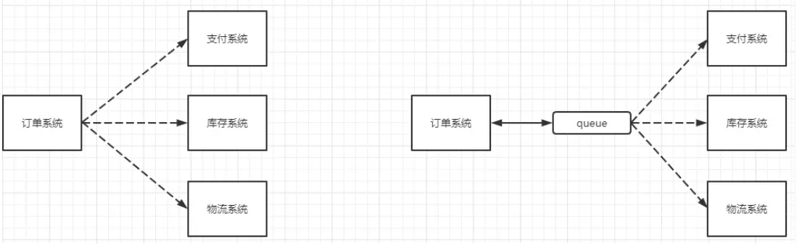

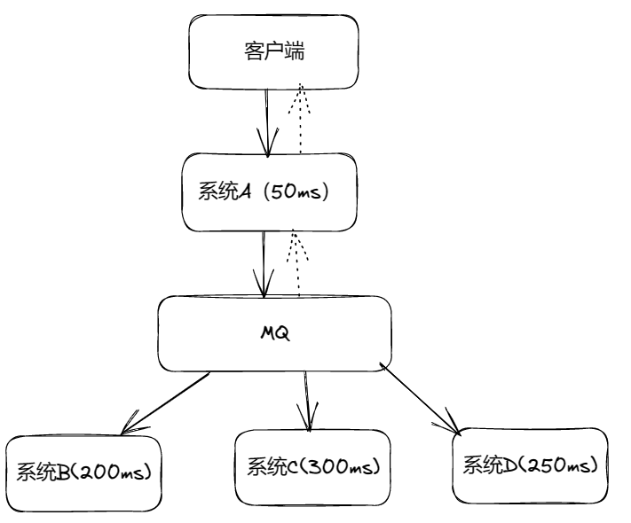

### 常见 MQ 产品对比

| 产品 | 吞吐量 | 特点 | 适用场景 |
|------|--------|------|----------|
| RabbitMQ | 万级 | Erlang 编写，功能完备，低延迟 | 中小公司通用 |
| Kafka | 百万级 TPS | 大数据领域首选，分布式高可用 | 日志收集、流处理 |
| RocketMQ | 十万级 | 阿里出品，0 丢失 | 金融领域 |
| ActiveMQ | 万级 | Java 实现，社区维护减少 | 传统企业应用 |

---

## RabbitMQ 核心概念

### AMQP 架构


### 四大核心组件

```
生产者(Producer) → 交换机(Exchange) → 队列(Queue) → 消费者(Consumer)
                       │
                  Routing Key 决定消息路由到哪个队列
```

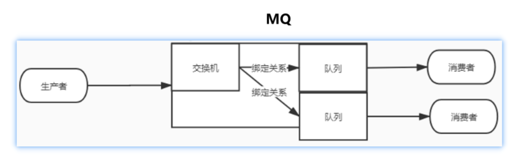

### 常见名词

| 名词 | 说明 |
|------|------|
| Broker | RabbitMQ Server，消息代理 |
| Virtual Host | 虚拟主机，隔离不同应用（类似 MySQL 的库） |
| Connection | TCP 连接 |
| Channel | 信道，复用 TCP 连接，类似 NIO 多路复用 |
| Exchange | 交换机，根据 Routing Key 将消息路由到队列 |
| Queue | 队列，存储消息 |
| Binding | 交换机与队列之间的绑定关系 |

### 六大模式

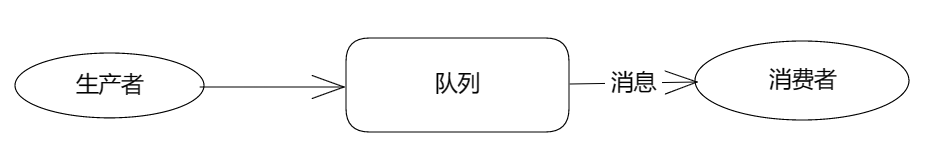

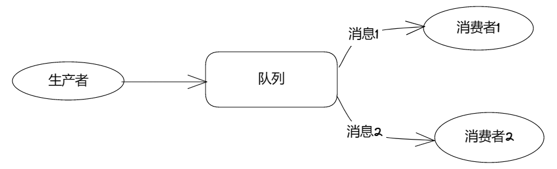

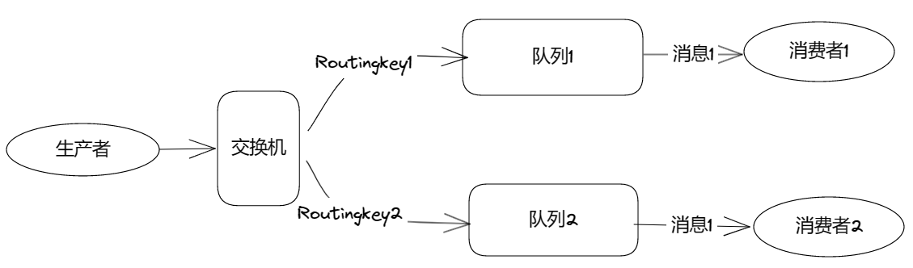

| 模式 | 说明 |
|------|------|
| 简单模式 | 1 生产者 + 1 队列 + 1 消费者 |
| 工作队列 | 多消费者共享队列，任务分发 + 负载均衡 |
| 发布/订阅 | 广播，交换机绑定多队列，每个消费者收到相同消息 |
| 路由模式 | 根据 Routing Key 选择性路由到不同队列 |
| 主题模式 | Routing Key 支持 `*`（一个词）和 `#`（零或多个词）通配符 |
| RPC 模式 | 远程过程调用 |

---

## 快速入门（SpringBoot）

### 依赖

```xml
<dependency>
    <groupId>org.springframework.boot</groupId>
    <artifactId>spring-boot-starter-amqp</artifactId>
</dependency>
```

### 配置

```yaml
spring:
  rabbitmq:
    host: 127.0.0.1
    port: 5672
    username: admin
    password: admin
```

### 生产者

```java
@RestController
public class ProducerController {
    @Autowired
    private RabbitTemplate rabbitTemplate;

    @GetMapping("/send")
    public String send(@RequestParam String msg) {
        rabbitTemplate.convertAndSend("", "hello.queue", msg);
        return "发送成功";
    }
}
```

### 消费者

```java
@Component
public class Consumer {
    @RabbitListener(queues = "hello.queue")
    public void receive(String msg) {
        System.out.println("收到消息: " + msg);
    }
}
```

### Web 管理界面

启动后访问 `http://localhost:15672`，可查看队列、交换机、消息状态。

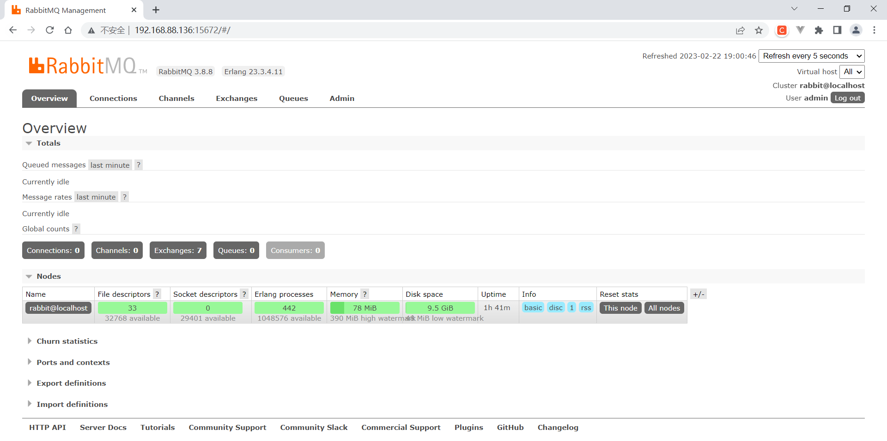

---

## 消息可靠性

### 消息应答

| 方式 | 行为 | 特点 |
|------|------|------|
| 自动应答 | 消费者收到即确认 | 高吞吐，可能丢消息 |
| 手动应答 | 消费者处理完手动 ACK | 可靠，消费者宕机消息自动重新入队 |

```java
// 手动应答
channel.basicConsume(QUEUE_NAME, false, deliverCallback, cancelCallback);

// 在回调中
channel.basicAck(delivery.getEnvelope().getDeliveryTag(), false);
```

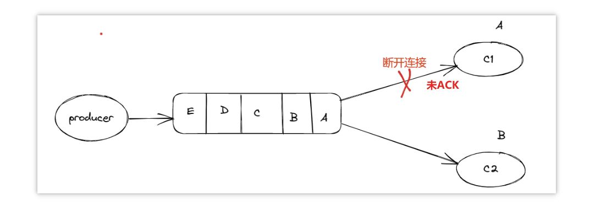

| 方法 | 作用 |
|------|------|
| `basicAck` | 肯定确认，消息已处理 |
| `basicNack` | 否定确认，支持批量拒绝 + 重新入队 |
| `basicReject` | 拒绝单条消息 |

### 持久化

| 类型 | 配置 |
|------|------|
| 队列持久化 | `queueDeclare(name, true, ...)` 第二个参数 |
| 消息持久化 | `MessageProperties.PERSISTENT_TEXT_PLAIN` |

> 队列 + 消息都持久化才能保障。但写磁盘有缓存间隔，不能 100% 保证不丢。

### 不公平分发

默认轮询分发，快慢消费者拿到相同数量消息。设置 `prefetchCount=1` 后，消息优先发给空闲的消费者：

```java
channel.basicQos(1);  // 每次只给一条，处理完再给下一条
```

### 发布确认

| 模式 | 原理 | 特点 |
|------|------|------|
| 单个确认 | 发一条 → 等确认 → 发下一条 | 同步等待，吞吐低 |
| 批量确认 | 发一批 → 等确认 | 有批量增益，故障难定位 |
| 异步确认 | 发送 + 回调监听 | 性能最优，推荐 |

```java
// 异步确认
channel.confirmSelect();
channel.addConfirmListener(
    (sequenceNumber, multiple) -> {
        // 确认成功
    },
    (sequenceNumber, multiple) -> {
        // 确认失败，重发
    }
);
```

---

## 交换机

### 三种核心类型

| 类型 | 路由规则 | 适用场景 |
|------|----------|----------|
| Fanout | 广播到所有绑定队列，忽略 Routing Key | 日志广播、通知推送 |
| Direct | Routing Key 完全匹配 | 按级别分发（error/info/warning） |
| Topic | 通配符匹配（`*` 一个词，`#` 零或多词） | 灵活路由，按业务规则分发 |

### Fanout — 发布订阅

```java
// 声明交换机
channel.exchangeDeclare("logs", "fanout");
// 绑定临时队列
String queue = channel.queueDeclare().getQueue();
channel.queueBind(queue, "logs", "");
// 发送
channel.basicPublish("logs", "", null, message.getBytes());
```

### Direct — 路由模式

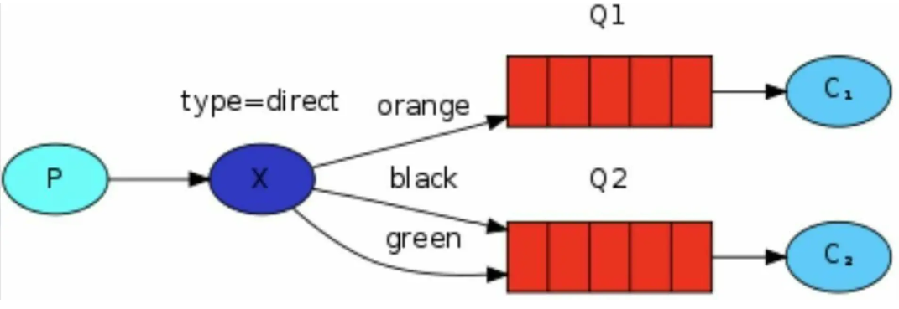

```java
channel.exchangeDeclare("direct_logs", "direct");
channel.queueBind(queue, "direct_logs", "error");  // 只接收 error 路由
```

### Topic — 主题模式

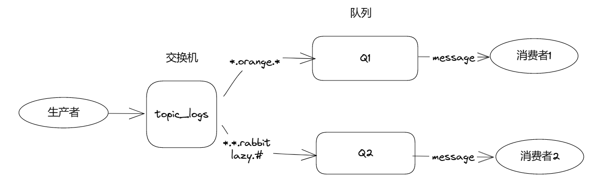

```
Routing Key 规则: 单词.单词.单词  (用 . 分隔)
* → 匹配恰好一个单词
# → 匹配零或多个单词

示例: "lazy.orange.rabbit"
  *.orange.*  → 匹配 ✓
  lazy.#      → 匹配 ✓
  *.banana.*  → 不匹配 ✗
```

---

## 死信队列

### 死信来源

| 原因 | 说明 |
|------|------|
| 消息 TTL 过期 | 消息设置了过期时间，到期未被消费 |
| 队列已满 | 队列长度达上限，多余消息变死信 |
| 消息被拒绝 | `basicReject` 且 `requeue=false` |

### 架构

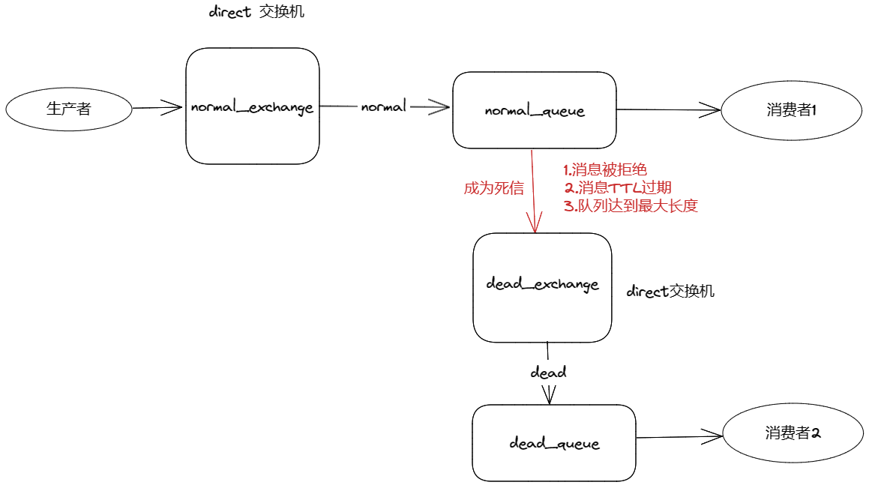

```
生产者 → 普通交换机 → 普通队列（设置死信交换机）
                          ↓ (过期/拒收/满)
                     死信交换机 → 死信队列 → 死信消费者
```

### 配置

```java
// 在普通队列上设置死信参数
Map<String, Object> args = new HashMap<>();
args.put("x-dead-letter-exchange", "dead_exchange");
args.put("x-dead-letter-routing-key", "dead.key");
args.put("x-message-ttl", 10000);        // 过期时间 10s
args.put("x-max-length", 5);             // 最大长度

Queue normalQueue = new Queue("normal.queue", true, false, false, args);
```

---

## 延迟队列

### 应用场景

订单超时未支付自动取消、延迟通知、定时任务。

### 实现方式一：死信队列 + TTL

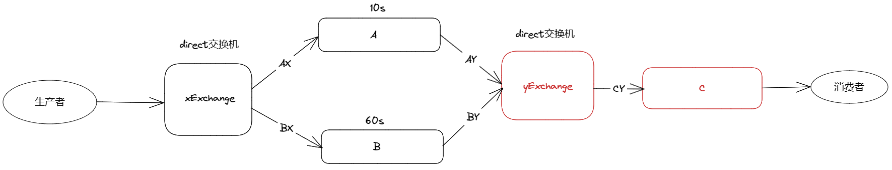

**问题**：FIFO 特性 —— 队列头部的长 TTL 消息会阻塞后面的短 TTL 消息。

### 实现方式二：延迟插件（推荐）

安装 `rabbitmq_delayed_message_exchange` 插件，延迟在**交换机层面**实现：

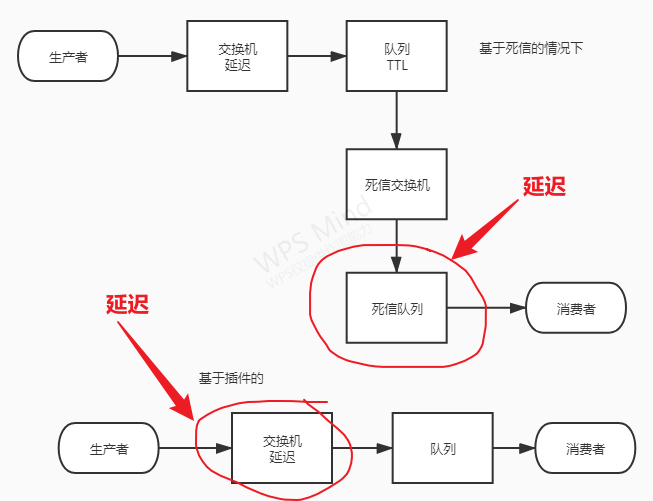

```java
// 声明延迟交换机
CustomExchange delayExchange = new CustomExchange(
    "delay.exchange", "x-delayed-message", true, false,
    Map.of("x-delayed-type", "direct")
);

// 发送时指定延迟
rabbitTemplate.convertAndSend("delay.exchange", "delay.key", msg, message -> {
    message.getMessageProperties().setDelay(5000);  // 延迟 5 秒
    return message;
});
```

> 插件方式解决了 FIFO 阻塞问题，消息按实际延迟时间排序投递。

---

## 发布确认高级

### 问题

生产者发布消息时，如果交换机不存在或 Routing Key 不可达，消息会**静默丢失**。

### 交换机回调

```yaml
spring:
  rabbitmq:
    publisher-confirm-type: correlated  # 开启发布确认
```

```java
@Component
public class ConfirmCallback implements RabbitTemplate.ConfirmCallback {
    @Override
    public void confirm(CorrelationData data, boolean ack, String cause) {
        if (ack) {
            log.info("交换机收到消息: {}", data.getId());
        } else {
            log.error("交换机未收到消息: {}, 原因: {}", data.getId(), cause);
        }
    }
}
```

### 队列回调（消息回退）

```yaml
spring:
  rabbitmq:
    publisher-returns: true      # 开启回退
    template:
      mandatory: true            # 路由失败时回调而非丢弃
```

```java
@Component
public class ReturnCallback implements RabbitTemplate.ReturnsCallback {
    @Override
    public void returnedMessage(ReturnedMessage returned) {
        log.error("消息路由失败: {}, 退回原因: {}",
            returned.getMessage(), returned.getReplyText());
    }
}
```

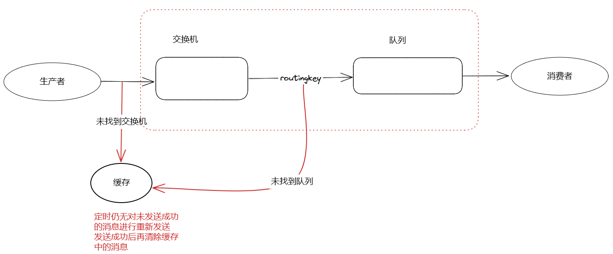

### 备份交换机

当消息不可路由时，备份交换机（通常为 Fanout）接管消息，防止丢失：

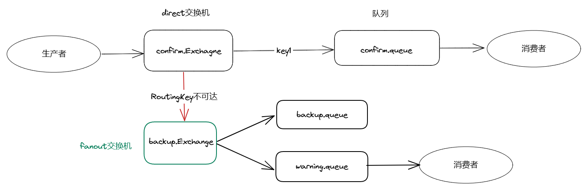

```java
// 声明交换机时指定备份
Map<String, Object> args = Map.of("alternate-exchange", "backup.exchange");
Exchange exchange = new DirectExchange("order.exchange", true, false, args);
```

> 配置备份交换机后，消息回退机制（returnedMessage）不再生效，消息直接转到备份交换机。

---

## 面试要点

**Q: RabbitMQ 如何保证消息不丢失？**

三层保障：
1. **生产者端**：发布确认（confirm）+ 消息回退（return）+ 备份交换机
2. **Broker 端**：队列持久化 + 消息持久化（`PERSISTENT_TEXT_PLAIN`）
3. **消费者端**：手动应答（`basicAck`），处理完再确认

**Q: 死信队列的应用场景？**

- 订单超时取消（TTL 过期 → 死信 → 消费者执行取消逻辑）
- 重试机制（业务失败 → 拒收 → 死信消费者重试）
- 异常消息归档（队列满时多出的消息进入死信，后续排查）

**Q: 延迟队列的两种实现，各有什么优缺点？**

| 方式 | 优点 | 缺点 |
|------|------|------|
| 死信 + TTL | 无需插件 | FIFO 阻塞，多时间需要多队列 |
| 延迟插件 | 交换机排序，无阻塞 | 需装插件，社区维护 |

**Q: RabbitMQ 有哪几种交换机类型？**

1. **Direct**：Routing Key 完全匹配 → 单播
2. **Fanout**：广播到所有绑定队列 → 发布订阅
3. **Topic**：通配符匹配 → 灵活路由
4. **Headers**：根据消息头匹配（不常用）
5. **默认无名交换机**：直接按队列名路由

**Q: 不公平分发是什么？怎么配置？**

默认轮询导致快慢消费者拿到相同数量，`channel.basicQos(1)` 设置 prefetchCount=1，队列每次只给消费者一条消息，处理完 ACK 后再给下一条，实现"能者多劳"。
