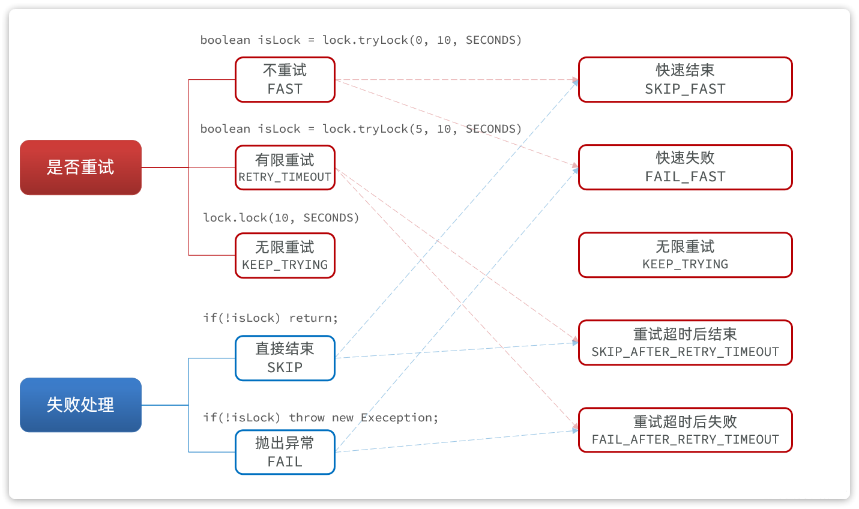

<h1 style="text-align: center;">策略模式</h1>
 
- - -

## 基本介绍

> #### 核心思想：把不同算法、不同业务规则封装成不同策略类，运行时根据条件选择使用哪一种策略
>
> #### 它关注的不是 “对象怎么创建”，而是同一个业务动作，有多种不同实现方式
>
> #### 应用场景：假设代码中有大量判断，策略模式可以把每种规则拆成单独的类

## 实现思路

> #### （1）定义策略接口
>
> #### （2）定义不同策略实现类
>
> #### （3）提供策略工厂，便于根据策略枚举获取不同策略实现

::: tip <span style="font-size:18px">⚠️ 注意</span>

#### 在策略比较简单的情况下，我们完全可以<span style="color:red">用枚举代替策略工厂</span>，通过在枚举类中定义抽象方法，并在每一个枚举对象中实现，合并了定义接口再定义实现类的传统方式，使得代码更简洁，进而简化策略模式

:::

## 用枚举代替策略工厂

### 需求分析

> #### 高并发场景通过 Redisson 获取锁，但也可能获取失败，此时需要定义获取锁失败后的处理逻辑



### 代码实现

> #### 这里没有单独定义接口和实现类，而是直接用枚举把它们合在一起了
>
> #### 策略接口：MyLockStrategy
>
> #### 具体策略：SKIP_FAST、FAIL_FAST、KEEP_TRYING

```java
public enum MyLockStrategy {
    SKIP_FAST(){
        @Override
        public boolean tryLock(RLock lock, MyLock prop) throws InterruptedException {
            return lock.tryLock(0, prop.leaseTime(), prop.unit());
        }
    },
    FAIL_FAST(){
        @Override
        public boolean tryLock(RLock lock, MyLock prop) throws InterruptedException {
            boolean isLock = lock.tryLock(0, prop.leaseTime(), prop.unit());
            if (!isLock) {
                throw new BizIllegalException("请求太频繁");
            }
            return true;
        }
    },
    KEEP_TRYING(){
        @Override
        public boolean tryLock(RLock lock, MyLock prop) throws InterruptedException {
            lock.lock( prop.leaseTime(), prop.unit());
            return true;
        }
    },
    SKIP_AFTER_RETRY_TIMEOUT(){
        @Override
        public boolean tryLock(RLock lock, MyLock prop) throws InterruptedException {
            return lock.tryLock(prop.waitTime(), prop.leaseTime(), prop.unit());
        }
    },
    FAIL_AFTER_RETRY_TIMEOUT(){
        @Override
        public boolean tryLock(RLock lock, MyLock prop) throws InterruptedException {
            boolean isLock = lock.tryLock(prop.waitTime(), prop.leaseTime(), prop.unit());
            if (!isLock) {
                throw new BizIllegalException("请求太频繁");
            }
            return true;
        }
    };

    public abstract boolean tryLock(RLock lock, MyLock prop) throws InterruptedException;
}
```

### 应用示例

```java
@Component
@Aspect
@RequiredArgsConstructor
public class MyLockAspect implements Ordered {

    private final MyLockFactory lockFactory;

    @Around("@annotation(myLock)")
    public Object tryLock(ProceedingJoinPoint pjp, MyLock myLock) throws Throwable {
        // 1.创建锁对象
        RLock lock = lockFactory.getLock(myLock.lockType(), myLock.name());
        // 2.尝试获取锁
        boolean isLock = myLock.lockStrategy().tryLock(lock, myLock);
        // 3.判断是否成功
        if(!isLock) {
            // 3.1.失败，快速结束
            return null;
        }
        try {
            // 3.2.成功，执行业务
            return pjp.proceed();
        } finally {
            // 4.释放锁
            lock.unlock();
        }
    }

    @Override
    public int getOrder() {
        return 0;
    }
}
```
