# <center>苍穹外卖</center>

---
<div style="display:flex;justify-content:center;gap:20px;margin-bottom:20px">
  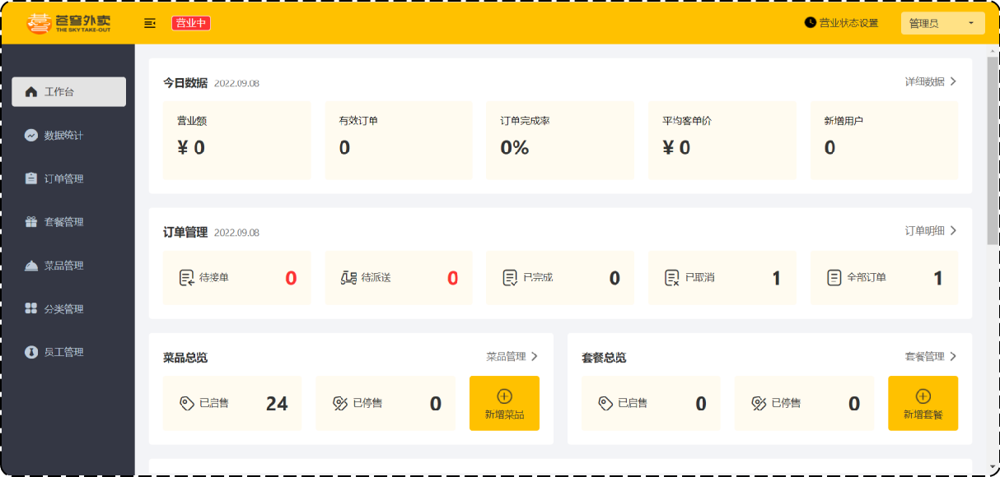
  
</div>

## 项目简介

苍穹外卖是专门为餐饮企业（餐厅、饭店）定制的一款软件产品，包括 **系统管理后台** 和 **小程序端应用** 两部分。

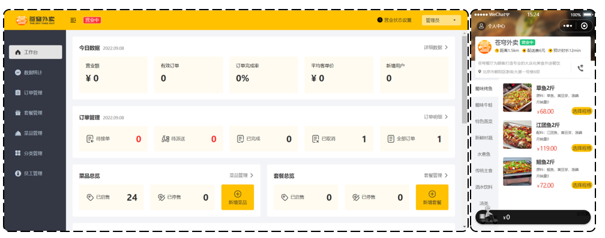

### 管理端功能

餐饮企业内部员工使用：

| 模块 | 描述 |
|------|------|
| 登录/退出 | 内部员工登录后访问系统管理后台 |
| 员工管理 | 查询、新增、编辑、禁用等 |
| 分类管理 | 菜品分类、套餐分类的增删改查 |
| 菜品管理 | 查询、新增、修改、删除、启售、停售 |
| 套餐管理 | 查询、新增、修改、删除、启售、停售 |
| 订单管理 | 查询、取消、派送、完成，订单报表下载 |
| 数据统计 | 营业额、用户数量、订单等统计 |

### 用户端功能

消费者使用（微信小程序）：

| 模块 | 描述 |
|------|------|
| 微信登录 | 微信授权登录点餐 |
| 点餐-菜单 | 分类展示菜品/套餐 |
| 点餐-购物车 | 加入、查看、删除、清空购物车 |
| 订单支付 | 对购物车商品结算 |
| 个人信息 | 收货地址管理、历史订单查询 |

---

## 技术选型

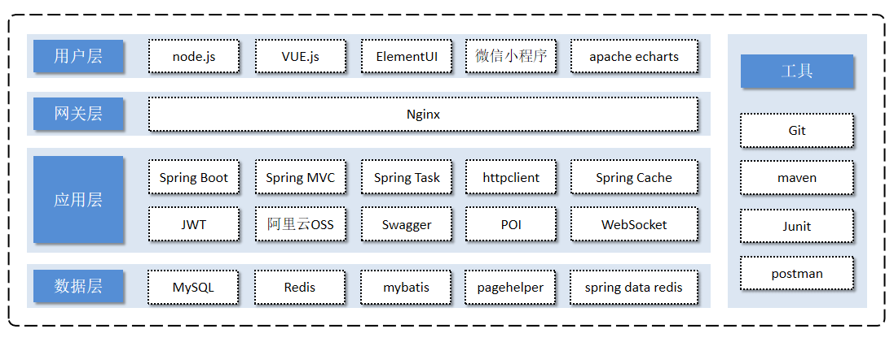

| 层级 | 技术 |
|------|------|
| 用户层 | H5、Vue.js、ElementUI、ECharts（管理端）；微信小程序（用户端） |
| 网关层 | Nginx（反向代理、负载均衡） |
| 应用层 | SpringBoot、SpringMVC、Spring Task、JWT、阿里云OSS、Swagger、WebSocket |
| 数据层 | MySQL、Redis、MyBatis、PageHelper |
| 工具 | Git、Maven、JUnit、Postman |

---

## 开发环境搭建

### 后端项目结构

基于 Maven 分模块开发：

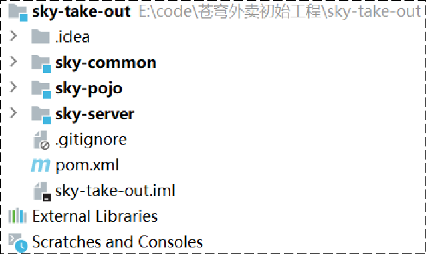

| 模块 | 说明 |
|------|------|
| sky-take-out | 父工程，统一管理依赖版本 |
| sky-common | 公共类：工具类、常量类、异常类 |
| sky-pojo | 实体类、VO、DTO |
| sky-server | 后端服务：Controller、Service、Mapper |

**sky-common 包结构：**

| 包名 | 说明 |
|------|------|
| constant | 常量类 |
| context | 上下文（如 BaseContext 的 ThreadLocal） |
| enumeration | 枚举类 |
| exception | 自定义异常 |
| json | JSON 序列化配置 |
| properties | 配置属性类 |
| result | 统一返回结果 Result\<T\> |
| utils | 工具类 |

**sky-pojo 包结构：**

| 包名 | 说明 |
|------|------|
| Entity | 实体，与数据库表对应 |
| DTO | 数据传输对象，层间传递数据 |
| VO | 视图对象，给前端展示 |
| POJO | 普通 Java 对象 |

**sky-server 包结构：**

| 包名 | 说明 |
|------|------|
| config | 配置类 |
| controller | 控制器 |
| interceptor | 拦截器（JWT 校验） |
| mapper | MyBatis Mapper |
| service | 业务逻辑 |
| SkyApplication | 启动类 |

### 数据库表设计

共 11 张表：

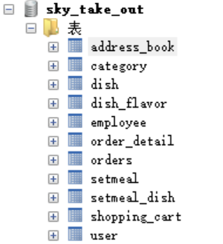

| 表名 | 中文名 |
|------|--------|
| employee | 员工表 |
| category | 分类表 |
| dish | 菜品表 |
| dish_flavor | 菜品口味表 |
| setmeal | 套餐表 |
| setmeal_dish | 套餐菜品关系表 |
| user | 用户表 |
| address_book | 地址表 |
| shopping_cart | 购物车表 |
| orders | 订单表 |
| order_detail | 订单明细表 |

### 前后端联调 — 登录功能

```
前端请求：http://localhost/api/employee/login
后端接口：http://localhost:8080/admin/employee/login

        Nginx 反向代理转发
         /api/ → /admin/
```

**Controller 层：**

```java
@RestController
@RequestMapping("/admin/employee")
@Slf4j
@Api(tags = "员工相关接口")
public class EmployeeController {

    @PostMapping("/login")
    @ApiOperation(value = "员工登录")
    public Result<EmployeeLoginVO> login(@RequestBody EmployeeLoginDTO employeeLoginDTO) {
        log.info("员工登录：{}", employeeLoginDTO);
        Employee employee = employeeService.login(employeeLoginDTO);

        // 登录成功，生成 JWT 令牌
        Map<String, Object> claims = new HashMap<>();
        claims.put(JwtClaimsConstant.EMP_ID, employee.getId());
        String token = JwtUtil.createJWT(
                jwtProperties.getAdminSecretKey(),
                jwtProperties.getAdminTtl(),
                claims);

        EmployeeLoginVO employeeLoginVO = EmployeeLoginVO.builder()
                .id(employee.getId())
                .userName(employee.getUsername())
                .name(employee.getName())
                .token(token)
                .build();

        return Result.success(employeeLoginVO);
    }
}
```

**Service 层：**

```java
@Service
public class EmployeeServiceImpl implements EmployeeService {

    public Employee login(EmployeeLoginDTO employeeLoginDTO) {
        String username = employeeLoginDTO.getUsername();
        String password = employeeLoginDTO.getPassword();

        // 1. 根据用户名查询
        Employee employee = employeeMapper.getByUsername(username);

        // 2. 各种异常处理
        if (employee == null) {
            throw new AccountNotFoundException(MessageConstant.ACCOUNT_NOT_FOUND);
        }
        // MD5 加密后比对
        password = DigestUtils.md5DigestAsHex(password.getBytes());
        if (!password.equals(employee.getPassword())) {
            throw new PasswordErrorException(MessageConstant.PASSWORD_ERROR);
        }
        if (employee.getStatus() == StatusConstant.DISABLE) {
            throw new AccountLockedException(MessageConstant.ACCOUNT_LOCKED);
        }

        // 3. 返回实体
        return employee;
    }
}
```

**Mapper 层：**

```java
@Mapper
public interface EmployeeMapper {
    @Select("select * from employee where username = #{username}")
    Employee getByUsername(String username);
}
```

### 统一返回结果 Result

```java
@Data
public class Result<T> implements Serializable {
    private Integer code;  // 1 成功，0 失败
    private String msg;    // 错误信息
    private T data;        // 数据

    public static <T> Result<T> success() { ... }
    public static <T> Result<T> success(T object) { ... }
    public static <T> Result<T> error(String msg) { ... }
}
```

---

## 员工管理

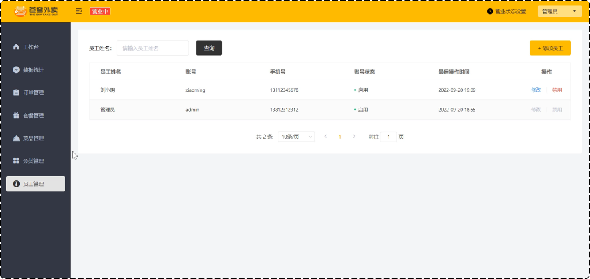

### 新增员工

**接口设计：** `POST /admin/employee`

**DTO 设计：**

```java
@Data
public class EmployeeDTO implements Serializable {
    private Long id;
    private String username;
    private String name;
    private String phone;
    private String sex;
    private String idNumber;
}
```

**Controller：**

```java
@PostMapping
@ApiOperation("新增员工")
public Result save(@RequestBody EmployeeDTO employeeDTO) {
    log.info("新增员工：{}", employeeDTO);
    employeeService.save(employeeDTO);
    return Result.success();
}
```

**Service 实现：**

```java
public void save(EmployeeDTO employeeDTO) {
    Employee employee = new Employee();
    BeanUtils.copyProperties(employeeDTO, employee);

    // 设置默认状态为正常
    employee.setStatus(StatusConstant.ENABLE);
    // 默认密码 123456（MD5加密）
    employee.setPassword(DigestUtils.md5DigestAsHex(
        PasswordConstant.DEFAULT_PASSWORD.getBytes()));
    // 设置创建时间和修改时间
    employee.setCreateTime(LocalDateTime.now());
    employee.setUpdateTime(LocalDateTime.now());
    // 设置创建人和修改人（从 ThreadLocal 获取当前登录用户）
    employee.setCreateUser(BaseContext.getCurrentId());
    employee.setUpdateUser(BaseContext.getCurrentId());

    employeeMapper.insert(employee);
}
```

**Mapper：**

```java
@Insert("insert into employee (name, username, password, phone, sex, id_number,"
    + " create_time, update_time, create_user, update_user, status) "
    + "values (#{name},#{username},#{password},#{phone},#{sex},#{idNumber},"
    + "#{createTime},#{updateTime},#{createUser},#{updateUser},#{status})")
void insert(Employee employee);
```

> **注：** `application.yml` 开启驼峰命名后，`id_number` 可自动映射 `idNumber`。

### 全局异常处理 — 用户名重复

员工表的 username 字段有唯一约束，重复插入会抛 `SQLIntegrityConstraintViolationException`。

```java
@ExceptionHandler
public Result exceptionHandler(SQLIntegrityConstraintViolationException ex) {
    // Duplicate entry 'zhangsan' for key 'employee.idx_username'
    String message = ex.getMessage();
    if (message.contains("Duplicate entry")) {
        String[] split = message.split(" ");
        String username = split[2];
        return Result.error(username + MessageConstant.ALREADY_EXISTS);
    } else {
        return Result.error(MessageConstant.UNKNOWN_ERROR);
    }
}
```

### ThreadLocal — 获取当前登录用户

JWT 拦截器校验通过后，把解析出的员工 ID 存入 ThreadLocal，Service 层直接取用：

```java
// BaseContext 工具类
public class BaseContext {
    public static ThreadLocal<Long> threadLocal = new ThreadLocal<>();
    public static void setCurrentId(Long id) { threadLocal.set(id); }
    public static Long getCurrentId() { return threadLocal.get(); }
    public static void removeCurrentId() { threadLocal.remove(); }
}
```

```java
// 拦截器中设置
Claims claims = JwtUtil.parseJWT(jwtProperties.getAdminSecretKey(), token);
Long empId = Long.valueOf(claims.get(JwtClaimsConstant.EMP_ID).toString());
BaseContext.setCurrentId(empId);

// Service 中获取
employee.setCreateUser(BaseContext.getCurrentId());
```

### 员工分页查询

**接口设计：** `GET /admin/employee/page?name=xxx&page=1&pageSize=10`

**DTO：**

```java
@Data
public class EmployeePageQueryDTO implements Serializable {
    private String name;   // 员工姓名（模糊查询）
    private int page;      // 页码
    private int pageSize;  // 每页记录数
}
```

**Service 实现（使用 PageHelper 分页插件）：**

```java
public PageResult pageQuery(EmployeePageQueryDTO dto) {
    PageHelper.startPage(dto.getPage(), dto.getPageSize());
    Page<Employee> page = employeeMapper.pageQuery(dto);
    return new PageResult(page.getTotal(), page.getResult());
}
```

**动态 SQL（EmployeeMapper.xml）：**

```xml
<select id="pageQuery" resultType="com.sky.entity.Employee">
    select * from employee
    <where>
        <if test="name != null and name != ''">
            and name like concat('%',#{name},'%')
        </if>
    </where>
    order by create_time desc
</select>
```

**分页结果封装：**

```java
@Data
@AllArgsConstructor
@NoArgsConstructor
public class PageResult implements Serializable {
    private long total;       // 总记录数
    private List records;     // 当前页数据
}
```

### 启用/禁用员工账号

```java
@PostMapping("/status/{status}")
@ApiOperation("启用禁用员工账号")
public Result startOrStop(@PathVariable Integer status, Long id) {
    employeeService.startOrStop(status, id);
    return Result.success();
}
```

```java
// Service — 使用 Builder 模式只更新需要的字段
public void startOrStop(Integer status, Long id) {
    Employee employee = Employee.builder()
            .status(status)
            .id(id)
            .build();
    employeeMapper.update(employee);
}
```

```xml
<!-- 动态 update，只更新非空字段 -->
<update id="update" parameterType="Employee">
    update employee
    <set>
        <if test="name != null">name = #{name},</if>
        <if test="username != null">username = #{username},</if>
        <if test="status != null">status = #{status},</if>
        <!-- ... -->
    </set>
    where id = #{id}
</update>
```

### 编辑员工（回显 + 更新）

**1）回显：** `GET /admin/employee/{id}`

```java
@GetMapping("/{id}")
@ApiOperation("根据id查询员工信息")
public Result<Employee> getById(@PathVariable Long id) {
    Employee employee = employeeService.getById(id);
    employee.setPassword("****");  // 密码脱敏
    return Result.success(employee);
}
```

**2）更新：** `PUT /admin/employee`

```java
@PutMapping
@ApiOperation("编辑员工信息")
public Result update(@RequestBody EmployeeDTO employeeDTO) {
    employeeService.update(employeeDTO);
    return Result.success();
}
```

```java
public void update(EmployeeDTO employeeDTO) {
    Employee employee = new Employee();
    BeanUtils.copyProperties(employeeDTO, employee);
    employee.setUpdateTime(LocalDateTime.now());
    employee.setUpdateUser(BaseContext.getCurrentId());
    employeeMapper.update(employee);
}
```

---

## 菜品管理

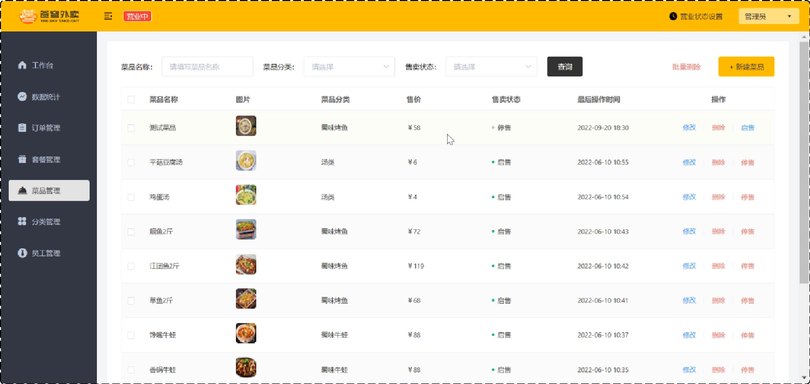

### 公共字段自动填充

问题：每个表都有 `create_time`、`create_user`、`update_time`、`update_user`，每个 Service 方法都要重复设置。解决方案：**AOP 切面**。

| 字段 | 含义 | 数据类型 |
|------|------|------|
| create_time | 创建时间 | datetime |
| create_user | 创建人id | bigint |
| update_time | 修改时间 | datetime |
| update_user | 修改人id | bigint |

**使用自定义注解 + AOP 自动填充：**

```java
// 自定义注解
@Target(ElementType.METHOD)
@Retention(RetentionPolicy.RUNTIME)
public @interface AutoFill {
    OperationType value();  // UPDATE 或 INSERT
}
```

```java
// 切面类
@Aspect
@Component
public class AutoFillAspect {
    @Pointcut("execution(* com.sky.mapper.*.*(..)) && @annotation(com.sky.annotation.AutoFill)")
    public void autoFillPointCut() {}

    @Before("autoFillPointCut()")
    public void autoFill(JoinPoint joinPoint) {
        MethodSignature signature = (MethodSignature) joinPoint.getSignature();
        AutoFill autoFill = signature.getMethod().getAnnotation(AutoFill.class);
        OperationType operationType = autoFill.value();

        Object[] args = joinPoint.getArgs();
        if (args == null || args.length == 0) return;

        Object entity = args[0];
        LocalDateTime now = LocalDateTime.now();
        Long currentId = BaseContext.getCurrentId();

        if (operationType == OperationType.INSERT) {
            // 反射设置 4 个字段
            setValue(entity, "createTime", now);
            setValue(entity, "createUser", currentId);
            setValue(entity, "updateTime", now);
            setValue(entity, "updateUser", currentId);
        } else if (operationType == OperationType.UPDATE) {
            setValue(entity, "updateTime", now);
            setValue(entity, "updateUser", currentId);
        }
    }
}
```

### 菜品分页查询 + 多表关联

菜品列表要显示分类名称（category 表），使用 VO 封装：

```java
@Data
public class DishVO extends Dish {
    private String categoryName;        // 分类名称
    private List<DishFlavor> flavors;   // 口味列表
    private Integer copies;             // 份数（前端展示用）
}
```

```xml
<select id="pageQuery" resultType="com.sky.vo.DishVO">
    select d.*, c.name as category_name
    from dish d left join category c on d.category_id = c.id
    <where>
        <if test="name != null">
            and d.name like concat('%',#{name},'%')
        </if>
        <if test="categoryId != null">
            and d.category_id = #{categoryId}
        </if>
        <if test="status != null">
            and d.status = #{status}
        </if>
    </where>
    order by d.create_time desc
</select>
```

---

## Redis 缓存

### 缓存菜品

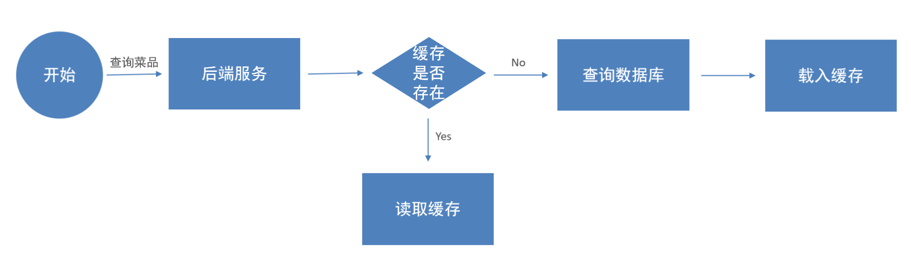

**缓存逻辑：**
- 每个分类的菜品保存一份到 Redis，key = `dish_分类id`
- 数据库有变更时，清理对应缓存

**查询时加入缓存：**

```java
@GetMapping("/list")
@ApiOperation("根据分类id查询菜品")
public Result<List<DishVO>> list(Long categoryId) {
    // 构造 Redis key
    String key = "dish_" + categoryId;

    // 先查 Redis
    List<DishVO> list = (List<DishVO>) redisTemplate.opsForValue().get(key);
    if (list != null && list.size() > 0) {
        return Result.success(list);  // 缓存命中，直接返回
    }

    // 缓存未命中，查数据库
    Dish dish = new Dish();
    dish.setCategoryId(categoryId);
    dish.setStatus(StatusConstant.ENABLE);
    list = dishService.listWithFlavor(dish);

    // 放入 Redis
    redisTemplate.opsForValue().set(key, list);
    return Result.success(list);
}
```

**数据变更时清理缓存：**

```java
// 抽取清理缓存方法
private void cleanCache(String pattern) {
    Set keys = redisTemplate.keys(pattern);
    redisTemplate.delete(keys);
}

// 新增菜品 — 清理单个分类
@PostMapping
public Result save(@RequestBody DishDTO dishDTO) {
    dishService.saveWithFlavor(dishDTO);
    cleanCache("dish_" + dishDTO.getCategoryId());
    return Result.success();
}

// 修改/删除/启停 — 清理所有菜品缓存
@PutMapping
public Result update(@RequestBody DishDTO dishDTO) {
    dishService.updateWithFlavor(dishDTO);
    cleanCache("dish_*");  // 通配符清理
    return Result.success();
}
```

### 缓存套餐 — Spring Cache 注解方式

Spring Cache 提供了声明式缓存，底层可切换 Redis / Caffeine 等。

| 注解 | 说明 |
|------|------|
| `@EnableCaching` | 开启缓存，加在启动类上 |
| `@Cacheable` | 先查缓存，有则返回，无则查库并缓存 |
| `@CachePut` | 将方法返回值放入缓存 |
| `@CacheEvict` | 删除缓存（一条或全部） |

**启动类：**

```java
@SpringBootApplication
@EnableTransactionManagement
@EnableCaching  // 开启 Spring Cache
public class SkyApplication { ... }
```

**查套餐 — 加缓存：**

```java
@GetMapping("/list")
@Cacheable(cacheNames = "setmealCache", key = "#categoryId")
public Result<List<Setmeal>> list(Long categoryId) {
    Setmeal setmeal = new Setmeal();
    setmeal.setCategoryId(categoryId);
    setmeal.setStatus(StatusConstant.ENABLE);
    List<Setmeal> list = setmealService.list(setmeal);
    return Result.success(list);
}
```

**新增/修改/删除 — 清缓存：**

```java
@PostMapping
@CacheEvict(cacheNames = "setmealCache", key = "#setmealDTO.categoryId")
public Result save(@RequestBody SetmealDTO setmealDTO) { ... }

@DeleteMapping
@CacheEvict(cacheNames = "setmealCache", allEntries = true)
public Result delete(@RequestParam List<Long> ids) { ... }

@PutMapping
@CacheEvict(cacheNames = "setmealCache", allEntries = true)
public Result update(@RequestBody SetmealDTO setmealDTO) { ... }
```

### 店铺营业状态设置（Redis 存储）

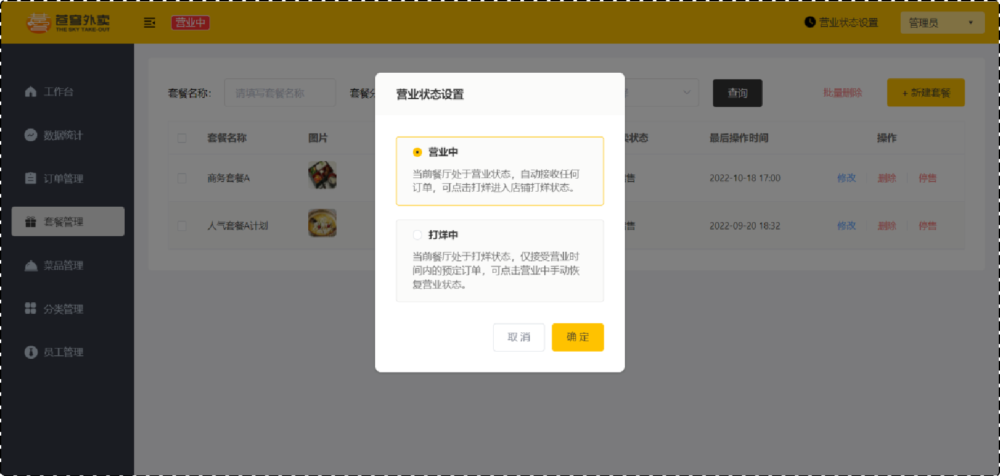

```java
// 设置营业状态
@PutMapping("/{status}")
public Result setStatus(@PathVariable Integer status) {
    redisTemplate.opsForValue().set("SHOP_STATUS", status);
    return Result.success();
}

// 获取营业状态
@GetMapping("/status")
public Result<Integer> getStatus() {
    Integer status = (Integer) redisTemplate.opsForValue().get("SHOP_STATUS");
    return Result.success(status);
}
```

---

## HttpClient + 微信登录

### HttpClient

```java
// GET 请求
CloseableHttpClient httpClient = HttpClients.createDefault();
HttpGet httpGet = new HttpGet("http://localhost:8080/user/shop/status");
CloseableHttpResponse response = httpClient.execute(httpGet);
String body = EntityUtils.toString(response.getEntity());

// POST 请求
HttpPost httpPost = new HttpPost("https://api.weixin.qq.com/sns/jscode2session");
httpPost.setEntity(new StringEntity(jsonString));
CloseableHttpResponse response = httpClient.execute(httpPost);
```

典型场景：微信登录时需要服务端向微信接口发请求换取 openid。

### 微信登录流程

```
小程序端                        后端                        微信平台
  |-- wx.login() 获取 code -->    |
  |                               |-- GET /sns/jscode2session?code=xxx -->  |
  |                               |  <-- { openid, session_key }            |
  |  <-- JWT token -----------    |
  |                               |-- 存入 user 表（首次登录）
```

**Controller：**

```java
@PostMapping("/login")
@ApiOperation("微信登录")
public Result<UserLoginVO> login(@RequestBody UserLoginDTO userLoginDTO) {
    // 1. 微信登录（code → openid）
    User user = userService.wxLogin(userLoginDTO);
    // 2. 生成 JWT 令牌
    Map<String, Object> claims = new HashMap<>();
    claims.put(JwtClaimsConstant.USER_ID, user.getId());
    String token = JwtUtil.createJWT(
            jwtProperties.getUserSecretKey(),
            jwtProperties.getUserTtl(),
            claims);
    // 3. 返回
    UserLoginVO vo = UserLoginVO.builder()
            .id(user.getId()).openid(user.getOpenid()).token(token).build();
    return Result.success(vo);
}
```

---

## 购物车

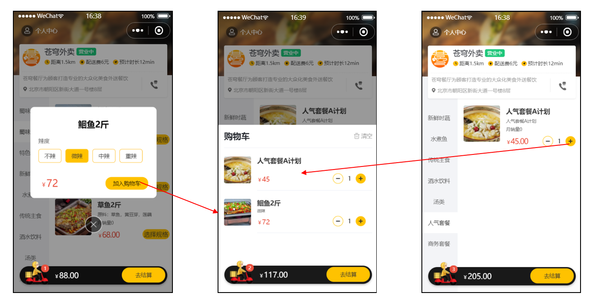

**核心逻辑：** 判断商品是否已在购物车 → 在则数量+1，不在则新增。

```java
public void addShoppingCart(ShoppingCartDTO shoppingCartDTO) {
    ShoppingCart shoppingCart = new ShoppingCart();
    BeanUtils.copyProperties(shoppingCartDTO, shoppingCart);
    shoppingCart.setUserId(BaseContext.getCurrentId());

    // 查询当前用户是否已有此商品
    List<ShoppingCart> list = shoppingCartMapper.list(shoppingCart);

    if (list != null && list.size() == 1) {
        // 已存在：数量 + 1
        shoppingCart = list.get(0);
        shoppingCart.setNumber(shoppingCart.getNumber() + 1);
        shoppingCartMapper.updateNumberById(shoppingCart);
    } else {
        // 不存在：插入新记录
        Long dishId = shoppingCartDTO.getDishId();
        if (dishId != null) {
            // 菜品
            Dish dish = dishMapper.getById(dishId);
            shoppingCart.setName(dish.getName());
            shoppingCart.setImage(dish.getImage());
            shoppingCart.setAmount(dish.getPrice());
        } else {
            // 套餐
            Setmeal setmeal = setmealMapper.getById(shoppingCartDTO.getSetmealId());
            shoppingCart.setName(setmeal.getName());
            shoppingCart.setImage(setmeal.getImage());
            shoppingCart.setAmount(setmeal.getPrice());
        }
        shoppingCart.setNumber(1);
        shoppingCart.setCreateTime(LocalDateTime.now());
        shoppingCartMapper.insert(shoppingCart);
    }
}
```

**API 一览：**

| 接口 | 方法 | 说明 |
|------|------|------|
| `/user/shoppingCart/add` | POST | 添加购物车 |
| `/user/shoppingCart/list` | GET | 查看购物车 |
| `/user/shoppingCart/clean` | DELETE | 清空购物车 |
| `/user/shoppingCart/sub` | POST | 减少商品数量 |

---

## 用户下单

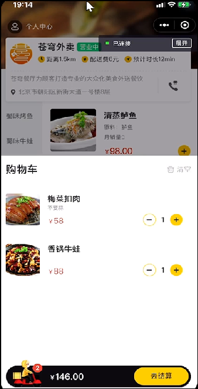

**下单流程：**
1. 获取收货地址、购物车数据
2. 向订单表插入 1 条记录
3. 向订单明细表插入 N 条记录（每个商品一条）
4. 清空当前用户的购物车
5. 保证原子性 —— 整个方法加 `@Transactional`

```java
@PostMapping("/submit")
@ApiOperation("用户下单")
public Result<OrderSubmitVO> submit(@RequestBody OrdersSubmitDTO ordersSubmitDTO) {
    OrderSubmitVO vo = orderService.submitOrder(ordersSubmitDTO);
    return Result.success(vo);
}
```

```java
@Transactional
public OrderSubmitVO submitOrder(OrdersSubmitDTO ordersSubmitDTO) {
    // 1. 处理地址簿、购物车为空等异常
    AddressBook addressBook = addressBookMapper.getById(ordersSubmitDTO.getAddressBookId());
    Long userId = BaseContext.getCurrentId();
    ShoppingCart shoppingCart = new ShoppingCart();
    shoppingCart.setUserId(userId);
    List<ShoppingCart> shoppingCartList = shoppingCartMapper.list(shoppingCart);
    if (shoppingCartList == null || shoppingCartList.size() == 0) {
        throw new AddressBookBusinessException("购物车为空");
    }

    // 2. 构造订单数据
    Orders orders = new Orders();
    BeanUtils.copyProperties(ordersSubmitDTO, orders);
    orders.setOrderTime(LocalDateTime.now());
    orders.setPayStatus(Orders.UN_PAID);
    orders.setStatus(Orders.PENDING_PAYMENT);
    orders.setNumber(String.valueOf(System.currentTimeMillis())); // 订单号
    orders.setUserId(userId);

    // 3. 插入订单
    orderMapper.insert(orders);
    // 4. 插入订单明细
    List<OrderDetail> orderDetailList = new ArrayList<>();
    for (ShoppingCart cart : shoppingCartList) {
        OrderDetail orderDetail = new OrderDetail();
        BeanUtils.copyProperties(cart, orderDetail);
        orderDetail.setOrderId(orders.getId());
        orderDetailList.add(orderDetail);
    }
    orderDetailMapper.insertBatch(orderDetailList);
    // 5. 清空购物车
    shoppingCartMapper.deleteByUserId(userId);
    // 6. 返回
    return OrderSubmitVO.builder()
            .id(orders.getId()).orderNumber(orders.getNumber())
            .orderAmount(orders.getAmount()).orderTime(orders.getOrderTime())
            .build();
}
```

---

## Spring Task + WebSocket

### 订单状态定时处理

```java
@Component
@Slf4j
public class OrderTask {

    @Autowired
    private OrderMapper orderMapper;

    /**
     * 处理超时未支付的订单（每分钟执行）
     * 下单后 15 分钟未支付 → 自动取消
     */
    @Scheduled(cron = "0 * * * * ?")
    public void processTimeoutOrder() {
        LocalDateTime time = LocalDateTime.now().plusMinutes(-15);
        List<Orders> ordersList = orderMapper.getByStatusAndOrderTimeLT(
                Orders.PENDING_PAYMENT, time);
        if (ordersList != null && ordersList.size() > 0) {
            for (Orders orders : ordersList) {
                orders.setStatus(Orders.CANCELLED);
                orders.setCancelReason("订单超时，自动取消");
                orders.setCancelTime(LocalDateTime.now());
                orderMapper.update(orders);
            }
        }
    }

    /**
     * 处理一直处于派送中的订单（每天凌晨 1 点）
     */
    @Scheduled(cron = "0 0 1 * * ?")
    public void processDeliveryOrder() {
        LocalDateTime time = LocalDateTime.now().plusMinutes(-60);
        List<Orders> ordersList = orderMapper.getByStatusAndOrderTimeLT(
                Orders.DELIVERY_IN_PROGRESS, time);
        if (ordersList != null && ordersList.size() > 0) {
            for (Orders orders : ordersList) {
                orders.setStatus(Orders.COMPLETED);
                orderMapper.update(orders);
            }
        }
    }
}
```

### WebSocket — 来单提醒 + 催单

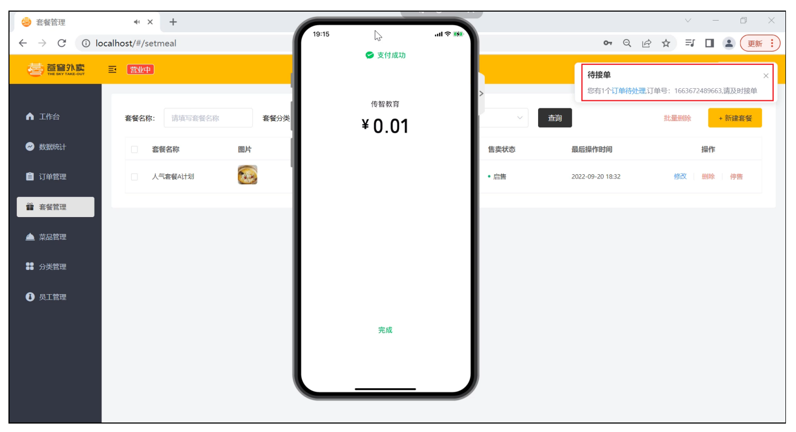

**WebSocket 配置：**

```java
@Configuration
public class WebSocketConfiguration {
    @Bean
    public ServerEndpointExporter serverEndpointExporter() {
        return new ServerEndpointExporter();
    }
}
```

**WebSocket 服务端：**

```java
@Component
@ServerEndpoint("/ws/{sid}")
public class WebSocketServer {

    private static Map<String, Session> sessionMap = new ConcurrentHashMap<>();

    @OnOpen
    public void onOpen(Session session, @PathParam("sid") String sid) {
        sessionMap.put(sid, session);
    }

    @OnClose
    public void onClose(@PathParam("sid") String sid) {
        sessionMap.remove(sid);
    }

    public void sendToAllClient(String message) {
        Collection<Session> sessions = sessionMap.values();
        for (Session session : sessions) {
            try {
                session.getBasicRemote().sendText(message);
            } catch (Exception e) {
                e.printStackTrace();
            }
        }
    }
}
```

**下单时推送来单提醒：**

```java
// 在 OrderServiceImpl 的 submitOrder 方法末尾
JSONObject result = new JSONObject();
result.put("type", 1);      // 1 来单提醒
result.put("orderId", orders.getId());
result.put("content", "订单号：" + orders.getNumber());
webSocketServer.sendToAllClient(result.toString());
```

**催单：** `GET /user/order/reminder/{id}`

```java
@GetMapping("/reminder/{id}")
public Result reminder(@PathVariable Long id) {
    JSONObject result = new JSONObject();
    result.put("type", 2);      // 2 客户催单
    result.put("orderId", id);
    result.put("content", "订单号：" + id);
    webSocketServer.sendToAllClient(result.toString());
    return Result.success();
}
```

---

## Apache ECharts 数据统计

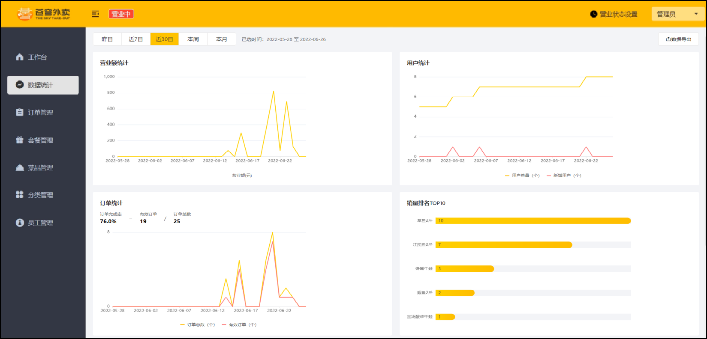

### 营业额统计

```java
@GetMapping("/turnoverStatistics")
@ApiOperation("营业额统计")
public Result<TurnoverReportVO> turnoverStatistics(
        @DateTimeFormat(pattern = "yyyy-MM-dd") LocalDate begin,
        @DateTimeFormat(pattern = "yyyy-MM-dd") LocalDate end) {
    return Result.success(reportService.getTurnoverStatistics(begin, end));
}
```

```java
public TurnoverReportVO getTurnoverStatistics(LocalDate begin, LocalDate end) {
    List<LocalDate> dateList = getDateList(begin, end);

    List<Double> turnoverList = new ArrayList<>();
    for (LocalDate date : dateList) {
        // 查询每日已完成订单的营业额 sum
        LocalDateTime beginTime = LocalDateTime.of(date, LocalTime.MIN);
        LocalDateTime endTime = LocalDateTime.of(date, LocalTime.MAX);
        Map<String, Object> map = new HashMap<>();
        map.put("begin", beginTime);
        map.put("end", endTime);
        map.put("status", Orders.COMPLETED);
        Double turnover = orderMapper.sumByMap(map);
        turnover = turnover == null ? 0.0 : turnover;
        turnoverList.add(turnover);
    }

    return TurnoverReportVO.builder()
            .dateList(StringUtils.join(dateList, ","))
            .turnoverList(StringUtils.join(turnoverList, ","))
            .build();
}
```

**动态 SQL：**

```xml
<select id="sumByMap" resultType="java.lang.Double">
    select sum(amount) from orders
    <where>
        <if test="begin != null"> and order_time &gt; #{begin} </if>
        <if test="end != null"> and order_time &lt; #{end} </if>
        <if test="status != null"> and status = #{status} </if>
    </where>
</select>
```

### 销量排名 Top10

```java
@GetMapping("/top10")
@ApiOperation("销量排名top10")
public Result<SalesTop10ReportVO> top10(
        @DateTimeFormat(pattern = "yyyy-MM-dd") LocalDate begin,
        @DateTimeFormat(pattern = "yyyy-MM-dd") LocalDate end) {
    return Result.success(reportService.getSalesTop10(begin, end));
}
```

```xml
<select id="getSalesTop10" resultType="com.sky.dto.GoodsSalesDTO">
    select od.name, sum(od.number) as number
    from order_detail od
    left join orders o on od.order_id = o.id
    where o.status = 5
    <if test="begin != null"> and o.order_time &gt; #{begin} </if>
    <if test="end != null"> and o.order_time &lt; #{end} </if>
    group by od.name
    order by number desc
    limit 10
</select>
```

---

## Apache POI — 导出运营数据 Excel

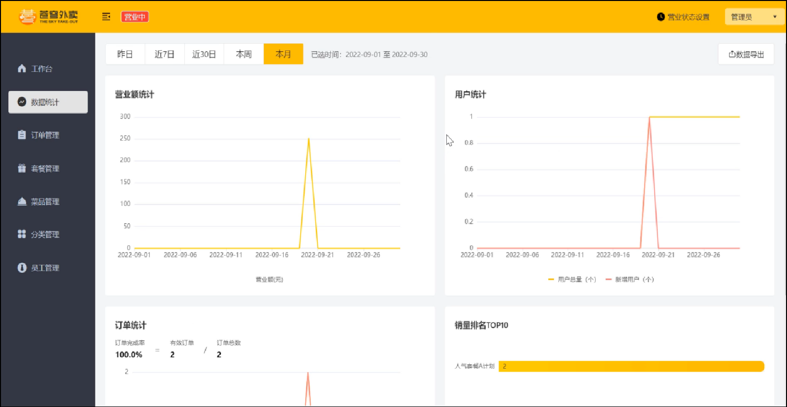

```java
@GetMapping("/export")
@ApiOperation("导出Excel报表")
public void export(HttpServletResponse response) {
    // 1. 查询数据
    LocalDate begin = LocalDate.now().minusDays(30);
    LocalDate end = LocalDate.now().minusDays(1);
    BusinessDataVO businessData = workspaceService.getBusinessData(
            LocalDateTime.of(begin, LocalTime.MIN),
            LocalDateTime.of(end, LocalTime.MAX));

    // 2. 写入 Excel（基于模板）
    InputStream in = this.getClass().getClassLoader()
            .getResourceAsStream("template/运营数据报表模板.xlsx");
    XSSFWorkbook excel = new XSSFWorkbook(in);

    // 填充数据
    XSSFSheet sheet = excel.getSheet("Sheet1");
    sheet.getRow(1).getCell(1).setCellValue("时间：" + begin + " 至 " + end);
    sheet.getRow(3).getCell(2).setCellValue(businessData.getTurnover());
    sheet.getRow(3).getCell(4).setCellValue(businessData.getOrderCompletionRate());
    sheet.getRow(3).getCell(6).setCellValue(businessData.getNewUsers());
    sheet.getRow(4).getCell(2).setCellValue(businessData.getValidOrderCount());
    sheet.getRow(4).getCell(4).setCellValue(businessData.getUnitPrice());

    // 3. 输出到浏览器
    ServletOutputStream out = response.getOutputStream();
    excel.write(out);
    out.close();
    excel.close();
}
```

---

## Swagger 接口文档

**依赖：** 使用 **Knife4j**（Swagger 增强方案，前身是 swagger-bootstrap-ui）

```xml
<dependency>
    <groupId>com.github.xiaoymin</groupId>
    <artifactId>knife4j-spring-boot-starter</artifactId>
</dependency>
```

**配置类：**

```java
@Bean
public Docket docket() {
    ApiInfo apiInfo = new ApiInfoBuilder()
            .title("苍穹外卖项目接口文档")
            .version("2.0")
            .description("苍穹外卖项目接口文档")
            .build();
    return new Docket(DocumentationType.SWAGGER_2)
            .apiInfo(apiInfo)
            .select()
            .apis(RequestHandlerSelectors.basePackage("com.sky.controller"))
            .paths(PathSelectors.any())
            .build();
}
```

**常用注解：**

| 注解 | 位置 | 说明 |
|------|------|------|
| `@Api(tags = "xxx")` | Controller 类 | 对类的说明 |
| `@ApiOperation("xxx")` | Controller 方法 | 方法说明 |
| `@ApiModel(description = "xxx")` | DTO/VO/Entity 类 | 类的说明 |
| `@ApiModelProperty("xxx")` | 字段 | 属性描述 |

**访问：** `http://localhost:8080/doc.html`

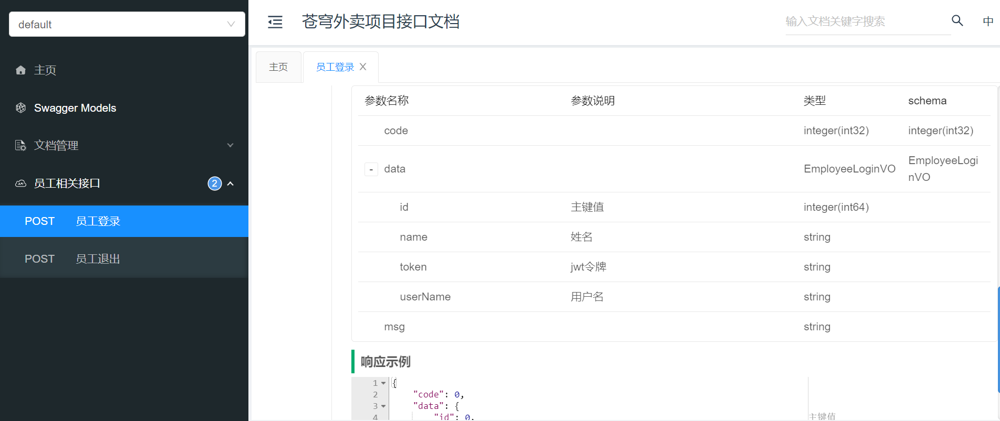

---

## Nginx 反向代理 & 负载均衡

```
前端请求：http://localhost/api/employee/login
          ↓ Nginx 反向代理
后端接口：http://localhost:8080/admin/employee/login
```

**反向代理配置：**

```nginx
server {
    listen 80;
    server_name localhost;

    location /api/ {
        proxy_pass http://localhost:8080/admin/;
    }
}
```

**负载均衡配置：**

```nginx
upstream webservers {
    server 192.168.100.128:8080;
    server 192.168.100.129:8080;
}
server {
    listen 80;
    server_name localhost;
    location /api/ {
        proxy_pass http://webservers/admin;
    }
}
```

**负载均衡策略：**

| 策略 | 说明 |
|------|------|
| 轮询 | 默认，轮流分配 |
| weight | 权重，权重越高分配越多 |
| ip_hash | 同 IP 分配到同一服务器 |
| least_conn | 分配给连接数最少的服务器 |

---

> **说明：** 以上内容为苍穹外卖项目的核心知识点梳理，涵盖了从项目搭建到核心业务实现的完整流程。涉及到的核心技术栈：SpringBoot + MyBatis + Redis + MySQL + WebSocket + Spring Task + ECharts + POI + JWT + Swagger。
