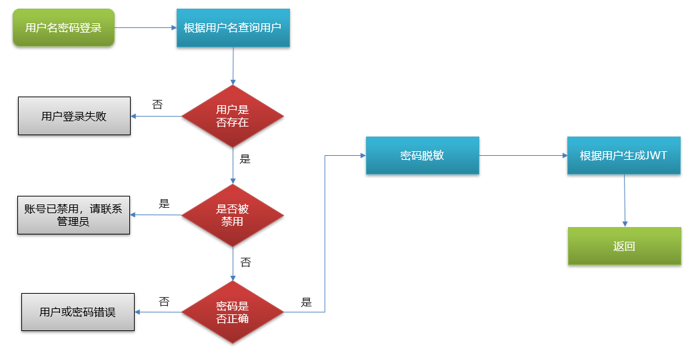
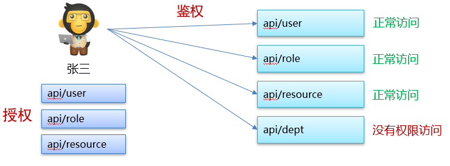
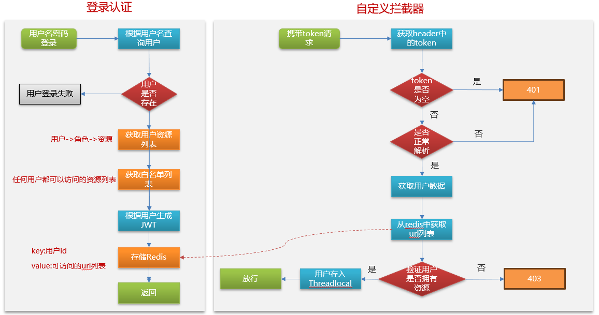
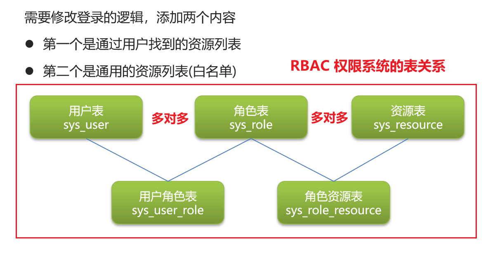
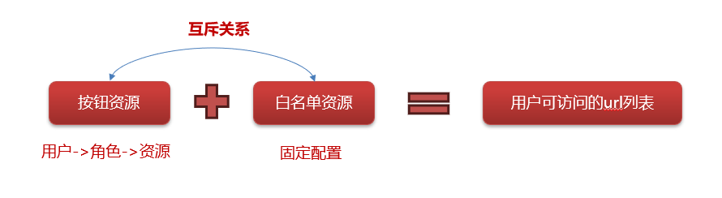
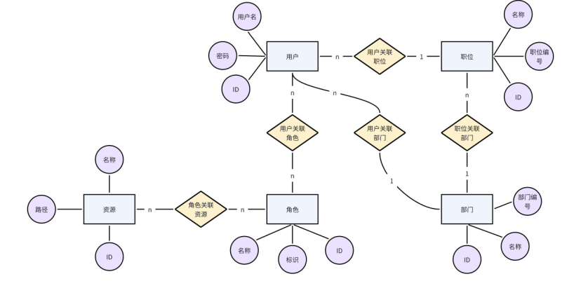

<h1 style="text-align: center;">权限相关</h1>
 
- - -

## 登录认证

### 思路分析

<br/>


### 示例代码

```java
/**
 * 用户登录
 * @param loginDto
 * @return
 */
@Override
public UserVo login(LoginDto loginDto) {
    // 根据用户名查询用户
    User user = userMapper.selectByUsername(loginDto.getUsername());
    // 判断用户是否为空
    if(ObjectUtil.isEmpty(user)){
        throw new BaseException(BasicEnum.LOGIN_FAIL);
    }
    // 判断用户是否被禁用
    if(user.getDataState().equals(SuperConstant.DATA_STATE_1)){
        throw new BaseException(BasicEnum.ACCOUNT_DISABLED);
    }
    // 判断密码是否正确
    if(!BCrypt.checkpw(loginDto.getPassword(), user.getPassword())){
        throw new BaseException(BasicEnum.INCORRECT_PASSWORD);
    }

    // 对象转换
    UserVo userVo = BeanUtil.toBean(user, UserVo.class);

    // 密码脱敏
    userVo.setPassword("");

    // 根据用户生成 JWT
    Map<String,Object> claims = new HashMap<>();
    claims.put("currentUser", JSONUtil.toJsonStr(userVo));

    String token = JwtUtil.createJWT(jwtTokenManagerProperties.getBase64EncodedSecretKey(), jwtTokenManagerProperties.getTtl(),
            claims);
    userVo.setUserToken(token);

    return userVo;
}
```

## 鉴权思路

### 相关概念

> #### 授权：用户认证成功后，根据用户的角色来确定其<span style="color:red;">是否有权利</span>执行或访问资源（分配资源）
>
> #### 鉴权：用户通过认证并被授权后进行的一道<span style="color:red;">安全检查</span>，<span style="color:red;">判断</span>用户是否有权利执行或访问该资源（校验资源）

### 思路分析

<br/>

<br/>
<br/>

<br/>



```sql
-- 参考 sql
select sr.request_path requestPath
from sys_user_role sur,
     sys_role_resource srr,
     sys_resource sr
where sur.role_id = srr.role_id
    and srr.resource_no = sr.resource_no
    and sr.data_state = '0'
    and sr.resource_type = 'r' -- 资源类型为按钮
    and sur.user_id = #{userId}
```

### 路径匹配

> #### 由于请求路径后可能会带有 /\* 或者 /\*\*，只需要匹配前面的部分，这是可以借助 <span style="color:red;">Hutool</span> 工具包中 的 <span style="color:red;">AntPathMatcher</span> 类来实现，直接注入进来，调用 <span style="color:red;">match 方法</span>即可
>
> #### 匹配规则如下
>
> #### （1）？匹配一个字符
>
> #### （2）\* 匹配 0 个或多个字符
>
> #### （3）\*\* 匹配 0 个或多个目录

```java
// 在拦截器中，通过重写的 preHandle 方法中的参数获取当前请求路径
String targetUrl = request.getMethod() + request.getRequestURI();

// 遍历可以访问的路径，匹配当前路径是否在 urllist 集合中
for(String url : urlList){
    if(antPathMatcher.match(url, targetUrl)){
        //存储当前线程中
        UserThreadLocal.setSubject(userJson);
        return true;
    }
}
```

## RBAC 权限模型

> #### 一共包含了 7 张表来进行权限控制：用户表、角色表、资源表、职位表、部门表。
>
> #### 用户与职位是 N:1 关系
>
> #### 用户与部门是 N:1 关系
>
> #### 用户与角色是 N:N 关系，则它们之间必然有一个中间表
>
> #### 角色与资源是 N:N 关系，则它们之间必然有一个中间表

<br/>


## BCrypt 密码加密

### 摘要加密

> #### 摘要加密：对数据进行哈希运算来生成一个固定长度的摘要（也称为哈希值或消息摘要）。
>
> #### 特点：不可逆，唯一性，BCrypt 对于同一个字符串加密多次是不同的，主要是因为添加了随机盐（随机字符串），更加安全
>
> #### 场景：密码加密、数字签名
>
> #### 常见的加密算法：<span style="color:red;">MD5、BCrypt</span>

### 对比 MD5 加密

<br/>


### 示例代码

```java
// 密码加密
String password = BCrypt.hashpw("123456", BCrypt.gensalt());
System.out.println(password);
// 输出 $2a$10$rkB/70Cz5UvsE7F5zsBh8O2EYDoGus3/AnVrEgP5cTpsGLxM8iyG

// 密码校验
boolean checkpw = BCrypt.checkpw("123456", "$2a$10$rkB/70Cz5UvsE7F5zsBh8O2EYDoGus3/AnVrEgP5cTpsGLxM8iyG6");

// 加密后，数据库存储的就是加密后的字符串
// 校验密码时可以从数据库中获得加密后的字符串，传入 checkpw 方法进行校验
```
