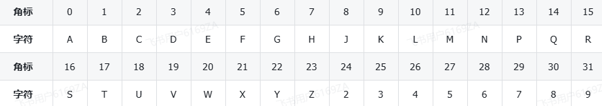
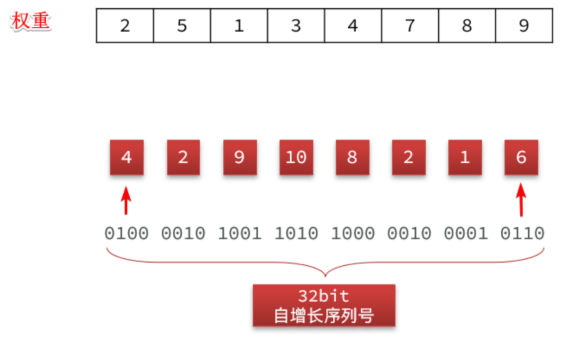
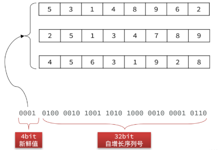
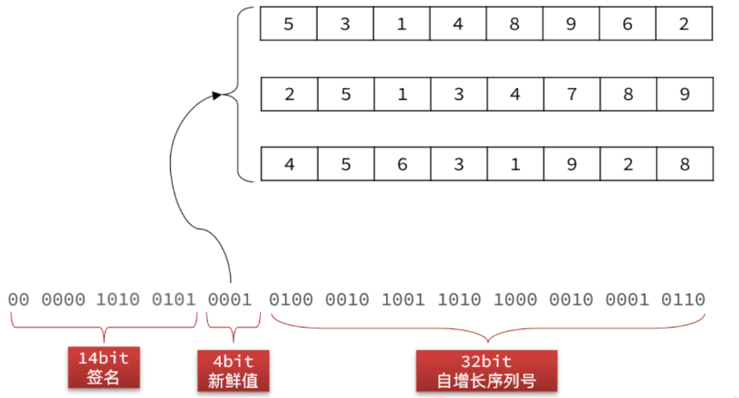
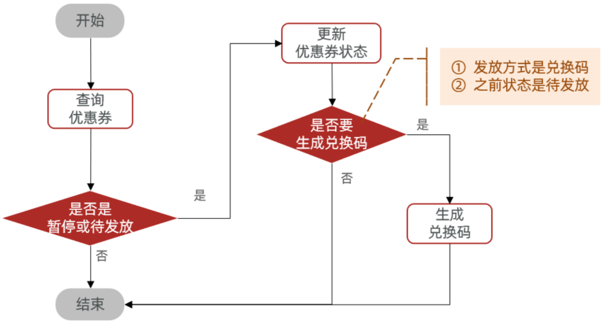
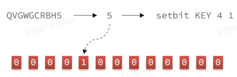
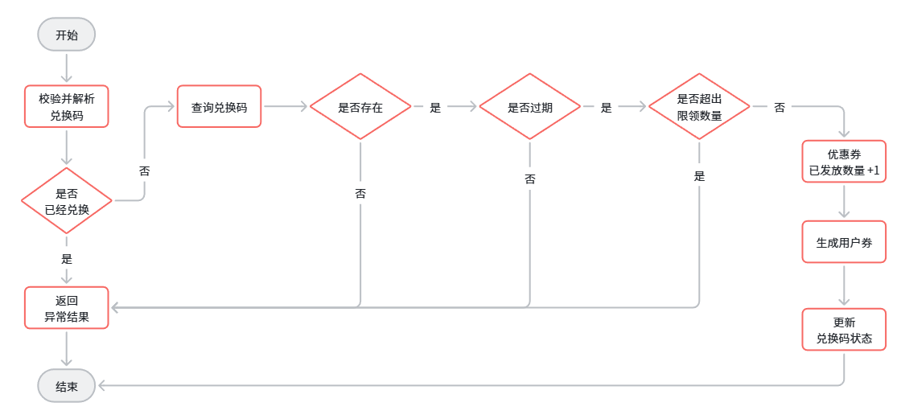

<h1 style="text-align: center;">兑换码业务</h1>
 
- - -

## 兑换码生成

### 生成要求

> #### 可读性好：兑换码是要给用户使用的，用户需要输入兑换码，因此可读性必须好，要求如下
>
> #### （1）长度不超过 10 个字符
>
> #### （2）只能是 24 个大写字母和 8 个数字：ABCDEFGHJKLMNPQRSTUVWXYZ23456789
>
> #### 数据量大：优惠活动比较频繁，必须有充足的兑换码，最好有 10 亿以上的量
>
> #### 唯一性：10 亿兑换码都必须唯一，不能重复，否则会出现兑换混乱的情况
>
> #### 不可重兑：兑换码必须便于校验兑换状态，避免重复兑换
>
> #### 防止爆刷：兑换码的规律性不能很明显，不能轻易被人猜测到其它兑换码
>
> #### 高效：兑换码生成、验证的算法必须保证效率，避免对数据库带来较大的压力

### Base32 转码

> #### 要满足唯一性，会想到以下技术：UUID、Snowflake、自增 id
>
> #### 我们的兑换码要求是 24 个大写字母和 8 个数字。而以上算法最终生成的结果都是数值类型，并不符合我们的需求！
>
> #### 假如我们将 24 个字母和 8 个数字放到数组中，<span style="color:red">去掉容易混淆的字母和数字 I，O，1，0</span>，如下



> #### 这样，0 ~ 31 的角标刚好对应了我们的 32 个字符！而 <span style="color:red">2 的 5 次幂刚好就是 32</span>，因此 5 位二进制数的范围就是 0 ~ 31

::: tip <span style="font-size:18px">⚠️ Tip</span>

#### n 位二进制数，每一位可以选择 0 或 1，所以一共有 2 × 2 × … × 2 = 2ⁿ 种不同的组合

#### 例如：1 位二进制有 2¹ = 2 种组合（0，1）

#### 2 位二进制有 2² = 4 种组合（00，01，10，11）

#### 3 位二进制有 2³ = 8 种组合（000 ~ 111）

#### 这些组合可以代表 从 0 到 2ⁿ - 1 的整数。因此，n 位二进制能表示的最大数值是 2ⁿ - 1

:::

> #### 那因此，只要我们让数字转为二进制的形式，然后每 5 个二进制位为一组，转 10 进制的结果是不是刚好对应一个角标，就能找到一个对应的字符呢？这样是不是就把一个数字转为我们想要的字符个数了。这种把二进制数经过加密得到字符的算法就是 Base32 法，类似的还有 Base64 法

```
举例：假如我们经过自增 id 计算出一个复杂数字，转为二进制，并每 5 位一组，结果如下

01001 00010 01100 10010 01101 11000 01101 00010 11110 11010

此时，我们看看每一组的结果：

- 01001 转 10 进制是 9，查数组得字符为：K
- 00010 转 10 进制是 2，查数组得字符为：C
- 01100 转 10 进制是 12，查数组得字符为：N
- 10010 转 10 进制是 18，查数组得字符为：B
- 01101 转 10 进制是 13，查数组得字符为：P
- 11000 转 10 进制是 24，查数组得字符为：2
- ...

依此类推，最终那一串二进制数得到的结果就是 KCNBP2PC84，刚好符合我们的需求
```

> #### 但是我们最终<span style="color:red">要求字符不能超过 10 位</span>，而每个字符对应 5 个 bit 位，因此二进制数不能超过 50 个 bit 位
>
> #### <span style="color:red">UUID</span> 是 <span style="color:red">128</span> 位， <span style="color:red">Snowflake</span> （雪花）算法得到的结果是 <span style="color:red">64</span> 位，都远远超出了我们的要求
>
> #### 那自增 id 算法符合我们的需求呢？
>
> #### 自增 id 从 1 增加到 Integer 的最大值，可以达到 40 亿以上个数字，而占用的字节仅仅 4 个字节，也就是 32 个 bit 位，距离 50 个 bit 位的限制还有很大的剩余，符合要求！

#### 综上，我们可以利用自增 id 作为兑换码，但是要利用 Base32 加密，转为我们要求的格式。此时就符合了我们的几个要求了

> #### （1）可读性好：可以转为要求的字母和数字的格式，长度还不超过 10 个字符
>
> #### （2）数据量大：可以应对 40 亿以上的数据规模
>
> #### （3）唯一性：自增 id，绝对唯一

### 重兑校验算法

#### （1）基于数据库

> #### 我们在设计数据库时有一个字段就是标示兑换码状态，每次兑换时可以到数据库查询状态，避免重兑
>
> #### 优点：简单，缺点：对数据库压力大

#### （2）基于 BitMap

> #### 兑换或没兑换就是两个状态，对应 0 和 1，而兑换码使用的是自增 id.我们如果每一个自增 id 对应一个 bit 位，用每一个 bit 位的状态表示兑换状态，是不是完美解决问题。而这种算法恰好就是 BitMap 的底层实现，而且 Redis 中的 BitMap 刚好能支持 2<sup>32</sup> 个 bit 位
>
> #### 优点：简答、高效、性能好， 缺点：依赖于 Redis

::: tip <span style="font-size:18px">⚠️ Tip</span>

#### 重兑、高效的两个特性都满足了！现在，就剩下防止爆刷了，兑换码规律性不能太明显，否则很容易被人猜测到其它兑换码，但是，如果我们使用了自增 id，那规律简直太明显了，岂不是很容易被人猜到其它兑换码？所以，我们采用自增 id 的同时，还需要利用某种校验算法对 id 做加密验证，避免他人找出规律，猜测到其它兑换码，甚至伪造、篡改兑换码

:::

### 防刷校验算法

> #### 非常可惜，没有一种现成的算法能满足我们的需求，我们必须自己设计一种算法来实现这个功能

#### 我们可以模拟其它验签的常用算法，比如大家熟悉的 JWT 技术，分为三部分组成

> #### （1）Header：记录算法
>
> #### （2）Payload：记录用户信息
>
> #### （3）Verify Signature：验签，用于验证整个 token
>
> #### JWT 中的的 Header 和 Payload 采用的是 Base64 算法，与我们 Base32 类似，几乎算是明文传输，难道不怕其他人伪造、篡改 token 吗？
>
> #### 为了解决这个问题，JWT 中才有了第三部分，验证签名。这个签名是有一个秘钥，结合 Header、Payload，利用 MD5 或者 RSA 算法生成的。因此
>
> #### （1）只要秘钥不泄露，其他人就无法伪造签名，也就无法伪造 token
>
> #### （2）有人篡改了 token，验签时会根据 header 和 payload 再次计算签名。数据被篡改，计算的到的签名肯定不一致，就是无效 token

#### 因此，我们也可以模拟这种思路

> #### （1）首先准备一个秘钥
>
> #### （2）然后利用秘钥对自增 id 做加密，生成签名
>
> #### （3）将签名、自增 id 利用 Base32 转码后生成兑换码

#### 只要秘钥不泄露，就没有人能伪造兑换码。只要兑换码被篡改，就会导致验签不通过，当然，这里我们不能采用 MD5 和 RSA 算法来生成签名，因为这些算法得到的签名都太长了，一般都是 128 位以上，超出了长度限制

#### 因此，这里我们必须采用一种特殊的签名算法。由于我们的兑换码核心是自增 id，也就是数字，因此这里我们打算采用按位加权的签名算法

> #### （1）将自增 id（32 位）每 4 位分为一组，共 8 组，都转为 10 进制
>
> #### （2）每一组给不同权重
>
> #### （3）把每一组数加权求和，得到的结果就是签名

<br/>


> #### 最终的加权和就是：4\*2 + 2\*5 + 9\*1 + 10\*3 + 8\*4 + 2\*7 + 1\*8 + 6\*9 = 165，这里的权重数组就可以理解为加密的秘钥
>
> #### 当然，为了避免秘钥被人猜测出规律，我们可以准备 16 组秘钥。在兑换码自增 id 前拼接一个 4 位的新鲜值，可以是随机的。这个值是多少，就取第几组秘钥

<br/>


> #### 这样就进一步增加了兑换码的复杂度，最后把加权和，也就是签名也转二进制，拼接到最前面，最终的兑换码就是这样

<br/>


## 代码实现

### Base32 工具类

```java
import cn.hutool.core.text.StrBuilder;

/**
 * 将整数转为base32字符的工具，因为是32进制，所以每5个bit位转一次
 */
public class Base32 {
    private final static String baseChars = "6CSB7H8DAKXZF3N95RTMVUQG2YE4JWPL";

    public static String encode(long raw) {
        StrBuilder sb = new StrBuilder();
        while (raw != 0) {
            int i = (int) (raw & 0b11111);
            sb.append(baseChars.charAt(i));
            raw = raw >>> 5;
        }
        return sb.toString();
    }

    public static long decode(String code) {
        long r = 0;
        char[] chars = code.toCharArray();
        for (int i = chars.length - 1; i >= 0; i--) {
            long n = baseChars.indexOf(chars[i]);
            r = r | (n << (5*i));
        }
        return r;
    }

    public static String encode(byte[] raw) {
        StrBuilder sb = new StrBuilder();
        int size = 0;
        int temp = 0;
        for (byte b : raw) {
            if (size == 0) {
                // 取5个bit
                int index = (b >>> 3) & 0b11111;
                sb.append(baseChars.charAt(index));
                // 还剩下3位
                size = 3;
                temp = b & 0b111;
            } else {
                int index = temp << (5 - size) | (b >>> (3 + size) & ((1 << 5 - size) - 1)) ;
                sb.append(baseChars.charAt(index));
                int left = 3 + size;
                size = 0;
                if(left >= 5){
                    index = b >>> (left - 5) & ((1 << 5) - 1);
                    sb.append(baseChars.charAt(index));
                    left = left - 5;
                }
                if(left == 0){
                    continue;
                }
                temp = b & ((1 << left) - 1);
                size = left;
            }
        }
        if(size > 0){
            sb.append(baseChars.charAt(temp));
        }
        return sb.toString();
    }

    public static byte[] decode2Byte(String code) {
        char[] chars = code.toCharArray();
        byte[] bytes = new byte[(code.length() * 5 )/ 8];
        byte tmp = 0;
        byte byteSize = 0;
        int index = 0;
        int i = 0;
        for (char c : chars) {
            byte n = (byte) baseChars.indexOf(c);
            i++;
            if (byteSize == 0) {
                tmp = n;
                byteSize = 5;
            } else {
                int left = Math.min(8 - byteSize, 5);
                if(i == chars.length){
                    bytes[index] =(byte) (tmp << left | (n & ((1 << left) - 1)));
                    break;
                }
                tmp = (byte) (tmp << left | (n >>> (5 - left)));
                byteSize += left;
                if (byteSize >= 8) {
                    bytes[index++] = tmp;
                    byteSize = (byte) (5 - left);
                    if (byteSize == 0) {
                        tmp = 0;
                    } else {
                        tmp = (byte) (n & ((1 << byteSize) - 1));
                    }
                }
            }
        }
        return bytes;
    }
}
```

### CodeUtil 工具类

#### （1）generateCode（long serialNum, long fresh）：根据自增 id 生成兑换码。两个参数

> #### serialNum：兑换码序列号，也就是自增 id
>
> #### fresh：新鲜值，这里建议使用兑换码对应的优惠券 id 做新鲜值

#### （2）parseCode（String code）：验证并解析兑换码，返回的是兑换码的序列号，即自增 id

```java
/**
 * 1. 兑换码算法说明
 *
 * 兑换码分为明文和密文：
 * （1）明文：50 位二进制数
 * （2）密文：长度为 10 的 Base32 编码字符串
 *
 * 2. 兑换码的明文结构
 *
 * 14 位校验码 + 4 位新鲜值 + 32 位序列号
 *
 * 字段说明：
 * （1）序列号：一个单调递增的数字，可以通过 Redis 生成
 * （2）新鲜值：可以是优惠券 ID 的最后 4 位，同一张优惠券的兑换码会有一个相同标记
 * （3）载荷：将新鲜值 4 位拼接序列号 32 位，得到载荷
 * （4）校验码：将载荷每 4 位分为一组，每组乘以加权数，最后累加求和，然后对 2^14 求余得到
 *
 * 3. 兑换码的加密过程
 *
 * （1）首先利用优惠券 ID 计算新鲜值 f
 * （2）将 f 和序列号 s 拼接，得到载荷 payload
 * （3）以 f 为角标，从提前准备好的 16 组加权码表中选一组
 * （4）对 payload 做加权计算，得到校验码 c
 * （5）利用 c 的后 4 位做角标，从提前准备好的异或密钥表中选择一个密钥 key
 * （6）将 payload 与 key 做异或，得到新的 payload2
 * （7）拼接兑换码明文：c 14 位 + payload2 36 位
 * （8）利用 Base32 对密文转码，生成兑换码
 *
 * 4. 兑换码的解密过程
 *
 * （1）首先利用 Base32 解码兑换码，得到明文数值 num
 * （2）取 num 的高 14 位得到 c1，取 num 的低 36 位得到 payload
 * （3）利用 c1 的后 4 位做角标，从提前准备好的异或密钥表中选择一个密钥 key
 * （4）将 payload 与 key 做异或，得到新的 payload2
 * （5）利用加密时的算法，用 payload2 计算出新校验码 c2
 * （6）比较 c1 和 c2，一致则校验通过
 */
public class CodeUtil {
    /**
     * 优惠券兑换码模板
     */
    private static final COUPON_CODE_PATTERN = "^[23456789ABCDEFGHJKLMNPQRSTUVWXYZ]{8,10}$";
    /**
     * 异或密钥表，用于最后的数据混淆
     */
    private final static long[] XOR_TABLE = {
            61261925471L, 61261925523L, 58169127203L, 64169927267L,
            64169927199L, 61261925629L, 58169127227L, 64169927363L,
            59169127063L, 64169927359L, 58169127291L, 61261925739L,
            59169127133L, 55139281911L, 56169127077L, 59169127167L
    };
    /**
     * fresh值的偏移位数
     */
    private final static int FRESH_BIT_OFFSET = 32;
    /**
     * 校验码的偏移位数
     */
    private final static int CHECK_CODE_BIT_OFFSET = 36;
    /**
     * fresh值的掩码，4位
     */
    private final static int FRESH_MASK = 0xF;
    /**
     * 验证码的掩码，14位
     */
    private final static int CHECK_CODE_MASK = 0b11111111111111;
    /**
     * 载荷的掩码，36位
     */
    private final static long PAYLOAD_MASK = 0xFFFFFFFFFL;
    /**
     * 序列号掩码，32位
     */
    private final static long SERIAL_NUM_MASK = 0xFFFFFFFFL;
    /**
     * 序列号加权运算的秘钥表
     */
    private final static int[][] PRIME_TABLE = {
            {23, 59, 241, 61, 607, 67, 977, 1217, 1289, 1601},
            {79, 83, 107, 439, 313, 619, 911, 1049, 1237},
            {173, 211, 499, 673, 823, 941, 1039, 1213, 1429, 1259},
            {31, 293, 311, 349, 431, 577, 757, 883, 1009, 1657},
            {353, 23, 367, 499, 599, 661, 719, 929, 1301, 1511},
            {103, 179, 353, 467, 577, 691, 811, 947, 1153, 1453},
            {213, 439, 257, 313, 571, 619, 743, 829, 983, 1103},
            {31, 151, 241, 349, 607, 677, 769, 823, 967, 1049},
            {61, 83, 109, 137, 151, 521, 701, 827, 1123},
            {23, 61, 199, 223, 479, 647, 739, 811, 947, 1019},
            {31, 109, 311, 467, 613, 743, 821, 881, 1031, 1171},
            {41, 173, 367, 401, 569, 683, 761, 883, 1009, 1181},
            {127, 283, 467, 577, 661, 773, 881, 967, 1097, 1289},
            {59, 137, 257, 347, 439, 547, 641, 839, 977, 1009},
            {61, 199, 313, 421, 613, 739, 827, 941, 1087, 1307},
            {19, 127, 241, 353, 499, 607, 811, 919, 1031, 1301}
    };

    /**
     * 生成兑换码
     *
     * @param serialNum 递增序列号
     * @return 兑换码
     */
    public static String generateCode(long serialNum, long fresh) {
        // 1.计算新鲜值
        fresh = fresh & FRESH_MASK;
        // 2.拼接payload，fresh（4位） + serialNum（32位）
        long payload = fresh << FRESH_BIT_OFFSET | serialNum;
        // 3.计算验证码
        long checkCode = calcCheckCode(payload, (int) fresh);
        System.out.println("checkCode = " + checkCode);
        // 4.payload做大质数异或运算，混淆数据
        payload ^= XOR_TABLE[(int) (checkCode & FRESH_MASK)];
        // 5.拼接兑换码明文: 校验码（14位） + payload（36位）
        long code = checkCode << CHECK_CODE_BIT_OFFSET | payload;
        // 6.转码
        return Base32.encode(code);
    }

    private static long calcCheckCode(long payload, int fresh) {
        // 1.获取码表
        int[] table = PRIME_TABLE[fresh];
        // 2.生成校验码，payload每4位乘加权数，求和，取最后13位结果
        long sum = 0;
        int index = 0;
        while (payload > 0) {
            sum += (payload & 0xf) * table[index++];
            payload >>>= 4;
        }
        return sum & CHECK_CODE_MASK;
    }

    public static long parseCode(String code) {
        if (code == null || !code.matches(COUPON_CODE_PATTERN)) {
            // 兑换码格式错误
            throw new RuntimeException("无效兑换码");
        }
        // 1.Base32解码
        long num = Base32.decode(code);
        // 2.获取低36位，payload
        long payload = num & PAYLOAD_MASK;
        // 3.获取高14位，校验码
        int checkCode = (int) (num >>> CHECK_CODE_BIT_OFFSET);
        // 4.载荷异或大质数，解析出原来的payload
        payload ^= XOR_TABLE[(checkCode & FRESH_MASK)];
        // 5.获取高4位，fresh
        int fresh = (int) (payload >>> FRESH_BIT_OFFSET & FRESH_MASK);
        // 6.验证格式：
        if (calcCheckCode(payload, fresh) != checkCode) {
            throw new BadRequestException("无效兑换码");
        }
        return payload & SERIAL_NUM_MASK;
    }
}
```

## 业务流程

### 生成兑换码

<br/>


### 兑换码兑换

> #### 兑换码是否兑换则要利用 BitMap 来实现。由于兑换码的 id 刚好是递增序列，按照约定，兑换码 id 是几，我们就找 BitMap 中的第几个 bit 位，判断是 0 还是 1，就能得知是否兑换过了
>
> #### 那因此，当我们兑换成功后，一定要利用 SETBIT 命令将对应的 bit 位置为 1，标识这个兑换码是已兑换的
>
> #### ⚠️ 注意：redis 中 setbit 返回的是 <span style="color:red">set 之前的值</span>

<br/>


<br/>

