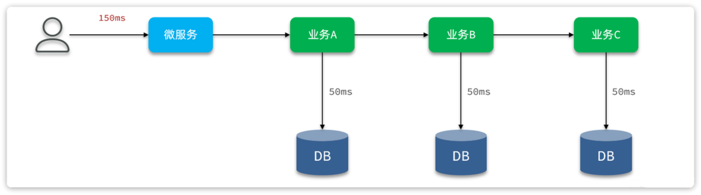
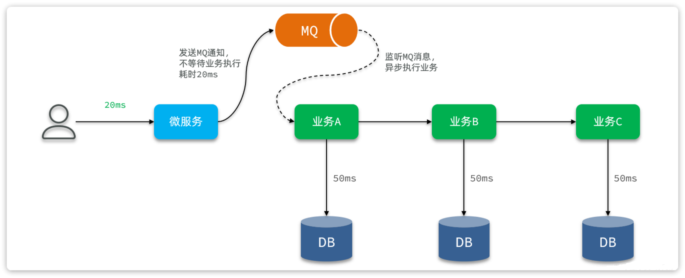
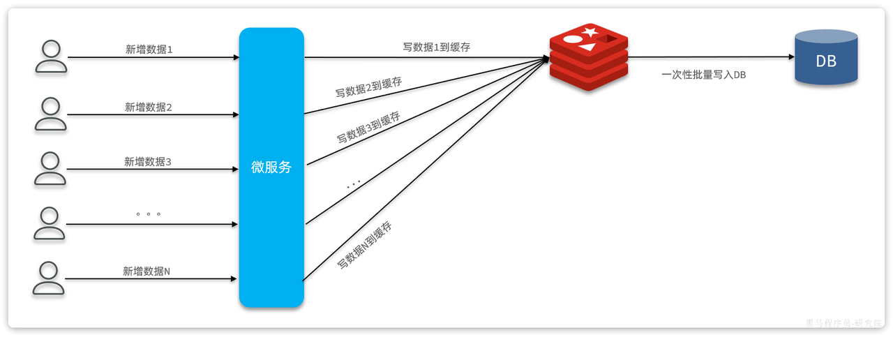

<h1 style="text-align: center;">高并发场景</h1>
 
- - -

## 解决方案

### 变同步为异步

<br/>


> #### 应用场景：<span style="color:red">比较适合应用于业务复杂， 业务链较长，有多次数据库写操作的业务</span>
>
> #### 由于各个业务之间是同步串行执行，因此整个业务的响应时间就是每一次数据库写业务的响应时间之和，并发能力肯定不会太好
>
> #### 优化的思路很简单，我们之前讲解 MQ 的时候就说过，利用 MQ 可以把同步业务变成异步，从而提高效率
>
> #### （1）当我们接收到用户请求后，可以先不处理业务，而是发送 MQ 消息并返回给用户结果
>
> #### （2）而后通过消息监听器监听 MQ 消息，处理后续业务

<br/>


> #### 这样一来，用户请求处理和后续数据库写就从同步变为异步，用户无需等待后续的数据库写操作，响应时间自然会大大缩短。并发能力自然大大提高

::: tip <span style="font-size:18px;">🔔 Tip</span>

#### 优点

#### （1）无需等待复杂业务处理，大大减少响应时间

#### （2）利用 MQ 暂存消息，起到流量削峰整形作用

#### （3）降低写数据库频率，减轻数据库并发压力

#### 缺点

#### （1）依赖于 MQ 的可靠性

#### （2）降低了些频率，但是没有减少数据库写次数

:::

### 合并写请求

<br/>


> #### 应用场景：<span style="color:red">写频率较高、写业务相对简单的场景</span>
>
> #### 合并写请求方案其实是参考高并发读的优化思路：当读数据库并发较高时，我们可以把数据缓存到 Redis，这样就无需访问数据库，大大减少数据库压力，减少响应时间
>
> #### 既然读数据可以建立缓存，那么写数据可以不可以也缓存到 Redis 呢？
>
> #### 答案是肯定的，合并写请求就是指当写数据库并发较高时，不再直接写到数据库。而是先将数据缓存到 Redis，然后定期将缓存中的数据批量写入数据库
>
> #### 由于 Redis 是内存操作，写的效率也非常高，这样每次请求的处理速度大大提高，响应时间大大缩短，并发能力肯定有很大的提升
>
> #### 而且由于数据都缓存到 Redis 了，积累一些数据后再批量写入数据库，这样数据库的写频率、写次数都大大减少，对数据库压力小了非常多！

::: tip <span style="font-size:18px;">🔔 Tip</span>

#### 优点

#### （1）写缓存速度快，响应时间大大减少

#### （2）降低数据库的写频率和写次数，大大减轻数据库压力

#### 缺点

#### （1）实现相对复杂

#### （2）依赖 Redis 可靠性

#### （3）不支持事务和复杂业务

:::

## DelayQueue

### 应用场景

> #### 用于延时任务处理，但是缺点是需要占用 JVM 内存，在数据量非常大的情况下可能会有问题

### 源码部分

> #### DelayQueue 实现了 BlockingQueue 接口，是一个阻塞队列。队列就是容器，用来存储东西的，DelayQueue 叫做延迟队列，其中存储的就是延迟执行的任务。这说明存入 DelayQueue 内部的元素必须是 Delayed 类型，这其实就是一个延迟任务的规范接口

```java
public class DelayQueue<E extends Delayed> extends AbstractQueue<E>
    implements BlockingQueue<E> {

    private final transient ReentrantLock lock = new ReentrantLock();
    private final PriorityQueue<E> q = new PriorityQueue<E>();

    // ... 略
}

public interface Delayed extends Comparable<Delayed> {

    /**
     * Returns the remaining delay associated with this object, in the
     * given time unit.
     *
     * @param unit the time unit
     * @return the remaining delay; zero or negative values indicate
     * that the delay has already elapsed
     */
    long getDelay(TimeUnit unit);
}
```

### 实际用法

#### （1）定义 DelayedTask

```java
@Data
public class DelayTask<D> implements Delayed {
    private D data;
    private long deadlineNanos;

    public DelayTask(D data, Duration delayTime) {
        this.data = data;
        this.deadlineNanos = System.nanoTime() + delayTime.toNanos();
    }

    @Override
    public long getDelay(TimeUnit unit) {
        return unit.convert(Math.max(0, deadlineNanos - System.nanoTime()), TimeUnit.NANOSECONDS);
    }

    @Override
    public int compareTo(Delayed o) {
        long l = getDelay(TimeUnit.NANOSECONDS) - o.getDelay(TimeUnit.NANOSECONDS);
        if(l > 0){
            return 1;
        }else if(l < 0){
            return -1;
        }else {
            return 0;
        }
    }
}
```

#### （2）任务执行

```java
@Slf4j
class DelayTaskTest {
    @Test
    void testDelayQueue() throws InterruptedException {
        // 1.初始化延迟队列
        DelayQueue<DelayTask<String>> queue = new DelayQueue<>();
        // 2.向队列中添加延迟执行的任务
        log.info("开始初始化延迟任务。。。。");
        queue.add(new DelayTask<>("延迟任务3", Duration.ofSeconds(3)));
        queue.add(new DelayTask<>("延迟任务1", Duration.ofSeconds(1)));
        queue.add(new DelayTask<>("延迟任务2", Duration.ofSeconds(2)));
        // 3.尝试执行任务
        while (true) {
            DelayTask<String> task = queue.take();
            log.info("开始执行延迟任务：{}", task.getData());
        }
    }
}
```

#### （3）异步执行实例

```java
public class taskHandler {
    // volatile 表示在多线程状态下共享变量值
    private static volatile boolean begin = true;

    @PostConstruct // 在当前类初始化后就调用这个方法
    public void init() {
        // 不要直接调用，这里是 Spring 生命周期的一部分，直接调用会死循环，应该采用异步执行
        CompletableFuture.runAsync(this::handleDelayTask);
    }

    @PreDestroy // 在容器销毁之前先调用这个函数
    public void destroy() {
        begin = false;
        log.debug("延迟任务停止执行！");
    }

    public void handleDelayTask() {
        while (begin) {
            try {
                // 获取到期的延迟任务
                DelayTask<RecordTaskData> task = queue.take();
                RecordTaskData data = task.getData();

                // 执行业务逻辑
            } catch (Exception  e) {
                log.error("处理延迟任务发生异常", e);
            }
        }
    }
}
```

## Redis Pipline

### 应用场景

> #### 需要批量执行命令，也就需要向 Redis 多次发起网络请求，给网络带宽带来非常大的压力，影响业务性能，可以使用 Pipeline，实现一次请求中执行多个命令，达到批处理效果

### 代码示例

```java
@Override
public Set<Long> isBizLiked(List<Long> bizIds) {
    // 1.获取登录用户id
    Long userId = UserContext.getUser();
    // 2.查询点赞状态
    List<Object> objects = redisTemplate.executePipelined((RedisCallback<Object>) connection -> {
        // 由于这里用的是 StringRedisTemplate，所以这里强转成 StringRedisConnection
        StringRedisConnection src = (StringRedisConnection) connection;
        // 执行业务逻辑
        for (Long bizId : bizIds) {
            String key = RedisConstants.LIKES_BIZ_KEY_PREFIX + bizId;
            src.sIsMember(key, userId.toString());
        }
        return null;
    });
}
```
