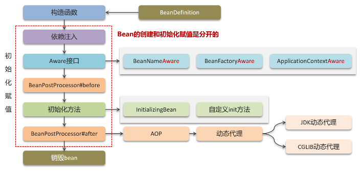
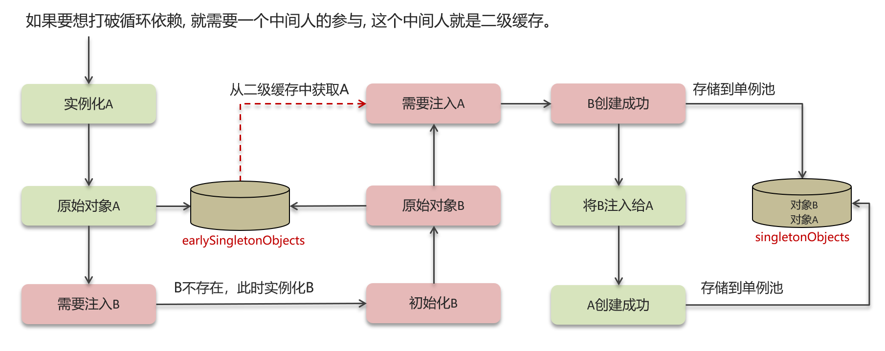
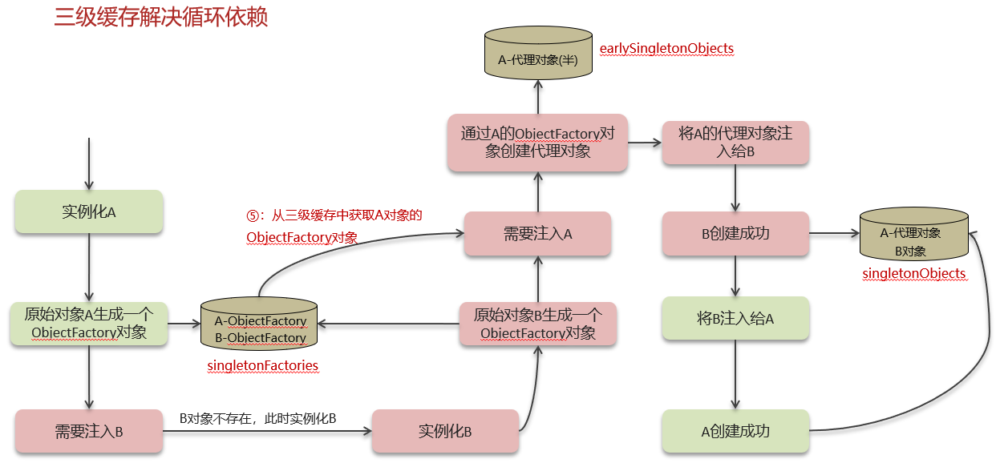
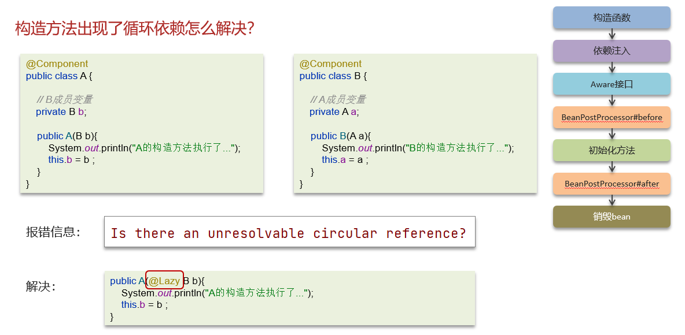
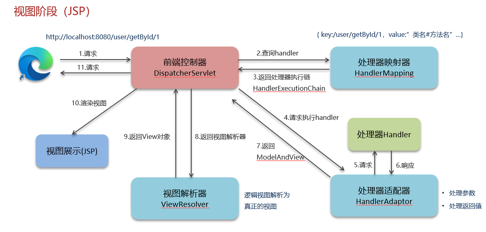
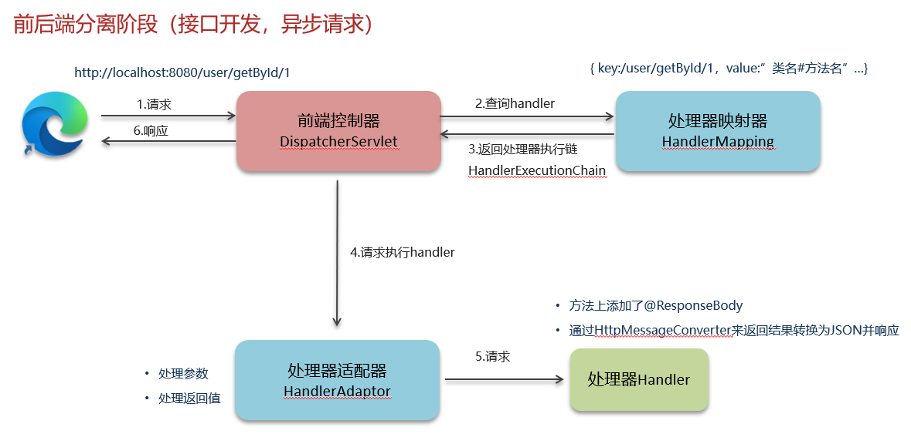
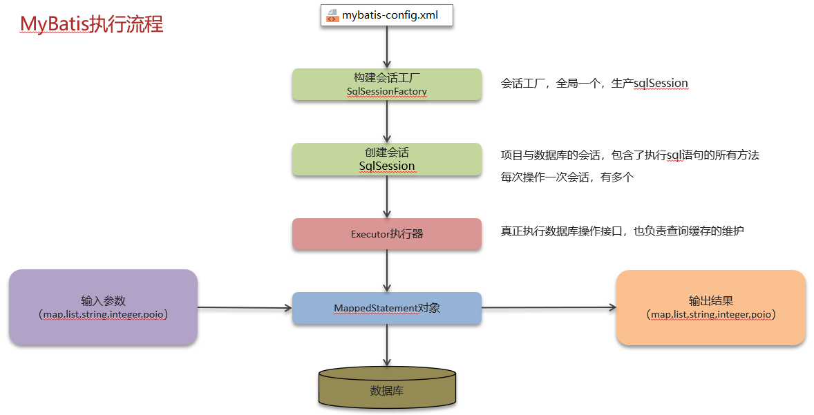
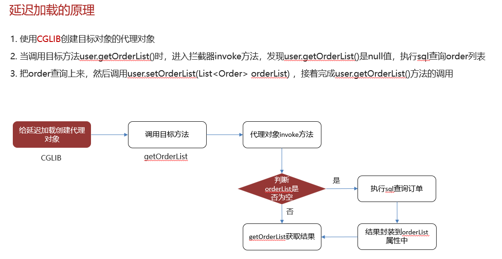

<h1 style="text-align: center; font-weight: bold;">Spring</h1>

## Bean 生命周期

## 循环依赖

### 二级缓存

 

### 三级缓存

 

### 构造方法

 

## SpringMVC

 

 

## Mybatis

### 执行流程

 

### 延迟加载

> #### 通过配置文件中的 lazyLoadingEnabled 配置启用或禁用延迟加载，默认未开启

