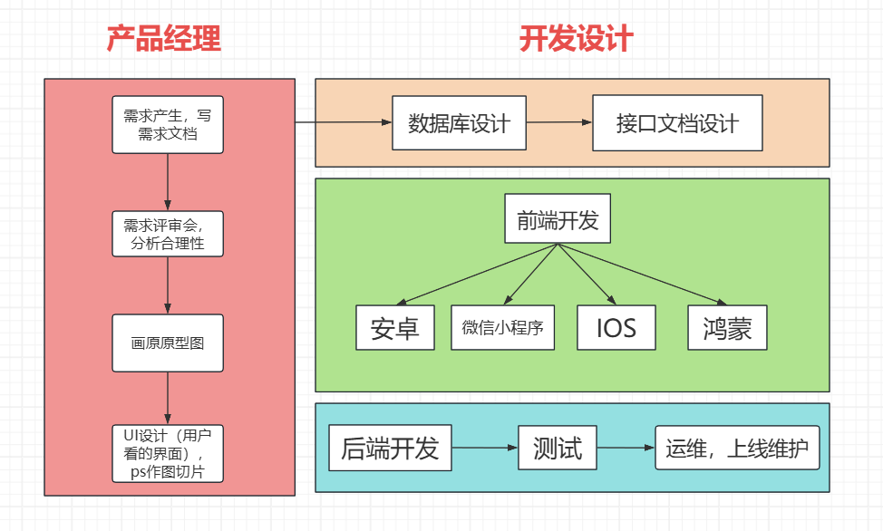
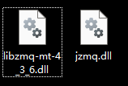
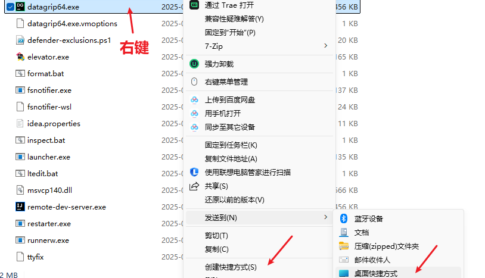

<h1 style="text-align: center; font-weight: bold;">随笔乱记</h1>

---

## 软件开发流程

<br/>


## Service 层编写思路

<br/>


## 忽略文件模板

```
######################################
# Cursor AI 忽略规则（项目根目录）
# 详细说明：https://docs.cursor.ac.cn/context/ignore-files
######################################

# ------------------------------------
# 敏感配置（尽最大努力从 AI 上下文/索引排除）
# ------------------------------------
# 环境变量文件
.env
.env.*
*.env

# 凭据/密钥
credentials.json
secrets.json
*.key
*.pem
*.jks
*.p12
*.keystore

# 本地配置/凭据
*.local
.local.env
.localsettings.json

# ------------------------------------
# Node/前端相关（不纳入 AI 分析）
# ------------------------------------
# Node 依赖
node_modules/
.pnp/
.pnp.js

# 构建/输出
dist/
build/
out/
public/   # 可按需保留 index.html 但忽略其他静态资产

# 缓存/工具
.cache/
.next/       # Next.js
.nuxt/       # Nuxt.js
.sass-cache/
.eslintcache/
parcel-cache/
.vite/
.storybook-static/

# 锁文件（根据团队选择，可选）
# 如果不希望忽略锁文件，则删除下面两个规则
package-lock.json
pnpm-lock.yaml
yarn.lock

# ------------------------------------
# Java 后端相关（Maven & Gradle）
# ------------------------------------
# Maven
target/
!.mvn/wrapper/maven-wrapper.jar   # 如果需要保留 Wrapper JAR 可取消注释

# Gradle
.gradle/
build/
!gradle/wrapper/gradle-wrapper.jar   # 保留 Gradle Wrapper 可执行文件

# Eclipse/STS 配置
.settings/
*.classpath
*.project

# IntelliJ/IDEA
*.iml
.idea/

# ------------------------------------
# 通用 IDE / 编辑器 / OS 文件
# ------------------------------------
.vscode/
.DS_Store
Thumbs.db
*.swp
*.swo
*.tmp
*.temp

# ------------------------------------
# 日志 & 运行时输出（AI 不需要分析）
# ------------------------------------
logs/
*.log
*.log.*
*.out
*.err

# Docker / Containers
docker-compose.override.yml
Dockerfile.*.local
*.dockerfile

# ------------------------------------
# 测试 & 临时/缓存
# ------------------------------------
coverage/
test-output/
*.coverage
*.cache

# JUnit / Test artifacts
*.class
*.jar
*.war
*.ear

# 二进制/编译产物
*.exe
*.dll
*.so
*.o
*.obj
*.bin

# ------------------------------------
# 媒体 / 大文件（无需索引/分析）
# ------------------------------------
*.zip
*.tar
*.gz
*.7z
*.rar
*.mp4
*.mov
*.mp3
*.wav
*.pdf
*.psd
*.ai

# ------------------------------------
# 例外规则（如果需要让 AI 索引/访问某些文件）
# ------------------------------------
# 取消忽略某些重要文档或配置模板
# !src/main/resources/application.yml
# !public/index.html
```

## 宝塔部署多项目

### 问题背景

> #### 在一个 HTML 项目中，通过配置 Nginx 配置文件实现在主域名后加上任意不同路径访问不同项目

### Nginx 配置

> #### 指定主域名后访问的路径，并指定该访问路径请求的资源目录

```bash
# 一定要包含域名和 IP
server_name 域名 服务器ip;

# ========== demo 子项目 ==========
# 访问 /demo 时统一跳到 /demo/
location = /demo {
    return 301 /demo/;
}

# /demo/ 作为 accompanySystem 的站点根
# 假设 Vite 已配置 base: '/demo/'，静态资源路径为 /demo/assets/...
location ^~ /demo/ {
    alias /www/wwwroot/accompanySystem/;
    index index.html index.htm;
}
# ========== demo 子项目结束 ==========
```

### vite.config.ts

> #### 在项目配置文件中配置 base 路径，即为主域名后的路径

```ts
export default defineConfig({
  // 指定部署子路径
  base: "/demo/",
  plugins: [vue(), vueDevTools()],
  resolve: {
    alias: {
      "@": fileURLToPath(new URL("./src", import.meta.url)),
    },
  },
  server: {
    proxy: {
      "/api": {
        target: "http://localhost:8080",
        changeOrigin: true,
        rewrite: (path) => path.replace(/^\/api/, ""),
      },
    },
  },
});
```

## JetBrains 软件启动问题

### 问题描述

> #### 24 版本系列的 JetBrains 软件启动后，在桌面弹出两个 ddl 插件

<br/>


### 解决方法

> #### 根本问题：激活脚本与新版本的不兼容问题，导致启动出现崩溃，建议采用激活码激活，删除 vm 文件中的 -javaagent 参数，采用激活码重新激活即可
>
> #### 解决方法：安装软件创建的快捷方式中的起始位置为空导致，删除桌面快捷方式，找到软件的安装的 bin 目录，右键 exe 文件重新发送快捷方式到桌面即可

<br/>
<div style="display:flex; gap:30px;">


</div>
