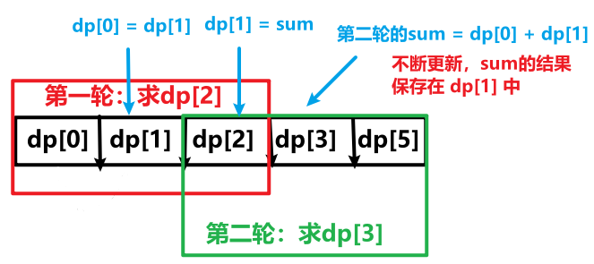

<h1 style="text-align: center; font-weight: bold;">Day 28</h1>

---

## 理论基础

无论大家之前对动态规划学到什么程度，一定要先看 我讲的 动态规划理论基础。

如果没做过动态规划的题目，看我讲的理论基础，会有感觉 是不是简单题想复杂了？

其实并没有，我讲的理论基础内容，在动规章节所有题目都有运用，所以很重要！

如果做过动态规划题目的录友，看我的理论基础 就会感同身受了。

文章讲解：https://programmercarl.com/%E5%8A%A8%E6%80%81%E8%A7%84%E5%88%92%E7%90%86%E8%AE%BA%E5%9F%BA%E7%A1%80.html

视频讲解：https://www.bilibili.com/video/BV13Q4y197Wg

### 基本介绍

> #### 动态规划，英文：Dynamic Programming，简称 <span style="color:red;font-weight:bold">DP</span>，如果某一问题有很<span style="color:red;font-weight:bold">多重叠子问题</span>，使用动态规划是最有效的。
>
> #### 所以动态规划中<span style="color:red;font-weight:bold">每一个状态一定是由上一个状态推导出来的</span>，这一点就区分于贪心，贪心没有状态推导，而是从局部直接选最优的，

### 动态规划<span style="color:red;font-weight:bold">框架</span>⭐

> #### （1）确定 dp 数组（dp table）以及下标的含义
>
> #### （2）确定递推公式
>
> #### （3）dp 数组如何初始化
>
> #### （4）确定遍历顺序
>
> #### （5）举例推导 dp 数组

## 509. 斐波那契数

很简单的动规入门题，但简单题使用来掌握方法论的，还是要有动规五部曲来分析。

题目链接：https://leetcode.cn/problems/fibonacci-number/description

文章讲解：https://programmercarl.com/0509.%E6%96%90%E6%B3%A2%E9%82%A3%E5%A5%91%E6%95%B0.html

视频讲解：https://www.bilibili.com/video/BV1f5411K7mo

### 思路分析

#### （1）确定 dp 数组以及下标的含义

> #### dp[i]的定义为：第 i 个数的斐波那契数值是 dp[i]

#### （2）确定递推公式

> #### 题目已经把递推公式直接给我们了：<span style="color:red">状态转移方程</span> dp[i] = dp[i - 1] + dp[i - 2];

#### （3）dp 数组如何初始化

> #### 题目中给出如下定义

```java
dp[0] = 0;
dp[1] = 1;
```

#### （4）确定遍历顺序

> #### 从递归公式 dp[i] = dp[i - 1] + dp[i - 2]中可以看出，<span style="color:red">dp[i] 是依赖 dp[i - 1] 和 dp[i - 2]</span>，那么遍历的顺序一定是<span style="color:red">从前向后</span>遍历的

#### （5）举例推导 dp 数组

> #### 按照这个递推公式 dp[i] = dp[i - 1] + dp[i - 2]，我们来推导一下，当 N 为 10 的时候，dp 数组应该是如下的数列
>
> #### 0、1、1、2、3、5、8、13、21、34、55

#### 提示：如果代码写出来，发现结果不对，就把 dp 数组打印出来看看和我们推导的数列是不是一致的。

### 题解

```java
class Solution {
    public int fib(int n) {
        if (n <= 1) {
            return n;
        }
        int[] dp = new int[n + 1];
        // 第 0 个斐波那契数
        dp[0] = 0;
        // 第 1 个斐波那契数
        dp[1] = 1;
        // 要求第 n 个斐波那契数，遍历到 n
        for (int index = 2; index <= n; index++) {
            dp[index] = dp[index - 1] + dp[index - 2];
        }
        return dp[n];
    }
}
```

### 状态压缩

> #### 根据递推公式可以发现，dp[i] 只依赖于前两个值，可以不用维护整个数组，只需要维护 dp[i]、dp[i - 1]、dp[i - 2]这三个值即可



```java
class Solution {
    public int fib(int n) {
        if (n <= 1) {
            return n;
        }
        int[] dp = new int[2];
        // 第 0 个斐波那契数
        dp[0] = 0;
        // 第 1 个斐波那契数
        dp[1] = 1;
        /*
            （1）要求第 n 个斐波那契数，遍历到 n
            （2）状态压缩，只需要维护三个变量（i - 2、i - 1、i）
         */
        for (int index = 2; index <= n; index++) {
            // dp[i]，第 i 个斐波那契数的值
            int sum = dp[0] + dp[1];
            // 下一轮循环，不断更新
            dp[0] = dp[1];
            dp[1] = sum;
        }
        // 经过不断更新，最终 sum 的值保存在了 dp[1] 中
        return dp[1];
    }
}
```

## 70. 爬楼梯

本题大家先自己想一想， 之后会发现，和斐波那契数有点关系。

题目链接：https://leetcode.cn/problems/climbing-stairs

文章讲解：https://programmercarl.com/0070.%E7%88%AC%E6%A5%BC%E6%A2%AF.html

视频讲解：https://www.bilibili.com/video/BV17h411h7UH

### 思路分析

#### （1）确定 dp 数组以及下标的含义

> #### dp[i]： 爬到第 i 层楼梯，有 dp[i] 种方法

#### （2）确定递推公式

> #### 题目中提到，每次只能走一步或者两步，也就是说方法依赖于前两个台阶的方法数
>
> #### dp[i - 1]，上 i-1 层楼梯，有 dp[i - 1]种方法，那么再一步跳<span style="color:red">一个</span>台阶不就是 dp[i]了么。
>
> #### dp[i - 2]，上 i-2 层楼梯，有 dp[i - 2]种方法，那么再一步跳<span style="color:red">两个</span>台阶不就是 dp[i]了么。
>
> #### dp[i] = dp[i - 1] + dp[i - 2]
>
> #### 最后发现，<span style="color:red">本质就是斐波那契数列</span>

#### （3）dp 数组如何初始化

> #### 题目中说了 n 是一个正整数，题目根本就没说 n 有为 0 的情况，<span style="color:red">不需要讨论 dp[0]的初始化</span>
>
> #### 从 i = 3 开始递推，这样才符合 dp[i] 的定义

```java
dp[1] = 1;
dp[2] = 2;
```

#### （4）确定遍历顺序

> #### 从递推公式 dp[i] = dp[i - 1] + dp[i - 2]中可以看出，遍历顺序一定是<span style="color:red">从前向后</span>遍历的

#### （5）举例推导 dp 数组

<br/>


### 题解

```java
class Solution {
    public int climbStairs(int n) {
        // 防止下标索引越界，同时处理特殊情况
        if (n <= 1){
            return n;
        }
        // dp[0] 没有意义，从dp[1]开始，正好对应第 i 个台阶
        int[] dp = new int[n + 1];
        dp[1] = 1;
        dp[2] = 2;
        // 从 3 开始递推
        for (int i = 3; i <= n; i++) {
            // dp[i - 1]：走一步
            // dp[i - 2]：走两步
            dp[i] = dp[i - 1] + dp[i - 2];
        }
        return dp[n];
    }
}
```

### 状态压缩

> #### 维护的仍然是三个数，不需要维护整个数组，再空间上优化

```java
class Solution {
    public int climbStairs(int n) {
        // 处理特殊情况
        if (n <= 1) {
            return n;
        }
        // dp[0] 没有意义，从dp[1]开始，正好对应第 i 个台阶
        int[] dp = new int[3];
        dp[1] = 1;
        dp[2] = 2;
        // 从 3 开始递推
        for (int i = 3; i <= n; i++) {
            int sum = dp[1] + dp[2];
            dp[1] = dp[2];
            dp[2] = sum;
        }
        return dp[2];
    }
}
```

## 746. 使用最小花费爬楼梯

这道题目力扣改了题目描述了，现在的题目描述清晰很多，相当于明确说 第一步是不用花费的。

更改题目描述之后，相当于是 文章中 「拓展」的解法

题目链接：https://leetcode.cn/problems/min-cost-climbing-stairs

文章讲解：https://programmercarl.com/0746.%E4%BD%BF%E7%94%A8%E6%9C%80%E5%B0%8F%E8%8A%B1%E8%B4%B9%E7%88%AC%E6%A5%BC%E6%A2%AF.html

视频讲解：https://www.bilibili.com/video/BV16G411c7yZ

### 思路分析

#### （1）确定 dp 数组以及下标的含义

> #### dp[i]的定义：到达第 i 台阶的最少花费为 dp[i]

#### （2）确定递推公式

> #### 可以有两个途径得到 dp[i]，一个是 dp[i-1] 一个是 dp[i-2]
>
> #### dp[i - 1] 跳到 dp[i] 需要花费 dp[i - 1] + cost[i - 1]
>
> > #### 解释：到达 dp[i - 1] 台阶的最小花费 + 跳到下一个台阶的花费 cost[i - 1]
>
> #### dp[i - 2] 跳到 dp[i] 需要花费 dp[i - 2] + cost[i - 2]
>
> #### 题目要求花费最少，则 dp[i] = min(dp[i - 1] + cost[i - 1], dp[i - 2] + cost[i - 2])

#### （3）dp 数组如何初始化

> #### 题目描述中明确说了<<你可以选择从下标为 0 或下标为 1 的台阶开始爬楼梯>><br/>也就是说到达第 0 个台阶是不花费的，但从第 0 个台阶<span style="color:red">往上跳</span>的话，<span style="color:red">需要花费</span> cost[0]
>
> #### 初始化 dp[0] = 0，dp[1] = 0

#### （4）确定遍历顺序

> #### 因为是模拟台阶，而且 dp[i]由 dp[i-1]dp[i-2]推出，所以是<span style="color:red">从前到后</span>遍历 cost 数组就可以了

#### （5）举例推导 dp 数组


### 题解

```java
class Solution {
    public int minCostClimbingStairs(int[] cost) {
        /*
            （1）dp[i] 表示到达第 i 个台阶的最小花费
            （2）cost[cost.length - 1] 表示跳到顶楼的花费，
                 还要再朓一步才到达顶楼的位置，
            （3）根据 dp[] 数组的含义，返回的应该是到达顶楼的最小花费，
                 即初始化时数组的长度要加一，加一到达的位置就是顶楼的位置
         */
        int[] dp = new int[cost.length + 1];
        // 从下标为 0 或者 下标为 1 的地方开始朓，跳了才有花费
        dp[0] = 0;
        dp[1] = 0;
        for (int i = 2; i <= cost.length; i++) {
            // 取最小花费
            dp[i] = Math.min(dp[i - 1] + cost[i - 1], dp[i - 2] + cost[i - 2]);
        }
        // 返回达到顶楼的最小花费
        return dp[cost.length];
    }
}
```

### 状态压缩

```java
class Solution {
    public int minCostClimbingStairs(int[] cost) {
        // 状态压缩，dp[i]就是由前两位推出来的
        int dp0 = 0;
        int dp1 = 0;
        for (int i = 2; i <= cost.length; i++) {
            int dpi = Math.min(dp1 + cost[i - 1], dp0 + cost[i - 2]);
            // 下一轮循环，更新
            dp0 = dp1;
            dp1 = dpi;
        }
        return dp1;
    }
}
```
