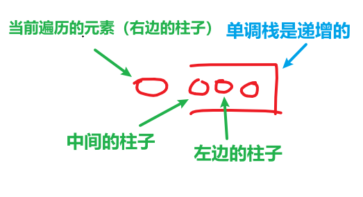

<h1 style="text-align: center; font-weight: bold;">Day 42</h1>

---

## 42. 接雨水

接雨水这道题目是面试中特别高频的一道题，也是单调栈应用的题目，大家好好做做

建议是掌握双指针和单调栈，因为在面试中写出单调栈可能有点难度，但双指针思路更直接一些

在时间紧张的情况有，能写出双指针法也是不错的，然后可以和面试官在慢慢讨论如何优化

题目链接：https://leetcode.cn/problems/trapping-rain-water

文章讲解：https://programmercarl.com/0042.%E6%8E%A5%E9%9B%A8%E6%B0%B4.html

视频讲解；https://www.bilibili.com/video/BV1uD4y1u75P

### 思路分析

#### 只有形成凹槽才能接雨水，即左边的柱子和右边的柱子高度比当前柱子高才能形成凹槽

#### （1）右边的柱子比当前柱子高：即找出右边第一个比当前柱子高的柱子

#### （2）左边的柱子比当前柱子高：即找出左边第一个比当前柱子高的柱子，可以利用单调栈递增的特性



### 题解

```java
class Solution {
    public int trap(int[] height) {
        int size = height.length;

        if (size <= 2) {
            return 0;
        }

        Stack<Integer> stack = new Stack<>();
        stack.push(0);

        int sum = 0;
        for (int index = 1; index < size; index++) {
            if (height[index] < height[stack.peek()]) {
                stack.push(index);
            } else if (height[index] == height[stack.peek()]) {
                stack.push(index);
            } else {
                while (!stack.isEmpty() && height[index] > height[stack.peek()]) {
                    int mid = stack.peek();
                    stack.pop();
                    if (!stack.isEmpty()) {
                        int left = stack.peek();
                        int h = Math.min(height[left], height[index]) - height[mid];
                        int w = index - left - 1; // 注意减一，只求中间宽度
                        sum += h * w;
                    }
                }
                stack.push(index);
            }
        }
        return sum;
    }
}
```

## 84.柱状图中最大的矩形

有了之前单调栈的铺垫，这道题目就不难了。

题目链接：https://leetcode.cn/problems/largest-rectangle-in-histogram

文章讲解：https://programmercarl.com/0084.%E6%9F%B1%E7%8A%B6%E5%9B%BE%E4%B8%AD%E6%9C%80%E5%A4%A7%E7%9A%84%E7%9F%A9%E5%BD%A2.html

视频讲解；https://www.bilibili.com/video/BV1Ns4y1o7uB

### 思路分析

#### 本题是要找每个柱子左右两边第一个小于该柱子的柱子，所以从栈头（元素从栈头弹出）到栈底的顺序应该是从大到小的顺序（<span style="color: red;">单调递减栈</span>）


> #### ⚠️ 注意点：需要在 height 数组的<span style="color: red;">首尾加 0</span>

#### （1）首先来说末尾为什么要加元素 0？

> #### 如果数组本身就是升序的，例如[2,4,6,8]，那么入栈之后都是单调递减，一直都没有走到计算结果的那一步，所以最后输出的就是 0 了

#### （2）开头为什么要加元素 0？

> #### 如果数组本身是降序的，例如 [8,6,4,2]，在 8 入栈后，6 开始与 8 进行比较，此时我们得到 mid（8），right（6），但是得不到 left

### 题解

```java
class Solution {
    public int largestRectangleArea(int[] heights) {
        Stack<Integer> st = new Stack<>();

        // 数组扩容，首位加入 0
        int[] newHeights = new int[heights.length + 2];
        newHeights[0] = 0;
        newHeights[heights.length - 1] = 0;
        for (int index = 0; index < heights.length; index++) {
            newHeights[index + 1] = heights[index];
        }
        // 引用指向新数组
        heights = newHeights;

        st.push(0);
        int result = 0;
        for (int i = 1; i < heights.length; i++) {
            if (heights[i] > heights[st.peek()]) {
                st.push(i);
            } else if (heights[i] == heights[st.peek()]) {
                // 先弹出在压入，可以减少一次计算
                st.pop();
                st.push(i);
            } else {
                while (!st.isEmpty() && heights[i] < heights[st.peek()]) {
                    int mid = st.peek();
                    st.pop();
                    int left = st.peek();
                    int right = i;
                    int w = right - left - 1; // 要求中间的，所以要减一
                    int h = heights[mid];
                    result = Math.max(result, w * h);
                }
                st.push(i);
            }
        }
        return result;
    }
}
```
