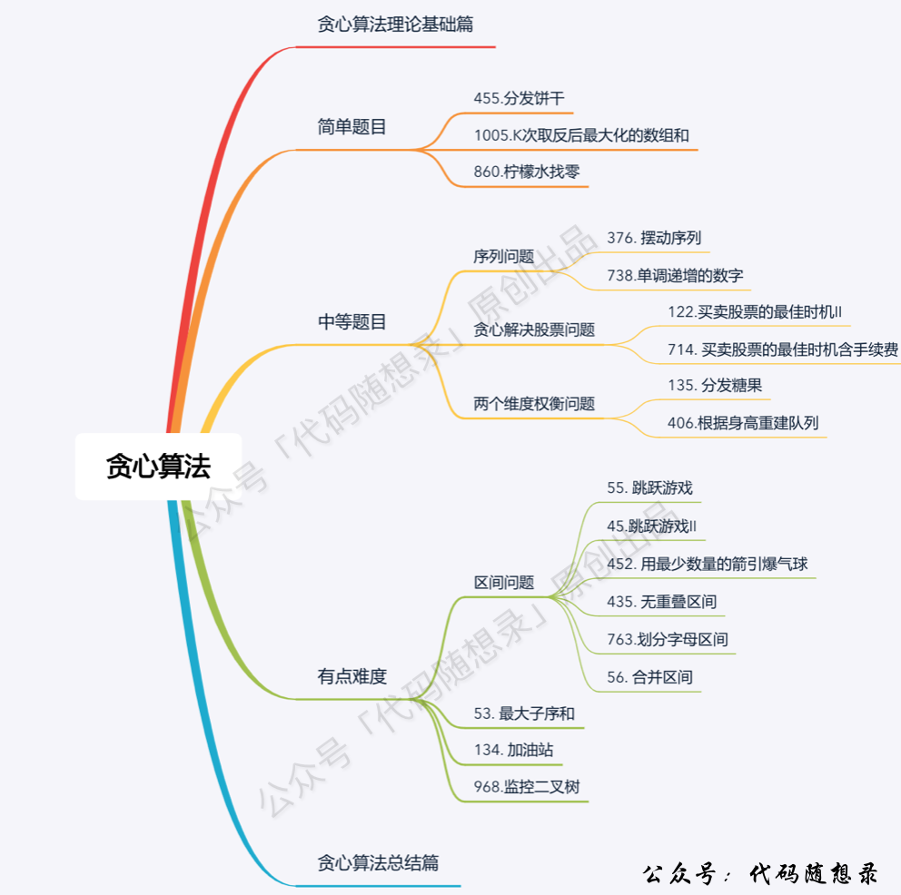

<h1 style="text-align: center; font-weight: bold;">Day 27</h1>

---

## 56. 合并区间

本题也是重叠区间问题，如果昨天三道都吸收的话，本题就容易理解了。

题目链接：https://leetcode.cn/problems/merge-intervals/

文章讲解：https://programmercarl.com/0056.%E5%90%88%E5%B9%B6%E5%8C%BA%E9%97%B4.html

视频链接：https://www.bilibili.com/video/BV1wx4y157nD

### 思路分析

> #### 又是重叠区间问题，还是老套路，按照左边界排序


#### 注意点

> #### （1）本题要求的是合并区间，当区间重叠时，有可能出现图中左边的这种情况，需要<span style="color:red">取最大右边界</span>
>
> #### （2）注意<span style="color:red">对边界的处理</span>（题目要求）：【1，<span style="color:red">2</span>】【<span style="color:red">2</span>，3】这也算重叠区间

### 题解

```java
class Solution {
    public int[][] merge(int[][] intervals) {
        LinkedList<int[]> res = new LinkedList<>();
        // 按照左边界排序
        Arrays.sort(intervals, (x, y) -> Integer.compare(x[0], y[0]));
        // 用 start 和 end 维护当前合并的区间范围
        int start = intervals[0][0];
        int end = intervals[0][1];
        // 从第二个区间开始遍历
        for (int i = 1; i < intervals.length; i++) {
            // 不重叠（左区间大于右区间）
            if (intervals[i][0] > end) {
                res.add(new int[] { start, end });
                // 更新当前区间，和下一个区间比较
                start = intervals[i][0];
                end = intervals[i][1];
            } else {
                // 重叠了，更新最大右区间，相当于合并区间
                end = Math.max(end, intervals[i][1]);
            }
        }
        // 遍历结束，把最后更新的区间添加到结果集
        res.add(new int[] { start, end });
        // 转为二维数组返回
        return res.toArray(new int[res.size()][]);
    }
}
```

## 738.单调递增的数字

题目链接：https://leetcode.cn/problems/monotone-increasing-digits/

文章讲解：https://programmercarl.com/0738.%E5%8D%95%E8%B0%83%E9%80%92%E5%A2%9E%E7%9A%84%E6%95%B0%E5%AD%97.html

视频链接：https://www.bilibili.com/video/BV1Kv4y1x7tP

### 思路分析

> #### 从<span style="color:red">后往前遍历</span>，如果前面比后面大，则前面的数减一，后面的数都变成 9，这样能保证是最大的单调递增数字

#### 为什么不从前往后遍历？

> #### 前向后遍历的话，遇到 strNum[i - 1] > strNum[i]的情况，让 strNum[i - 1]减一，但此时如果 strNum[i - 1]减一了，可能又小于 strNum[i - 2]

#### 举例

> #### 数字 332，从前向后遍历的话，那么就把变成了 329，此时 2 又小于了第一位的 3 了，真正的结果应该是 299

### 题解

```java
class Solution {
    public int monotoneIncreasingDigits(int n) {
        String s = String.valueOf(n);
        char[] chars = s.toCharArray();
        // 初始为如下值，如果本身符合条件，则不会进入两个 for 循环
        int start = s.length();
        // 从后往前遍历，防止越界，不取 0
        for (int i = s.length() - 1; i > 0; i--) {
            // 前面的比后面大
            if (chars[i - 1] > chars[i]) {
                chars[i - 1]--;
                start = i;
            }
        }
        for (int i = start; i < s.length(); i++) {
            chars[i] = '9';
        }
        return Integer.parseInt(String.valueOf(chars));
    }
}
```

## 968.监控二叉树 （可跳过）

本题是贪心和二叉树的一个结合，比较难，一刷大家就跳过吧。

题目链接：https://leetcode.cn/problems/binary-tree-cameras

文章讲解：https://programmercarl.com/0968.%E7%9B%91%E6%8E%A7%E4%BA%8C%E5%8F%89%E6%A0%91.html

视频链接：https://www.bilibili.com/video/BV1SA411U75i

## 贪心算法总结

可以看看贪心算法的总结，贪心本来就没啥规律，能写出个总结篇真的不容易了。

文章讲解：https://programmercarl.com/%E8%B4%AA%E5%BF%83%E7%AE%97%E6%B3%95%E6%80%BB%E7%BB%93%E7%AF%87.html


