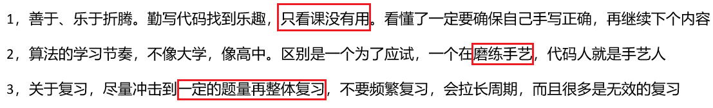
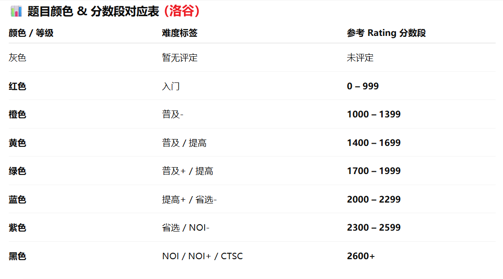
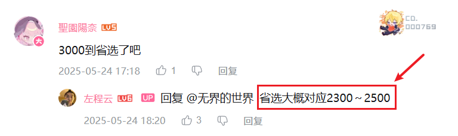
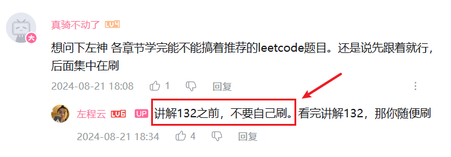
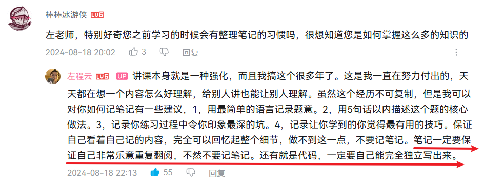

<h1 style="text-align: center; font-weight: bold;">0. 导论</h1>

---

## 左程云 B 站

> #### https://space.bilibili.com/8888480?spm_id_from=333.337.0.0

## 课程资料

> #### https://github.com/algorithmzuo/algorithm-journey

## 学习建议

 

 

 

 

 

 

 

 

