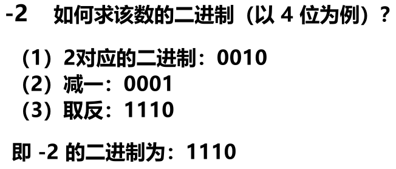
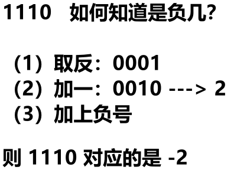
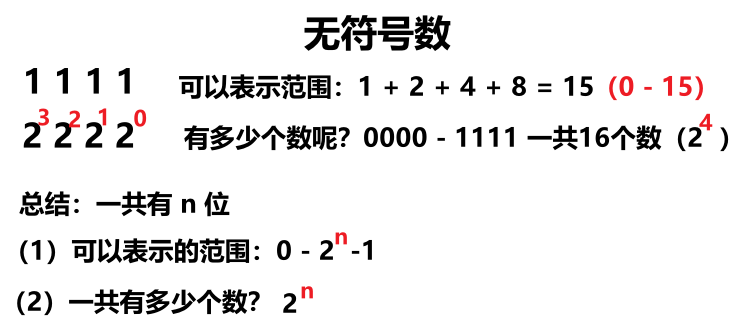
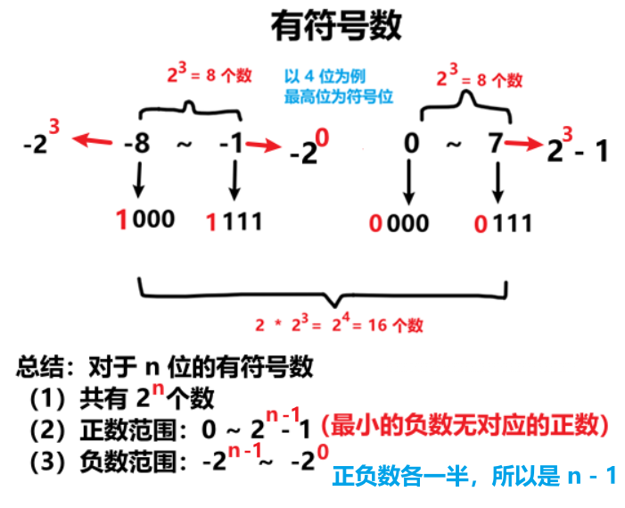

<h1 style="text-align: center; font-weight: bold;">二进制及运算</h1>

---

## 二进制

### 基本介绍

#### 符号位概念：最高位为符号位，<span style="color:red">0 表示正数，1 表示负数</span>

#### （1）给一个负数，如果求该负数的二进制？

> #### 先求该负数对应的正数的二进制，<span style="color:red">减一，取反</span>

<br/>

<br/>

#### （2）给一个负数的二进制，如何知道是负几？

> #### 将二进制<span style="color:red">取反，加一</span>，得到的二进制的值就是负数的绝对值

<br/>

<br/>

### 范围问题

<br/>


#### 问题一：如何理解对于有 n 位的二进制数，可以表示的数的个数位 2ⁿ ？

> #### 每位二进制有 0 和 1 两种选择，n 位就是 n 个 2 相乘，即 2ⁿ 种组合，对应 2ⁿ 个不同的数

#### 问题二：范围的右边界为什么是 2ⁿ - 1 ？

#### （1）第一种理解

> #### 一共有 2ⁿ 个不同的数，而无符号数是从 0 开始的，0 占用了一位，所以范围的右边界是 2ⁿ - 1

#### （2）第二种理解

> #### 利用等比数列的求和公式，结果即是 2ⁿ - 1

<br/>


### 相反数

> #### 无论是正数还是负数，<span style="color:red">相反数 = 当前数取反 + 1</span>

### 位运算

#### （1）按位 <span style="color:red">&</span>：两位全为 1，结果为 1，否则为 0

#### （2）按位或 <span style="color:red">|</span>：两位有一个为 1，结果为 1，否则为 0

#### （3）按位取反 <span style="color:red">~</span>：0 - > 1 ， 1 - > 0

#### （4）按位异或 <span style="color:red">^</span>：两位一个为 0，一个为 1，结果为 1，否则为 0

#### （5）算术左移 <span style="color:red"><<</span>：无论正数、负数，<span style="color:red">低位都是补 0</span>

#### （6）算术右移 <span style="color:red">>></span>：<span style="color:red">正数</span>：高位补 <span style="color:red">0</span>，<span style="color:red">负数</span>：高位补 <span style="color:red">1</span>

#### （7）无符号右移 <span style="color:red">>>></span>：无论正数、负数，<span style="color:red">高位都是补 0</span>

### 如何打印二进制

> #### 核心关系式：<span style="color:red">（num &（1 &lt;&lt; i）） == 0 ? "0" : "1"</span>，i 表示该数有多少个 bit 位

## 本节代码

```java
package class003;

// 本文件的实现是用int来举例的
// 对于long类型完全同理
// 不过要注意，如果是long类型的数字num，有64位
// num & (1 << 48)，这种写法不对
// 因为1是一个int类型，只有32位，所以(1 << 48)早就溢出了，所以无意义
// 应该写成 : num & (1L << 48)
public class BinarySystem {

	// 打印一个int类型的数字，32位进制的状态
	// 左侧是高位，右侧是低位
	public static void printBinary(int num) {
		for (int i = 31; i >= 0; i--) {
			// 下面这句写法，可以改成 :
			// System.out.print((a & (1 << i)) != 0 ? "1" : "0");
			// 但不可以改成 :
			// System.out.print((a & (1 << i)) == 1 ? "1" : "0");
			// 因为a如果第i位有1，那么(a & (1 << i))是2的i次方，而不一定是1
			// 比如，a = 0010011
			// a的第0位是1，第1位是1，第4位是1
			// (a & (1<<4)) == 16（不是1），说明a的第4位是1状态
			System.out.print((num & (1 << i)) == 0 ? "0" : "1");
		}
		System.out.println();
	}

	public static void main(String[] args) {
		// 非负数
		int a = 78;
		System.out.println(a);
		printBinary(a);
		System.out.println("===a===");
		// 负数
		int b = -6;
		System.out.println(b);
		printBinary(b);
		System.out.println("===b===");
		// 直接写二进制的形式定义变量
		int c = 0b1001110;
		System.out.println(c);
		printBinary(c);
		System.out.println("===c===");
		// 直接写十六进制的形式定义变量
		// 0100 -> 4
		// 1110 -> e
		// 0x4e -> 01001110
		int d = 0x4e;
		System.out.println(d);
		printBinary(d);
		System.out.println("===d===");
		// ~、相反数
		System.out.println(a);
		printBinary(a);
		printBinary(~a);
		int e = ~a + 1;
		System.out.println(e);
		printBinary(e);
		System.out.println("===e===");
		// int、long的最小值，取相反数、绝对值，都是自己
		int f = Integer.MIN_VALUE;
		System.out.println(f);
		printBinary(f);
		System.out.println(-f);
		printBinary(-f);
		System.out.println(~f + 1);
		printBinary(~f + 1);
		System.out.println("===f===");
		// | & ^
		int g = 0b0001010;
		int h = 0b0001100;
		printBinary(g | h);
		printBinary(g & h);
		printBinary(g ^ h);
		System.out.println("===g、h===");
		// 可以这么写 : int num = 3231 | 6434;
		// 可以这么写 : int num = 3231 & 6434;
		// 不能这么写 : int num = 3231 || 6434;
		// 不能这么写 : int num = 3231 && 6434;
		// 因为 ||、&& 是 逻辑或、逻辑与，只能连接boolean类型
		// 不仅如此，|、& 连接的两侧一定都会计算
		// 而 ||、&& 有穿透性的特点
		System.out.println("test1测试开始");
		boolean test1 = returnTrue() | returnFalse();
		System.out.println("test1结果，" + test1);
		System.out.println("test2测试开始");
		boolean test2 = returnTrue() || returnFalse();
		System.out.println("test2结果，" + test2);
		System.out.println("test3测试开始");
		boolean test3 = returnFalse() & returnTrue();
		System.out.println("test3结果，" + test3);
		System.out.println("test4测试开始");
		boolean test4 = returnFalse() && returnTrue();
		System.out.println("test4结果，" + test4);
		System.out.println("===|、&、||、&&===");
		// <<
		int i = 0b0011010;
		printBinary(i);
		printBinary(i << 1);
		printBinary(i << 2);
		printBinary(i << 3);
		System.out.println("===i << ===");
		// 非负数 >> >>>，效果一样
		printBinary(i);
		printBinary(i >> 2);
		printBinary(i >>> 2);
		System.out.println("===i >> >>>===");
		// 负数 >> >>>，效果不一样
		int j = 0b11110000000000000000000000000000;
		printBinary(j);
		printBinary(j >> 2);
		printBinary(j >>> 2);
		System.out.println("===j >> >>>===");
		// 非负数 << 1，等同于乘以2
		// 非负数 << 2，等同于乘以4
		// 非负数 << 3，等同于乘以8
		// 非负数 << i，等同于乘以2的i次方
		// ...
		// 非负数 >> 1，等同于除以2
		// 非负数 >> 2，等同于除以4
		// 非负数 >> 3，等同于除以8
		// 非负数 >> i，等同于除以2的i次方
		// 只有非负数符合这个特征，负数不要用
		int k = 10;
		System.out.println(k);
		System.out.println(k << 1);
		System.out.println(k << 2);
		System.out.println(k << 3);
		System.out.println(k >> 1);
		System.out.println(k >> 2);
		System.out.println(k >> 3);
		System.out.println("===k===");
	}

	public static boolean returnTrue() {
		System.out.println("进入了returnTrue函数");
		return true;
	}

	public static boolean returnFalse() {
		System.out.println("进入了returnFalse函数");
		return false;
	}

}
```
