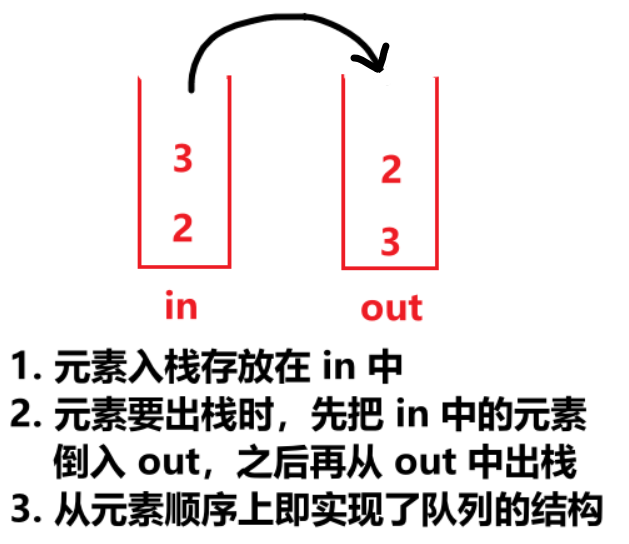
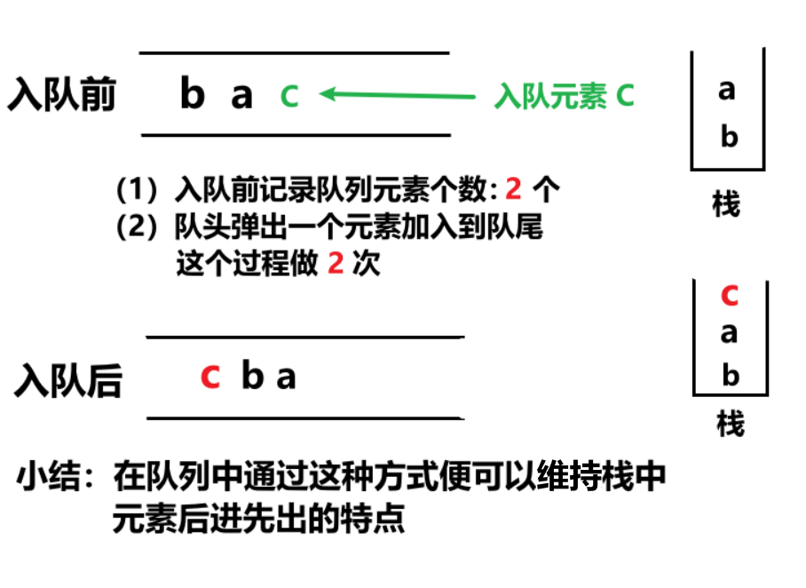

<h1 style="text-align: center; font-weight: bold;">队列与栈互相实现</h1>

---

## 栈实现队列

### 题目链接

> #### https://leetcode.cn/problems/implement-queue-using-stacks/

### 思路分析

> #### 定义两个栈，inStack，outStack，入栈元素存放在 inStack，出栈元素从 outStack 弹出
>
> #### ⚠️ 两大注意点
>
> #### （1）out 空了，才能倒数据
>
> #### （2）如果倒数据，in 必须倒完



### 代码实现

```java
class MyQueue {

    public Stack<Integer> in;

    public Stack<Integer> out;

    public MyQueue() {
        in = new Stack<Integer>();
        out = new Stack<Integer>();
    }

    // 倒数据
    // 从 in 栈，把数据倒入 out 栈
    // （1） out 空了，才能倒数据
    // （2）如果倒数据，in 必须倒完
    private void inToOut() {
        if (out.empty()) {
            while (!in.empty()) {
                out.push(in.pop());
            }
        }
    }

    public void push(int x) {
        in.push(x);
        // 如果不能倒数据就啥也不做
        inToOut();
    }

    public int pop() {
        inToOut();
        return out.pop();
    }

    public int peek() {
        inToOut();
        return out.peek();
    }

    public boolean empty() {
        return in.isEmpty() && out.isEmpty();
    }

}
```

## 队列实现栈

### 题目链接

> #### https://leetcode.cn/problems/implement-stack-using-queues/

### 思路分析

> #### 每加入一个元素，就记录当前队列中的元素个数
>
> #### 之后从队头弹出一个元素加入到队列的末尾，这个过程循环 queue.size() 次
>
> #### 这样就可以在队列结构的情况下保证元素是后进先出的



### 代码实现

```java
class MyStack {

    Queue<Integer> queue;

    public MyStack() {
        queue = new LinkedList<Integer>();
    }

    // O(n)
    public void push(int x) {
        int n = queue.size();
        queue.offer(x);
        for (int i = 0; i < n; i++) {
            queue.offer(queue.poll());
        }
    }

    public int pop() {
        return queue.poll();
    }

    public int top() {
        return queue.peek();
    }

    public boolean empty() {
        return queue.isEmpty();
    }

}
```
