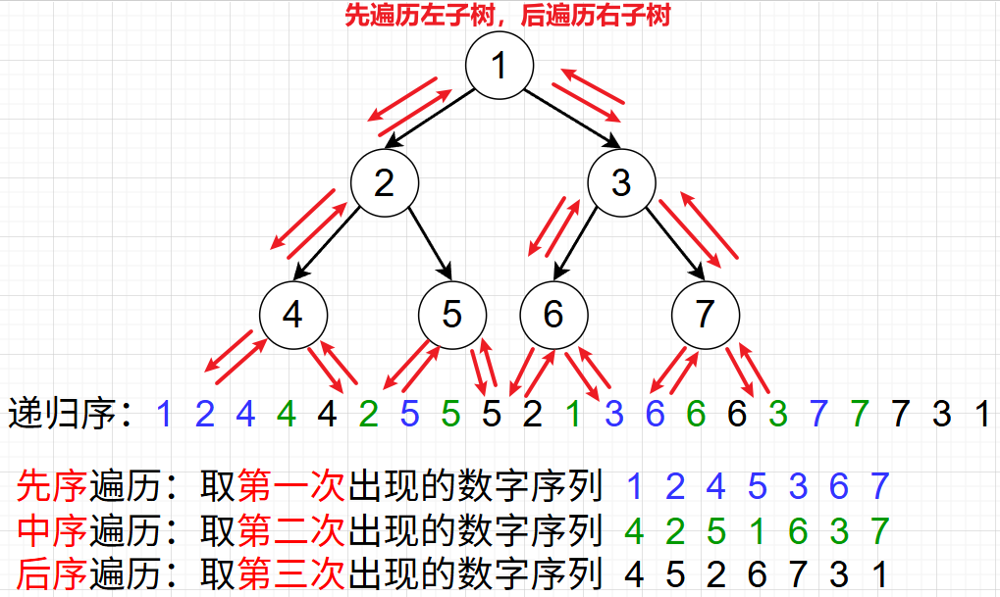

<h1 style="text-align: center; font-weight: bold;">二叉树及三种序</h1>

---

## 树节点定义

```java
public static class TreeNode {
    public int val;
    public TreeNode left;
    public TreeNode right;

    public TreeNode(int v) {
        val = v;
    }
}
```

## 三种序

### 先序遍历

```java
public static void preOrder(TreeNode head) {
    if (head == null) {
        return;
    }
    System.out.print(head.val + " ");
    preOrder(head.left);
    preOrder(head.right);
}
```

### 中序遍历

```java
public static void inOrder(TreeNode head) {
    if (head == null) {
        return;
    }
    inOrder(head.left);
    System.out.print(head.val + " ");
    inOrder(head.right);
}
```

### 后序遍历

```java
public static void posOrder(TreeNode head) {
    if (head == null) {
        return;
    }
    posOrder(head.left);
    posOrder(head.right);
    System.out.print(head.val + " ");
}
```

### 测试代码

```java
public class BinaryTreeTraversalRecursion {

	public static class TreeNode {
		public int val;
		public TreeNode left;
		public TreeNode right;

		public TreeNode(int v) {
			val = v;
		}
	}

	// 先序打印所有节点，递归版
	public static void preOrder(TreeNode head) {
		if (head == null) {
			return;
		}
		System.out.print(head.val + " ");
		preOrder(head.left);
		preOrder(head.right);
	}

	// 中序打印所有节点，递归版
	public static void inOrder(TreeNode head) {
		if (head == null) {
			return;
		}
		inOrder(head.left);
		System.out.print(head.val + " ");
		inOrder(head.right);
	}

	// 后序打印所有节点，递归版
	public static void posOrder(TreeNode head) {
		if (head == null) {
			return;
		}
		posOrder(head.left);
		posOrder(head.right);
		System.out.print(head.val + " ");
	}

	public static void main(String[] args) {
		TreeNode head = new TreeNode(1);
		head.left = new TreeNode(2);
		head.right = new TreeNode(3);
		head.left.left = new TreeNode(4);
		head.left.right = new TreeNode(5);
		head.right.left = new TreeNode(6);
		head.right.right = new TreeNode(7);

		System.out.println("先序遍历递归版");
		preOrder(head);
		System.out.println();

		System.out.println("中序遍历递归版");
		inOrder(head);
		System.out.println();

		System.out.println("后序遍历递归版");
		posOrder(head);
	}
}
```

## ⭐ 递归序

```java
public static void f(TreeNode head) {
    if (head == null) {
        return;
    }
    // 第一次来到 head 节点
    f(head.left);
    // 第二次来到 head 节点
    f(head.right);
    // 第三次来到 head 节点
}
```

::: tip <span style="font-size:18px;font-weight:bold;">💡 Tip</span>

#### 任何一个<span style="color:red;">不为空</span>的节点在二叉树的遍历中都会经过<span style="color:red;">三次</span>，空节点经过依次就返回

:::

#### 递归序遍历如下

<br/>

