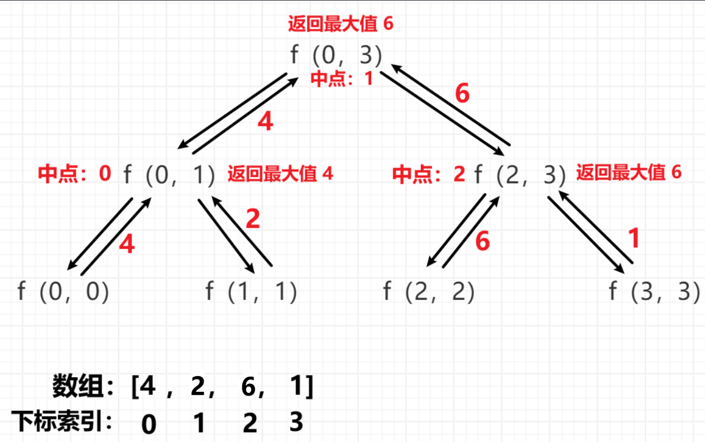

<h1 style="text-align: center; font-weight: bold;">递归和 master 公式</h1>

---

## 理解递归

```java
// 用这个例子讲解递归如何执行
public class GetMaxValue {

	public static int maxValue(int[] arr) {
		return f(arr, 0, arr.length - 1);
	}

	// arr[l....r]范围上的最大值
	public static int f(int[] arr, int l, int r) {
		if (l == r) {
			return arr[l];
		}
		int m = (l + r) / 2;
		int lmax = f(arr, l, m);
		int rmax = f(arr, m + 1, r);
		return Math.max(lmax, rmax);
	}

	public static void main(String[] args) {
		int[] arr = { 3, 8, 7, 6, 4, 5, 1, 2 };
		System.out.println("数组最大值 : " + maxValue(arr));
	}
}
```



## Master 公式

#### 所有子问题<span style="color:red">规模相同</span>的递归才能用 master 公式，T(n) = a \* T(n/b) + O(n^c)，a、b、c 都是常数

> #### （1）如果 log(b,a) < c，复杂度为：O(n^c)
>
> #### （2）如果 log(b,a) > c，复杂度为：O(n^log(b,a))
>
> #### （3）如果 log(b,a) == c，复杂度为：O(n^c \* logn)

#### 特殊情况

> #### T(n) = 2*T(n/2) + O(n*logn)，时间复杂度是 O(n \* ((logn)的平方))，证明过程比较复杂，记住即可
