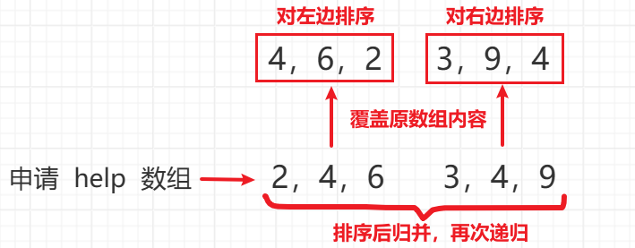
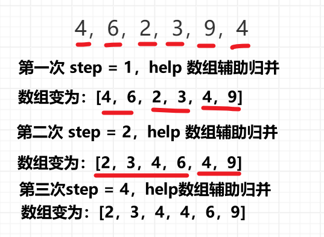

<h1 style="text-align: center; font-weight: bold;">归并排序</h1>

---

## 递归版本

### 思路分析

> #### 排序思路：找到中点，对左边排序，对右边排序，依次递归
>
> #### merge 的过程：谁小拷贝谁，直到左右两部分所有的数字耗尽，把 merge 后的结果拷贝回原数组

<br/>


### 代码实现

```java
class Solution {

    public static int MAXN = 50001;

	public static int[] help = new int[MAXN];

    public static int[] sortArray(int[] nums) {
		if (nums.length > 1) {
			mergeSort(nums);
		}
		return nums;
	}

	// 归并排序递归版
	public static void mergeSort(int[] arr) {
		sort(arr, 0, arr.length - 1);
	}

	public static void sort(int[] arr, int l, int r) {
		if (l == r) {
			return;
		}
        // 找到中点
		int m = (l + r) / 2;
        // 对左边排序
		sort(arr, l, m);
        // 对右边排序
		sort(arr, m + 1, r);
        // 归并
		merge(arr, l, m, r);
	}

	public static void merge(int[] arr, int l, int m, int r) {
        // help 数组的遍历指针
		int i = l;
        // 左边起点
		int a = l;
        // 右边起点
		int b = m + 1;
        // 左右两边都有元素时，依次比较，实现排序
        // 相等时优先拷贝左边的数，维持排序的稳定性
		while (a <= m && b <= r) {
			help[i++] = arr[a] <= arr[b] ? arr[a++] : arr[b++];
		}
        // 剩余的元素
		while (a <= m) {
			help[i++] = arr[a++];
		}
		while (b <= r) {
			help[i++] = arr[b++];
		}
        // 排好序后，把 help 数组中的值覆盖原数组
		for (i = l; i <= r; i++) {
			arr[i] = help[i];
		}
	}
}
```

### 复杂度分析

> #### T(n) = 2 \* T(n/2) + O(n)，a = 2, b = 2, c = 1
>
> #### 根据 master 公式，时间复杂度 O(n \* logn)
>
> #### 需要辅助数组，空间复杂度 O(n)

## 非递归版本

### 思路分析

> #### step 从 1 开始，每次翻两倍
>
> #### for 循环遍历数组，每次取 step 个元素，然后 merge，一轮结束后，step 翻了两倍，在第一次 merge 的基础上继续 merge



### 代码实现

```java
class Solution {

    public static int MAXN = 50001;

	public static int[] help = new int[MAXN];

    public static int[] sortArray(int[] nums) {
		if (nums.length > 1) {
			mergeSort(nums);
		}
		return nums;
	}

	// 归并排序非递归版
    // 不需要传入 l,m,r 三个参数，这里是在循环中通过计算的来的
	public static void mergeSort(int[] arr) {
		int n = arr.length;
        // 按照步长取 step 个元素，分组，merge，需要考虑边界是否越界的问题
		for (int l, m, r, step = 1; step < n; step <<= 1) {
            // 左侧的左边界
			l = 0;
			while (l < n) {
                // 找到左侧的右边界
				m = l + step - 1;
                // 判断右侧是否有元素
				if (m + 1 >= n) {
					break;
				}
                // 有右侧，求右侧的有边界，考虑到可能越界，取最小值
				r = Math.min(l + (step << 1) - 1, n - 1);
                // l...m m + 1...r
                //                 l...m m + 1...r
				merge(arr, l, m, r);
                // 继续归并下一组
				l = r + 1;
			}
		}
	}

	public static void merge(int[] arr, int l, int m, int r) {
        // help 数组的遍历指针
		int i = l;
        // 左边起点
		int a = l;
        // 右边起点
		int b = m + 1;
        // 左右两边都有元素时，依次比较，实现排序
        // 相等时优先拷贝左边的数，维持排序的稳定性
		while (a <= m && b <= r) {
			help[i++] = arr[a] <= arr[b] ? arr[a++] : arr[b++];
		}
        // 剩余的元素
		while (a <= m) {
			help[i++] = arr[a++];
		}
		while (b <= r) {
			help[i++] = arr[b++];
		}
        // 排好序后，把 help 数组中的值覆盖原数组
		for (i = l; i <= r; i++) {
			arr[i] = help[i];
		}
	}
}
```

### 复杂度分析

> #### 时间复杂度 O(n \* logn)
>
> #### 空间复杂度 O(n)
