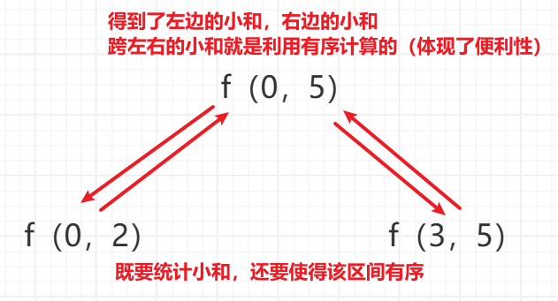

<h1 style="text-align: center; font-weight: bold;">归并分治</h1>

---

## 算法思想

### 原理

> #### （1）思考一个问题在大范围上的答案，是否等于，<span style="color: red;">左部分的答案 + 右部分的答案 + 跨越左右产生的答案</span>
>
> #### （2）计算 “ 跨越左右产生的答案 ” 时，如果加上<span style="color: red;">左、右各自有序</span>这个设定，会不会获得计算的便利性
>
> #### （3）如果以上两点都成立，那么该问题很可能被归并分治解决（话不说满，因为总有很毒的出题人）
>
> #### （4）求解答案的过程中只需要加入归并排序的过程即可，因为要让左、右各自有序，来获得计算的便利性

### 补充

> #### （1）一些用归并分治解决的问题，往往也可以用线段树、树状数组等解法。时间复杂度也都是最优解，这些数据结构都会在【必备】或者【扩展】课程阶段讲到
>
> #### （2）本节讲述的题目都是归并分治的常规题，难度不大。归并分治不仅可以解决简单问题，还可以解决很多较难的问题，只要符合上面说的特征。比如二维空间里任何两点间的最短距离问题，这个内容会在【挺难】课程阶段里讲述。顶级公司考这个问题的也很少，因为很难，但是这个问题本身并不冷门，来自《算法导论》原题
>
> #### （3）还有一个常考的算法：“整块分治”。会在【必备】课程阶段讲到

## 小和问题

### 题目链接

> #### https://www.nowcoder.com/practice/edfe05a1d45c4ea89101d936cac32469
>
> #### 假设数组 s = [ 1, 3, 5, 2, 4, 6]
>
> #### 在 s[0]的左边所有 <= s[0]的数的总和为 0
>
> #### 在 s[1]的左边所有 <= s[1]的数的总和为 1
>
> #### 在 s[2]的左边所有 <= s[2]的数的总和为 4
>
> #### 在 s[3]的左边所有 <= s[3]的数的总和为 1
>
> #### 在 s[4]的左边所有 <= s[4]的数的总和为 6
>
> #### 在 s[5]的左边所有 <= s[5]的数的总和为 15
>
> #### 所以 s 数组的“小和”为 : 0 + 1 + 4 + 1 + 6 + 15 = 27

### 思路分析

> #### 指针的含义：<span style="color:red">不包括指针所在位置的数</span>，其左边的数满足小和的条件
>
> #### f 函数的调用有两大作用
>
> #### （1）返回该区间的小和
>
> #### （2）使得该区间<span style="color:red">有序</span>，目的是为了方便计算<span style="color:red">跨左右</span>的小和，<span style="color:red">指针不回退</span>的情况下便利一遍就可以统计跨左右的小和，加速求跨左右小和的值（<span style="color:red">体现了便利性</span>）

<br/>


### 代码实现

```java
import java.io.*;

public class Main {

    public static int MAXN = 100001;

    public static int[] arr = new int[MAXN];

    public static int[] help = new int[MAXN];

    public static int n;

    public static void main(String[] args) throws IOException {
        BufferedReader br = new BufferedReader(new InputStreamReader(System.in));
        StreamTokenizer in = new StreamTokenizer(br);
        PrintWriter out = new PrintWriter(new OutputStreamWriter(System.out));
        while (in.nextToken() != StreamTokenizer.TT_EOF) {
            n = (int) in.nval;
            for (int i = 0; i < n; i++) {
                // nextToken() 每次读取一个数
                in.nextToken();
                arr[i] = (int) in.nval;
            }
            // 先缓存在内存中
            out.println(smallsum(0, n - 1));
        }
        // 一次性刷给后台，将答案与答案文件中的答案比较
        out.flush();
        out.close();
    }

    public static long smallsum(int l, int r) {
        if (l == r) {
            return 0;
        }
        // 计算中点
        int m = (l + r) / 2;
        // 分别计算左右的小和，同时使得有序，目的是便于计算跨左右的小和
        return smallsum(l, m) + smallsum(m + 1, r) + merge(l, m, r);
    }

    public static long merge(int l, int m, int r) {
        // 统计部分
        long ans = 0;
        for (int j = m + 1, i = l, sum = 0; j <= r; j++) {
            while (i <= m && arr[i] <= arr[j]) {
                sum += arr[i++];
            }
            ans += sum;
        }

        // 正常 merge
        int i = l;
        int a = l;
        int b = m + 1;
        while (a <= m && b <= r) {
            help[i++] = arr[a] < arr[b] ? arr[a++] : arr[b++];
        }
        while (a <= m) {
            help[i++] = arr[a++];
        }
        while (b <= r) {
            help[i++] = arr[b++];
        }
        for (int j = l; j <= r; j++) {
            arr[j] = help[j];
        }
        return ans;
    }
}
```

## 翻转对数量

### 题目链接

> #### https://leetcode.cn/problems/reverse-pairs/
>
> #### 给定一个数组  nums ，如果  i < j  且  nums[i] > 2 \* nums[j]  我们就将（i，j）称作一个翻转对，你需要返回给定数组中的翻转对的数量

### 思路分析

> #### 本题和上题类似，只是统计的逻辑不同

### 代码实现

```java
class Solution {
    public static int MAXN = 50001;

    public static int[] help = new int[MAXN];

    public static int reversePairs(int[] arr) {
        return counts(arr, 0, arr.length - 1);
    }

    // 统计 l...r 范围上，翻转对的数量，同时 l...r 范围统计完后变有序
    // 时间复杂度 O(n * logn)
    public static int counts(int[] arr, int l, int r) {
        if (l == r) {
            return 0;
        }
        int m = (l + r) / 2;
        return counts(arr, l, m) + counts(arr, m + 1, r) + merge(arr, l, m, r);
    }

    public static int merge(int[] arr, int l, int m, int r) {
        // 统计部分
        int ans = 0;
        for (int i = l, j = m + 1; i <= m; i++) {
            // * 2 这一步可能会溢出，数值比较大，所以转成 long 类型，比较安全
            while (j <= r && (long) arr[i] > (long) arr[j] * 2) {
                j++;
            }
            // 指针 j 表示不包含 j 所在的数，其左边的数
            // 即求 j 左边有几个数，不包含 j，所以要 - 1
            ans += j - m - 1;
        }

        // 正常 merge
        int i = l;
        int a = l;
        int b = m + 1;
        while (a <= m && b <= r) {
            help[i++] = arr[a] <= arr[b] ? arr[a++] : arr[b++];
        }
        while (a <= m) {
            help[i++] = arr[a++];
        }
        while (b <= r) {
            help[i++] = arr[b++];
        }
        for (i = l; i <= r; i++) {
            arr[i] = help[i];
        }
        return ans;
    }
}
```
