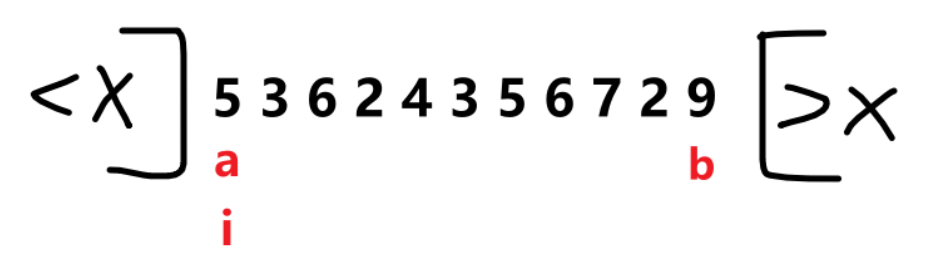

<h1 style="text-align: center; font-weight: bold;">随机快速排序</h1>

---

## 题目链接

> #### https://leetcode.cn/problems/sort-an-array/description/

## 思路分析



#### a、b 表示边界，假设随机的数是 5

#### （1）< 5，放到左边，i 和 a 位置的数交换，a++，i++

#### （2）== 5，i ++

#### （3）> 5，放到右边，i 和 b 位置的数交换，b--，i 不变（因为刚换过来，还没看过）

#### （4）当 i 跑到 b 的右边时，整个过程结束，区间划分完成

## 代码实现

```java
class Solution {
    // 这里表示边界
    public static int first;
    public static int last;

    public int[] sortArray(int[] nums) {
        if (nums.length > 1) {
            quickSort(nums, 0, nums.length - 1);
        }
        return nums;
    }

    public void quickSort(int[] arr, int l, int r) {
        if (l >= r) {
            return;
        }
        // 随机一个中间值
        // [l,r] 上随机一个值：l + (int)(Math.random() * (l - r + 1))
        int x = arr[l + (int) (Math.random() * (r - l + 1))];

        // 以中间值为标准划分， < x 的放在左边， > x 的放在右边
        partition(arr, l, x, r);

        // 为了防止递归过曾覆盖全局变量，用临时变量记录
        int left = first;
        int right = last;

        // 以中点划分左右两个区间，分别排序
        // ... left x right ...
        quickSort(arr, l, left - 1);
        quickSort(arr, right + 1, r);
    }

    public void partition(int[] arr, int l, int x, int r) {
        first = l;
        last = r;
        int i = l;
        while (i <= last) {
            if (arr[i] == x) {
                i++;
            } else if (arr[i] < x) {
                // < x，放到左区间
                swap(arr, i, first);
                first++;
                i++;
            } else {
                // > x，放到右区间
                swap(arr, i, last);
                // 右边的数刚换过来，i 还没有判断过，i 不动
                last--;
            }
        }
    }

    public void swap(int[] arr, int i, int j) {
        int tmp = arr[i];
        arr[i] = arr[j];
        arr[j] = tmp;
    }
}
```

## 复杂度分析

#### （1）时间复杂度 O(n \* logn)

> #### 根据 master 公式，T(n) = 2 \* T(n/2) + O(n)，a = 2, b = 2, c = 1

#### （2）额外空间复杂度 O(logn)

> #### 最好的情况就是每次随机的数都在中点的位置，进而去区分左右区间，这不就是二分的过程，即递归的层数为 logn
