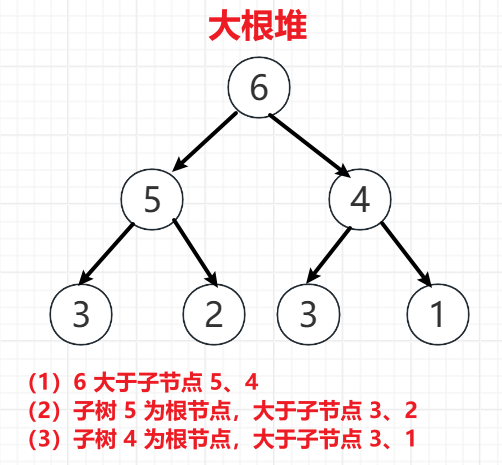
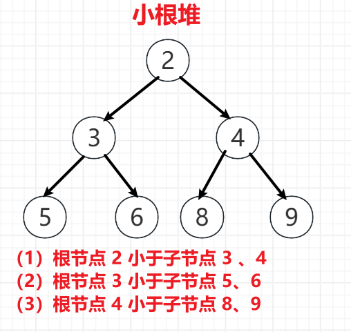
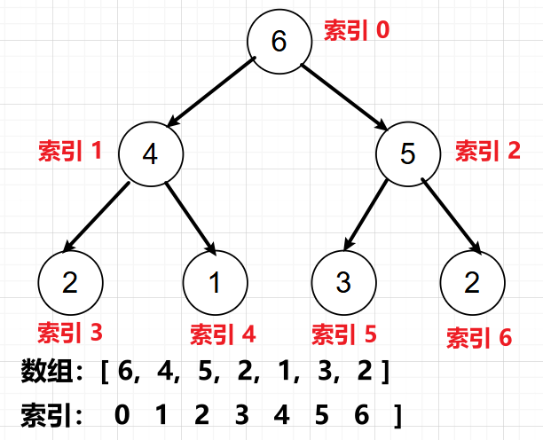
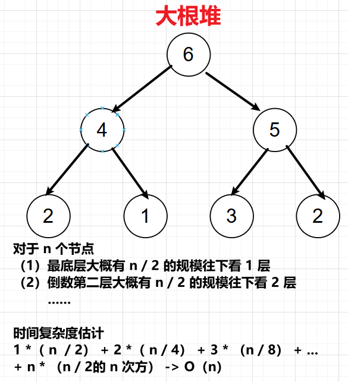

<h1 style="text-align: center; font-weight: bold;">堆结构和堆排序</h1>

---

## 堆结构

### 基本介绍

> #### 堆结构是一种特殊的完全二叉树，分为大根堆和小根堆
>
> #### 大根堆：任何一颗子树的根节点都大于子节点
>
> #### 小根堆：任何一颗子树的根节点都小于子节点

#### 以大根堆为例

<br/>

<br/>


### 相关性质

> #### <span style="color:red;">堆结构</span>是一种特殊的完全二叉树，可以用<span style="color:red;">数组实现</span>，通过调整数组中元素的位置，维持堆的结构，用数组的大小 size 来控制堆的大小
>
> #### 堆中元素位置与数组中元素位置的关系：从索引 0 开始，在堆中从上到下，从左到右，依次排列 0 - n-1 位置的元素

<br/>


#### 对于任意索引 i 位置的元素，由如下性质

> #### （1）i 的父亲节点：（i - 1） / 2
>
> #### （2）i 的左孩子：i \* 2 + 1
>
> #### （3）i 的右孩子：i \* 2 + 2

### 堆调整

> #### 堆是一种特殊的完全二叉树，n 个节点，树的高度为 log n（以 2 为底）
>
> #### 堆的调整过程最差情况是从顶到低，调整的路径怎么也不会大于树的高度，即堆调整的时间复杂度为 O(log n)

### heapInsert

> #### 以大根堆为例，这里表示上调整，插入一个元素或者元素变大了，调整堆的结构，维持大根堆的性质

```java
// i位置的数，向上调整大根堆
// arr[i] = x，x是新来的！往上看，直到不比父亲大，或者来到 0 位置（顶节点）
public static void heapInsert(int[] arr, int i) {
    // 对于索引 i 位置的元素，其父节点的索引为 (i - 1) / 2
    // 元素交换后，i 来到父节点的位置，继续判断是否需要向上调整
    while (arr[i] > arr[(i - 1) / 2]) {
        swap(arr, i, (i - 1) / 2);
        i = (i - 1) / 2;
    }
}
```

### heapify

> #### 以大根堆为例，这里表示下调整，删除一个元素或者元素变小了，调整堆的结构，维持大根堆的性质

```java
// i位置的数，变小了，又想维持大根堆结构，向下调整大根堆
// 当前堆的大小为size
public static void heapify(int[] arr, int i, int size) {
    int l = i * 2 + 1;
    // 有左孩子
    while (l < size) {
        // 有左孩子，l
        // 右孩子，l + 1
        // 找出左右孩子中最大的孩子下标
        int best = l + 1 < size && arr[l + 1] > arr[l] ? l + 1 : l;
        // 将最大的孩子和当前元素相比，找出最大的元素，并更新最大下标
        best = arr[best] > arr[i] ? best : i;
        // 如果 best == i，说明最强的元素是 i 自己，不需要继续调整
        if (best == i) {
            break;
        }
        swap(arr, best, i);
        i = best;
        l = i * 2 + 1;
    }
}
```

## 堆排序

### 题目链接

> #### https://leetcode.cn/problems/sort-an-array/

### 思路分析

> #### 建立大根堆，将堆顶元素和最后一个元素交换，size--（表示元素排好了，从堆中移除），向下调整堆维持大根堆的结构，依次循环
>
> #### 有两种方式建堆，从顶到底建大根堆，<span style="color:red;">从底到顶建大根堆</span>（时间复杂度为 O（n），<span style="color:red;">推荐使用</span>）
>
> #### 堆排序的整体时间复杂度是 O（n \* log n）

### 从顶到底建大根堆

> #### 堆排序时间复杂度：O(n \* log n)
>
> #### 构建堆的时间复杂度：O(n \* log n)
>
> #### 每来一个元素，就 heapInsert 一次，log1 + log2 + log3 + … + logn 收敛于 O(n\*logn)

```java
class Solution {
    public int[] sortArray(int[] nums) {
        if (nums.length > 1) {
            heapSort(nums);
        }
        return nums;
    }

    // 从顶到底建堆
    public void heapSort(int[] arr) {
        int n = arr.length;
        // 建立大根堆
        for (int i = 0; i < n; i++) {
            heapInsert(arr, i);
        }
        // 堆顶元素和最后一个元素交换位置
        int size = n;
        while (size > 0) {
            swap(arr, 0, size - 1);
            size--;
            heapify(arr, 0, size);
        }
    }

    public void heapify(int[] arr, int i, int size) {
        int l = 2 * i + 1;
        // 有左孩子
        while (l < size) {
            // 不一定有右孩子，要判断
            // 找出两个孩子中最大的那个，并记录下标
            int best = l + 1 < size && arr[l + 1] > arr[l] ? l + 1 : l;
            // 将最大的孩子与 i 位置的比较
            best = arr[best] > arr[i] ? best : i;
            // 最大的就是 i 自己，不用调整
            if (best == i) {
                break;
            }
            swap(arr, best, i);
            // 更新 i 位置
            i = best;
            // 继续下一轮的往下调整
            l = 2 * i + 1;
        }

    }

    public void heapInsert(int[] arr, int i) {
        // 维持大根堆的性质
        // 父节点的索引 (i -1) / 2
        while (arr[i] > arr[(i - 1) / 2]) {
            swap(arr, i, (i - 1) / 2);
            i = (i - 1) / 2;
        }
    }

    public void swap(int[] arr, int i, int j) {
        int temp = arr[i];
        arr[i] = arr[j];
        arr[j] = temp;
    }
}
```

### 从底到顶建大根堆

> #### 构建堆的时间复杂度：<span style="color:red;">O(n)</span>
>
> #### 堆排序时间复杂度：O(n \* log n)
>
> #### 从底到顶建大根堆，每加入一个元素就需要往下调整，根据如下对元素的规模分析可以推算建堆的时间复杂度

<br/>


```java
class Solution {
    public int[] sortArray(int[] nums) {
        if (nums.length > 1) {
            heapSort(nums);
        }
        return nums;
    }

    // 从低到顶建堆
    public void heapSort(int[] arr) {
        int n = arr.length;
        for (int i = n - 1; i >= 0; i--) {
            heapify(arr, i, n);
        }
        int size = n;
        while (size > 0) {
            swap(arr, 0, size - 1);
            size--;
            heapify(arr, 0, size);
        }
    }

    public void heapify(int[] arr, int i, int size) {
        // 向下调整
        int l = i * 2 + 1;
        while (l < size) {
            // 找出两个孩子中较大的那个
            // 要考虑是否有右孩子
            int best = l + 1 < size && arr[l + 1] > arr[l] ? l + 1 : l;
            // 最大的孩子跟父节点比较
            best = arr[best] > arr[i] ? best : i;
            // 说明最大的节点是自己
            if (best == i) {
                break;
            }
            // 否则就向下调整堆的结构
            swap(arr, i, best);
            // i 来到 best 的位置，继续下一轮的向下调整
            i = best;
            l = i * 2 + 1;
        }
    }

    public void heapInsert(int[] arr, int i) {
        // 向上调整，父节点的索引：(i - 1) / 2
        while (arr[i] > arr[(i - 1) / 2]) {
            swap(arr, i, (i - 1) / 2);
            // i 来到父节点的位置
            i = (i - 1) / 2;
        }
    }

    public void swap(int[] arr, int i, int j) {
        int temp = arr[i];
        arr[i] = arr[j];
        arr[j] = temp;
    }
}
```

## ⭐ 增倍分析法

::: tip <span style="font-size:18px;font-weight:bold;">Tip</span>

#### 已知以 2 为底的 log 1 + log 2 + log 3 + ... + log n --> O（n \* logn）

:::

#### （1）时间复杂度分析

> #### 从顶到底建堆，每加入一个元素就要调整堆，而调整堆的时间复杂度是 O(logn)，则堆排序的整体时间复杂度以 2 为底的 log 1 + log 2 + log 3 + ... + log n

#### （2）增倍分析法

> #### <span style="color:red">n 个数</span>依次进堆，数量级的上限也就是 log n，log n < n \* log n，也就是说此时的<span style="color:red">上限是 n \* log n</span>
>
> #### 增一倍，<span style="color:red">2n 个数字</span>的时候，前 n 个数的复杂度如上分析，由于后 n 个数的复杂度是基于前 n 个数的，则后 n 个数的复杂度的规模肯定大于 log n，而已知 n 个数的时候复杂度为 n \* log n，也即是说此时的<span style="color:red">下限是 n \* log n</span>
>
> #### 对于复杂度来说，只看规模，常熟可以忽略，<span style="color:red">上限和下限都是 n \* log n</span>
>
> #### 那复杂度只能是 O（n \* log n）
