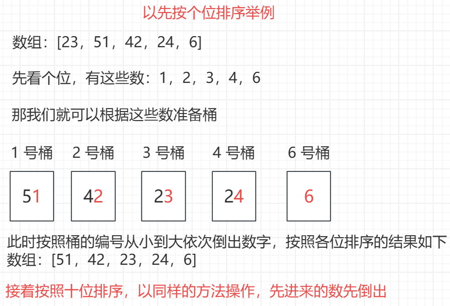
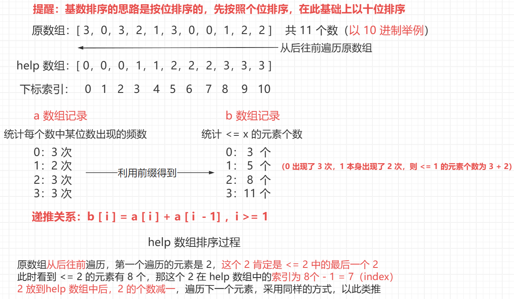

<h1 style="text-align: center; font-weight: bold;">基数排序</h1>

---

## 题目链接

> #### https://leetcode.cn/problems/sort-an-array/

## 计数排序

> #### 该排序<span style="color:red">适用数值范围较小</span>的数排序
>
> #### 排序思想：对于数值范围从 0 - n 的数组，先统计每个数值出现的次数，最后根据每个数值出现的次数，从小大大依次打印即可

## 基数排序

### 思路分析

> #### <span style="color:red">适用条件：排序元素非负（> 0）</span>
>
> #### 基数排序是按照每一位的相对次序排序的，先按照个位从小大大排序，然后按照十位进行排序......
>
> #### 对于每一位，可以根据每一位的值不同设立不同的桶，<span style="color:red">先进来的先倒出</span>，这个特点说明了基数排序是<span style="color:red">稳定</span>的



::: tip <span style="font-size:18px;font-weight:bold;">Tip</span>

#### 基数排序有比较优雅的实现，就是在准备桶这件事情上比较巧妙

#### 接下来就需要使用到前缀数量分区技巧、数字提取某一位技巧

:::

### 前缀数量分区技巧

<br/>


### 数字提取某一位技巧

> #### 对于一个数字 num，初始时设置 offset = 1，从个位开始提取，个位 = （num / offset）% 10，每提取一位后， offset \*= 10，接着提取百位，以此类推

### ⭐ 优化后的思路

> #### 首先统计数组中每个元素出现的次数
>
> #### 在此基础上递推出 <= 数组中每个元素的个数
>
> #### 申请 help 数组，从后往前遍历原数组，根据前缀数量分区的规则，将遍历元素放到 help 数组中的相应位置
>
> #### 最后的 help 数组就是排好序的，覆盖原数组即可

### 处理有负数的排序

> #### 先找出数组中<span style="color:red">最小的元素</span>，<span style="color:red">所有元素都减去最小值</span>，对数组排序，最后再对每个元素加上最小值即可

## 代码实现

```java
class Solution {

    // 可以设置进制，不一定是 10 进制，可随意设置
    public static int BASE = 10;

    public static int MAXN = 50001;

    public static int[] help = new int[MAXN];

    // 基数排序是按位来排序的，先按照个位排序，在此基础上以十位排序...
    // cnts 数组中的数表示每一轮排序，取出的数字是 BASE 进制下位数的范围
    // 例如 BASE = 10，十进制的数字范围是 0 ~ 9
    // 则 cnt[0] ~ cnt[9] 分别表示 0 ~ 9 的数字个数
    public static int[] cnts = new int[BASE];

    public int[] sortArray(int[] nums) {
        if (nums.length > 1){
            int n = nums.length;

            // 基数排序要求是数组中没有负数，考虑到有可能有负数，先做处理
            // 找到数组中的最小值，所有数都减去最小值，排序，最后再加回去

            // 找最小值
            int min = nums[0];
            for (int i = 0; i < n; i++) {
                min = Math.min(min, nums[i]);
            }

            // 数组中的每个数字都减去最小值，这样就把 nums 转成了非负数组
            // 同时记录最大值
            int max = 0;
            for (int i = 0; i < n; i++) {
                nums[i] -= min;
                max = Math.max(max, nums[i]);
            }

            // 根据最大值在 BASE 进制下的位数，决定基数排序做多少轮
            radixSort(nums, n, bits(max));

            // 数组排序完成，所有数都减去了最小值，最后记得还原
            for (int i = 0; i < n; i++) {
                nums[i] += min;
            }
        }
        return nums;
    }

    // 返回 number 在 BASE 进制下有几位
    public static int bits(int number) {
        int ans = 0;
        while (number > 0) {
            ans++;
            number /= BASE;
        }
        return ans;
    }


    // 基数排序核心代码，要求 arr 中没有负数
    // bits 是 arr 中的最大值在 BASE 进制下有几位
    public static void radixSort(int[] arr, int n, int bits) {
        // 基数排序至少要过 bits 轮
        for (int offset = 1; bits > 0; offset *= BASE, bits--) {
            // 初始化 cnts 数组
            Arrays.fill(cnts, 0);

            // 统计每个数字某位出现的次数
            for (int i = 0; i < n; i++) {
                cnts[(arr[i] / offset) % BASE]++;
            }

            // 前缀次数累加
            for (int i = 1; i < BASE; i++) {
                cnts[i] = cnts[i] + cnts[i - 1];
            }

            // 从后往前遍历，这样可以维持稳定性，相对次序不会乱
            // 前缀数量分区技巧、数字提取某一位技巧
            for (int i = n - 1; i >= 0; i--) {
                help[--cnts[(arr[i] / offset) % BASE]] = arr[i];
            }

            // 处理完成后，help 数组就是有序的，把排序结果给回原数组
            for (int i = 0; i < n; i++) {
                arr[i] = help[i];
            }
        }
    }
}
```

## 复杂度分析

> #### 时间复杂度：O（n），严格来说是 k \* O（n），k 是最大值的位数
>
> #### 空间复杂度：O（m），m 是 BASE 进制，就相当于要用几个桶（cnts 数组的大小）
