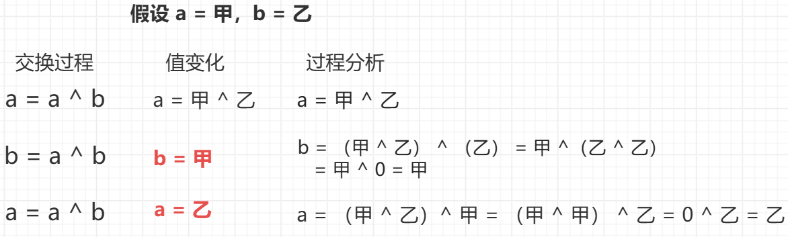

<h1 style="text-align: center; font-weight: bold;">异或运算的骚操作</h1>

---

## 异或运算性质

> #### （1）异或运算就是<span style="color: red;">无进位相加</span>
>
> #### （2）异或运算<span style="color: red;">满足交换律、结合律</span>（用无进位相加理解），也就是同一批数字，不管异或顺序是什么，最终的结果都是一个
>
> #### （3）0 ^ n = n，n ^ n = 0
>
> #### （4）<span style="color: red;">整体异或和如果是 x，整体中某个部分的异或和如果是 y，那么剩下部分的异或和是 x ^ y</span>，因为异或运算<span style="color: red;">满足交换律、结合律</span>

::: tip <span style="font-size:18px;font-weight:bold;">Tip</span>

#### （1）理解无进位相加：<span style="color: red;">异或</span>运算的规则是<span style="color: red;">不同为 1，相同为 0</span>，无进位相加恰好符合这个性质

#### （2）第四点的简单证明，若 a ^ b = c，则 a = c ^ b，b = c ^ a

#### 已知 a ^ b = c，证明 a = c ^ b，利用性质 <span style="color: red;">0 ^ n = n，n ^ n = 0</span>，两边同时异或 b

#### 则原式变为 a ^ b ^ b = c ^ b，a ^ b ^ b = a ^ 0 = a，即 a = c ^ b

:::

## 异或场景题

#### 袋子里一共 a 个白球，b 个黑球，每次从袋子里拿 2 个球，每个球每次被拿出机会均等，如果拿出的是 2 个白球或者 2 个黑球，那么就往袋子里重新放入 1 个白球，如果拿出的是 1 个白球和 1 个黑球，那么就往袋子里重新放入 1 个黑球那么最终袋子里一定会只剩 1 个球，请问最终的球是黑的概率是多少？用 a 和 b 来表达这个概率

> #### 黑球的数量如果是<span style="color: red;">偶数</span>，最终的球是黑的概率是 <span style="color: red;">0%</span>
>
> #### 黑球的数量如果是<span style="color: red;">奇数</span>，最终的球是黑的概率是 <span style="color: red;">100%</span>

::: tip <span style="font-size:18px;font-weight:bold;">Tip</span>

#### 题目含义：白球，白球 --> 放回白球，黑球，黑球 --> 放回白球，白球，黑球 --> 放回黑球

#### 假设<span style="color: red;">白球是 0，黑球是 1</span>，翻译一下题意就是 <span style="color: red;">0 0 --> 0，1 1 --> 0，0 1 --> 1</span>，这不就是异或运算，而放回的过程就是 a ^ b = c，把 c 这个结果放回袋子中

#### 如果黑球的数量是<span style="color: red;">偶数</span>，最后无进位相加（异或运算）的结果一定是 0，而白球是 0，即不会有黑球剩余，黑球的概率为 0%

#### 如果黑球的数量是<span style="color: red;">奇数</span>，对于无进位相加（异或运算）有两种情况，1 + 1 --> 0，0 + 0 --> 0，之前所有数的异或结果为 0，黑球用 1 表示，那最后一定会剩余一个 1，无进位相加的结果就是 1，即会有 1 个黑球剩余，黑球的概率为 100%

:::

## 交换两个数（不比较）

### 思路分析

<br/>


### ⚠️ 注意事项

> #### 了解异或运算可以实现交换两个变量的值即可，<span style="color: red;">不推荐</span>使用这种做法
>
> #### <span style="color: red;">数组</span>中交换两个值，则<span style="color: red;">要求</span>索引 <span style="color: red;">i != j</span>，如果 i = j，则异或结果为 0，原来的数被异或结果 0 覆盖，之后两行已经没有意义了

### 代码实现

```java
public class Code01_SwapExclusiveOr {

	public static void main(String[] args) {
		int a = -2323;
		int b = 10;
		a = a ^ b;
		b = a ^ b;
		a = a ^ b;
		System.out.println(a);
		System.out.println(b);

		int[] arr = { 3, 5 };
		swap(arr, 0, 1);
		System.out.println(arr[0]);
		System.out.println(arr[1]);
		swap(arr, 0, 0);
		System.out.println(arr[0]);
	}

	// 当 i != j，没问题，会完成交换功能
	// 当 i == j，会出错
	// 所以知道这种写法即可，并不推荐
	public static void swap(int[] arr, int i, int j) {
		arr[i] = arr[i] ^ arr[j];
		arr[j] = arr[i] ^ arr[j];
		arr[i] = arr[i] ^ arr[j];
	}

}
```

## 不比较返回两数最大值

### 题目链接

> #### https://www.nowcoder.com/practice/d2707eaf98124f1e8f1d9c18ad487f76

### 代码实现

```java
public class Code02_GetMaxWithoutJudge {

	// 必须保证 n 一定是 0 或者 1
	// 若 n = 0，返回 1
    // 若 n = 1，返回 0
	public static int flip(int n) {
		return n ^ 1;
	}

	// >>> 是无符号右移，无论正数还是负数，高位都补 0
    // flip 之前：非负数返回 0，负数返回 1
	// flip 之后：非负数返回 1，负数返回 0
    // 该方法的目的是取符号位，即判断某个数 > 0 还是 < 0
	public static int sign(int n) {
        // 最高位占一位，int 一共 32 位，右移 31 位的结果就是取符号位的值
		return flip(n >>> 31);
	}

	// 根据差值来判断大小，差值有溢出风险的实现
	public static int getMax1(int a, int b) {
		int c = a - b;
		// c非负，returnA -> 1
		// c非负，returnB -> 0
		int returnA = sign(c);
        // c负数，returnA -> 0
		// c负数，returnB -> 1
		int returnB = flip(returnA);

        // returnA 和 returnB 是互斥的，返回一个，另一个就会被舍弃
        // 简单理解，该返回谁就 return 谁，由于互斥，另一个就会被舍弃
		return a * returnA + b * returnB;
	}

	// 没有任何问题的实现，根据符号来判断大小，而不是根据差值
	public static int getMax2(int a, int b) {
		// c可能是溢出的
		int c = a - b;

        // 再次强调 sign 方法 --> 非负返回 1 ，负数返回 0

		// a的符号
		int sa = sign(a);
		// b的符号
		int sb = sign(b);
		// c的符号
		int sc = sign(c);
		// 判断 A 和 B的符号是不是不一样，如果不一样 diffAB = 1，如果一样 diffAB = 0
		int diffAB = sa ^ sb;
		// 判断 A 和 B 的符号是不是一样，如果不一样 sameAB = 0，如果一样 sameAB = 1
		int sameAB = flip(diffAB);

        // diffAB 和 sameAB 是互斥的，返回一个，另一个就会被舍弃

        // return A 的两种情况
        // （1）A 和 B 符号不一样，且 a 非负，另一个数的符号是负数，显然 a 更大，returnA
        // （2）A 和 B 符号一样，且 c 非负，a - b = c > 0，显然 a 更大，returnA
        // 为什么可以规避溢出的风险？因为这里增加了对 A，B 符号是否相同的逻辑
        // 根据符号信息进行判断，而不是直接通过 c = a - b 来判断差值的大小，避免差值 c 溢出
		int returnA = diffAB * sa + sameAB * sc;
		int returnB = flip(returnA);

        // c = a - b，a，b 谁大返回谁
		return a * returnA + b * returnB;
	}

	public static void main(String[] args) {
		int a = Integer.MIN_VALUE;
		int b = Integer.MAX_VALUE;
		// getMax1方法会错误，因为溢出
		System.out.println(getMax1(a, b));
		// getMax2方法永远正确
		System.out.println(getMax2(a, b));
	}

}
```

## 找到缺失的数字

### 题目链接

> #### https://leetcode.cn/problems/missing-number/
>
> #### 题意：给一个长度为 n 的数组，数组中的值不重复，数组中的元素都是 [0，n] 范围的数，找出在 [0，n] 范围内数组中缺失的那个数
>
> #### 理解：因为数组长度为 n，则数组中元素的最大范围是 [0，n - 1]，给定的范围是 [0，n]，必定缺失一个数

### 思路分析

> #### 根据异或运算的性质 4，<span style="color: red;">整体异或和如果是 x，整体中某个部分的异或和如果是 y，那么剩下部分的异或和是 x ^ y</span>
>
> #### 本题中对于 0 - n 范围的异或和设为 xorAll，对于数组中元素的异或和设为 xorHas，根据性质 4，缺失的那个数就是 xorAll ^ xorHas
>
> #### 时间复杂度：O（n），空间复杂度：O（1）

### 代码实现

```java
class Solution {
    public int missingNumber(int[] nums) {
        // 0 - n 范围内的异或和
        int xorAll = 0;
        // 数组中元素的异或和
        int xorHas = 0;

        for (int i = 0; i < nums.length; i++) {
            xorAll ^= i;
            xorHas ^= nums[i];
        }
        // xorAll 是 0 - n 范围内的异或和
        // 而循环中只能异或到 n - 1，最后还要异或长度
        xorAll ^= nums.length;

        // 根据异或运算的性质可以求得缺失的数
        return xorAll ^ xorHas;
    }
}
```

## 找唯一出现奇数次的数

### 题目链接

> #### https://leetcode.cn/problems/single-number/
>
> #### 应用场景：数组中 只有 1 种数出现了奇数次，其他的数都出现了偶数次，找出出现奇数次的这种数，该题是取了一个特例

### 思路分析

> #### 根据异或运算的性质，0 ^ n = n，n ^ n = 0
>
> #### 只需要将数组中所有数异或一遍，就可以得到出现奇数次的数
>
> #### 数组中所有的数异或，如果一个数出现了 n 次（偶数次），那就会出现 n / 2 组 n ^ n = 0 的结果，而 0 ^ 0 = 0，也就是说 n / 2 个 0 异或，结果为 0，若一个数出现了奇数次，最后异或一定会剩余这个数，即 0 ^ 这个数 = 这个数（0 ^ n = n）

### 代码实现

```java
class Solution {
    public int singleNumber(int[] nums) {
        int xor = 0;
        for (int num : nums) {
            xor ^= num;
        }
        return xor;
    }
}
```

## ⭐ Brian Kernighan 算法

### 应用场景

> #### 提取出二进制状态中最右侧的 1 这个状态
>
> #### 执行前：0 1 1 0 <span style="color: red;">1</span> 0 0 0
>
> #### 执行后：0 0 0 0 <span style="color: red;">1</span> 0 0 0

### 思路分析

> #### 对于原状态 n
>
> #### 第一步：对 n 取反得到 ~n，记为 a
>
> #### 第二步：~n + 1 ，记为 b
>
> #### 第三步：n & b 得到结果，即 n & （~n + 1） = <span style="color: red;">n & （-n）</span>

### 代码实现

```java
int rightOne = eor1 & (-eor1);
```

## 找唯二出现奇数次的数

### 题目链接

> #### https://leetcode.cn/problems/single-number-iii/
>
> #### 应用场景：数组中有 2 种数出现了奇数次，其他的数都出现了偶数次，找出出现奇数次的那 2 个数，该题是取了一个特例

### 思路分析

> #### 根据题意，<span style="color: red;">a ≠ b</span>，且 a，b 都出现了奇数次
>
> #### 对于数组中所有的数异或，假设结果为 c，根据异或的性质，最后可以得到 <span style="color: red;">a ^ b = c</span>
>
> #### 因为 <span style="color: red;">a ≠ b</span>，那在二进制中，说明 a，b 的某一位一定不同，也就是说两个数的某一位异或结果是 1，<span style="color: red;">假设第 3 位不同</span>，那整个数组的数就可以分类两类，第三位是 1 的数，第三位不是 1 的数
>
> #### 对于出现偶数次的数，无需关心，因为他们异或的结果为 0，都消掉了，对数组中所有的元素异或，最后只会剩下出现奇数次数的数
>
> #### 那也就是说，a 可能在第三位为 1 的这一组数中，b 可能在第三位不为 1 的这一组数中，要么就反过来
>
> #### 准备一个变量 xor2，只异或第三位上不是 1 的数，出现偶数次的数都会抵消，他们的异或和为 0，0 ^ 出现奇数个数的数 = 出现奇数个数的数，最后剩下出现奇数个数的数，又因为根据前面的思路对数组中的元素分了组，那第三位上不是 1 的这一组数中，有可能是 a 在这一组，也有可能是 b 在这一组，即 xor2 要么得到 a，要么得到 b
>
> #### xor1 = a ^ b，xor2 会得到 a 或 b，此时利用异或运算的性质 4，就可以得到 a 或 b = xor1 ^ xor2

### 代码实现

```java
class Solution {
    public int[] singleNumber(int[] nums) {
        int xor1 = 0;
        for (int num : nums) {
            xor1 ^= num;
        }
        // xor1 最后得到 xor1 = a ^ b

        // Brian Kernighan 算法，提取二进制里最右侧的 1
        int rightOne = xor1 & (-xor1);

        int xor2 = 0;
        for (int num : nums) {
            // xor2 只异或二进制里最右侧 1 那一位不是 1 的数
            if ((num & rightOne) == 0) {
                xor2 ^= num;
            }
        }
        return new int[] { xor2, xor1 ^ xor2 };
    }
}
```

## 找唯一出现次数小于 m 的数

### 题目链接

> #### https://leetcode.cn/problems/single-number-ii/
>
> #### 应用场景：数组中只有 1 种数出现次数少于 m 次，其他数都出现了 m 次，返回出现次数小于 m 次的那种数，题目只是一个特例

### 思路分析

> #### 对于每一个数，将其看成是二进制位，统计出每一位出现的次数，如果一个数出现了偶数次，那这个数的每一位出现的次数一定为偶数，如果一个数出现了 m 次（<span style="color:red">假设是偶数</span>），那二进制的某一位 % m = 0，这是毋庸置疑的
>
> #### 如果二进制的某一位 % m = 1，那说明这个 1 肯定是出现了少于 m 次的数（<span style="color:red">假设是出现了奇数次的数</span>）的某一个二进制位的影响所造成的，那能说明出现了奇数次的这个数的某一位是 1

### 代码实现

```java
class Solution {
    public int singleNumber(int[] nums) {
        return find(nums, 3);
    }

    public int find(int[] arr, int m) {
        // cnts[i]：一个十进制数的二进制数中第 i 位二进制数是 1 的个数
        int[] cnts = new int[32];

        for (int num : arr) {
            for (int i = 0; i < 32; i++) {
                // & 运算：同为 1 为 1，否则为 0
                // 如果第 i 位是 1，就累加 1，否则累加 0
                cnts[i] += (num >> i & 1);
            }
        }

        int ans = 0;
        for (int i = 0; i < 32; i++) {
            // 这里说明出现次数小于 k 次的数在这一位是 1，设置一下
            if (cnts[i] % m != 0) {
                ans |= (1 << i);
            }
        }
        return ans;
    }
}
```
