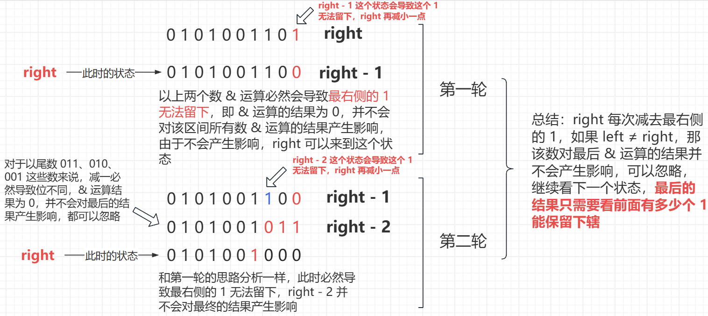
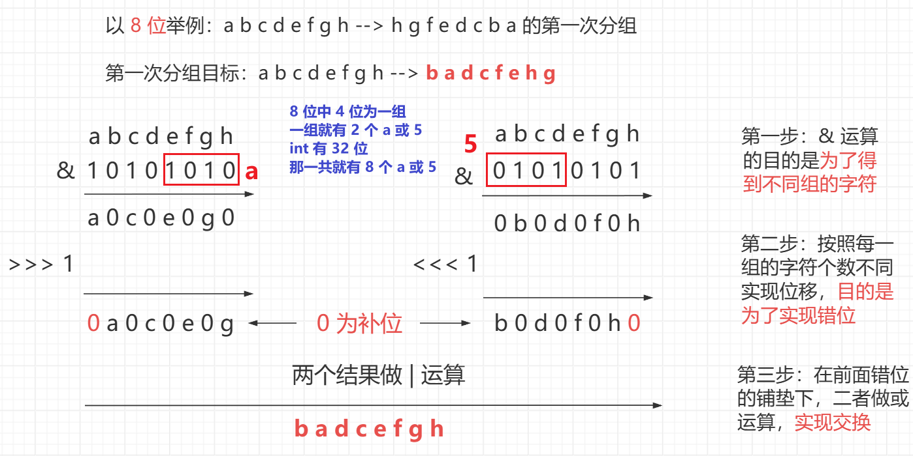
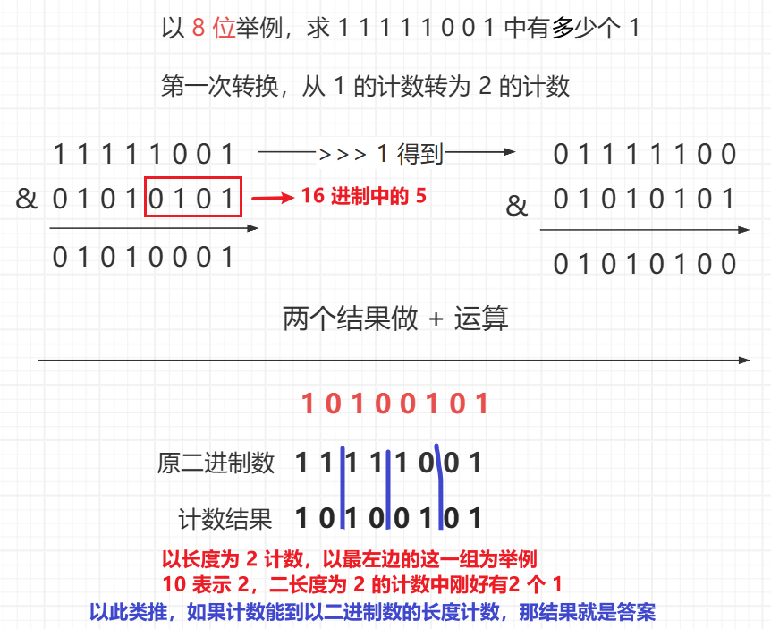

<h1 style="text-align: center; font-weight: bold;">位运算的骚操作</h1>

---

## 位运算的优势

> #### 位运算的速度非常快，仅次于赋值操作，常数时间极好

## 判断一个正数是否是 2 的幂

### 题目链接

> #### https://leetcode.cn/problems/power-of-two/

### 思路分析

> #### 如果一个数是 2 的幂，则这个数必然大于 0
>
> #### 对于任意一个 2 的幂，在其二进制中只有一个 1，其余都是 0
>
> #### 利用 Brian Kernighan 算法<span style="color:red">提取出最右侧的 1</span>，此时这个数的状态就是最接近 n 的 2 的幂的数，如果二者相等，说明该数是 2 的幂

### 代码实现

```java
class Solution {
    public boolean isPowerOfTwo(int n) {
        return n > 0 && n == (n & -n);
    }
}
```

## 判断一个整数是不是 3 的幂

### 题目链接

> #### https://leetcode.cn/problems/power-of-three/

### 思路分析

> #### 如果一个数字是 3 的某次幂，那么这个数一定只含有 3 这个质数因子
>
> #### 1162261467 是 int 型范围内，最大的 3 的幂，它是 <span style="color:red">3 的 19 次方</span>
>
> #### 这个 1162261467 只含有 3 这个质数因子，如果 n 也是只含有 3 这个质数因子，那么
>
> #### 1162261467 % n == 0
>
> #### 反之如果 1162261467 % n != 0 说明 n 一定含有其他因子

### 代码实现

```java
class Solution {
    public boolean isPowerOfThree(int n) {
        return n > 0 && 1162261467 % n == 0;
    }
}
```

## 返回 >= n 最小 2 的幂

```java
// 已知 n 是非负数
// 返回 >= n 最小 2 的幂
// 如果 int 范围内不存在这样的数，返回整数最小值
public class Near2power {

	public static final int near2power(int n) {
		if (n <= 0) {
			return 1;
		}

        // 减 1 的目的是为了能让本身就是 2 的幂的数最终返回自己
		n--;

        // 这里的目的是让二进制中最左侧的 1 以及后面的位都变成 1
        // int 是 32 位，每一次 | 运算都会以前一个状态作为基础
        // 为了将二进制中最左侧的 1 以及后面的位都变成 1
        // 每次 | 运算都会处理 2 的幂次方个 1（画图就知道了）
		n |= n >>> 1;
		n |= n >>> 2;
		n |= n >>> 4;
		n |= n >>> 8;
		n |= n >>> 16;

        // 在前面的基础上加一，得到的数就是 2 的幂
		return n + 1;
	}

	public static void main(String[] args) {
		int number = 100;
		System.out.println(near2power(number));
	}

}
```

## 求区间所有数字 & 的结果

### 题目链接

> #### https://leetcode.cn/problems/bitwise-and-of-numbers-range/

### 思路分析

#### （1）明确 & 运算的性质

> #### & 运算的性质：同为 1 结果为 1，否则为 0，即<span style="color:red">只要有 0 存在 & 的结果为 0</span>
>
> #### 若两个数相等，或者说和自己 & 运算，则两个数 & 运算的<span style="color:red">结果为本身</span>

#### （2）本题思路

> #### 一堆数字 & 运算，如果二进制位中出现 0， 该二进制位 & 运算的结果为 0，我们只需要关注二进制位为 1 的，根据二进制转十进制的方式理解,因为最后 & 运算的结果由这些二进制位为 1 的所影响，二进制为 0 的最后也不会累加到结果中，也就是说我们需要<span style="color:red">关注哪些位的 1 可以被保留下来，而这就是该区间中所有数 & 运算的结果</span>
>
> #### left 到 right 这个区间的是连续的，每次让 right 减一，<span style="color:red">二进制位中也会减去 1</span>，得到的结果记为 a，则 a 必定在 left 到 right 这个区间中，而这个状态的存在必定会导致 right（即减一之前的数） 的二进制位中最右侧的 1 无法留下（同为 1， & 运算的结果为 1，而减一必然导致两个数的同一个二进制位不同，& 的结果必然为 0），right 继续减小
>
> #### 若每次减一后都发现 right > left 则必然是上面这种情况，继续减一
>
> #### 一直减到 right <= left，循环退出，此时两数相等，根据 & 运算的性质，二者 & 运算的结果为本身，二进制位中前面的 1 肯定能留下，这些二进制位对最后的记过是会产生影响的，因为要求是 left 到 right 区间，所以 < left 的数的二进制位对最后的结果是没有影响的，则此时的二进制状态表示的十进制数就是最后在该区间所有数 & 运算的结果



### 代码实现

```java
class Solution {
    public int rangeBitwiseAnd(int left, int right) {
        while (left < right) {
            // 每次减去最右侧的 1
            right -= right & -right;
        }
        // 第一种情况：left = right，& 运算的结果为本身，所有的 1 都会保留
        // 第二种情况：left < right，& 运算的结果为 0，对结果不会产生影响
        //            可以忽略，right 继续减小
        return right;
    }
}
```

### 复杂度分析

> #### 时间复杂度：O（1）
>
> #### 位运算的速度非常快，仅次于赋值操作，常数时间极好，right 的二进制位中有几个 1，while 就循环几次，对于 int 数值来说，最多 32 次结束

## 逆序一个二进制状态

### 题目链接

> #### https://leetcode.cn/problems/reverse-bits/

### 交换过程

```
以 8 位为例

a b c d e f g h --> h g f e d c b a

第一步：1 v 1 交换（1 个为一组）
b a d c f e h g

第二步：2 v 2 交换（2 个为一组）
d c b a h g f e --> dc ba hg fe

第三步：4 v 4 交换（4 个为一组）
h g f e d c b a --> hgfe dcba
```

### 位运算思路

> #### 按照前面提到的分组思想，实现交换
>
> #### 先去 & 一个数，保留分组的位数
>
> #### 位移实现错位，用 | 运算实现交换



### 代码实现

```java
class Solution {
    public int reverseBits(int n) {
		// 例子：a b c d e f g h

		// & 运算的目的是为了获取不同分组的数，为交换做准备
		// 位移的目的是为了实现错位，最后通过 | 运算实现交换

		// 1 个二进制位为一组，a：1010，5：0101
		n = ((n & 0xaaaaaaaa) >>> 1) | ((n & 0x55555555) << 1);
		// 2 个二进制位为一组，c：1100，3：0011
		n = ((n & 0xcccccccc) >>> 2) | ((n & 0x33333333) << 2);
		// 4 个二进制位为一组，f：1111，0：0000
		n = ((n & 0xf0f0f0f0) >>> 4) | ((n & 0x0f0f0f0f) << 4);
		// 8 个二进制位为一组，ff：8 个 1，00：8 个 0
		n = ((n & 0xff00ff00) >>> 8) | ((n & 0x00ff00ff) << 8);
		n = (n >>> 16) | (n << 16);
		return n;
    }
}
```

## 求二进制中有几个 1

### 题目链接

> #### https://leetcode.cn/problems/hamming-distance/

### 思路分析

<br/>


#### 以长度为 8 位的二进制数字为例，理解从 1 的计数转为 2 的计数过程中各个运算的作用

> #### 第一步：& 一个数字，目的是提取出计数为 2 中的数，比如 0101，这一次 & 运算就会提取出第 2 个 1 和第 4 个 1（<span style="color:red">先提取后面的</span>）
>
> #### 第二步：位移，再 & 同一个数，位移是为了实现错位，再次 & 同一个数是提取以 2 计数中的另一个数，比如 0101，这一次就是提取两个 0
>
> #### 第三步：将前两次操作的结果相加，即以 2 为计数，两次操作分别计算了这两位中 1 的个数，累加就是以 2 为计数，这两个数中有多少个 1 的结果

### 代码实现

```java
class Solution {
	public int hammingDistance(int x, int y) {
        // 位不同，异或结果为 1
		return cntOnes(x ^ y);
	}

	// 返回 n 的二进制中有几个 1
	public  int cntOnes(int n) {
		// 5：0101 --> 1 的计数
		n = (n & 0x55555555) + ((n >>> 1) & 0x55555555);
		// 3：0011 --> 2 的计数
		n = (n & 0x33333333) + ((n >>> 2) & 0x33333333);
		// 0：0000，f：1111 --> 4 的计数
		n = (n & 0x0f0f0f0f) + ((n >>> 4) & 0x0f0f0f0f);
		// 00：8 个 0，ff：8 个 1 --> 8 的计数
		n = (n & 0x00ff00ff) + ((n >>> 8) & 0x00ff00ff);
		// 0000：16 个 0，ffff：16 个 1 --> 16 的计数
		n = (n & 0x0000ffff) + ((n >>> 16) & 0x0000ffff);
		return n;
	}
}
```
