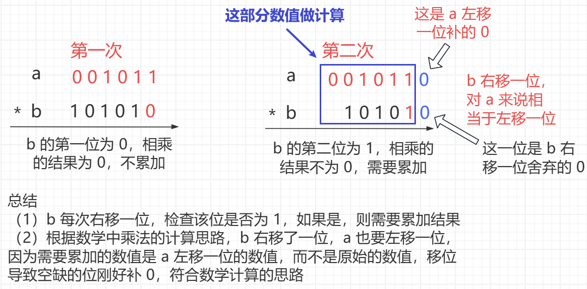
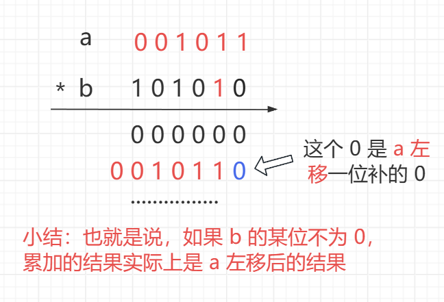

<h1 style="text-align: center; font-weight: bold;">位运算实现加减乘除</h1>

---

## 题目链接

> #### https://leetcode.cn/problems/divide-two-integers/

## 加法实现

### 思路分析

> #### 两数相加可以等价为<span style="color: red;">无进位相加的结果 + 进位信息</span>
>
> #### 如果发生进位，则两位必定为 1，可以通过 <span style="color: red;">a & b 保留</span>所有位都为 1 的信息，而这些位就是<span style="color: red;">进位信息</span>
>
> #### 进位信息是<span style="color: red;">进到了上一位</span>，所以得到的进位信息需要<span style="color: red;">左移一位</span>

### 代码实现

```java
public static int add(int a, int b) {
    int ans = a;
    while (b != 0) {
        // ans : a 和 b 无进位相加的结果
        ans = a ^ b;
        // b : a 和 b 相加时的进位信息
        b = (a & b) << 1;
        // 得到了两个信息，答案是 ans + b
        // 而此时又是相加操作，复用前面的过程即可
        // 相当于又执行 a + b，将 ans 的值给 a
        a = ans;
    }
    // 如果 b 为 0，返回 a，即为 ans
    // 如果进位信息（b）消失了，则最后就是 a + b 的答案，返回 ans
    return ans;
}
```

## 减法实现

### 思路分析

> #### 减法的本质还是加法：a - b <---> a + （-b）
>
> #### 一个数的<span style="color: red;">相反数</span>在二进制运算中的实现为：<span style="color: red;">取反 + 1</span>，通过加法实现

### 代码实现

```java
public static int minus(int a, int b) {
    return add(a, neg(b));
}

public static int neg(int n) {
    return add(~n, 1);
}
```

## 乘法实现

### 思路分析

> #### 这里是模拟数学运算的乘法逻辑，对于 a \* b，若 b 每一位乘 a 不为 0，则最后是需要累加结果的，累加的结果应该是在对应的位上相乘得到的，具体入下图

<br/>

<br/>


### 代码实现

```java
// 这种乘法后面有大用处，尤其是求（a 的 b 次方 % m）的结果，也叫龟速乘
public static int multiply(int a, int b) {
    // 说明：只要 a * b 的结果不溢出，无论整数还是负数，最后的结果总是可以计算正确
    int ans = 0;
    while (b != 0) {
        // 检查 b 的二进位状态，只要不为 0，就累加结果
        // 累加的结果是 b 左移后的结果
        if ((b & 1) != 0) {
            ans = add(ans, a);
        }
        // a，b 同时移动，如果 b 的二进制位不为 0，才能保证累加的结果才嫩正确
        // 如果不理解，可以使用数学乘法的思路计算二进制数的乘法体会
        a <<= 1;
        b >>>= 1;
    }
    return ans;
}
```

## 除法实现

### 思路分析

> #### 前提：对于<span style="color: red;">非负</span>的 a、b，且 a、b 都<span style="color: red;">不是</span>整数<span style="color: red;">最大或者最小</span>，a / b 可以等价于以下形式（注意结果是<span style="color: red;">向下取整</span>的）
>
> #### 280 / 25 = 25 \* 2<sup>3</sup> + 25 \* 2<sup>1</sup> + 25 \* 2<sup>0</sup> + <span style="color: red;">5</span>，因为结果向下取整，<span style="color: red;">余数可以忽略</span>
>
> #### 280 / 25 = 25 \* （<span style="color: red;">2<sup>3</sup> + 2<sup>1</sup> + 2<sup>0</sup></span>），后面这部分不就是<span style="color: red;">二进制转十进制</span>的计算方法，于是可以得到相除结果的二进制
>
> #### 依据上述思路，若 a / b，可以从 2<sup>30</sup> 开始，依次递减，每次判断 a 是否<span style="color: red;">大于等于</span> b \* 2 <sup>i</sup>，如果符合，就把对应的二进制设置为 1
>
> #### 由于 b \* 2 <sup>i</sup> 是通过左移实现的，考虑到<span style="color: red;">溢出的风险</span>，等价写法是 a 右移 i 与 b 进行比较，如果 a 右移 i 位<span style="color: red;">大于等于</span> b，则下一轮判断更新 <span style="color: red;">a = a - b \* 2 <sup>i</sup></span>
>
> #### 等价关系：<span style="color: red;">a 是否大于 b \* 2 <sup>i</sup> ---> a / 2 <sup>i</sup> 是否大于 b ---> a 右移 i 位是否大于 b</span>

### 非负且不是最大最小

```java
// 必须保证 a 和 b 都不是整数最小值，返回 a 除以 b 的结果
public static int div(int a, int b) {
    // neg 方法返回相反数：取反 + 1
    // 如果小于 0，就先处理成大于 0
    int x = a < 0 ? neg(a) : a;
    int y = b < 0 ? neg(b) : b;
    int ans = 0;
    // 一共 32 位（0 - 31），忽略符号位，从 30 开始
    // 不能体现算术运算，这里 i-- 调用 minus 方法实现
    for (int i = 30; i >= 0; i = minus(i, 1)) {
        // 每次判断 x 是否大于等于 y * 2 的 i 次方
        // 考虑到溢出风险，以下为等价写法
        if ((x >> i) >= y) {
            ans |= (1 << i);
            x = minus(x, y << i);
        }
    }
    // 符号不一样，异或结果为 1，最后的结果应为相除结果的相反数
    return a < 0 ^ b < 0 ? neg(ans) : ans;
}
```

### 特殊情况处理

```java
public static int divide(int a, int b) {
    // a、b 都是整数最小，返回 1
    if (a == MIN && b == MIN) {
        return 1;
    }
    // a 和 b 都不是整数最小，那么正常去除
    if (a != MIN && b != MIN) {
        return div(a, b);
    }
    // a 不是整数最小，b 是整数最小，结果为 0
    // 可以把负号提出来，a / b（无限大）的结果趋近于 0
    // a / b 的结果是向下取整的，即 -0.000....向下取整为 0
    if (b == MIN) {
        return 0;
    }
    // a 是整数最小，b是 -1，返回整数最大，因为题目里明确这么说了
    if (b == neg(1)) {
        return Integer.MAX_VALUE;
    }
    // a 是整数最小，b 不是整数最小，b也不是 -1
    // 分 b > 0 和 b < 0 两种情况套路最后的结果正负
    // 因为 a 是整数最小，在二进制中没有与之对应的正数，需要特殊处理

    // 如果 b > 0，加上 b 没有这么小了，可以使用 divide 方法
    // 因为 （a + b）/ b = （a / b） + 1，所以最后还要 -1

    // 如果 b < 0，减去 b 没有这么小了，可以使用 divide 方法
    // 因为 （a -（- b））/ b = （a + b）/ b = （a / b） + 1，所以最后还要 +1
    a = add(a, b > 0 ? b : neg(b));
    int ans = div(a, b);
    int offset = b > 0 ? neg(1) : 1;
    return add(ans, offset);
}
```

### 完整代码

```java
// 必须保证 a 和 b 都不是整数最小值，返回 a 除以 b 的结果
public static int div(int a, int b) {
    // neg 方法返回相反数：取反 + 1
    // 如果小于 0，就先处理成大于 0
    int x = a < 0 ? neg(a) : a;
    int y = b < 0 ? neg(b) : b;
    int ans = 0;
    // 一共 32 位（0 - 31），忽略符号位，从 30 开始
    // 不能体现算术运算，这里 i-- 调用 minus 方法实现
    for (int i = 30; i >= 0; i = minus(i, 1)) {
        // 每次判断 x 是否大于等于 y * 2 的 i 次方
        // 考虑到溢出风险，以下为等价写法
        if ((x >> i) >= y) {
            ans |= (1 << i);
            x = minus(x, y << i);
        }
    }
    // 符号不一样，异或结果为 1，最后的结果应为相除结果的相反数
    return a < 0 ^ b < 0 ? neg(ans) : ans;
}

public static int divide(int a, int b) {
    // a、b 都是整数最小，返回 1
    if (a == MIN && b == MIN) {
        return 1;
    }
    // a 和 b 都不是整数最小，那么正常去除
    if (a != MIN && b != MIN) {
        return div(a, b);
    }
    // a 不是整数最小，b 是整数最小，结果为 0
    // 可以把负号提出来，a / b（无限大）的结果趋近于 0
    // a / b 的结果是向下取整的，即 -0.000....向下取整为 0
    if (b == MIN) {
        return 0;
    }
    // a 是整数最小，b是 -1，返回整数最大，因为题目里明确这么说了
    if (b == neg(1)) {
        return Integer.MAX_VALUE;
    }
    // a 是整数最小，b 不是整数最小，b也不是 -1
    // 分 b > 0 和 b < 0 两种情况套路最后的结果正负
    // 因为 a 是整数最小，在二进制中没有与之对应的正数，需要特殊处理

    // 如果 b > 0，加上 b 没有这么小了，可以使用 divide 方法
    // 因为 （a + b）/ b = （a / b） + 1，所以最后还要 -1

    // 如果 b < 0，加上 -b 没有这么小了（-b > 0），可以使用 divide 方法
    // 因为 （a +（- b））/ b = （a - b）/ b = （a / b） - 1，所以最后还要 +1
    a = add(a, b > 0 ? b : neg(b));
    int ans = div(a, b);
    int offset = b > 0 ? neg(1) : 1;
    return add(ans, offset);
}
```

## 代码实现

```java
class Solution {
    public static int MIN = Integer.MIN_VALUE;

    public static int divide(int a, int b) {
        // a、b 都是整数最小，返回 1
        if (a == MIN && b == MIN) {
            return 1;
        }
        // a 和 b 都不是整数最小，那么正常去除
        if (a != MIN && b != MIN) {
            return div(a, b);
        }
        // a 不是整数最小，b 是整数最小，结果为 0
        // 可以把负号提出来，a / b（无限大）的结果趋近于 0
        // a / b 的结果是向下取整的，即 -0.000....向下取整为 0
        if (b == MIN) {
            return 0;
        }
        // a 是整数最小，b是 -1，返回整数最大，因为题目里明确这么说了
        if (b == neg(1)) {
            return Integer.MAX_VALUE;
        }
        // a 是整数最小，b 不是整数最小，b也不是 -1
        // 分 b > 0 和 b < 0 两种情况套路最后的结果正负
        // 因为 a 是整数最小，在二进制中没有与之对应的正数，需要特殊处理

        // 如果 b > 0，加上 b 没有这么小了，可以使用 divide 方法
        // 因为 （a + b）/ b = （a / b） + 1，所以最后还要 -1

        // 如果 b < 0，减去 b 没有这么小了，可以使用 divide 方法
        // 因为 （a -（- b））/ b = （a + b）/ b = （a / b） + 1，所以最后还要 +1
        a = add(a, b > 0 ? b : neg(b));
        int ans = div(a, b);
        int offset = b > 0 ? neg(1) : 1;
        return add(ans, offset);
    }

    // 必须保证 a 和 b 都不是整数最小值，返回 a 除以 b 的结果
    public static int div(int a, int b) {
        // neg 方法返回相反数：取反 + 1
        // 如果小于 0，就先处理成大于 0
        int x = a < 0 ? neg(a) : a;
        int y = b < 0 ? neg(b) : b;
        int ans = 0;
        // 一共 32 位（0 - 31），忽略符号位，从 30 开始
        // 不能体现算术运算，这里 i-- 调用 minus 方法实现
        for (int i = 30; i >= 0; i = minus(i, 1)) {
            // 每次判断 x 是否大于等于 y * 2 的 i 次方
            // 考虑到溢出风险，以下为等价写法
            if ((x >> i) >= y) {
                ans |= (1 << i);
                x = minus(x, y << i);
            }
        }
        // 符号不一样，异或结果为 1，最后的结果应为相除结果的相反数
        return a < 0 ^ b < 0 ? neg(ans) : ans;
    }

    public static int add(int a, int b) {
        int ans = a;
        while (b != 0) {
            // ans : a 和 b 无进位相加的结果
            ans = a ^ b;
            // b : a 和 b 相加时的进位信息
            b = (a & b) << 1;
            // 得到了两个信息，答案是 ans + b
            // 而此时又是相加操作，复用前面的过程即可
            // 相当于又执行 a + b，将 ans 的值给 a
            a = ans;
        }
        // 如果 b 为 0，返回 a，即为 ans
        // 如果进位信息（b）消失了，则最后就是 a + b 的答案，返回 ans
        return ans;
    }

    public static int minus(int a, int b) {
        return add(a, neg(b));
    }

    public static int neg(int n) {
        return add(~n, 1);
    }

    // 这种乘法后面有大用处，尤其是求（a 的 b 次方 % m）的结果，也叫龟速乘
    public static int multiply(int a, int b) {
        // 说明：只要 a * b 的结果不溢出，无论整数还是负数，最后的结果总是可以计算正确
        int ans = 0;
        while (b != 0) {
            // 检查 b 的二进位状态，只要不为 0，就累加结果
            // 累加的结果是 b 左移后的结果
            if ((b & 1) != 0) {
                ans = add(ans, a);
            }
            // a，b 同时移动，如果 b 的二进制位不为 0，才能保证累加的结果才嫩正确
            // 如果不理解，可以使用数学乘法的思路计算二进制数的乘法体会
            a <<= 1;
            b >>>= 1;
        }
        return ans;
    }
}
```
