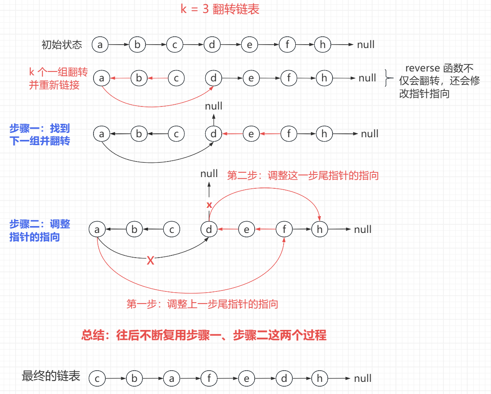

<h1 style="text-align: center; font-weight: bold;">链表高频题与必备技巧</h1>

---

## ⚠️ 注意事项

> #### （1）如果笔试中空间要求不严格，直接使用容器来解决链表问题
>
> #### （2）如果笔试中空间要求严格、或者在面试中面试官强调空间的优化，需要使用额外空间复杂度 O（1）的方法
>
> #### （3）最常用的技巧：<span style="color:red">快慢指针</span>
>
> #### （4）链表类题目往往都是很简单的算法问题，核心考察点也并不是算法设计，是 coding 能力
>
> #### （5）这一类问题除了<span style="color:red">多写多练</span>没有别的应对方法

::: tip <span style="font-size:18px;font-weight:bold;">💡 Tip</span>

#### 链表类问题既然练的就是 <span style="color:red">coding 能力</span>，那么不要采取空间上讨巧的方式来练习

:::

## 寻找第一个相交节点

### 题目链接

> #### https://leetcode.cn/problems/intersection-of-two-linked-lists/

### 思路分析

> #### 首先统计两个链表的长度，定义两个指针分别指向<span style="color:red">长链表</span>的头节点和<span style="color:red">短链表</span>的头节点
>
> #### 先让长链表指针<span style="color:red">先走</span> diff 步，<span style="color:red">diff = abs（lenA - lenB）</span>
>
> #### 接下来两个链表<span style="color:red">同时移动</span>，如果遇到相同节点，说明是遇到的第一个相交节点，直接返回

::: tip <span style="font-size:18px;font-weight:bold;">💡 巧妙的设计</span>

#### 利用 diff 变量来记录两个链表的长度差，无论 diff 是整数还是负数，只要 diff ≠ 0，其绝对值一定是两个链表的长度差

:::

### 代码实现

```java
/**
 * Definition for singly-linked list.
 * public class ListNode {
 *     int val;
 *     ListNode next;
 *     ListNode(int x) {
 *         val = x;
 *         next = null;
 *     }
 * }
 */
public class Solution {
    public ListNode getIntersectionNode(ListNode headA, ListNode headB) {
        // 处理特殊情况，如果有一个链表为空，则链表不可能相交
        if (headA == null || headB == null) {
            return null;
        }
        // 定义两个遍历指针
        ListNode a = headA;
        ListNode b = headB;

        // 分别遍历两个链表，统计链表的长度差值
        int diff = 0;

        while (a.next != null) {
            a = a.next;
            diff++;
        }
        while (b.next != null) {
            b = b.next;
            diff--;
        }

        // 两个指针遍历到末尾
        // 如果两个指针不指向同一个节点
        // 则说明链表一定不相交
        if (a != b) {
            return null;
        }

        // 链表相交，找到第一个相交节点

        // 首先找到长链表，注意边界的处理，即相等的时候
        // a 指向长链表的头节点
        if (diff >= 0) {
            a = headA;
            b = headB;
        } else {
            a = headB;
            b = headA;
        }

        // 长链表先走 diff 步
        diff = Math.abs(diff);
        while (diff > 0) {
            a = a.next;
            diff--;
        }

        // 消除链表的长度差后，两个指针同时移动
        // 如果发现两个指针指向同一个节点
        // 则说明这个节点是第一个相交的节点
        while (a != b) {
            a = a.next;
            b = b.next;
        }

        // 如果退出循环，则说明 a = b，即指向同一个节点
        // 返回链表相交的第一个相交节点
        return a;
    }
}
```

## K 个一组翻转链表

### 题目链接

> #### https://leetcode.cn/problems/reverse-nodes-in-k-group/

### 思路分析

<br/>


### 代码实现

```java
/**
 * Definition for singly-linked list.
 * public class ListNode {
 *     int val;
 *     ListNode next;
 *     ListNode() {}
 *     ListNode(int val) { this.val = val; }
 *     ListNode(int val, ListNode next) { this.val = val; this.next = next; }
 * }
 */
class Solution {
    public ListNode reverseKGroup(ListNode head, int k) {
        ListNode start = head;
        ListNode end = teamEnd(start, k);
        // 如果第一组不够 k 个，则无需处理，直接返回
        if (end == null) {
            return head;
        }
        // 第一组需要特殊处理，即头节点需要更换
        head = end;
        reverse(start, end);

        // 翻转之后，start 变成了上一组的为尾节点，记为 lastTeamEnd
        // 在这一组翻转之前，lastTeamEnd.next 指向这一组的 start
        // 在这一组翻转之后，这一组的 start 变成了 end，而 start 在 end 位置
        // 此时 lastTeamEnd.next 应该指向 end（新的 start 位置）
        // 即 lastTeamEnd.next = end，此时两组链表链接完成
        // lastTeamEnd 跑到新的一组的 end 位置，继续下一组链接，依次复用这个过程
        ListNode lastTeamEnd = start;
        while (lastTeamEnd.next != null) {
            // 记录新一组的 start，end，并翻转
            start = lastTeamEnd.next;
            end = teamEnd(start,k);
            // 如果这一组不够 k 个，直接返回，reverse 中已经处理了后续节点
            // 如果不足 k 个，后续的链表无需再次处理，直接链接即可
            if (end == null){
                return head;
            }
            reverse(start, end);
            // lastTeamEnd.next 指向这一组翻转后新的头节点，即 end 位置
            lastTeamEnd.next = end;
            // lastTeamEnd 来到这一组的 start 节点（翻转后的尾部），继续复用这个逻辑
            lastTeamEnd = start;
        }

        // 返回新链接链表的头节点
        return head;
    }

    // 当前组的开始节点是 s，往下数 k 个数找到当前组的结束节点返回
    // 注意 --k != 0 的写法，先减再判断是否为 0，其他写法会导致多走一步
    public ListNode teamEnd(ListNode s, int k) {
        while (--k != 0 && s != null) {
            s = s.next;
        }
        // 如果 s.next = null
        // 情况一：够 k 个节点，此时 s 此时指向的是这一组数 k 个数的最后一个节点
        // 情况二：不够 k 个节点，k 还没减到 0，s 先变为 null 了
        return s;
    }

    // 翻转 k 个节点为一组的链表
    // 同时将翻转后链表重新链接回原链表
    // a -> b -> c -> d，k = 3
    // a <- b <- c，这部分就是正常的 reverse
    // 但是最后 a 还要链接 d，所以先保存下一个节点
    // 翻转完之后再将 a 链接到 d
    public void reverse(ListNode start, ListNode end) {
        // 保存下一个节点
        end = end.next;

        // reverse
        ListNode pre = null;
        ListNode cur = start;
        while (cur != end) {
            // 先保存下一个节点
            ListNode temp = cur.next;
            cur.next = pre;
            pre = cur;
            cur = temp;
        }

        // 将 a 链接到 d
        start.next = end;
    }
}
```

## 复制带随机指针的链表

### 题目链接

> #### https://leetcode.cn/problems/copy-list-with-random-pointer/

### 思路分析

> #### 在每一个节点后插入一个与之值一样的新节点，根据旧节点的指针关系就可以知道新节点的指针应该指向谁，这就实现了拷贝的目的
>
> #### 例如 1 -> 1' -> 2 -> 2' -> 3 -> 3' -> ...
>
> #### 我们需要知道 1' 的 random 指针，可以先找 1 的 random 指针指向的节点，找到了之后，因为结构是新旧节点值相同会挂接在一起，那也就是说 1' 的 random 指向指向的节点就是 1 的 random 指针指向的节点的<span style="color:red;">下一个节点</span>
>
> #### 根据这个结构特点就可以完成链表的拷贝，最后再分离新老链表即可

### 代码实现

```java
/*
// Definition for a Node.
class Node {
    int val;
    Node next;
    Node random;

    public Node(int val) {
        this.val = val;
        this.next = null;
        this.random = null;
    }
}
*/

class Solution {
    public Node copyRandomList(Node head) {
        // 处理特殊情况
        if (head == null) {
            return null;
        }

        // 首先插入节点
        // 1 -> 2 -> 3 -> ... 变成如下状态
        // 1 -> 1' -> 2 -> 2' -> 3 -> 3' -> ...
        // 这个操作的本质就是插入节点
        Node cur = head;
        while (cur != null) {
            // 先保存下一个节点
            Node temp = cur.next;
            Node newNode = new Node(cur.val);
            // 先处理后，再处理前
            newNode.next = temp;
            cur.next = newNode;
            // 处理完成后，cur 跳到下一个节点继续处理
            cur = temp;
        }

        // cur 回到头节点，开始链表的拷贝
        cur = head;
        Node copy = null;

        // 步骤一：首先根据新老节点的关系，设置每一个新节点的 random 指针
        //  1 -> 1' -> 2 -> 2' -> 3 -> 3' -> ...
        // cur  copy  temp
        //            cur
        while (cur != null) {
            // 保存旧链表的下一个节点（2 的位置）
            Node temp = cur.next.next;
            // copy 指针来到新链表的头（1' 的位置）
            copy = cur.next;

            // random 指针可能没有，注意判断是否为空
            copy.random = cur.random != null ? cur.random.next : null;

            // cur 跳到下一个节点，继续处理新节点的 random 指针
            cur = temp;
        }

        // cur 回到头节点
        cur = head;
        // 记录新链表的头部
        Node ans = head.next;

        // 步骤二：分离新老链表
        //  1 -> 1' -> 2 -> 2' -> 3 -> 3' -> ...
        // cur  copy  temp
        //            cur
        while (cur != null) {
            // 保存旧链表的下一个节点（2 的位置）
            Node temp = cur.next.next;
            // copy 指针来到新链表的头（1' 的位置）
            copy = cur.next;

            // 先处理旧链表的节点
            cur.next = temp;

            // 再处理新链表的节点
            // 如果是新链表的最后一个节点，此时 temp 为空，需要判断
            copy.next = temp != null ? temp.next : null;

            // cur 跳到下一个节点，继续处理新节点的 random 指针
            cur = temp;
        }
        return ans;
    }
}
```

## 回文链表

### 题目链接

> #### https://leetcode.cn/problems/palindrome-linked-list/

### 思路分析

> #### 重点技巧：<span style="color:red;">快慢指针（用于找中点）</span>，快指针每次走两步，慢指针每次走一步
>
> #### 1 -> 2 -> 3 -> 2 -> 1，首先处理为如下情况
>
> #### 1 -> 2 -> 3 <- 2 <- 1，此时 fast 指针在尾巴的位置，slow 指针在中点的位置，而且也知道 head 指针，遍历一遍比较一下，就知道是不是回文链表了
>
> #### 最后再把链表翻转回去即可

### 代码实现

```java
/**
 * Definition for singly-linked list.
 * public class ListNode {
 *     int val;
 *     ListNode next;
 *     ListNode() {}
 *     ListNode(int val) { this.val = val; }
 *     ListNode(int val, ListNode next) { this.val = val; this.next = next; }
 * }
 */
class Solution {
    public boolean isPalindrome(ListNode head) {
        // 处理特殊情况：链表为空或者只有一个节点
        if (head == null || head.next == null) {
            return true;
        }

        // 定义快慢指针
        ListNode slow = head;
        ListNode fast = head;

        // 找中点：快指针每次走两步，慢指针每次走一步
        while (fast.next != null && fast.next.next != null) {
            slow = slow.next;
            fast = fast.next.next;
        }

        // 此时 slow 指针在中点，中点往后的节点翻转
        // 1 -> 2 -> 3 -> 2 -> 1
        //          slow
        //          pre  cur   temp
        ListNode pre = slow;
        ListNode cur = pre.next;
        // 先断掉 3 -> 2 这个指针
        pre.next = null;
        while (cur != null) {
            // 保存下一个节点
            ListNode temp = cur.next;
            cur.next = pre;
            pre = cur;
            cur = temp;
        }

        // 当 cur 为空的时候，链表翻转完成，结果如下
        // 1 -> 2 -> 3 <- 2 <- 1
        //                    pre cur
        // 从首尾向中间遍历，看是否是回文链表
        boolean ans = true;
        ListNode left = head;
        ListNode right = pre;
        while (left != null && right != null) {
            if (left.val != right.val) {
                ans = false;
                break;
            }
            left = left.next;
            right = right.next;
        }

        // 最后再把链表翻转回来
        cur = pre.next;
        pre.next = null;
        // 1 -> 2 -> 3 <- 2    1
        //               cur  pre
        while (cur != null) {
            ListNode temp = cur.next;
            cur.next = pre;
            pre = cur;
            cur = temp;
        }

        return ans;
    }
}
```

## 链表的第一个入环节点

### 题目链接

> #### https://leetcode.cn/problems/linked-list-cycle-ii/

### 思路分析

> #### 证明过程可看这个视频：https://www.bilibili.com/video/BV1if4y1d7ob
>
> #### 定义快慢指针，fast 每次走两步，slow 每次走一步
>
> #### 版本一：定义<span style="color:red">快慢指针</span>，初始时两指针都在起点，之后循环开始，<span style="color:red">慢指针</span>每次走 <span style="color:red">1</span> 步，<span style="color:red">快指针</span>每次走 <span style="color:red">2</span> 步，快指针和慢指针一定会在环上相遇，此时让<span style="color:red">慢指针回到起点</span>，两个指针每次走 1 步，相遇即为入环节点处
>
> #### 版本二：定义<span style="color:red">快慢指针</span>，初始时<span style="color:red">先让快指针走 1 步，慢指针走 2 步</span>，之后循环开始，<span style="color:red">慢指针</span>每次走 <span style="color:red">1</span> 步，<span style="color:red">快指针</span>每次走 <span style="color:red">2</span> 步，快指针和慢指针一定会在环上相遇，此时让<span style="color:red">快指针回到起点</span>，两个指针每次走 1 步，相遇即为入环节点处

### 版本一思路实现写法一

```java
/**
 * Definition for singly-linked list.
 * class ListNode {
 *     int val;
 *     ListNode next;
 *     ListNode(int x) {
 *         val = x;
 *         next = null;
 *     }
 * }
 */
public class Solution {
    public ListNode detectCycle(ListNode head) {
        // 处理特殊情况，0 / 1 / 2 个节点均无法构成环
        if (head == null || head.next == null || head.next.next == null) {
            return null;
        }

        // 初始时两指针都在起点
        ListNode slow = head;
        ListNode fast = head;
        ListNode p1 = null;
        ListNode p2 = null;

        // 两指针一定会在换上相遇
        while (fast != null && fast.next != null) {
            slow = slow.next;
            fast = fast.next.next;
            // 慢指针回起点
            if (slow == fast) {
                p1 = head;
                p2 = fast;
                break;
            }
        }

        // p1 和 p2 指针走相同的步数一定可以相遇
        // 如果是无环链表，p1 和 p2 为空，返回空
        while (p1 != p2) {
            p1 = p1.next;
            p2 = p2.next;
        }
        return p1;
    }
}
```

### 版本一思路实现写法二

```java
/**
 * Definition for singly-linked list.
 * class ListNode {
 *     int val;
 *     ListNode next;
 *     ListNode(int x) {
 *         val = x;
 *         next = null;
 *     }
 * }
 */
public class Solution {
    public ListNode detectCycle(ListNode head) {
        // 处理特殊情况，0 / 1 / 2 个节点均无法构成环
        if (head == null || head.next == null || head.next.next == null) {
            return null;
        }

        // 初始时两指针都在起点
        ListNode slow = head;
        ListNode fast = head;

        // 两指针一定会在换上相遇
        while (fast != null && fast.next != null) {
            slow = slow.next;
            fast = fast.next.next;
            // 慢指针回起点
            if (fast == slow) {
                break;
            }
        }

        // 有可能是无环链表，while 循环结束，分两种情况讨论
        // 如果链表长度为偶数，走 fast = null，返回
        // 如果链表长度为奇数，走 fast.next = null，返回
        if (fast == null || fast.next == null) {
            return null;
        }

        slow = head;
        // p1 和 p2 指针走相同的步数一定可以相遇
        while (slow != fast) {
            slow = slow.next;
            fast = fast.next;
        }
        return slow;
    }
}
```

### 版本二思路实现（推荐）

```java
/**
 * Definition for singly-linked list.
 * class ListNode {
 *     int val;
 *     ListNode next;
 *     ListNode(int x) {
 *         val = x;
 *         next = null;
 *     }
 * }
 */
public class Solution {
    public ListNode detectCycle(ListNode head) {
        // 处理特殊情况，0 / 1 / 2 个节点均无法构成环
        if (head == null || head.next == null || head.next.next == null) {
            return null;
        }

        // 初始先让慢指针朓 1 步，快指针朓 2 步
        ListNode slow = head.next;
        ListNode fast = head.next.next;

        // 两指针一定会在换上相遇
        while (slow != fast) {
            if (fast.next == null || fast.next.next == null) {
                return null;
            }
            slow = slow.next;
            fast = fast.next.next;
        }

        // 快指针回起点
        fast = head;
        while (slow != fast) {
            slow = slow.next;
            fast = fast.next;
        }
        return slow;
    }
}
```

## 链表排序

### 题目链接

> #### https://leetcode.cn/problems/sort-list/

### 思路分析

> #### 使用<span style="color:red;">归并排序</span>的<span style="color:red;">非递归</span>版本解决，时间复杂度 O（n \* logn），空间复杂度 O（1），而且还是稳定的，不会改变元素的相对位置

### 代码实现

```java
/**
 * Definition for singly-linked list.
 * public class ListNode {
 *     int val;
 *     ListNode next;
 *     ListNode() {}
 *     ListNode(int val) { this.val = val; }
 *     ListNode(int val, ListNode next) { this.val = val; this.next = next; }
 * }
 */
class Solution {
    public ListNode sortList(ListNode head) {
        int n = 0;
        ListNode cur = head;
        // 先计数，非递归归并排序是按分组的思想实现的
        while (cur != null) {
            n++;
            cur = cur.next;
        }

        // l1 ... r1 --> 每一组的左边部分
        // l2 ... r2 --> 每一组的右边部分
        // next --> 下一组的开头
        // lastTeamEnd --> 上一组的结尾
        ListNode l1, r1, l2, r2, next, lastTeamEnd;

        // 模拟 step = 1
        // 5 -> 4 -> 6 -> 8 -> 3 -> 2

        // 非递归归并排序
        for (int step = 1; step < n; step <<= 1) {
            // 第一组比较特殊，因为链表的头节点会变化，单独处理
            l1 = head;
            r1 = findEnd(l1, step);

            l2 = r1.next;
            r2 = findEnd(l2, step);

            // 记录下一组的开头
            next = r2.next;

            // merge 之前先将 next 置空
            // 将排序好的链表再链接回去
            // 因为记录了下一组的开头，不会破坏原有的结构
            r1.next = null;
            r2.next = null;

            // 归并排序
            merge(l1, r1, l2, r2);

            // 记录归并后的首尾，目的是方便找到下一组的位置
            head = start;
            lastTeamEnd = end;

            // 特殊处理完第一组，继续处理后面的组
            // next 在处理第一组的时候记录了一下组的 start 位置
            while (next != null) {
                // 当前组的左边部分
                l1 = next;
                r1 = findEnd(l1, step);

                // 当前组的右边部分
                l2 = r1.next;
                // 考虑到 l2 可能为 null，也就是没有下一组，直接挂接
                if (l2 == null) {
                    lastTeamEnd.next = l1;
                    break;
                }
                // 有右边部分
                r2 = findEnd(l2, step);

                // 记录下一组的开头
                next = r2.next;

                // merge 之前先将 next 置空
                // 将排序好的链表再链接回去
                // 因为记录了下一组的开头，不会破坏原有的结构
                r1.next = null;
                r2.next = null;

                merge(l1, r1, l2, r2);

                // 上一组尾巴的 next 指向新 merge 完成一组的头
                lastTeamEnd.next = start;
                // 尾巴来到新一组的 end 位置
                lastTeamEnd = end;
            }
        }

        return head;
    }

    // 包括 s 在内，往下数 k 个节点
    // 如果不够 k 个，则返回最后一个非空节点
    public ListNode findEnd(ListNode s, int k) {
        while (--k != 0 && s.next != null) {
            s = s.next;
        }
        return s;
    }

    public static ListNode start;
    public static ListNode end;

    // l1 ... r1 -> null 有序的左边部分
    // l2 ... r2 -> null 有序的右边部分
    // 二者 merge，整体有序
    // 用全局变量 start，end 记录整体的头和尾
    public void merge(ListNode l1, ListNode r1, ListNode l2, ListNode r2) {
        // 定义指针，用于挂接节点
        ListNode pre;

        // 定义新链表，较小的节点做头
        if (l1.val <= l2.val) {
            start = l1;
            pre = l1;
            l1 = l1.next;
        } else {
            start = l2;
            pre = l2;
            l2 = l2.next;
        }

        // merge 的过程，谁小谁先挂接，保证整体有序
        while (l1 != null && l2 != null) {
            if (l1.val <= l2.val) {
                pre.next = l1;
                pre = l1;
                l1 = l1.next;
            } else {
                pre.next = l2;
                pre = l2;
                l2 = l2.next;
            }
        }

        // 左右部分分别有序，挂接剩余节点，整体有序
        if (l1 != null) {
            pre.next = l1;
            end = r1;
        } else {
            pre.next = l2;
            end = r2;
        }
    }
}
```
