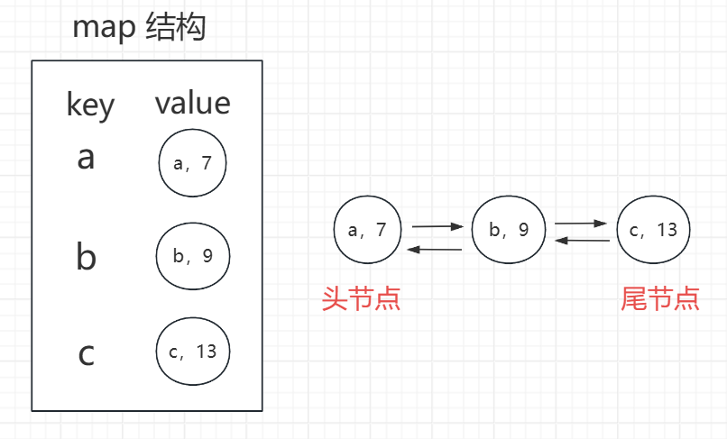
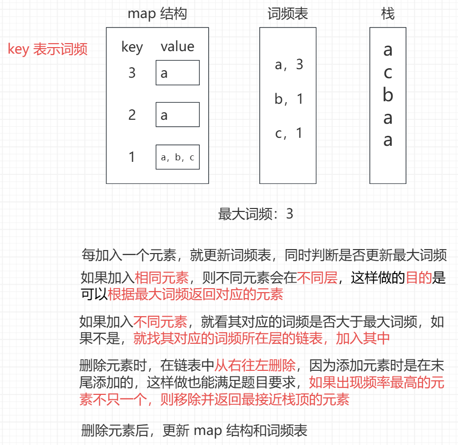
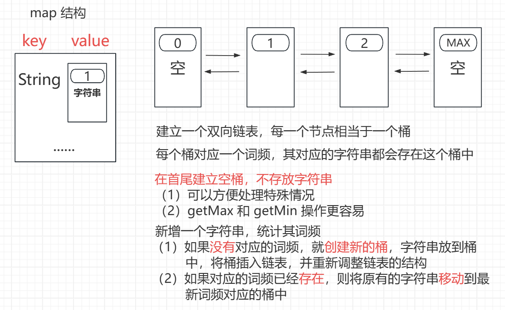

<h1 style="text-align: center; font-weight: bold;">数据结构设计高频题</h1>

---

## setAll 功能的哈希表

### 题目链接

> #### https://www.nowcoder.com/practice/7c4559f138e74ceb9ba57d76fd169967
>
> #### 使用 <span style="color: red;">O（1）</span>的操作将哈希表中的 value 值全部设置为 newValue，<span style="color: red;">不能遍历哈希表</span>

### 思路分析

> #### 使用两个变量：setAllValue、setAllTime，加
>
> #### 用一个 setAllTime 变量记录 setAll 的时间，每一个元素都有一个对应的操作时间，如果操作时间小于 setAllTime，则说明改元素会被设置成 setAllValue，返回 setAllValue 即可，否则返回原来的值

### 代码实现

```java
import java.io.*;
import java.util.*;

public class Main {

    // key，[value，time]，time 表示操作次数
    public static HashMap<Integer, int[]> map = new HashMap<>();
    public static int setAllValue;
    public static int setAllTime;
    // 记录每一个元素的操作时间
    public static int cnt;

    public static void put(int k, int v) {
        // 如果 key 存在就更新 value，否则新增
        if (map.containsKey(k)) {
            int[] value = map.get(k);
            value[0] = v;
            value[1] = cnt++;
        } else {
            map.put(k, new int[]{v, cnt++});
        }
    }

    public static void setAll(int v) {
        setAllValue = v;
        setAllTime = cnt++;
    }

    public static int get(int k) {
        // 判断是否存在
        if (!map.containsKey(k)) {
            return -1;
        }
        // 存在，需要判断是返回 value 还是 setAllValue
        int[] value = map.get(k);
        if (value[1] > setAllTime) {
            return value[0];
        } else {
            return setAllValue;
        }
    }

    // 定义变量接收输入
    public static int n, opt, a, b;

    public static void main(String[] args) throws Exception {
        BufferedReader br = new BufferedReader(new InputStreamReader(System.in));
        StreamTokenizer in = new StreamTokenizer(br);
        PrintWriter out = new PrintWriter(new OutputStreamWriter(System.out));
        while (in.nextToken() != StreamTokenizer.TT_EOF) {
            // 在每一轮循环中的得出一个答案，先放到缓冲区
            // 所以每次循环开始先要重置一下变量的值
            map.clear();
            setAllValue = 0;
            setAllTime = -1;
            cnt = 0;

            n = (int) in.nval;

            for (int i = 0; i < n; i++) {
                in.nextToken();
                opt = (int) in.nval;

                // 若 opt = 1，put 操作
                // 若 opt = 2，get 操作
                // 若 opt = 3，setAll 操作
                if (opt == 1) {
                    in.nextToken();
                    a = (int) in.nval;
                    in.nextToken();
                    b = (int) in.nval;
                    put(a, b);
                } else if (opt == 2) {
                    in.nextToken();
                    a = (int) in.nval;
                    out.println(get(a));
                } else {
                    in.nextToken();
                    a = (int) in.nval;
                    setAll(a);
                }
            }
        }
        out.flush();
        out.close();
        br.close();
    }
}
```

## LRU 缓存

### 题目链接

> #### https://leetcode.cn/problems/lru-cache

### 什么是 LRU

> #### 指定一个 capacity，存储的元素个数上限为 capacity，以 capacity = 3 举例
>
> #### 每一个元素是 key - value 的键值对结构，同时每个元素对应一个操作时间
>
> #### 只要对某个元素操作，则当前元素的操作时间就是最晚的，同时更新其余两个元素的操作时间
>
> #### 如果已经满了，还需要添加元素，则移除操作时间最早的元素
>
> #### 若添加的元素的 key 在缓存中已经存在，则会更新 value，同时更新三个元素的操作时间

### 思路分析

> #### 实现结构：<span style="color: red;">哈希表（map 结构：key - 节点地址） + 双向链表</span>
>
> #### 定义头尾指针，<span style="color: red;">头节点</span>指向操作时间<span style="color: red;">最早</span>的节点，<span style="color: red;">尾节点</span>指向操作时间<span style="color: red;">最晚</span>的节点
>
> #### 当对节点操作时，哈希表中做相应的更新，同时调整双向链表，维持元素操作的相对时序

<br/>


### 代码实现

```java
class LRUCache {

    class DoubleNode {
        // 每一个元素是 key - value 的结构
        public int key;
        public int val;
        public DoubleNode last;
        public DoubleNode next;

        public DoubleNode(int key, int val) {
            this.key = key;
            this.val = val;
        }
    }

    class DoubleList {
        // 只定义头尾指针
        // <头指针> 指向操作时间 <最早> 的节点
        // <尾指针> 指向操作时间 <最晚> 的节点
        private DoubleNode head;
        private DoubleNode tail;

        public DoubleList() {
            head = null;
            tail = null;
        }

        public void addNode(DoubleNode newNode) {
            if (newNode == null) {
                return;
            }
            // 添加的节点是第一个节点
            if (head == null) {
                head = newNode;
                tail = newNode;
            } else {
                // 挂接新节点，同时调整两个指针
                tail.next = newNode;
                newNode.last = tail;
                // 尾节点来到新的尾巴，继续挂接下一个节点
                tail = newNode;
            }
        }

        // 删除操作时间最早的节点，即删除头节点
        public DoubleNode removeHead() {
            if (head == null) {
                return null;
            }
            DoubleNode ans = head;
            // 只有一个节点
            if (head == tail) {
                head = null;
                tail = null;
            } else {
                // head 来到头节点的下一个节点
                head = ans.next;
                // 删除头节点，处理两个指针
                ans.next = null;
                head.last = null;
            }
            return ans;
        }

        // 对元素操作后，需要调整时序
        public void moveNodeToTail(DoubleNode node) {
            // 只有一个节点，无需调整
            if (tail == node) {
                return;
            }

            // 如果头节点，调整头指针
            if (head == node) {
                head = node.next;
                head.last = null;
            } else {
                // 节点是中间节点，将该节点从链表中分离

                // 调整 lastNode 的 next 指针
                node.last.next = node.next;

                // 调整 nextNode 的 last 指针
                node.next.last = node.last;
            }

            // 调整指针，挂接节点
            tail.next = node;
            node.last = tail;
            node.next = node;
            tail = node;
        }
    }

    private HashMap<Integer, DoubleNode> keyNodeMap;
    private DoubleList nodeList;
    private final int capacity;

    public LRUCache(int n) {
        keyNodeMap = new HashMap<>();
        nodeList = new DoubleList();
        capacity = n;
    }

    public int get(int key) {
        if (keyNodeMap.containsKey(key)) {
            DoubleNode ans = keyNodeMap.get(key);
            nodeList.moveNodeToTail(ans);
            return ans.val;
        }
        // 不存在返回 -1
        return -1;
    }

    public void put(int key, int value) {
        // 如果 key 存在就更新 value，否则就新增 key
        if (keyNodeMap.containsKey(key)) {
            DoubleNode node = keyNodeMap.get(key);
            node.val = value;
            nodeList.moveNodeToTail(node);
        } else {
            // 新增之前先判断是否满容量
            // 满容量的情况下要新增，移除头节点
            if (keyNodeMap.size() == capacity) {
                // nodeList.removeHead() 返回头节点
                keyNodeMap.remove(nodeList.removeHead().key);
            }
            DoubleNode newNode = new DoubleNode(key, value);
            keyNodeMap.put(key, newNode);
            nodeList.addNode(newNode);
        }
    }
}

/**
 * Your LRUCache object will be instantiated and called as such:
 * LRUCache obj = new LRUCache(capacity);
 * int param_1 = obj.get(key);
 * obj.put(key,value);
 */
```

## O(1) 增删和获取随机元素-1

### 题目链接

> #### https://leetcode.cn/problems/insert-delete-getrandom-o1/

### 思路分析

> #### 采用 map 结构，key 存储元素值，vval 存储元素下标
>
> #### 定义一个动态数组，存储元素
>
> #### remove 删除元素，如果在 random 的时候恰好随机到被删除的元素，这就会产生问题
>
> #### 如果 remove 元素，拿动态数组的<span style="color:red;">最后一个元素填补空缺</span>，同时更新 map 中元素对应的下标

### 代码实现

```java
class RandomizedSet {

    public HashMap<Integer, Integer> map;

    public ArrayList<Integer> arr;

    public RandomizedSet() {
        map = new HashMap<>();
        arr = new ArrayList<>();
    }

    public boolean insert(int val) {
        if (map.containsKey(val)) {
            return false;
        }
        map.put(val, arr.size());
        arr.add(val);
        return true;
    }

    public boolean remove(int val) {
        if (!map.containsKey(val)) {
            return false;
        }
        // 删除一个数产生的空缺用最后一个数填补
        int valIndex = map.get(val);
        int endValue = arr.get(arr.size() - 1);
        map.put(endValue, valIndex);
        arr.set(valIndex, endValue);
        map.remove(val);
        arr.remove(arr.size() - 1);
        return true;
    }

    public int getRandom() {
        return arr.get((int) (Math.random() * arr.size()));
    }
}
/**
 * Your RandomizedSet object will be instantiated and called as such:
 * RandomizedSet obj = new RandomizedSet();
 * boolean param_1 = obj.insert(val);
 * boolean param_2 = obj.remove(val);
 * int param_3 = obj.getRandom();
 */
```

## O(1) 增删和获取随机元素-2

::: tip <span style="font-size:18px;font-weight:bold;">💡 Tip</span>

#### 区别于上题，本题<span style="color:red;">允许有重复元素</span>，getRandom（）从当前的多个元素集合中返回一个随机元素。每个元素被<span style="color:red;">返回的概率</span>与集合中包含的相同值的<span style="color:red;">数量线性相关</span>

:::

### 题目链接

> #### https://leetcode.cn/problems/insert-delete-getrandom-o1-duplicates-allowed/

### 思路分析

> #### 跟上题思路类似，由于允许重复元素存在，map 中的 <span style="color:red;">value 变为 set 结构</span>，存储多个重复元素的下标

### 代码实现

```java
class RandomizedCollection {

    private HashMap<Integer, HashSet<Integer>> map;

    private ArrayList<Integer> arr;

    public RandomizedCollection() {
        map = new HashMap<>();
        arr = new ArrayList<>();
    }

    // 第一次加入返回 true，否则返回 false
    public boolean insert(int val) {
        arr.add(val);
        HashSet<Integer> set = map.getOrDefault(val, new HashSet<Integer>());
        // 记录元素的下标
        set.add(arr.size() - 1);
        map.put(val, set);
        return set.size() == 1;
    }

    public boolean remove(int val) {
        if (!map.containsKey(val)) {
            return false;
        }
        HashSet<Integer> valIndexSet = map.get(val);
        int valAnyIndex = valIndexSet.iterator().next();
        int endValue = arr.get(arr.size() - 1);
        // 如果删除的是最后一个元素，直接删除，无需填补
        if (val == endValue) {
            valIndexSet.remove(arr.size() - 1);
        } else {
            // 用最后一个数去填补删除元素产生的空缺
            HashSet<Integer> endValueSet = map.get(endValue);
            endValueSet.add(valAnyIndex);
            arr.set(valAnyIndex, endValue);
            endValueSet.remove(arr.size() - 1);
            valIndexSet.remove(valAnyIndex);
        }
        arr.remove(arr.size() - 1);
        if (valIndexSet.isEmpty()) {
            map.remove(val);
        }
        return true;
    }

    public int getRandom() {
        return arr.get((int) (Math.random() * arr.size()));
    }
}

/**
 * Your RandomizedCollection object will be instantiated and called as such:
 * RandomizedCollection obj = new RandomizedCollection();
 * boolean param_1 = obj.insert(val);
 * boolean param_2 = obj.remove(val);
 * int param_3 = obj.getRandom();
 */
```

## 获取数据流的中位数

### 题目链接

> #### https://leetcode.cn/problems/find-median-from-data-stream/

### 思路分析

> #### 求中位数的<span style="color:red;">前提是有序</span>
>
> #### 可以利用有序的特点，运用两个堆实现，维护中间值
>
> #### 左边较小的部分放在大顶堆中，右边较大的部分放在小顶堆中，那两个堆的堆顶元素就是中间值
>
> #### 只要两个堆的大小差值不大于 2，就无需调整堆
>
> #### 如果总元素个数是<span style="color:red;">奇数</span>，则中位数就是大顶堆的堆顶元素
>
> #### 如果总元素个数是<span style="color:red;">偶数</span>，则中位数是两个堆的堆顶元素的平均值

### 代码实现

```java
class MedianFinder {

    // 较大的元素放在小根堆
    private PriorityQueue<Integer> minHeap;

    // 较小的元素放在大根堆
    private PriorityQueue<Integer> maxHeap;

    public MedianFinder() {
        minHeap = new PriorityQueue<>((a, b) -> a - b);
        maxHeap = new PriorityQueue<>((a, b) -> b - a);
    }

    public void addNum(int num) {
        if (maxHeap.isEmpty() || num <= maxHeap.peek()) {
            maxHeap.add(num);
        } else {
            minHeap.add(num);
        }
        balance();
    }

    public double findMedian() {
        // 元素个数是偶数个
        if (maxHeap.size() == minHeap.size()) {
            return (double) (maxHeap.peek() + minHeap.peek()) / 2;
        } else {
            // 元素个数是奇数个
            return maxHeap.size() > minHeap.size() ? maxHeap.peek() : minHeap.peek();
        }
    }

    public void balance() {
        if (Math.abs(maxHeap.size() - minHeap.size()) == 2) {
            if (maxHeap.size() > minHeap.size()) {
                // 大根堆弹出一个进小根堆
                minHeap.add(maxHeap.poll());
            } else {
                // 小根堆弹出一个进大根堆
                maxHeap.add(minHeap.poll());
            }
        }
    }
}

/**
 * Your MedianFinder object will be instantiated and called as such:
 * MedianFinder obj = new MedianFinder();
 * obj.addNum(num);
 * double param_2 = obj.findMedian();
 */
```

## 最大频率栈

### 题目链接

> #### https://leetcode.cn/problems/maximum-frequency-stack

### 思路分析

<br/>


### 代码实现

```java
class FreqStack {

    // 出现的最大次数
    private int topTimes;

    // 每层节点
    private HashMap<Integer, ArrayList<Integer>> cntValues = new HashMap<>();

    // 每一个数出现了几次（词频表）
    private HashMap<Integer, Integer> valueTimes = new HashMap<>();

    public void push(int val) {
        // 更新自己的词频
        valueTimes.put(val, valueTimes.getOrDefault(val, 0) + 1);
        // 当前元素的最大词频，后续可能会更新
        int curTopTimes = valueTimes.get(val);
        // 如果当前词频对应的层么米有链表，建出来
        if (!cntValues.containsKey(curTopTimes)) {
            cntValues.put(curTopTimes, new ArrayList<>());
        }
        // 拿到当前词频对应层的链表，添加元素
        ArrayList<Integer> curTimeValues = cntValues.get(curTopTimes);
        curTimeValues.add(val);
        // 更新最大词频
        topTimes = Math.max(topTimes, curTopTimes);
    }

    public int pop() {
        // 弹出词频最大的元素
        ArrayList<Integer> topTimeValues = cntValues.get(topTimes);
        // 同一层链表，从右往左移除元素
        // 返回移除的数字，目的是后续更新词频表
        int ans = topTimeValues.remove(topTimeValues.size() - 1);
        // 如果元素没了，清除当前层的链表
        if (topTimeValues.size() == 0) {
            cntValues.remove(topTimes);
            topTimes--;
        }
        // 更新移除元素对应的词频
        int times = valueTimes.get(ans);
        // 要移除的数字只剩下依次，再移除就没了
        if (times == 1) {
            valueTimes.remove(ans);
        } else {
            valueTimes.put(ans, times - 1);
        }
        return ans;
    }
}

/**
 * Your FreqStack object will be instantiated and called as such:
 * FreqStack obj = new FreqStack();
 * obj.push(val);
 * int param_2 = obj.pop();
 */
```

## 全 O（1）的数据结构

### 题目链接

> #### https://leetcode.cn/problems/all-oone-data-structure

### 思路分析

<br/>


### 代码实现

```java
class AllOne {

    // 定义双向链表节点（桶）
    class Bucket {
        // 词频
        public int cnt;
        // 该词频对应的字符串
        public HashSet<String> set;
        public Bucket last;
        public Bucket next;

        public Bucket(String s, int n) {
            set = new HashSet<>();
            set.add(s);
            cnt = n;
        }
    }

    // 在 cur 桶（节点）的后面插入 pos 桶（节点）
    public void insert(Bucket cur, Bucket pos) {
        // 先处理后面，再处理前面
        pos.next = cur.next;
        cur.next.last = pos;

        cur.next = pos;
        pos.last = cur;
    }

    // 移除 cur 桶（节点）
    public void remove(Bucket cur) {
        cur.last.next = cur.next;
        cur.next.last = cur.last;
    }

    // 头桶指针
    Bucket head;

    // 尾桶指针
    Bucket tail;

    HashMap<String, Bucket> map;

    // 初始化，建立首尾两个桶，不存储字符串
    public AllOne() {
        head = new Bucket("", 0);
        tail = new Bucket("", Integer.MAX_VALUE);
        head.next = tail;
        tail.last = head;
        map = new HashMap<>();
    }

    // 整体思路
    // 如果链表 有 对应的词频，就以最新的词频为准，移动字符串
    // 如果链表中 没有 对应的词频，就创建新的桶，加入双向链表
    public void inc(String key) {
        // 字符串第一次进来，放到词频为 1 的桶中
        if (!map.containsKey(key)) {
            // 词频为 1 的桶存在，直接放入
            if (head.next.cnt == 1) {
                map.put(key, head.next);
                head.next.set.add(key);
            } else {
                // 词频为 1 的桶不存在，创建桶并插入到链表中
                Bucket bucket = new Bucket(key, 1);
                map.put(key, bucket);
                // 在 head 桶的后面插入 bucket 桶
                insert(head, bucket);
            }
        } else {
            Bucket bucket = map.get(key);
            // 需要插入 key，看是否存在词频为 bucket.cnt + 1 的桶
            if (bucket.next.cnt == bucket.cnt + 1) {
                map.put(key, bucket.next);
                bucket.next.set.add(key);
            } else {
                Bucket newBucket = new Bucket(key, bucket.cnt + 1);
                map.put(key, newBucket);
                insert(bucket, newBucket);
            }
            // 字符串移动了到了新的桶，更新原来的桶
            bucket.set.remove(key);
            // 如果桶空了，把桶移除
            if (bucket.set.isEmpty()) {
                // 前后节点重连，移除 bucket 桶
                remove(bucket);
            }
        }
    }

    public void dec(String key) {
        Bucket bucket = map.get(key);
        // 字符串的词频只有 1，删除就没了
        if (bucket.cnt == 1) {
            map.remove(key);
        } else {
            // 有对应词频的桶就移动字符串，否则新建
            if (bucket.last.cnt == bucket.cnt - 1) {
                map.put(key, bucket.last);
                bucket.last.set.add(key);
            } else {
                Bucket newBucket = new Bucket(key, bucket.cnt - 1);
                map.put(key, newBucket);
                insert(bucket.last, newBucket);
            }
        }
        // 字符串移动了到了新的桶，更新原来的桶
        bucket.set.remove(key);
        // 如果桶空了，把桶移除
        if (bucket.set.isEmpty()) {
            remove(bucket);
        }
    }

    public String getMaxKey() {
        return tail.last.set.iterator().next();
    }

    public String getMinKey() {
        return head.next.set.iterator().next();
    }
}

/**
 * Your AllOne object will be instantiated and called as such:
 * AllOne obj = new AllOne();
 * obj.inc(key);
 * obj.dec(key);
 * String param_3 = obj.getMaxKey();
 * String param_4 = obj.getMinKey();
 */
```
