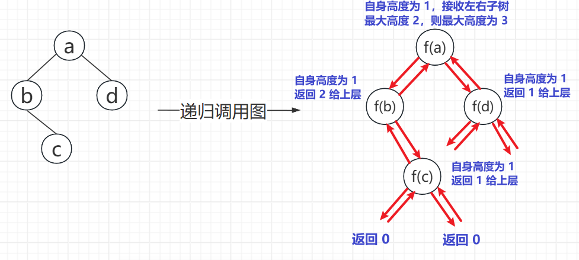
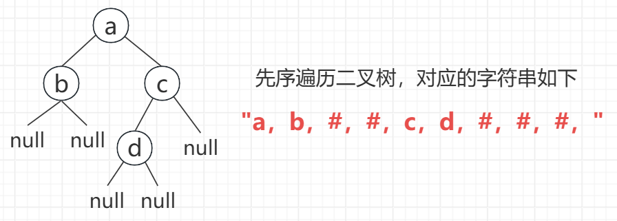
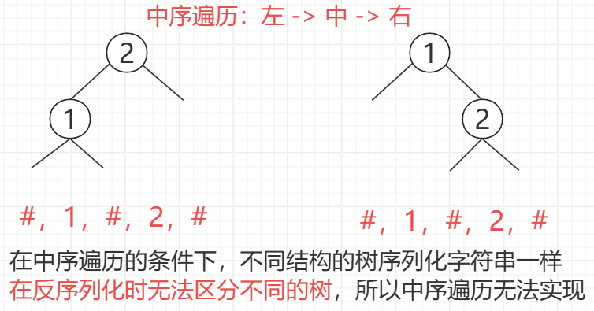
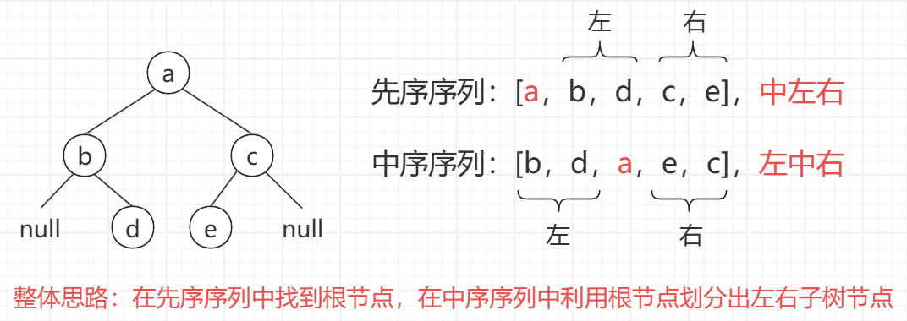
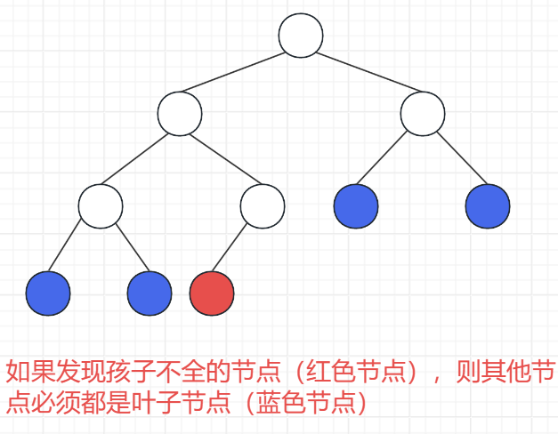
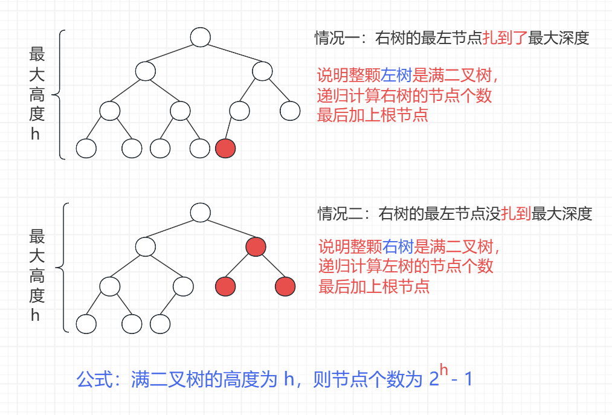

<h1 style="text-align: center; font-weight: bold;">二叉树高频题-上</h1>

---

## 层序遍历

### 题目链接

> #### https://leetcode.cn/problems/binary-tree-level-order-traversal/

### 思路分析

#### （1）思路一：BFS + 哈希表

> #### BFS 层序遍历二叉树，哈希表记录每个节点对应的层数，<span style="color: red;">根节点是第 0 层</span>，通过层数进而知道哪些节点需要收集在一个 List 中

#### （2）思路二：数组实现队列 + 一次处理一层节点

> #### BFS 层序遍历二叉树，在 poll 之前记录队列的大小为 size，表示当前层的节点个数
>
> #### <span style="color: red;">弹出队头元素，将左右孩子入队，这个过程做 size 次</span>

### 代码实现

```java
/**
 * Definition for a binary tree node.
 * public class TreeNode {
 *     int val;
 *     TreeNode left;
 *     TreeNode right;
 *     TreeNode() {}
 *     TreeNode(int val) { this.val = val; }
 *     TreeNode(int val, TreeNode left, TreeNode right) {
 *         this.val = val;
 *         this.left = left;
 *         this.right = right;
 *     }
 * }
 */
class Solution {
    public List<List<Integer>> levelOrder(TreeNode root) {
        List<List<Integer>> ans = new ArrayList<>();
        if (root != null) {
            Queue<TreeNode> queue = new LinkedList<>();
            // 用 map 记录节点所在的层，便于收集节点
            HashMap<TreeNode, Integer> levels = new HashMap<>();
            queue.add(root);
            // 根节点为第 0 层
            levels.put(root, 0);
            while (!queue.isEmpty()) {
                TreeNode cur = queue.poll();
                int level = levels.get(cur);
                // 刚开始的时候还没有链表，建出来
                if (ans.size() == level) {
                    ans.add(new ArrayList<>());
                }
                ans.get(level).add(cur.val);
                // 将左右孩子加入队列，并记录层数
                if (cur.left != null) {
                    queue.add(cur.left);
                    levels.put(cur.left, level + 1);
                }
                if (cur.right != null) {
                    queue.add(cur.right);
                    levels.put(cur.right, level + 1);
                }
            }
        }
        return ans;
    }
}
```

### 优化实现

```java
/**
 * Definition for a binary tree node.
 * public class TreeNode {
 *     int val;
 *     TreeNode left;
 *     TreeNode right;
 *     TreeNode() {}
 *     TreeNode(int val) { this.val = val; }
 *     TreeNode(int val, TreeNode left, TreeNode right) {
 *         this.val = val;
 *         this.left = left;
 *         this.right = right;
 *     }
 * }
 */
class Solution {

    public static int MAXN = 2001;

    public static TreeNode[] queue = new TreeNode[MAXN];

    // 定义队头，队尾指针
    public static int l, r;

    public List<List<Integer>> levelOrder(TreeNode root) {
        List<List<Integer>> ans = new ArrayList<>();
        if (root != null) {
            l = r = 0;
            // 将元素放在 r 位置，r ++
            // 即 r 始终指向队尾元素的下一个位置
            queue[r++] = root;

            // BFS 层序遍历
            // 只要队列还有元素就继续
            while (l < r) {
                // poll 之前先记录队列大小
                int size = r - l;
                ArrayList<Integer> list = new ArrayList<>();
                // 取出队头元素，将左右孩子入队，这个过程做 size 次
                // 每次循环处理一层元素，最后将 list 加入结果集 ans
                for (int i = 0; i < size; i++) {
                    TreeNode cur = queue[l++];
                    list.add(cur.val);
                    if (cur.left != null) {
                        queue[r++] = cur.left;
                    }
                    if (cur.right != null) {
                        queue[r++] = cur.right;
                    }
                }
                ans.add(list);
            }
        }
        return ans;
    }
}
```

## 锯齿形层序遍历

### 题目链接

> #### https://leetcode.cn/problems/binary-tree-zigzag-level-order-traversal/

### 思路分析

> #### 采用优化的 BFS 层序遍历，利用 reverse 变量来控制收集元素的顺序
>
> #### 有一点区别：因为是收集元素的顺序不同，所以处理的时候<span style="color: red;">先收集节点</span>，在 BFS 层序处理的时候<span style="color: red;">弹出节点就不收集</span>，接着处理左右孩子节点即可

### 代码实现

```java
/**
 * Definition for a binary tree node.
 * public class TreeNode {
 *     int val;
 *     TreeNode left;
 *     TreeNode right;
 *     TreeNode() {}
 *     TreeNode(int val) { this.val = val; }
 *     TreeNode(int val, TreeNode left, TreeNode right) {
 *         this.val = val;
 *         this.left = left;
 *         this.right = right;
 *     }
 * }
 */
class Solution {

    public static int MAXN = 2001;

    public static TreeNode[] queue = new TreeNode[MAXN];

    // 定义队头，队尾指针
    public static int l, r;

    public List<List<Integer>> zigzagLevelOrder(TreeNode root) {
        List<List<Integer>> ans = new ArrayList<>();
        if (root != null) {
            l = r = 0;
            queue[r++] = root;

            // 用 reverse 变量来控制收集元素的顺序
            // false：从左 -> 右收集
            // true： 从右 -> 左收集
            boolean reverse = false;

            while (l < r) {
                int size = r - l;
                ArrayList<Integer> list = new ArrayList<>();

                // false：从左 -> 右收集，l .... r-1，收集 size 个
                // true： 从右 -> 左收集，r-1 .... l，收集 size 个
                // 左 -> 右：i = i + 1
                // 右 -> 左：i = i - 1
                for (int i = reverse ? r - 1 : l, j = reverse ? -1 : 1, k = 0; k < size; i += j, k++) {
                    TreeNode cur = queue[i];
                    list.add(cur.val);
                }

                // BFS 层序处理逻辑
                for (int i = 0; i < size; i++) {
                    TreeNode cur = queue[l++];
                    // 这里不收集节点，直接处理左右孩子
                    if (cur.left != null) {
                        queue[r++] = cur.left;
                    }
                    if (cur.right != null) {
                        queue[r++] = cur.right;
                    }
                }
                ans.add(list);
                // 遍历顺序是交替变换的
                reverse = !reverse;
            }
        }
        return ans;
    }
}
```

## 二叉树最大宽度

### 题目链接

> #### https://leetcode.cn/problems/maximum-width-of-binary-tree/
>
> #### 题意：按层计算宽度，即该层节点的个数，每一层最左的不空节点到最右的不空节点，中间节点无论是否为空都要计算，返回最大宽度

### 思路分析

> #### 利用二叉树的性质，用<span style="color: red;">下标差值</span>来记录每一层的节点数，每一层拿出最左和最右节点，计算下标差值，就知道该层的最大宽度
>
> #### 额外申请一个队列，同步记录节点对应的下标索引
>
> #### 假定<span style="color: red;">头节点为 1 号节点</span>，对于父节点的下标索引 i
>
> #### （1）<span style="color: red;">左</span>子节点索引为 <span style="color: red;">2 \* i</span>
>
> #### （2）<span style="color: red;">右</span>子节点索引为 <span style="color: red;">2 \* i + 1</span>

### 代码实现

```java
/**
 * Definition for a binary tree node.
 * public class TreeNode {
 *     int val;
 *     TreeNode left;
 *     TreeNode right;
 *     TreeNode() {}
 *     TreeNode(int val) { this.val = val; }
 *     TreeNode(int val, TreeNode left, TreeNode right) {
 *         this.val = val;
 *         this.left = left;
 *         this.right = right;
 *     }
 * }
 */
class Solution {
    public static int MAXN = 3001;

    public static TreeNode[] nodeQueue = new TreeNode[MAXN];

    // 额外申请一个队列同步记录节点对应的下标索引
    public static long[] indexQueue = new long[MAXN];

    public static int l, r;

    public int widthOfBinaryTree(TreeNode root) {
        // 从根节点开始，初始宽度为 1
        int ans = 1;
        l = r = 0;
        nodeQueue[r] = root;
        // r 始终指向队尾元素的下一个位置
        indexQueue[r++] = 1;

        while (l < r) {
            // 计算本层节点的个数
            int size = r - l;
            // 计算每层的最大宽度，并更新
            ans = Math.max(ans, (int) (indexQueue[r - 1] - indexQueue[l] + 1));
            for (int i = 0; i < size; i++) {
                TreeNode node = nodeQueue[l];
                long id = indexQueue[l++];
                // 注意两个队列使用的是同一个头尾指针
                // r++ 应该在队列都更新后执行
                if (node.left != null) {
                    nodeQueue[r] = node.left;
                    indexQueue[r++] = id * 2;
                }
                if (node.right != null) {
                    nodeQueue[r] = node.right;
                    indexQueue[r++] = id * 2 + 1;
                }
            }
        }
        return ans;
    }
}
```

## 最大深度

### 题目链接

> #### https://leetcode.cn/problems/maximum-depth-of-binary-tree

### 思路分析



### 代码实现

```java
/**
 * Definition for a binary tree node.
 * public class TreeNode {
 *     int val;
 *     TreeNode left;
 *     TreeNode right;
 *     TreeNode() {}
 *     TreeNode(int val) { this.val = val; }
 *     TreeNode(int val, TreeNode left, TreeNode right) {
 *         this.val = val;
 *         this.left = left;
 *         this.right = right;
 *     }
 * }
 */
class Solution {
    public int maxDepth(TreeNode root) {
       // 最大深度 = 本层节点的高度 + 左右子树的最大高度
       return root == null ? 0 : Math.max(maxDepth(root.left), maxDepth(root.right)) + 1;
    }
}
```

## 最小深度

### 题目链接

> #### https://leetcode.cn/problems/minimum-depth-of-binary-tree/
>
> #### 第一种表达：最小深度是指从根节点出发，到所有<span style="color: red;">叶子节点</span>的最小深度
>
> #### 第二种表达：最小深度是从根节点到最近叶子节点的最短路径上的节点数量

### 思路分析

> #### 本题仍然可以采用递归的思路，逐层向上返回结果
>
> #### 需要注意的是，如果<span style="color: red;">叶子节点为空</span>，则会返回 0，<span style="color: red;">会干扰最后</span>最小深度的计算<span style="color: red;">结果</span>，再递归前需要先判断
>
> #### <span style="color: red;">如果叶子节点不为空，再递归</span>

### 代码实现

```java
/**
 * Definition for a binary tree node.
 * public class TreeNode {
 *     int val;
 *     TreeNode left;
 *     TreeNode right;
 *     TreeNode() {}
 *     TreeNode(int val) { this.val = val; }
 *     TreeNode(int val, TreeNode left, TreeNode right) {
 *         this.val = val;
 *         this.left = left;
 *         this.right = right;
 *     }
 * }
 */
class Solution {
    public int minDepth(TreeNode root) {
        // 当前的树是空树
        if (root == null) {
            return 0;
        }
        // 当前 root 是叶子节点，即只有 root 一个节点
        if (root.left == null && root.right == null) {
            return 1;
        }

        // 设置成最大的目的是不去干扰最后的计算结果
        // 因为最后的结果需要取最小
        int leftDeep = Integer.MAX_VALUE;
        int rightDeep = Integer.MAX_VALUE;

        // 如果左右孩子不为空，才递归
        // 若为空，返回 0，影响最后的计算结果
        if (root.left != null) {
            leftDeep = minDepth(root.left);
        }
        if (root.right != null) {
            rightDeep = minDepth(root.right);
        }
        // 当前层的深度 + 左右孩子的最大深度
        // root 算一层，所以要加 1
        return Math.min(leftDeep, rightDeep) + 1;
    }
}
```

## 先序序列化与反序列化

### 题目链接

> #### https://leetcode.cn/problems/serialize-and-deserialize-binary-tree

### 思路分析

#### （1）前序遍历和后序可以实现序列化和反序列化，这里以前序遍历为例，<span style="color:red;">遇到空节点就用 # 标记</span>

<br/>


#### （2）<span style="color:red;">中序无法实现序列化和反序列化</span>

<br/>


### 代码实现

```java
/**
 * Definition for a binary tree node.
 * public class TreeNode {
 *     int val;
 *     TreeNode left;
 *     TreeNode right;
 *     TreeNode(int x) { val = x; }
 * }
 */
public class Codec {
    // Encodes a tree to a single string.
    public String serialize(TreeNode root) {
        StringBuilder builder = new StringBuilder();
        f(root, builder);
        return builder.toString();
    }

    public void f(TreeNode root, StringBuilder builder) {
        // 先序遍历
        if (root == null) {
            builder.append("#,");
        } else {
            builder.append(root.val + ",");
            f(root.left, builder);
            f(root.right, builder);
        }
    }

    // 记录数组消费到哪了
    public static int cnt;

    // Decodes your encoded data to tree.
    public TreeNode deserialize(String data) {
        String[] vals = data.split(",");
        cnt = 0;
        return g(vals);
    }

    TreeNode g(String[] vals) {
        String cur = vals[cnt++];
        if (cur.equals("#")) {
            return null;
        } else {
            TreeNode head = new TreeNode(Integer.valueOf(cur));
            head.left = g(vals);
            head.right = g(vals);
            return head;
        }
    }
}

// Your Codec object will be instantiated and called as such:
// Codec ser = new Codec();
// Codec deser = new Codec();
// TreeNode ans = deser.deserialize(ser.serialize(root));
```

## 按层序列化与反序列化

### 题目链接

> #### https://leetcode.cn/problems/serialize-and-deserialize-binary-tree

### 思路分析

> #### 采用层序遍历，<span style="color:red;">一次处理一个节点</span>的方式实现

### 代码实现

```java
/**
 * Definition for a binary tree node.
 * public class TreeNode {
 *     int val;
 *     TreeNode left;
 *     TreeNode right;
 *     TreeNode(int x) { val = x; }
 * }
 */
public class Codec {
    public static int MAXN = 10001;

    public static TreeNode[] queue = new TreeNode[MAXN];

    public static int l, r;

    // Encodes a tree to a single string.
    public String serialize(TreeNode root) {
        StringBuilder builder = new StringBuilder();
        if (root != null) {
            builder.append(root.val + ",");
            l = 0;
            r = 0;
            queue[r++] = root;
            // 层序遍历，一次处理一个节点
            while (l < r) {
                root = queue[l++];
                if (root.left != null) {
                    builder.append(root.left.val + ",");
                    queue[r++] = root.left;
                } else {
                    builder.append("#,");
                }
                if (root.right != null) {
                    builder.append(root.right.val + ",");
                    queue[r++] = root.right;
                } else {
                    builder.append("#,");
                }
            }
        }
        return builder.toString();
    }

    // Decodes your encoded data to tree.
    public TreeNode deserialize(String data) {
        if (data.equals("")) {
            return null;
        }
        String[] nodes = data.split(",");
        int index = 0;
        TreeNode root = generate(nodes[index++]);
        l = 0;
        r = 0;
        queue[r++] = root;
        while (l < r) {
            TreeNode cur = queue[l++];
            cur.left = generate(nodes[index++]);
            cur.right = generate(nodes[index++]);
            if (cur.left != null) {
                queue[r++] = cur.left;
            }
            if (cur.right != null) {
                queue[r++] = cur.right;
            }
        }
        return root;
    }

    public TreeNode generate(String val) {
        return val.equals("#") ? null : new TreeNode(Integer.valueOf(val));
    }
}

// Your Codec object will be instantiated and called as such:
// Codec ser = new Codec();
// Codec deser = new Codec();
// TreeNode ans = deser.deserialize(ser.serialize(root));
```

## 先序和中序构造二叉树

### 题目链接

> #### https://leetcode.cn/problems/construct-binary-tree-from-preorder-and-inorder-traversal/

### 思路分析

<br/>


### 代码实现

```java
/**
 * Definition for a binary tree node.
 * public class TreeNode {
 *     int val;
 *     TreeNode left;
 *     TreeNode right;
 *     TreeNode() {}
 *     TreeNode(int val) { this.val = val; }
 *     TreeNode(int val, TreeNode left, TreeNode right) {
 *         this.val = val;
 *         this.left = left;
 *         this.right = right;
 *     }
 * }
 */
class Solution {
    public TreeNode buildTree(int[] preorder, int[] inorder) {
        if (preorder == null || inorder == null || preorder.length != inorder.length) {
            return null;
        }

        // 记录中序遍历每个节点的下标
        HashMap<Integer, Integer> map = new HashMap<>();
        for (int i = 0; i < inorder.length; i++) {
            map.put(inorder[i], i);
        }
        return f(preorder, 0, preorder.length - 1, inorder, 0, inorder.length - 1, map);
    }

    public static TreeNode f(int[] preOrder, int l1, int r1, int[] inOrder, int l2, int r2,
            HashMap<Integer, Integer> map) {
        if (l1 > r1) {
            return null;
        }
        // 先序遍历顺序：根左右，取出根节点在中序遍历序列中找子节点
        TreeNode head = new TreeNode(preOrder[l1]);
        // 只有一个节点
        if (l1 == r1) {
            return head;
        }
        int k = map.get(preOrder[l1]);
        // preOrder : l1(........)[.......r1]
        // inOrder  : (l2......)k[........r2]
        // (...)是左树对应，[...]是右树的对应
        // k - l2 表示不包含 k，k 左边的元素个数，即左子树的个数
        head.left = f(preOrder, l1 + 1, l1 + (k - l2), inOrder, l2, k - 1, map);
        head.right = f(preOrder, l1 + (k - l2) + 1, r1, inOrder, k + 1, r2, map);
        return head;
    }
}
```

## 验证完全二叉树

### 题目链接

> #### https://leetcode.cn/problems/check-completeness-of-a-binary-tree/

### 思路分析

> #### 思路：运用 BFS <span style="color:red;">层序遍历</span>
>
> #### 情况一：有右无左的节点，不是完全二叉树
>
> #### 情况二：发现孩子不全的节点，则其他节点必须全是叶子节点，否则不是完全二叉树



### 代码实现

```java
/**
 * Definition for a binary tree node.
 * public class TreeNode {
 *     int val;
 *     TreeNode left;
 *     TreeNode right;
 *     TreeNode() {}
 *     TreeNode(int val) { this.val = val; }
 *     TreeNode(int val, TreeNode left, TreeNode right) {
 *         this.val = val;
 *         this.left = left;
 *         this.right = right;
 *     }
 * }
 */
class Solution {
    public static int MAXN = 101;

    public static TreeNode[] queue = new TreeNode[MAXN];

    public static int l, r;

    public boolean isCompleteTree(TreeNode root) {
        if (root == null) {
            return true;
        }
        l = r = 0;
        queue[r++] = root;
        // 是否遇到过左右孩子不双全的节点
        boolean leaf = false;
        // BFS
        while (l < r) {
            root = queue[l++];
            // 如果没有遇到孩子不双全的节点，leaf = false
            // 条件一：判断是否是有右无左
            // 若 leaf = true，说明遇到过孩子不双全的节点
            // 条件二：此时其他节点都要求是叶子节点，做判断
            if (root.left == null && root.right != null || (leaf && (root.left != null || root.right != null))) {
                return false;
            }
            if (root.left != null) {
                queue[r++] = root.left;
            }
            if (root.right != null) {
                queue[r++] = root.right;
            }
            // 遇到了左右孩子不双全的节点，leaf = true
            // 若走条件二，则会一直判断是否是叶子节点
            if (root.left == null || root.right == null) {
                leaf = true;
            }
        }
        return true;
    }
}
```

## 完全二叉树节点个数

### 题目链接

> #### https://leetcode.cn/problems/count-complete-tree-nodes/

### 思路分析

> #### <span style="color:red;">默认根节点为第 1 层</span>

<br/>


### 代码实现

> #### 时间复杂度：O（（log n）<sup>2</sup> ）
>
> #### 从根节点出发，到右树的最左节点走过了 h 层，接着来到 level + 1 层（<span style="color:red;">h - 1 这么高的层数</span>）继续递归调用左树或者右树
>
> #### 1 + 2 + 3 + ... + n - 1 + n = n \* （n + 1）/ 2，规模为 h 的平方，h 是树的高度

```java
/**
 * Definition for a binary tree node.
 * public class TreeNode {
 *     int val;
 *     TreeNode left;
 *     TreeNode right;
 *     TreeNode() {}
 *     TreeNode(int val) { this.val = val; }
 *     TreeNode(int val, TreeNode left, TreeNode right) {
 *         this.val = val;
 *         this.left = left;
 *         this.right = right;
 *     }
 * }
 */
class Solution {
    public int countNodes(TreeNode root) {
        if (root == null) {
            return 0;
        }
        return f(root, 1, mostLeft(root, 1));
    }

    // cur ：当前来到的节点
    // level ：当前来到的节点在第几层
    // h ：整颗树的高度，不是 cur 这颗子树的高度
    // 求 cur 这颗子树上共有多少个节点
    public int f(TreeNode cur, int level, int h) {
        if (level == h) {
            return 1;
        }
        // 情况一：cur 的右树扎到 h 层，说明左树是满二叉树
        if (mostLeft(cur.right, level + 1) == h) {
            return ((1 << (h - level)) - 1 + 1 + f(cur.right, level + 1, h));
        } else {
            // 情况二：cur 的右树没扎到 h 层，说明右树是满二叉树
            // 右树是满二叉树，则层数会比左树是满二叉树少一层
            return ((1 << (h - level - 1)) - 1 + 1 + f(cur.left, level + 1, h));
        }
    }

    // 当前节点为 cur，在第 level 层
    // 返回从 cur 开始不停向左，能到第几层
    public int mostLeft(TreeNode cur, int level) {
        while (cur != null) {
            level++;
            cur = cur.left;
        }
        // cur 遇到空停，level 多加了一层，要减掉
        return level - 1;
    }
}
```
