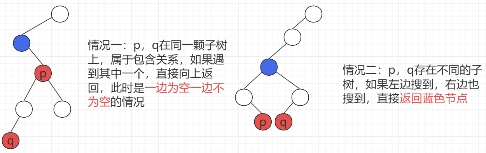
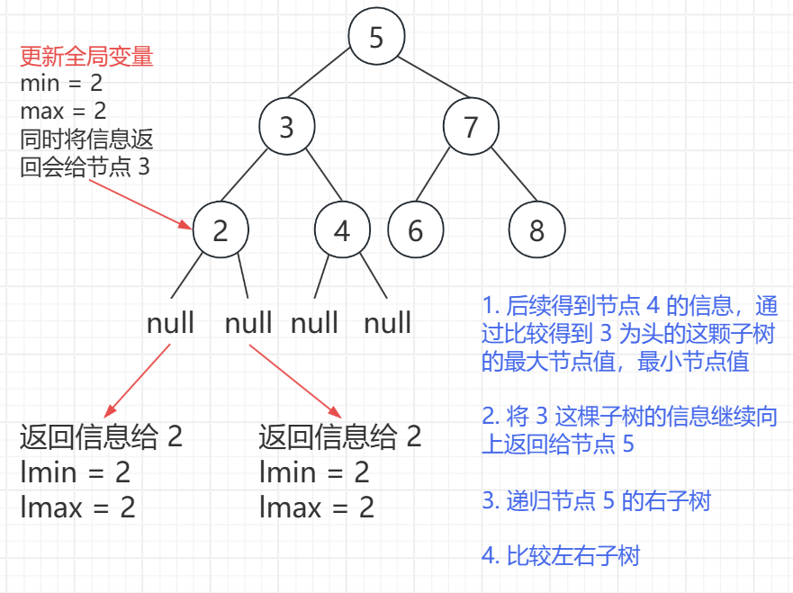
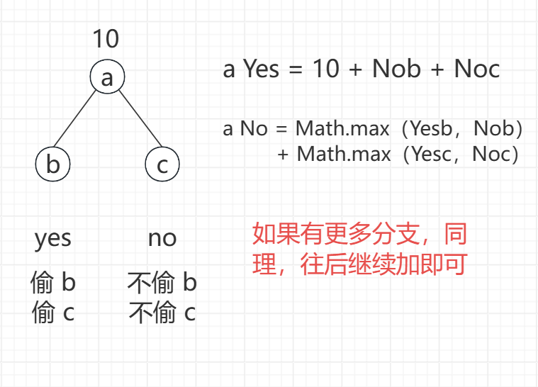

<h1 style="text-align: center; font-weight: bold;">二叉树高频题-下</h1>

---

## 普通二叉树 LCA

### 题目链接

> #### https://leetcode.cn/problems/lowest-common-ancestor-of-a-binary-tree/

### 思路分析

<br/>


### 代码实现

```java
/**
 * Definition for a binary tree node.
 * public class TreeNode {
 *     int val;
 *     TreeNode left;
 *     TreeNode right;
 *     TreeNode(int x) { val = x; }
 * }
 */
class Solution {
    public TreeNode lowestCommonAncestor(TreeNode root, TreeNode p, TreeNode q) {
        if (root == null || root == p || root == q) {
            // root 为空，或者遇到 p，或者遇到 q，返回 root
            return root;
        }

        TreeNode l = lowestCommonAncestor(root.left, p, q);
        TreeNode r = lowestCommonAncestor(root.right, p, q);

        // 情况二：左边搜到，右边也搜到，返回 root
        if (l != null && r != null) {
            return root;
        }
        if (l == null && r == null) {
            return null;
        }

        // 情况一：p，q 属于包含关系，在同一颗子树上
        //        只要遇到一个就返回
        // l，r 一个空，一个不为空，返回不空的那个
        return l != null ? l : r;
    }
}
```

## 搜索二叉树 LCA

### 题目链接

> #### https://leetcode.cn/problems/lowest-common-ancestor-of-a-binary-search-tree/

### 思路分析

> #### 本题需要利用搜索二叉树的性质，<span style="color:red;">左子树所有节点值 <= 根节点 <= 右子树所有节点值</span>

### 代码实现

```java
/**
 * Definition for a binary tree node.
 * public class TreeNode {
 *     int val;
 *     TreeNode left;
 *     TreeNode right;
 *     TreeNode(int x) { val = x; }
 * }
 */

class Solution {
    public TreeNode lowestCommonAncestor(TreeNode root, TreeNode p, TreeNode q) {
        // 搜索二叉树的性质：左子树节点值 < 根节点 < 右子树节点值
        // root 从上到下遍历，会有以下 4 种情况，假设 p < q
        // 1. p，q 属于同一颗子树，先遇到谁，谁就是答案
        // 2. root < p ~ q，root 往右移动
        // 3. p ~ q < root，root 往左移动
        // 4. p < root < q，root 就是答案

        // 先遇到谁返回谁，退出循环
        while (root.val != p.val && root.val != q.val) {
            // 情况二：p < root < q，root 就是答案，不用搜了，返回
            if (Math.min(p.val, q.val) < root.val && root.val < Math.max(p.val, q.val)) {
                break;
            }
            // 情况三、四
            root = root.val < Math.min(p.val, q.val) ? root.right : root.left;
        }
        // 情况一
        return root;
    }
}
```

## 累加和为 sum 的所有路径

### 题目链接

> #### https://leetcode.cn/problems/path-sum-ii/description/

### 思路分析

> #### 典型的递归 + 回溯，递归过程中计算 curSum，并将值作为参数传递，如果符合条件就收集路径
>
> #### 本题要理解清楚递归的执行流程，回溯时，什么情况下要减去 curSum

### 代码实现

> #### 以下代码为更优雅的写法，<span style="color:red;">把 res 和 path 作为递归方法的参数（或局部变量）传递</span>，彻底避免成员变量的依赖，<span style="color:red;">代码可复用性更高</span>

```java
/**
 * Definition for a binary tree node.
 * public class TreeNode {
 *     int val;
 *     TreeNode left;
 *     TreeNode right;
 *     TreeNode() {}
 *     TreeNode(int val) { this.val = val; }
 *     TreeNode(int val, TreeNode left, TreeNode right) {
 *         this.val = val;
 *         this.left = left;
 *         this.right = right;
 *     }
 * }
 */
class Solution {
    public List<List<Integer>> pathSum(TreeNode root, int targetSum) {
        List<List<Integer>> res = new ArrayList<>();
        if (root == null) {
            return res;
        }
        List<Integer> path = new ArrayList<>();
        traversal(root, targetSum, 0, path, res);
        return res;
    }

    // curSum 表示 cur 节点上方路径的累加和
    // 这里传递的是 curSum + cur.val 的计算结果（新值），而非修改原变量
    // 左子树递归栈中，拿到的 curSum 是 S + val，但这只是局部副本
    // 当左子树递归结束，回到当前层时，上层的 curSum 仍然是原来的 S，没有被修改
    // 即回溯时无需对 curSum 进行修改
    public void traversal(TreeNode cur, int targetSum, int curSum, List<Integer> path, List<List<Integer>> res) {
        // 递归终止条件，遇到叶子节点，收集路径
        if (cur.left == null && cur.right == null) {
            if (curSum + cur.val == targetSum) {
                path.add(cur.val);
                res.add(new ArrayList<>(path));
                // 回溯
                path.remove(path.size() - 1);
            }
        } else {
            // 不是叶子节点，继续递归搜索
            path.add(cur.val);
            if (cur.left != null) {
                traversal(cur.left, targetSum, curSum + cur.val, path, res);
            }
            if (cur.right != null) {
                traversal(cur.right, targetSum, curSum + cur.val, path, res);
            }
            path.remove(path.size() - 1);
        }
    }
}
```

## 验证平衡二叉树

### 题目链接

> #### https://leetcode.cn/problems/balanced-binary-tree

### 思路分析

> #### 平衡二叉树：每个节点的左右子树的<span style="color:red;">高度差值的绝对值 <= 1</span>
>
> #### 递归求解每个节点的子树高度，判断是否符合条件即可

### 代码实现

```java
/**
 * Definition for a binary tree node.
 * public class TreeNode {
 *     int val;
 *     TreeNode left;
 *     TreeNode right;
 *     TreeNode() {}
 *     TreeNode(int val) { this.val = val; }
 *     TreeNode(int val, TreeNode left, TreeNode right) {
 *         this.val = val;
 *         this.left = left;
 *         this.right = right;
 *     }
 * }
 */
class Solution {
    public static boolean balance;

    public boolean isBalanced(TreeNode root) {
        // balance 是全局变量，所有递归过程共享
        // 所以每次判断开始时候设置为 true
        balance = true;
        height(root);
        return balance;
    }

    // 求以 cur 为头的这颗子树的高度
    public static int height(TreeNode cur) {
        // 如果不平衡，返回什么已经不重要了
        if (!balance || cur == null) {
            return 0;
        }

        // 递归求左右子树的高度
        int leftHeight = height(cur.left);
        int rightHeight = height(cur.right);

        // 判断是否是平衡二叉树
        if (Math.abs(leftHeight - rightHeight) > 1) {
            balance = false;
        }

        // 返回树高，树高 = 当前节点这层高度 + 左右子树的最大高度
        return Math.max(leftHeight, rightHeight) + 1;
    }
}
```

## 判断搜索二叉树

### 题目链接

> #### https://leetcode.cn/problems/validate-binary-search-tree/

### 思路分析

> #### 搜索二叉树：对于每一颗子树，都应该满足<span style="color:red;">左子树所有节点都小于根节点，根节点小于右子树的所有节点</span>

### 方法一

> #### 非递归实现<span style="color:red;">中序遍历</span>，判断是否是升序序列即可

```java
/**
 * Definition for a binary tree node.
 * public class TreeNode {
 *     int val;
 *     TreeNode left;
 *     TreeNode right;
 *     TreeNode() {}
 *     TreeNode(int val) { this.val = val; }
 *     TreeNode(int val, TreeNode left, TreeNode right) {
 *         this.val = val;
 *         this.left = left;
 *         this.right = right;
 *     }
 * }
 */
class Solution {

    public static int MAXN = 10001;

    public static TreeNode[] stack = new TreeNode[MAXN];

    public static int size;

    public boolean isValidBST(TreeNode root) {
        if (root == null) {
            return true;
        }
        // 定义前驱指针，用于比较，判断是否升序
        TreeNode pre = null;
        // size 始终指向栈顶元素的下一个位置
        size = 0;
        while (size > 0 || root != null) {
            // 一直往左
            if (root != null) {
                stack[size++] = root;
                root = root.left;
            } else {
                // 弹出栈顶元素，处理右子树
                root = stack[--size];
                // 利用升序特性，判断是否搜索二叉树
                if (pre != null && pre.val >= root.val) {
                    return false;
                }
                // 移动前驱指针
                pre = root;
                root = root.right;
            }
        }
        return true;
    }
}
```

### 方法二

> #### 利用搜索二叉树的性质，<span style="color:red;">左子树的 max < 根节点 < 右子树的 min</span>
>
> #### 每棵子树的左子树，右子树的最大和最小分别用局部变量接收，将信息返回给子树的根节点
>
> #### 用全局变量 min，max 记录整棵子树的最大和最小，更新全局变量，并将信息向上返回

<br/>


```java
/**
 * Definition for a binary tree node.
 * public class TreeNode {
 *     int val;
 *     TreeNode left;
 *     TreeNode right;
 *     TreeNode() {}
 *     TreeNode(int val) { this.val = val; }
 *     TreeNode(int val, TreeNode left, TreeNode right) {
 *         this.val = val;
 *         this.left = left;
 *         this.right = right;
 *     }
 * }
 */
class Solution {

    public static long min;

    public static long max;

    public boolean isValidBST(TreeNode root) {
        // 左子树的 max < 根节点 < 右子树的 min
        if (root == null) {
            // 这样设置的目的是不让空节点影响判断
            // 最小值为最大，最大值为最小
            min = Long.MAX_VALUE;
            max = Long.MIN_VALUE;
            // 空节点符合条件
            return true;
        }

        boolean leftIsValid = isValidBST(root.left);
        // 左树的最小和最大
        long leftMin = min;
        long leftMax = max;

        boolean rightIsValid = isValidBST(root.right);
        // 右树最小和最大
        long rightMin = min;
        long rightMax = max;

        // 更新当前子树的最小和最大
        // 将该信息返回给上游节点
        min = Math.min(Math.min(leftMin, rightMin), root.val);
        max = Math.max(Math.max(leftMax, rightMax), root.val);

        return leftIsValid && rightIsValid && leftMax < root.val && root.val < rightMin;
    }
}
```

## 修建搜索二叉树

### 题目链接

> #### https://leetcode.cn/problems/trim-a-binary-search-tree/
>
> #### 题意：给定范围 [low, high]，将二叉树修剪成所有节点都在这个范围内的二叉树

### 思路分析

> #### 利用搜索二叉树的性质，<span style="color:red;">左子树的 max < 根节点 < 右子树的 min</span>
>
> #### 如果 root.val < low，则说明 root 及其左子树的节点都是 < low 的，递归修剪右子树
>
> #### 如果 root.val > high，则说明 root 及其右子树的节点都是 > high 的，递归修剪左子树
>
> #### 否则 root 就是在 low，high 的范围内，递归修剪左右子树并链接，将节点返回即可

### 代码实现

```java
/**
 * Definition for a binary tree node.
 * public class TreeNode {
 *     int val;
 *     TreeNode left;
 *     TreeNode right;
 *     TreeNode() {}
 *     TreeNode(int val) { this.val = val; }
 *     TreeNode(int val, TreeNode left, TreeNode right) {
 *         this.val = val;
 *         this.left = left;
 *         this.right = right;
 *     }
 * }
 */
class Solution {
    // 力扣是 TreeNode root，这里改成 cur 表示当前节点，便于理解
    // [left, right] 范围内，左闭右闭区间
    public TreeNode trimBST(TreeNode cur, int low, int high) {
        if (cur == null) {
            return null;
        }
        if (cur.val < low) {
            return trimBST(cur.right, low, high);
        }
        if (cur.val > high) {
            return trimBST(cur.left, low, high);
        }
        // left < cur < right
        cur.left = trimBST(cur.left, low, high);
        cur.right = trimBST(cur.right, low, high);
        return cur;
    }
}
```

## 二叉树打家劫舍问题

### 题目链接

> #### https://leetcode.cn/problems/house-robber-iii/

### 思路分析

<br/>


### 代码实现

```java
/**
 * Definition for a binary tree node.
 * public class TreeNode {
 *     int val;
 *     TreeNode left;
 *     TreeNode right;
 *     TreeNode() {}
 *     TreeNode(int val) { this.val = val; }
 *     TreeNode(int val, TreeNode left, TreeNode right) {
 *         this.val = val;
 *         this.left = left;
 *         this.right = right;
 *     }
 * }
 */
class Solution {
    public int rob(TreeNode root) {
        trversal(root);
        // 偷头节点和不偷头节点两个情况取最大值
        return Math.max(yes, no);
    }

    // 全局变量，完成了 X 子树的遍历，返回之后
    // yes 变成 X 子树在偷头节点的情况下的最大收益
    public static int yes;

    // 全局变量，完成了 X 子树的遍历，返回之后
    // no 变成 X 子树在不偷头节点的情况下的最大收益
    public static int no;

    public void trversal(TreeNode root) {
        if (root == null) {
            yes = 0;
            no = 0;
        } else {
            // 初始变量
            // 偷头节点，初始为 root.val
            int y = root.val;
            // 不偷头节点，初始为 0
            int n = 0;

            // 递归左子树
            trversal(root.left);
            // 偷头节点，子树的头节点不能偷
            // 则加上不偷子树头节点的价值
            y += no;
            // 不偷头节点，那子树的头节点可偷可不偷
            // 取最大价值
            n += Math.max(yes, no);

            // 同理递归右子树
            trversal(root.right);
            y += no;
            n += Math.max(yes, no);

            // 更新全局变量，向上返回
            yes = y;
            no = n;
        }
    }
}
```
