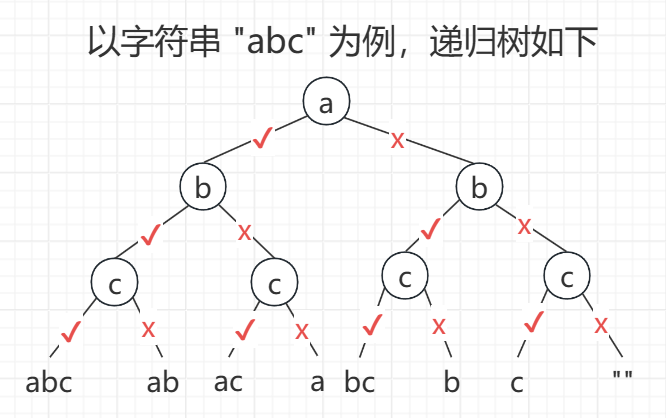
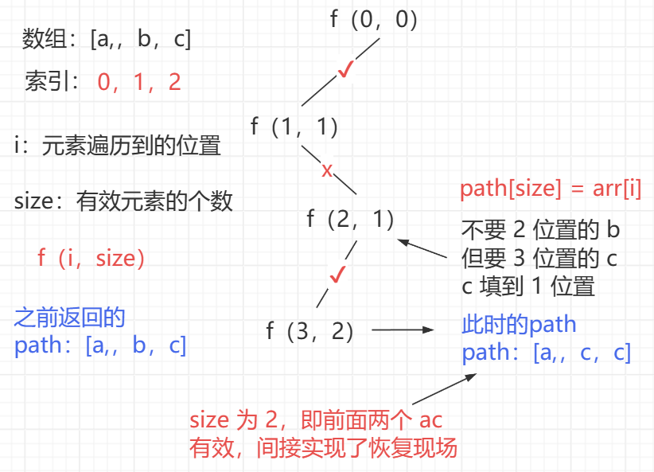
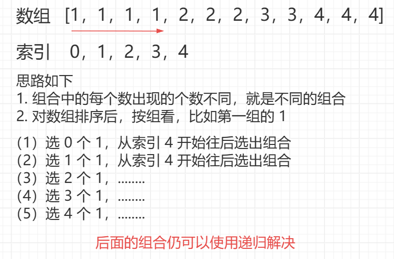
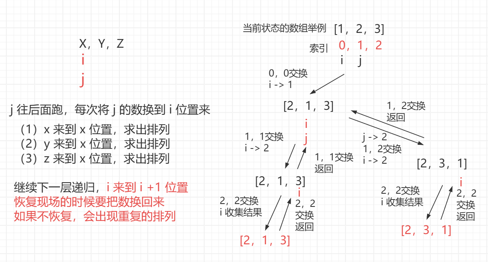
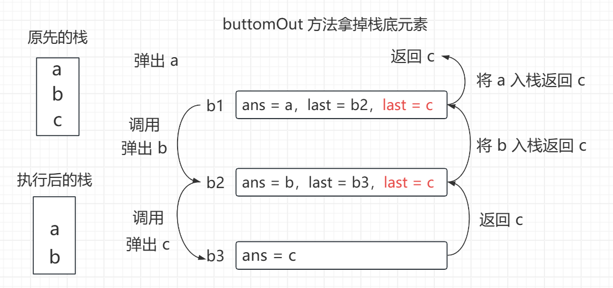
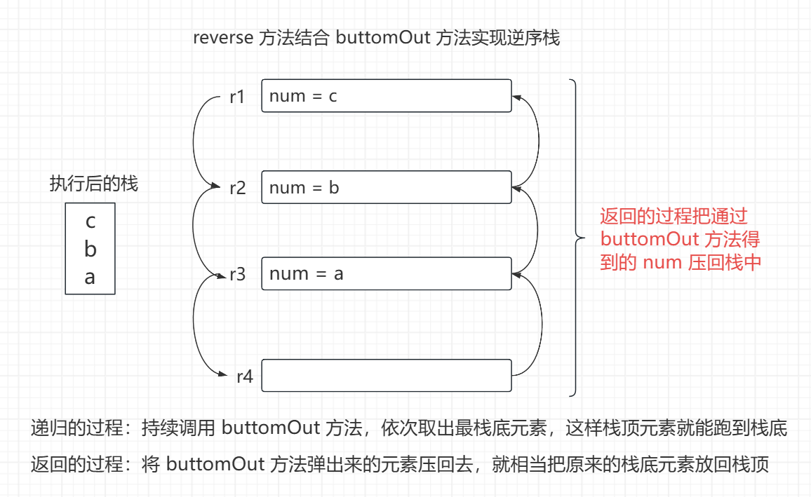
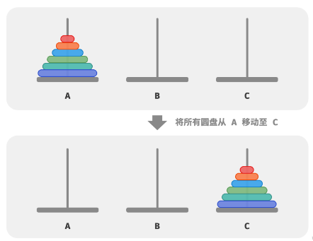

<h1 style="text-align: center; font-weight: bold;">经典递归过程解析</h1>

---

## 预备内容

### 路径与递归

> #### <span style="color:red">带路径的递归 vs 不带路径的递归</span>（大部分 dp，状态压缩 dp 认为是路径简化了结构，dp 专题后续讲述）
>
> #### 任何递归都是 dfs 且非常灵活。回溯这个术语并不重要

### 传值方式

> #### 值传递：在递归中可以理解为值得<span style="color:red">副本拷贝</span>，并不会改变值
>
> #### 引用传递：引用传递传递的是地址，指向的是同一份空间，会影响值

## 字符串的全部子序列

### 题目链接

> #### https://www.nowcoder.com/practice/92e6247998294f2c933906fdedbc6e6a

### 思路分析

> #### 每个位置都分<span style="color:red">要和不要两种情况</span>，子序列的总个数：<span style="color:red">2<sup>n</sup></span>
>
> #### 沿途收集路径，如果要回到上一个状态，需要<span style="color:red">恢复现场</span>（回溯），再走下一个状态

<br/>


### 写法一

> #### 经典递归写法，递归沿途收集路径，如果需要回到上一个状态，<span style="color:red">恢复现场</span>（回溯）
>
> #### 利用 HashSet 存储路径，同时实现去重

```java
import java.util.*;

public class Solution {
    // 题目是 String s，这里改成 str
    public String[] generatePermutation(String str) {
        char[] s = str.toCharArray();
        HashSet<String> set = new HashSet<>();
        // 将容器作为递归参数传递，可以复用空间
        traversal(s, 0, new StringBuilder(), set);
        String[] ans = new String[set.size()];
        int i = 0;
        for (String cur : set) {
            ans[i++] = cur;
        }
        return ans;
    }

    public void traversal(char[] s, int i, StringBuilder path, HashSet<String> set) {
        if (i == s.length) {
            set.add(path.toString());
        } else {
            path.append(s[i]);
            traversal(s, i + 1, path, set);
            // 恢复现场
            path.deleteCharAt(path.length() - 1);
            traversal(s, i + 1, path, set);
        }
    }
}
```

### 写法二

> #### 更优雅的实现，将数组作为递归参数传递，不断复用同一份空间，节省了空间开销
>
> #### 变量 i 表示当前遍历到的位置， size 表示 path 中填了多少个，即控制有效元素的个数
>
> #### 通过数组的复用和 i 变量，以及 size 控制有效元素的个数，在递归的过程中可以实现元素擦除，后面的元素会覆盖前面的元素，间接实现了恢复现场，无需手动控制

<br/>

<br/>

```java
import java.util.*;

public class Solution {
    // 题目是 String s，这里改成 str
    public String[] generatePermutation(String str) {
        char[] s = str.toCharArray();
        HashSet<String> set = new HashSet<>();
        // 将容器作为递归参数传递，可以复用空间
        traversal(s, 0, new char[s.length], 0, set);
        String[] ans = new String[set.size()];
        int i = 0;
        for (String cur : set) {
            ans[i++] = cur;
        }
        return ans;
    }

    public void traversal(char[] s, int i, char[] path, int size, HashSet<String> set) {
        if (i == s.length) {
            set.add(String.valueOf(path, 0, size));
        } else {
            // 通过 size 控制来有效的元素
            path[size] = s[i];
            traversal(s, i + 1, path, size + 1, set);
            traversal(s, i + 1, path, size, set);
        }
    }
}
```

### 复杂度分析

> #### 时间复杂度：O（2<sup>n</sup> \* n），子序列的个数：2<sup>n</sup>，每个子序列都要生成出来，平均长度算为 n

## 数组的全部组合（去重）

### 题目链接

> #### https://leetcode.cn/problems/subsets-ii/
>
> #### 给你一个整数<span style="color:red">数组 nums</span> ，其中可能<span style="color:red">包含重复元素</span>，请你返回该数组所有可能的组合
>
> #### 答案<span style="color:red">不能</span>包含<span style="color:red">重复</span>的组合。返回的答案中，组合可以按 任意顺序排列
>
> #### 注意其实要求返回的不是子集，因为子集一定是不包含相同元素的，要返回的其实是<span style="color:red">不重复的组合</span>，比如输入：nums = [1,2,2]，输出：[[],[1],[1,2],[1,2,2],[2],[2,2]]

### 思路分析

> #### 如何区分不同的组合？组合中的<span style="color:red">每个数出现的个数不同</span>，就是不同的组合
>
> #### 可以先<span style="color:red">对数组排序</span>，这个操作并不会影响组合的个数

<br/>


### 代码实现

```java
class Solution {
    public List<List<Integer>> subsetsWithDup(int[] nums) {
        List<List<Integer>> ans = new ArrayList<>();
        Arrays.sort(nums);
        // 作为参数递归传递可以实现空间复用
        traversal(nums, 0, new int[nums.length], 0, ans);
        return ans;
    }

    public static void traversal(int[] nums, int i, int[] path, int size, List<List<Integer>> ans) {
        if (i == nums.length) {
            ArrayList<Integer> cur = new ArrayList<>();
            for (int j = 0; j < size; j++) {
                cur.add(path[j]);
            }
            ans.add(cur);
        } else {
            // 退出循环时，j 来到下一组的第一个数的位置
            int j = i + 1;
            while (j < nums.length && nums[i] == nums[j]) {
                j++;
            }
            // 通过 size 控制要几个当前组的数
            // 当前组的数要 0 个，从 j 位置开始继续递归求出组合
            traversal(nums, j, path, size, ans);
            // 当前组的数要 1 个，2 个，3 个... 每个情况都尝试一遍
            for (; i < j; i++) {
                path[size++] = nums[i];
                traversal(nums, j, path, size, ans);
            }
        }
    }
}
```

### 复杂度分析

> #### 为什么<span style="color:red">分组</span>可以达到<span style="color:red">剪枝</span>的效果？对当前组每次选 0 个数，1 个数......
>
> #### 这个过程就是<span style="color:red">人为的控制当前组递归的过程</span>，进而达到了剪枝的目的，而不是每遇到一个数都去展开，分情况讨论要和不要去求组合
>
> #### 例如：1 1 1 1 2 3 4 这个序列，前面有四个 1，若不剪枝，都要讨论要和不要的情况，相当于 2<sup>4</sup> 的展开，而人为的控制分组，四个 1 这一组就只有五种情况，要 0 个 1，要 1 个 1......大大减少了不必要的递归，优化了时间
>
> #### 如果每一组的数出现多次，通过人为的分组控制递归的过程，是有利于优化实践复杂度的
>
> #### 最差的情况，每个数都出现了一次，那每个数都是<span style="color:red">选和不选两种</span>情况，类似递归过程的二叉树那样展开
>
> #### 时间复杂度：O（2<sup>n</sup> \* n），每个数都是<span style="color:red">选和不选两种</span>情况，意思就是等价于求子序列的过程，子序列的个数：2<sup>n</sup>，每个子序列都要生成出来，平均长度算为 n

## 数组的全部排列

### 题目链接

> #### https://leetcode.cn/problems/permutations

### 思路分析

> #### 区别于组合，组合是每个位置的数<span style="color:red">要和不要</span>两种情况
>
> #### 对于排列，该位置之后包括当前位置的数字都要在当前位置都要出现一次，如下图解

<br/>


#### 以上图解过程

```java
for (int j = i; j < nums.length; j++) {
    swap(nums, i, j);
    traverse(nums, i + 1, ans);
    swap(nums, i, j);
}
```

### 代码实现

```java
public class Solution {
    public List<List<Integer>> permuteUnique(int[] nums) {
        List<List<Integer>> ans = new ArrayList<>();
        traverse(nums, 0, ans);
        return ans;
    }

    public void traverse(int[] nums, int i, List<List<Integer>> ans) {
        if (i == nums.length) {
            List<Integer> cur = new ArrayList<>();
            for (int num : nums) {
                cur.add(num);
            }
            ans.add(cur);
        } else {
            for (int j = i; j < nums.length; j++) {
                swap(nums, i, j);
                traverse(nums, i + 1, ans);
                swap(nums, i, j);
            }
        }
    }

    public void swap(int[] nums, int i, int j) {
        int temp = nums[i];
        nums[i] = nums[j];
        nums[j] = temp;
    }
}
```

### 复杂度分析

> #### 时间复杂度：O（n！ \* n），排列的个数：n！，每个排列都要生成出来，平均长度算为 n

## 数组的全部排列（去重）

### 题目链接

> #### https://leetcode.cn/problems/permutations-ii/

### 思路分析

> #### 思路和上体类似，需要保证<span style="color:red">每次换到 i 位置的数都是不同的</span>，这里可以使用 HashSet 去重，递归前判断一下

### 代码实现

```java
class Solution {
    public List<List<Integer>> permuteUnique(int[] nums) {
        List<List<Integer>> ans = new ArrayList<>();
        traverse(nums, 0, ans);
        return ans;
    }

    public void traverse(int[] nums, int i, List<List<Integer>> ans) {
        if (i == nums.length) {
            List<Integer> cur = new ArrayList<>();
            for (int num : nums) {
                cur.add(num);
            }
            ans.add(cur);
        } else {
            HashSet<Integer> hashSet = new HashSet<>();
            for (int j = i; j < nums.length; j++) {
                // 每次换到 i 位置的数都是不同的，实现去重
                // 每遍历一个数就放到 set 中，后续判断是否出现过
                // 如果当前遍历的数 set 中已经存在，说明是重复的数值
                if (!hashSet.contains(nums[j])) {
                    hashSet.add(nums[j]);
                    swap(nums, i, j);
                    traverse(nums, i + 1, ans);
                    swap(nums, i, j);
                }
            }
        }
    }

    public void swap(int[] nums, int i, int j) {
        int temp = nums[i];
        nums[i] = nums[j];
        nums[j] = temp;
    }
}
```

## 递归函数逆序栈

### 思路分析

> #### 时间复杂度：O（n<sup>2</sup>）

<br/>

<br/>


### 代码实现

```java
import java.util.Stack;

public class Main {

    public static void reverse(Stack<Integer> stack) {
        if (stack.isEmpty()) {
            return;
        }
        // 依次取出栈底元素，栈空了，要返回
        // 返回的过程中将原来拿到的栈底元素压回去
        // 相当于把栈底元素放到了栈顶，实现了逆序
        int num = buttomOut(stack);
        reverse(stack);
        stack.push(num);
    }

    public static int buttomOut(Stack<Integer> stack) {
        // 栈顶到栈底元素 a b c 为例
        int ans = stack.pop();
        if (stack.isEmpty()) {
            // 拿完了 c，栈空，返回 c
            return ans;
        } else {
            int last = buttomOut(stack);
            // 把当时弹出的元素押回去
            // 同时接收到返回的 c，一直向上返回
            stack.push(ans);
            return last;
        }
    }

    public static void main(String[] args) {
        Stack<Integer> stack = new Stack<Integer>();
        stack.push(1);
        stack.push(2);
        stack.push(3);
        stack.push(4);
        stack.push(5);
        // 原先从栈顶到栈底   5 4 3 2 1
        // 逆序后从栈顶到栈底 1 2 3 4 5
        // 依次弹出栈顶元素   1 2 3 4 5
        reverse(stack);
        while (!stack.isEmpty()) {
            System.out.println(stack.pop());
        }
    }
}
```

## 递归函数排序栈

### 题目要求

> #### 请完成无序栈的排序，要求排完序之后，<span style="color:red">从栈顶到栈底从小到大</span>
>
> #### <span style="color:red">只能</span>使用栈提供的 <span style="color:red">push、pop、isEmpty</span> 三个方法、以及递归函数
>
> #### 除此之外不能使用任何的容器，数组也不行

### 思路分析

> #### 时间复杂度：O（n<sup>2</sup>）
>
> #### 首先统计栈的深度，记为 deep，统计最大值出现的次数，记为 k
>
> #### 然后在 deep 层这个范围内找到最大值，将所有最大值沉底
>
> #### 由于最大值沉底了，这部分排好序了，下一轮可以不用管
>
> #### 下一轮在 deep - k 层这个范围内找最大值，沉底，如此往复，从栈底到栈顶就是逐渐减小的，即从栈顶到栈底是从小到大排列的，这样就可以实现排序

### 代码实现

```java
import java.util.Stack;

public class Main {

    public static void sort(Stack<Integer> stack) {
        int deep = deep(stack);
        while (deep > 0) {
            // 找到最大值
            int max = max(stack, deep);
            // 最大值出现的次数
            int k = times(stack, deep, max);
            // 将所有最大值沉底
            down(stack, deep, max, k);
            // 最大值占用了 k 层
            // 下一轮在 deep - k 层继续找最大，沉底
            // 依次往复，这样就可以实现栈排序
            deep -= k;
        }
    }

    public static int deep(Stack<Integer> stack) {
        if (stack.isEmpty()) {
            return 0;
        }
        int num = stack.pop();
        int deep = deep(stack) + 1;
        stack.push(num);
        return deep;
    }

    // 从栈当前的顶部开始，往下数 deep 层
    // 返回这 deep 层里的最大值
    public static int max(Stack<Integer> stack, int deep) {
        if (deep == 0) {
            return Integer.MIN_VALUE;
        }
        int num = stack.pop();
        int restMax = max(stack, deep - 1);
        int max = Math.max(num, restMax);
        stack.push(num);
        return max;
    }

    // 从栈当前的顶部开始，往下数 deep 层，已知最大值 max
    // 返回 max 出现了几次，不改变栈中元素的相对次序
    public static int times(Stack<Integer> stack, int deep, int max) {
        if (deep == 0) {
            return 0;
        }
        int num = stack.pop();
        int restTimes = times(stack, deep - 1, max);
        // 总出现次数 = 底下层的出现次数 + 当前层出现次数
        int times = restTimes + (num == max ? 1 : 0);
        stack.push(num);
        return times;
    }

    // 从栈当前的顶部开始往下数 deep 层，已知最大值 max，出现了 k 次
    // 请把这 k 个最大值沉底，剩下的数保持相对次序不变放回栈中
    public static void down(Stack<Integer> stack, int deep, int max, int k) {
        if (deep == 0) {
            // 递归到最底层，把 max 压入
            // 返回的时候把原来的元素压回去
            // 实现了将最大元素沉底的操作
            for (int i = 0; i < k; i++) {
                stack.push(max);
            }
        } else {
            int num = stack.pop();
            down(stack, deep - 1, max, k);
            // 递归前取出来了，返回的时候压回去
            // 由于递归是一层一层往下，返回是从下往上返回
            // 类似栈的结构，后面取出的元素先压回，可以维持相对次序
            if (num != max) {
                stack.push(num);
            }
        }
    }

    // 为了测试
    // 生成随机栈
    public static Stack<Integer> randomStack(int n, int v) {
        Stack<Integer> ans = new Stack<Integer>();
        for (int i = 0; i < n; i++) {
            ans.add((int) (Math.random() * v));
        }
        return ans;
    }

    // 为了测试
    // 检测栈是不是从顶到底依次有序
    public static boolean isSorted(Stack<Integer> stack) {
        int step = Integer.MIN_VALUE;
        while (!stack.isEmpty()) {
            if (step > stack.peek()) {
                return false;
            }
            step = stack.pop();
        }
        return true;
    }

    // 为了测试
    public static void main(String[] args) {
        Stack<Integer> test = new Stack<Integer>();
        test.add(1);
        test.add(5);
        test.add(4);
        test.add(5);
        test.add(3);
        test.add(2);
        test.add(3);
        test.add(1);
        test.add(4);
        test.add(2);
        sort(test);
        while (!test.isEmpty()) {
            System.out.println(test.pop());
        }

        // 随机测试
        int N = 20;
        int V = 20;
        int testTimes = 20000;
        System.out.println("测试开始");
        for (int i = 0; i < testTimes; i++) {
            int n = (int) (Math.random() * N);
            Stack<Integer> stack = randomStack(n, V);
            sort(stack);
            if (!isSorted(stack)) {
                System.out.println("出错了!");
                break;
            }
        }
        System.out.println("测试结束");
    }
}
```

## 汉诺塔问题

### 问题背景

> #### 三根柱子 A、B、C，柱子上有大小不同的圆盘，初始时所有圆盘在 A 柱子上
>
> #### 需要将所欲圆盘从 A 柱子移动到 C 柱子，且移动过程中必须满足大圆盘在小圆盘的下面
>
> #### 给定圆盘 n，打印将所有圆盘从 A 柱子移动到 C 柱子的移动过程

<br/>


### 思路分析

> #### 递归思想：一个问题可以拆分成一个简单的问题和一个复杂问题
>
> #### 设置 from，为起始柱，to 为目标柱，other 为中间柱三个参数
>
> #### 将上面的 n - 1 个圆盘看做整体，视为一个复杂的问题，最底层的圆盘看作一个简单的问题
>
> #### 移动思路：将上面的 n - 1 个圆盘从 from 柱移动到 other 柱，将最底层的圆盘从 from 柱移动到 to 柱，将 n - 1 个圆盘从 other 柱移动到 to 柱（可以类比两个圆盘的情况理解）
>
> #### 而上面的 n -1 个圆盘这个复杂的问题，如何从 from 柱移动到 other 柱子呢，又可以复用递归的思想
>
> #### 将上面的 n - 2 个圆盘从 from 柱移动到 other 柱，将第 n - 1 个圆盘从 from 柱移动到 to 柱，将 n - 2 个圆盘从 other 柱移动到 to 柱......

### 代码实现

```java
// 打印n层汉诺塔问题的最优移动轨迹
public class Code07_TowerOfHanoi {

	public static void hanoi(int n) {
		if (n > 0) {
			f(n, "左", "右", "中");
		}
	}

	public static void f(int i, String from, String to, String other) {
        // 只有一个圆盘
		if (i == 1) {
			System.out.println("移动圆盘 1 从 " + from + " 到 " + to);
		} else {
            // from 左边的柱子，other 中间的柱子，to 右边的柱子
			f(i - 1, from, other, to);
			System.out.println("移动圆盘 " + i + " 从 " + from + " 到 " + to);
			f(i - 1, other, to, from);
		}
	}

	public static void main(String[] args) {
		int n = 3;
		hanoi(n);
	}

}
```

### 移动次数

> #### 给定 n 个圆盘，将所有圆盘从 A 柱子移动到 C 柱子所需要的移动次数：<span style="color:red">2 <sup>n</sup> - 1</span>
>
> #### 将上面的 n - 1 个圆盘从 from 柱子移动到 other 柱子：f（n - 1）
>
> #### 将最底层的圆盘从 from 柱子移动到 to 柱子：1
>
> #### 将 n - 1 个圆盘从 other 柱子移动到 to 柱子：f（n - 1）
>
> #### 总过程：f（n） = f（n - 1） + 1 + f（n - 1） = <span style="color:red">2 \* f（n - 1） + 1</span>
>
> #### 根据数学递推关系可以得到通项公式为 <span style="color:red">2 <sup>n</sup> - 1</span>
