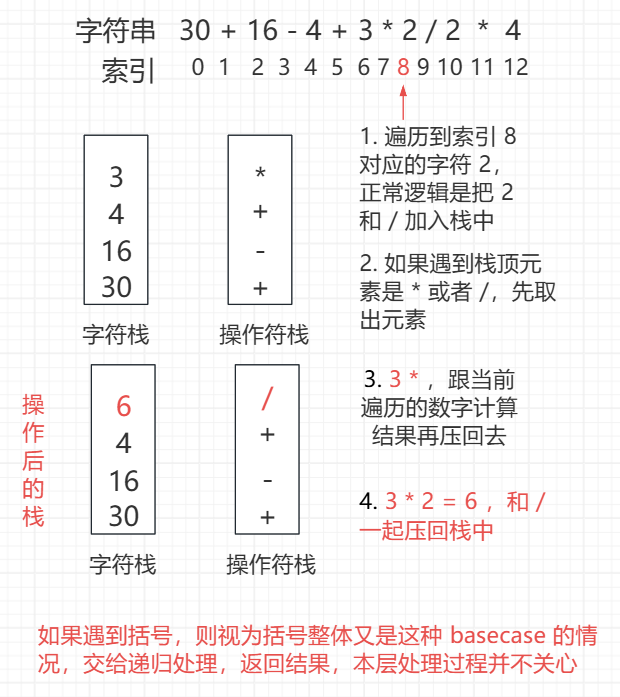

<h1 style="text-align: center; font-weight: bold;">嵌套类问题递归解析</h1>

---

## 解题套路

### 大概过程

> #### 定义全局变量 int where
>
> #### 递归函数 f（i） : s[i..]，从 i 位置出发开始解析，遇到<span style="color:red">字符串终止</span>或<span style="color:red">嵌套条件终止</span>就返回
>
> #### 返回值是 f（i）负责这一段的结果
>
> #### f（i）在返回前更新全局变量 where，让上级函数通过 where 知道解析到了什么位置，进而继续

### 执行细节

> #### 如果 f（i）遇到嵌套条件的开始，就调用下级递归去处理嵌套，下级会负责嵌套部分的计算结果
>
> #### f（i）下级处理完成后，f（i）可以根据下级更新的全局变量 where，知道该从什么位置继续解析

## 表达式求值

### 题目链接

> #### https://www.nowcoder.com/practice/c215ba61c8b1443b996351df929dc4d4

### 思路分析

<br/>


### 代码实现

```java
import java.util.*;

public class Solution {
    // 记录遍历位置，下级函数递归处理完子过程后
    // 需要更新 where 的值，返回上级函数，目的是
    // 让上级函数通过 where 知道解析到了什么位置
    // 在当前处理的位置开始继续后续的递归过程处理
    public static int where;

    // 原来是 String s，这里改成 str
    public int solve(String str) {
        where = 0;
        return traversal(str.toCharArray(), 0);
    }

    // s[i....]开始计算，遇到字符串终止 或者 遇到)停止
    // 返回 : 自己负责的这一段，计算的结果
    // 返回之间，更新全局变量where，为了上游函数知道从哪继续！
    public int traversal(char[] s, int i) {
        int cur = 0;
        // 用数组来模拟栈，操作上更加便捷
        ArrayList<Integer> numbers = new ArrayList<>();
        ArrayList<Character> ops = new ArrayList<>();
        while (i < s.length && s[i] != ')') {
            // 遇到数字，就计算一下值
            // 因为是一位一位遍历的，在原基础上累加
            // 例如 56，第一次 5，第二次 5 * 10 + 6 = 56
            if (s[i] >= '0' && s[i] <= '9') {
                cur = cur * 10 + s[i++] - '0';
            } else if (s[i] != '(') {
                // 没有遇到数字，有没有遇到右括号
                // 那就是遇到了运算符 + - * /
                // 如果是 + 或者 - 则将数字和后面跟的符号同步压入栈中
                // 如果是 * 或者 / 则将其弹出，并计算结果再压入栈中
                push(numbers, ops, cur, s[i++]);
                // 清空，继续下一轮遍历
                cur = 0;
            } else {
                // i 遇到了左括号 (
                // 交给下一层递归解析返回结果，本层递归并不关心
                cur = traversal(s, i + 1);
                // 子过程调用完成后会更新 where，子过程返回
                // 返回时告诉本层递归 i 遍历到那里了，继续处理
                // 即 i 从 where + 1 开始继续处理后续的字符
                i = where + 1;
            }
        }
        // 遍历到终止位置，最后一个数可能每加入栈中
        // 例如：3 + (5 * 2) + 17，遍历到终止位置，cur = 17
        // 数字和符号是同步入栈的，最后就剩余 17 了
        // 但是 17 还没有加入栈中
        // 默认后面补一个 '+'，数字和符号同步入栈
        push(numbers, ops, cur, '+');
        // 本层递归跑完，更新 where
        where = i;
        return compute(numbers, ops);
    }

    public void push(ArrayList<Integer> numbers, ArrayList<Character> ops, int cur, char op) {
        int n = numbers.size();
        // 栈为空或者栈顶的运算符是 + 或者 - 直接加
        if (n == 0 || ops.get(n - 1) == '+' || ops.get(n - 1) == '-') {
            // 数字，其对应的运算符同步压入
            numbers.add(cur);
            ops.add(op);
        } else {
            // 遇到 * 或者 /，把结果处理完后压回去
            // 使得最后只剩徐 + 或者 - 运算
            int topNumber = numbers.get(n - 1);
            char topOp = ops.get(n - 1);
            if (topOp == '*') {
                numbers.set(n - 1, topNumber * cur);
            } else {
                numbers.set(n - 1, topNumber / cur);
            }
            ops.set(n - 1, op);
        }
    }

    public int compute(ArrayList<Integer> numbers, ArrayList<Character> ops) {
        // push 方法已经处理了遇到 * 或者 / 的情况，会取出计算结果再压入栈中
        // 最后栈中只会剩余 + 或者 - 两种符号，计算结果即可
        int n = numbers.size();
        int ans = numbers.get(0);
        // i 从 1 开始，即能取到该位置对应的符号，又能取到下一个需要运算的值
        for (int i = 1; i < n; i++) {
            ans += ops.get(i - 1) == '+' ? numbers.get(i) : -numbers.get(i);
        }
        return ans;
    }
}
```

## 字符串解码

### 题目链接

> #### https://leetcode.cn/problems/decode-string/

### 思路分析

> #### 本题跟上题的思路类似，延续解决嵌套递归问题的解题套路
>
> #### 遇到括号，交给递归处理，本层并不关心，最后把字符串对应的数字传入 get 函数，返回字符串加入到 结果集中

### 代码实现

```java
class Solution {

    // 记录遍历到哪里
    public static int where;

    public String decodeString(String str) {
        where = 0;
        return traversal(str.toCharArray(), 0);
    }

    // 返回自己负责的这一段字符串的结果
    // 返回之前更新全局变量 where，为了让上游函数直到从哪里继续
    public String traversal(char[] s, int i) {
        StringBuilder path = new StringBuilder();
        int cnt = 0;
        while (i < s.length && s[i] != ']') {
            // 遍历到字母
            if ((s[i] >= 'a' && s[i] <= 'z') || (s[i] >= 'A' && s[i] <= 'Z')) {
                path.append(s[i++]);
            } else if (s[i] >= '0' && s[i] <= '9') {
                // 遍历到数字，计算
                cnt = cnt * 10 + s[i++] - '0';
            } else {
                // 遍历到 [
                // 例如遇到 7 [?]，? 的内容就由递归来返回
                // 然后把对应份数的结果加入 path 中
                path.append(get(cnt, traversal(s, i + 1)));
                i = where + 1;
                // 这一组结束，清空，继续遍历后续字符
                cnt = 0;
            }
        }
        where = i;
        return path.toString();
    }

    // 获取字符串和字符串前的 cnt，生成字符串返回，拼接到结果集中
    public String get(int cnt, String str) {
        StringBuilder builder = new StringBuilder();
        for (int i = 0; i < cnt; i++) {
            builder.append(str);
        }
        return builder.toString();
    }
}
```

## 分子式求原子数量

### 题目链接

> #### https://leetcode.cn/problems/number-of-atoms/

### 思路分析

> #### 最后的结果是按照字典序返回的，可以用 <span style="color:red">TreeMap</span> 实现，默认按字典序从小到大
>
> #### 遍历过程中可能会遇到：大写、小写字母、数字、左括号 （ 、右括号 ），右括号 ）并不关心，因为遇到右括号 ）的时候意味着递归该返回了，<span style="color:red">重点关注大写字母，左括号</span>
>
> #### 建立一个历史的概念，有 name 这个字段和一张表，name 字段是对应遍历到字母的情况，表是对应遍历到括号的情况，一旦遇到括号，交给递归处理，处理完后将这个子过程的信息存在表中并返回
>
> #### 一旦<span style="color:red">遇到大写字母，左括号</span>，意味着<span style="color:red">旧的历史要清算，新的统计要开始</span>

### 代码实现

```java
class Solution {

    // 记录遍历放到哪里
    public static int where;

    public String countOfAtoms(String str) {
        where = 0;
        TreeMap<String, Integer> map = traversal(str.toCharArray(), 0);
        StringBuilder ans = new StringBuilder();
        for (String key : map.keySet()) {
            ans.append(key);
            int cnt = map.get(key);
            if (cnt > 1) {
                ans.append(cnt);
            }
        }
        return ans.toString();
    }

    // s[i....]开始计算，遇到字符串终止 或者 遇到 ) 停止
    // 返回 : 自己负责的这一段字符串的结果，有序表！
    // 返回之间，更新全局变量where，为了上游函数知道从哪继续！
    public TreeMap<String, Integer> traversal(char[] s, int i) {
        // ans 是总表
        TreeMap<String, Integer> ans = new TreeMap<>();

        /*
         * 这里引入一个历史的概念
         * name ：表示遍历到字母，需要记录
         * map  ：表示遍历到括号，括号这个整体由递归处理
         *        递归返回的结果回记录再 map 中
         * 本层会以历史的记录更新结果集，然后继续向后遍历字符
         */

        // 之前收集的字母，历史的一部分
        StringBuilder name = new StringBuilder();
        // 之前收集的表，即遇到了括号，递归子过程返回的结果，历史的一部分
        TreeMap<String, Integer> pre = null;
        // 历史翻几倍
        int cnt = 0;
        // 遍历过程中会遇到 大写、小写字母、数字、左括号、右括号
        // 右括号我们并不关心，遇到右括号说明递归该返回了
        // 重点关注大写字母和左括号，这意味着旧的历史清算，新的统计开始
        // 分三类处理（1）大写字母、左括号（2）小写字母（3）数字
        while (i < s.length && s[i] != ')') {
            // 如果遇到大写字母或者左括号
            // 意味着旧的历史清算，新的统计开始
            if (s[i] >= 'A' && s[i] <= 'Z' || s[i] == '(') {
                fill(ans, name, pre, cnt);
                // 新的统计开始，重置变量的值
                name.setLength(0);
                pre = null;
                cnt = 0;
                if (s[i] >= 'A' && s[i] <= 'Z') {
                    name.append(s[i++]);
                } else {
                    pre = traversal(s, i + 1);
                    i = where + 1;
                }
            } else if (s[i] >= 'a' && s[i] <= 'z') {
                name.append(s[i++]);
            } else {
                cnt = cnt * 10 + s[i++] - '0';
            }
        }
        // 遍历到结束位置，需要把最后一个位置的字符填入
        fill(ans, name, pre, cnt);
        where = i;
        return ans;
    }

    public void fill(TreeMap<String, Integer> ans, StringBuilder name, TreeMap<String, Integer> pre, int cnt) {
        // 历史中有内容
        if (name.length() > 0 || pre != null) {
            // 跑到下一个位置，之前的历史清空，cnt = 0，新的统计开始
            // 也就是说 cnt = 0 的时候已经来到了下一个位置
            // 此时的字符个数是 1 个
            cnt = cnt == 0 ? 1 : cnt;
            if (name.length() > 0) {
                String key = name.toString();
                ans.put(key, ans.getOrDefault(key, 0) + cnt);
            } else {
                for (String key : pre.keySet()) {
                    // 如果是表，则要对整体翻倍，所以要 * cnt
                    ans.put(key, ans.getOrDefault(key, 0) + pre.get(key) * cnt);
                }
            }
        }
    }
}
```
