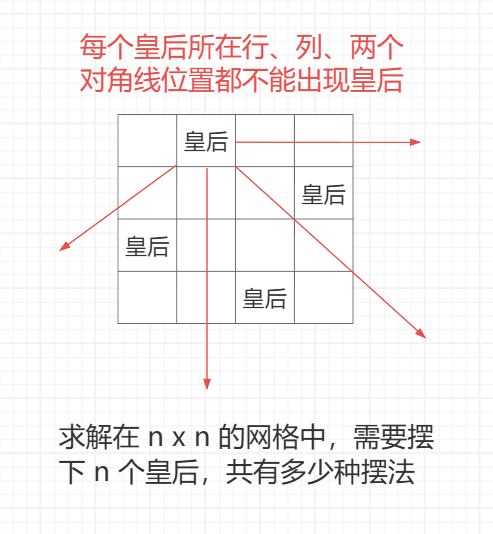

<h1 style="text-align: center; font-weight: bold;">N皇后问题（位运算）</h1>

---

## 问题背景



## 统计方案数

### 题目链接

> #### https://leetcode.cn/problems/n-queens-ii/description/

### 思路分析

#### （1）递归实现

> #### 在第一行的第 1 个位置放置皇后，以此为基础，之后在第 2 - n-1 行中的每一列都尝试一遍，看摆放皇后是否合法
>
> #### 在第一行的第 2 个位置放置皇后，以此为基础，之后在第 2 - n-1 行中的每一列都尝试一遍，看摆放皇后是否合法
>
> #### .....
>
> #### 直到第一行每一个位置都尝试了的情况下，下面所有行的所有列都尝试过了，整个过程结束

#### （2）位运算实现

> #### int 类型有 32 位，用每一个<span style="color:red">二进制位的状态</span>来表示是否可以摆放皇后
>
> #### 某一列放置了皇后，则该列对应的二进制位为 1，否则为 0
>
> #### col 表示<span style="color:red">列限制</span>，left 表示<span style="color:red">右上到左下</span>对角线的限制，right 表示<span style="color:red">左上到右下</span>对角线的限制，具体是如何限制的可以看代码注释解析
>
> #### 这三个变量的二进制位，都用 <span style="color:red">1</span> 表示<span style="color:red">不可以</span>放置皇后，<span style="color:red">0</span> 表示<span style="color:red">可以</span>放置皇后，那<span style="color:red">共同的限制</span>就是三个数做<span style="color:red">或运算</span>得到的结果
>
> #### int col : 0..i-1 行皇后放置的位置因为正下方向延伸的原因，哪些列不能再放皇后
>
> #### int left : 0..i-1 行皇后放置的位置因为左下方向延伸的原因，哪些列不能再放皇后
>
> #### int right : 0..i-1 行皇后放置的位置因为右下方向延伸的原因，哪些列不能再放皇后
>
> #### 根据 col、left、right，用位运算快速判断能放哪些列
>
> #### 把能放的列都尝试一遍，每次尝试修改 3 个数字表示当前的决策，后续返回的答案都累加返回
>
> #### 更多的思路和细节见代码注释......

### check 函数

> #### 每行放置一个皇后，到后面的行尝试所有情况，即逐行尝试每一列是否可以放置皇后，此时<span style="color:red">无需考虑皇后所在行是否合法</span>的情况
>
> #### 检查皇后两个<span style="color:red">对角线</span>的位置可以<span style="color:red">使用斜率</span>，这是<span style="color:red">很巧妙</span>的地方，如果<span style="color:red">斜率的绝对值相等</span>，则表示 45 度 135 度两个方向的对角线
>
> #### 新增 <span style="color:red">path 数组</span>，表示第 i 行的皇后放置在了第 j 列，即 path[i] = j
>
> #### <span style="color:red">检查皇后所在列</span>可以检查 path 数组，遍历每一行，如果当前行皇后所在列和之前的皇后所在列相等，则表示在同一列，不合法

### 递归实现

```java
class Solution {
    // 用数组表示路径实现的 N 皇后问题，不推荐
    public int totalNQueens(int n) {
        if (n < 1) {
            return 0;
        }
        return traversal(0, new int[n], n);
    }

    // i ：当前来到的行
    // path ： 记录 0 ... i-1 行的皇后都摆在了那些列
    // n ：几皇后问题
    // 0 ... i-1 行已经摆好了，返回 i ... n-1 行可以尝试的情况下还能找到几种有序的方法
    public int traversal(int i, int[] path, int n) {
        // 摆皇后是有前提的，如果可以递归到最后
        // 说明所有的皇后都可以摆放，这时就是一种方法，返回
        if (i == n) {
            return 1;
        }
        int ans = 0;
        // 当前来到第 i 行，尝试该行的每一个位置，即第 i 行的每一列
        // n * n 的网格，即 n 行 n 列
        for (int j = 0; j < n; j++) {
            if (check(path, i, j)) {
                // 皇后摆在第 i 行的第 j 列
                path[i] = j;
                ans += traversal(i + 1, path, n);
            }
        }
        return ans;
    }

    // 检查 （i，j） 位置是否可以摆放皇后，第 i 行，第 j 列
    public boolean check(int[] path, int i, int j) {
        // 只需要检查该皇后列和对角线，皇后所在行无需检查
        // 因为递归思路是每行摆一个皇后，到下一行开始尝试
        // 不同的情况，不存在同一行出现两个皇后的情况
        // 遍历皇后所在的列，坐标中也就是行的变化，遍历行
        for (int k = 0; k < i; k++) {
            // k ：0 ... k-1
            // 之前的行 ： k
            // 之前的列 ： path[k]
            // 在同一列或者对角线上就是不合法的
            // 对角线可以用斜率来判断，这是巧妙的地方
            if (j == path[k] || Math.abs(i - k) == Math.abs(j - path[k])) {
                return false;
            }
        }
        return true;
    }
}
```

### 位运算实现

```java
class Solution {
    // 位运算版本，常数时间极好，但是复杂度无法改变，仍是 O（n！）
    public int totalNQueens(int n) {
        if (n < 1) {
            return 0;
        }
        // n = 5
        // 1 << 5 = 0...100000 - 1
        // limit  = 0...011111
        // limit 表示几皇后，即皇后的规模
        int limit = (1 << n) - 1;
        return traversal(limit, 0, 0, 0);
    }

    // limit 表示几皇后问题，col 列限制
    // left  右上到左下的对角线限制
    // right 左上到右下的对角线限制
    public int traversal(int limit, int col, int left, int right) {
        // 如果相等说明每一列都摆了皇后，而摆皇后是有前提的
        // 能摆说明这些皇后是合法的，即这是一种摆放情况，返回
        if (col == limit) {
            return 1;
        }
        // 三者都用二进制位 0 表示可以放皇后，1 不可以放皇后
        // 三者做或运算的结果表示 --> 总限制
        int ban = col | left | right;
        // 对 ban 取反，即 1 表示可以放皇后，0 不可以放皇后
        // limit 表示几皇后问题，且对应的二进制位都是 1
        // 然而更高的二进制位是无效的，& 运算后高位的二进制为
        // 变为 0，则表示不能放置皇后，即 & 的目的就是取出那些
        // 有效的二进制位，这些二进制位为 1 的表示可以尝试放皇后
        // 即 candidate 表示可以哪些位置可以放置皇后
        int candidate = limit & (~ban);
        // 放置皇后的尝试
        int place = 0;
        // 一共有多少有效的方法
        int ans = 0;
        // 如果 candidate != 0 说明二进制位还有 1，可以放置皇后，继续尝试
        while (candidate != 0) {
            // Brian Kernighan 算法，提取出最右侧的 1 这个状态
            // 例如 0 0 0 1 1 0 --> 0 0 0 0 1 0
            // candidate ： 0 0 1 1 1 0
            //     index ： 5 4 3 2 1 0
            // 3 2 1 位置表示可以放置皇后
            // 那就每次提取出最右侧的 1
            // 而 1 表示可以放置皇后
            // 即 place 表示每一个可以尝试的位置
            place = candidate & (-candidate);

            // 二进制  0 0 1 1 1 0
            //   下标  5 4 3 2 1 0
            // 提取出最右侧的 1
            // place :
            // 0 0 0 0 1 0
            // candidate :
            // 0 0 1 1 0 0
            // 5 4 3 2 1 0
            // 尝试过了，该位要变成 0，表示不能放置皇后
            // 异或运算实现，异或运算：不同为 0，相同为 1
            candidate ^= place;

            // 哪些位的二进制位为 1，表示该二进制位对应的限制在这个
            // 二进制位的位置上不可以放置皇后，否则为 0 表示可以放置

            // col 列限制，如果某个位置为 1，表示该位置放置了皇后
            // 则该位置对应的列不可以放置皇后，这样达到限制的目的
            // place 表示可以尝试的位置，该位置要尝试，使用或运算实现将该二进制位置为 1

            // 两个注意点
            // （1）每次尝试都会走到下一行
            // （2）即若某个位置需要放置皇后，使用或运算将该二进制为置为 1 即可

            // left 表示从右上到左下的限制，left | place 表示原有的限制下，某个位置需要放置皇后
            // 整体的运算结果右移就表示放置新的皇后之后，新的限制
            // 如何理解？整体右移在列的体现上是走向低位的体现，然后右上到左下不正是左下方走向低位
            // 限制的这个趋势，对应上了

            // right 和 left 同理，这里不再赘述，过程是相反的

            // 上面的 candidate ^= place 表示本行已经尝试过了，现在需要到下一行继续尝试
            // 所以调用递归，同时把该位置尝试后新的限制传递给下一层
            ans += traversal(limit, col | place, (left | place) >> 1, (right | place) << 1);
        }
        return ans;
    }
}
```

## 输出放置方案

### 题目链接

> #### https://leetcode.cn/problems/n-queens/description/

### 思路分析

> #### 该题通过 path 数组记录了每一行的皇后放置在什么位置，遍历整个棋盘，做判断即可

### 递归实现

```java
import java.util.*;

class Solution {
    // 用数组表示路径实现的 N 皇后问题，不推荐
    public List<List<String>> solveNQueens(int n) {
        if (n < 1) {
            return new ArrayList<>();
        }
        List<List<String>> result = new ArrayList<>();
        int[] path = new int[n]; // path[i] 表示第 i 行的皇后在第几列
        traversal(0, path, n, result);
        return result;
    }

    // i ：当前来到的行
    // path ： 记录 0 ... i-1 行的皇后都摆在了那些列
    // n ：几皇后问题
    // result：用于收集所有解
    public void traversal(int i, int[] path, int n, List<List<String>> result) {
        // 摆皇后是有前提的，如果可以递归到最后
        // 说明所有的皇后都可以摆放，这时就是一种方法，构造解并加入结果
        if (i == n) {
            // 构建棋盘，记录此时的摆放情况
            List<String> board = new ArrayList<>();
            // 遍历每一行每一列，逐行加入 borad 中
            for (int row = 0; row < n; row++) {
                StringBuilder sb = new StringBuilder();
                for (int col = 0; col < n; col++) {
                    // 对于每一行的每一列判断，是否放置了皇后
                    // path[row] 表示 row 行的 path[row] 列放置了皇后
                    if (col == path[row]) {
                        sb.append('Q');
                    } else {
                        sb.append('.');
                    }
                }
                board.add(sb.toString());
            }
            result.add(board);
            return;
        }
        // 当前来到第 i 行，尝试该行的每一个位置，即第 i 行的每一列
        for (int j = 0; j < n; j++) {
            if (check(path, i, j)) {
                // 皇后摆在第 i 行的第 j 列
                path[i] = j;
                traversal(i + 1, path, n, result);
            }
        }
    }

    // 检查 （i，j） 位置是否可以摆放皇后，第 i 行，第 j 列
    public boolean check(int[] path, int i, int j) {
        // 只需要检查该皇后列和对角线，皇后所在行无需检查
        // 因为递归思路是每行摆一个皇后，到下一行开始尝试
        // 不同的情况，不存在同一行出现两个皇后的情况
        // 遍历皇后所在的列，坐标中也就是行的变化，遍历行
        for (int k = 0; k < i; k++) {
            // k ：0 ... k-1
            // 之前的行 ： k
            // 之前的列 ： path[k]
            // 在同一列或者对角线上就是不合法的
            // 对角线可以用斜率来判断，这是巧妙的地方
            if (j == path[k] || Math.abs(i - k) == Math.abs(j - path[k])) {
                return false;
            }
        }
        return true;
    }
}
```

## 时间对比测试

### 问题分析

> #### 位运算实现的版本<span style="color:red">常数时间极好</span>，大量优化了额常数时间，同时省去了很多数组寻址的过程
>
> #### <= 16 皇后问题，位运算版本在 10 s 内可以跑完，而递归版本要跑很久
>
> #### > 16 皇后问题，无论哪个版本都会跑很久，因为是 n！的增长

### 代码实现

```java
// N皇后问题
// 测试链接 : https://leetcode.cn/problems/n-queens-ii/
public class Test {

    // 用数组表示路径实现的N皇后问题，不推荐
    public static int totalNQueens1(int n) {
        if (n < 1) {
            return 0;
        }
        return f1(0, new int[n], n);
    }

    // i : 当前来到的行
    // path : 0...i-1行的皇后，都摆在了哪些列
    // n : 是几皇后问题
    // 返回 : 0...i-1行已经摆完了，i....n-1行可以去尝试的情况下还能找到几种有效的方法
    public static int f1(int i, int[] path, int n) {
        if (i == n) {
            return 1;
        }
        int ans = 0;
        // 0 1 2 3 .. n-1
        // i j
        for (int j = 0; j < n; j++) {
            if (check(path, i, j)) {
                path[i] = j;
                ans += f1(i + 1, path, n);
            }
        }
        return ans;
    }

    // 当前在i行、j列的位置，摆了一个皇后
    // 0...i-1行的皇后状况，path[0...i-1]
    // 返回会不会冲突，不会冲突，有效！true
    // 会冲突，无效，返回false
    public static boolean check(int[] path, int i, int j) {
        // 当前 i
        // 当列 j
        for (int k = 0; k < i; k++) {
            // 0...i-1
            // 之前行 : k
            // 之前列 : path[k]
            if (j == path[k] || Math.abs(i - k) == Math.abs(j - path[k])) {
                return false;
            }
        }
        return true;
    }

    // 用位信息表示路径实现的N皇后问题，推荐
    public static int totalNQueens2(int n) {
        if (n < 1) {
            return 0;
        }
        // n = 5
        // 1 << 5 = 0...100000 - 1
        // limit  = 0...011111;
        // n = 7
        // limit  = 0...01111111;
        int limit = (1 << n) - 1;
        return f2(limit, 0, 0, 0);
    }

    // limit : 当前是几皇后问题
    // 之前皇后的列影响：col
    // 之前皇后的右上 -> 左下对角线影响：left
    // 之前皇后的左上 -> 右下对角线影响：right
    public static int f2(int limit, int col, int left, int right) {
        if (col == limit) {
            // 所有皇后放完了！
            return 1;
        }
        // 总限制
        int ban = col | left | right;
        // ~ban : 1可放皇后，0不能放
        int candidate = limit & (~ban);
        // 放置皇后的尝试！
        int place = 0;
        // 一共有多少有效的方法
        int ans = 0;
        while (candidate != 0) {
            // 提取出最右侧的1
            // 0 0 1 1 1 0
            // 5 4 3 2 1 0
            // place :
            // 0 0 0 0 1 0
            // candidate :
            // 0 0 1 1 0 0
            // 5 4 3 2 1 0
            // place :
            // 0 0 0 1 0 0
            // candidate :
            // 0 0 1 0 0 0
            // 5 4 3 2 1 0
            // place :
            // 0 0 1 0 0 0
            // candidate :
            // 0 0 0 0 0 0
            // 5 4 3 2 1 0
            place = candidate & (-candidate);
            candidate ^= place;
            ans += f2(limit, col | place, (left | place) >> 1, (right | place) << 1);
        }
        return ans;
    }

    public static void main(String[] args) {
        int n = 14;
        long start, end;
        System.out.println("测试开始");
        System.out.println("解决" + n + "皇后问题");
        start = System.currentTimeMillis();
        System.out.println("方法1答案 : " + totalNQueens1(n));
        end = System.currentTimeMillis();
        System.out.println("方法1运行时间 : " + (end - start) + " 毫秒");

        start = System.currentTimeMillis();
        System.out.println("方法2答案 : " + totalNQueens2(n));
        end = System.currentTimeMillis();
        System.out.println("方法2运行时间 : " + (end - start) + " 毫秒");
        System.out.println("测试结束");

        System.out.println("=======");
        System.out.println("只有位运算的版本，才能10秒内跑完16皇后问题的求解过程");
        start = System.currentTimeMillis();
        int ans = totalNQueens2(16);
        end = System.currentTimeMillis();
        System.out.println("16皇后问题的答案 : " + ans);
        System.out.println("运行时间 : " + (end - start) + " 毫秒");
    }

}
```

## 复杂度分析

> #### 时间复杂度：O（n！）
>
> #### 每次是逐行放置皇后，所以不考虑皇后所在行的影响
>
> #### 第一行有 n 种尝试，忽略对角线的影响，只看同一列不能出现皇后，第二行有 n - 1 中尝试，依次类推，而所有的可能属于是相乘的关系
>
> #### n \* （n - 1） \* （n - 2） \* ... \* 1 = n！

## 更大的皇后问题？

> #### 目前能算出精确解数的 n 皇后问题，最大 n 为 27，其解数约为 234907967154122528
>
> #### 这个结果是依靠分布式计算集群 + 极致的位运算剪枝回溯算法，耗费大量时间得到的
>
> #### 对于 n=28 及以上的情况，哪怕是用超级计算机，也无法在可接受的时间内完成穷举计算
>
> #### 核心瓶颈在于
>
> #### （1）时间复杂度接近 n!，n 每增加 1，计算量会呈阶乘级暴涨
>
> #### （2）并行计算的节点通信开销、状态存储开销会随 n 增大急剧上升
