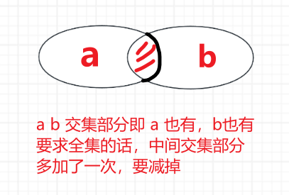

<h1 style="text-align: center; font-weight: bold;">最大公约数与同余定理</h1>

---

## gcd 最大公约数

### 基本介绍

> #### （1）<span style="color: red;">欧几里得</span>算法的过程 : <span style="color: red;">辗转相除法</span>
>
> #### （2）正确性的证明过程见代码注释部分，证明过程非常好懂，不过<span style="color: red;">直接记忆过程</span>即可
>
> #### （3）求 gcd（a，b），其中 <span style="color: red;">a > b</span>，<span style="color: red;">时间复杂度为 O（（log a）的 3 次方）</span>，时间复杂度证明略，这个复杂度足够好了
>
> #### （4）简单转化就可以求最小公倍数
>
> #### （5）更高效求<span style="color: red;">最大公约数</span>的 <span style="color: red;">Stein 算法</span>、由最大公约数扩展出的 “ <span style="color: red;">裴蜀定理</span> ” ，比赛同学有兴趣可以继续研究
>
> #### （6）不比赛的同学，哪怕你的目标是最顶级的公司应聘、还是考研，掌握这个只有一行的函数已经足够 ！

### 代码实现

```java
// 求最大公约数、最小公倍数
public class Code01_GcdAndLcm {

	// 证明辗转相除法就是证明如下关系：
	// gcd(a, b) = gcd(b, a % b)
	// 假设a % b = r，即需要证明的关系为：gcd(a, b) = gcd(b, r)

	// 证明过程：
	// 因为a % b = r，所以如下两个等式必然成立
	// 1) a = b * q + r，q为0、1、2、3....中的一个整数
	// 2) r = a − b * q，q为0、1、2、3....中的一个整数
	// 假设u是a和b的公因子，则有: a = s * u, b = t * u
	// 把a和b带入2)得到，r = s * u - t * u * q = (s - t * q) * u
	// 这说明 : u如果是a和b的公因子，那么u也是r的因子
	// 假设v是b和r的公因子，则有: b = x * v, r = y * v
	// 把b和r带入1)得到，a = x * v * q + y * v = (x * q + y) * v
	// 这说明 : v如果是b和r的公因子，那么v也是a的公因子
	// 综上，a和b的每一个公因子 也是 b和r的一个公因子，反之亦然
	// 所以，a和b的全体公因子集合 = b和r的全体公因子集合
	// 即gcd(a, b) = gcd(b, r)
	// 证明结束
	public static long gcd(long a, long b) {
		return b == 0 ? a : gcd(b, a % b);
	}
}
```

## lcm 最小公倍数

### 思路分析

> #### 有了最大公约数的基础，两个数任意一个数除以最大公约数 \* 另一个数就是最小公倍数
>
> #### 注意代码的写法，a \* b 可能会有溢出的风险，<span style="color: red;">强转为 long 类型，先除再乘</span>

### 代码实现

```java
// 求最大公约数、最小公倍数
public class Code01_GcdAndLcm {

	// 证明辗转相除法就是证明如下关系：
	// gcd(a, b) = gcd(b, a % b)
	// 假设a % b = r，即需要证明的关系为：gcd(a, b) = gcd(b, r)

	// 证明过程：
	// 因为a % b = r，所以如下两个等式必然成立
	// 1) a = b * q + r，q为0、1、2、3....中的一个整数
	// 2) r = a − b * q，q为0、1、2、3....中的一个整数
	// 假设u是a和b的公因子，则有: a = s * u, b = t * u
	// 把a和b带入2)得到，r = s * u - t * u * q = (s - t * q) * u
	// 这说明 : u如果是a和b的公因子，那么u也是r的因子
	// 假设v是b和r的公因子，则有: b = x * v, r = y * v
	// 把b和r带入1)得到，a = x * v * q + y * v = (x * q + y) * v
	// 这说明 : v如果是b和r的公因子，那么v也是a的公因子
	// 综上，a和b的每一个公因子 也是 b和r的一个公因子，反之亦然
	// 所以，a和b的全体公因子集合 = b和r的全体公因子集合
	// 即gcd(a, b) = gcd(b, r)
	// 证明结束
	public static long gcd(long a, long b) {
		return b == 0 ? a : gcd(b, a % b);
	}

	public static long lcm(long a, long b) {
		return (long) a / gcd(a, b) * b;
	}
}
```

## 第 N 个神奇数字

### 题目链接

> #### https://leetcode.cn/problems/nth-magical-number/description/

### 思路分析

> #### 本题用到 “ <span style="color: red;">二分答案法</span> ” 和 “ <span style="color: red;">容斥原理</span> ” 两个重要的算法，不过用的非常浅，之前没有接触过也能理解
>
> #### “ 二分答案法 ” 非常巧妙可以解决很多问题，整套内容会在后续的【必备】课程里做成专题视频讲述
>
> #### “ 容斥原理 ” 可以考的非常难，也会在后续的【扩展】课程里做成专题视频讲述
>
> #### 假设 a < b，如果不管 b，那 n \* a 就是第 n 个神奇数字，如果 b 加进来了，那就会缩小神奇数字的范围，则<span style="color: red;">边界就是 Math.min（a，b） \* n</span>
>
> #### 本题采用<span style="color: red;">二分答案</span>的思想，第 n 个神奇数字，就相当于在某个范围上统计神奇数字的个数，根据某个范围的神奇数字够不够 n 个来决定往哪个区间继续二分
>
> #### <span style="color: red;">容斥原理</span>的体现：在 0 - n 范围内，总有一部分数字既能被 a 整除，也能被 b 整除，这部分就是重复的，需要减去，重复部分的数字就是可以被 <span style="color: red;">lcm（a，b）</span> 整除的那些数字
>
> #### 则神奇的数字的个数为：<span style="color: red;">n / a + n / b - n / lcm（a, b）</span>
>
> #### 举例：1 - 10 范围内有多少个数字可以被 2 整除，<span style="color: red;">10 / 2 = 5 个</span>，分别是 2 4 6 8 10



### 代码分析

```java
class Solution {
    public int nthMagicalNumber(int n, int a, int b) {
        long lcm = lcm(a, b);
        long ans = 0;
        // l = 0
        // r = (long) n * Math.min(a, b)
        // l ... r 范围上二分，结合容斥原理
        // 若不考虑 b，则第 n 个神奇数字就是 (long) n * Math.min(a, b)
        // b 的加入会缩小第 n 个神奇数字所在的范围
        // 二分思想；某个范围符合够 n 个神奇数字，则范围的边界就是第 n 个神奇数字
        // 容斥原理：某个范围中总有一部分数字既能被 a 整除，也能被 b 整除，这部分就是重复的，需要减去
        for (long left = 0, right = (long) n * Math.min(a, b), mid = 0; left <= right;) {
            mid = (left + right) / 2;
            // 够 n 个，往左二分
            if (mid / a + mid / b - mid / lcm >= n) {
                // 记答案
                ans = mid;
                right = mid - 1;
            } else {
                // 否则往右二分
                left = mid + 1;
            }
        }
        return (int) (ans % 1000000007);
    }

    public long gcd(long a, long b) {
        return b == 0 ? a : gcd(b, a % b);
    }

    public long lcm(long a, long b) {
        return (long) a / gcd(a, b) * b;
    }
}
```

## 同余原理

### 应用场景

> #### 某个过程需要连续使用 <span style="color: red;">+ - \* /</span> 运算，由于结果可能非常大，所以需要<span style="color: red;">返回对一个数取模的结果，并且非负</span>
>
> #### 出现的问题：（1）计算过程中可能会<span style="color: red;">出现负数</span>（2）计算结果可能会有<span style="color: red;">溢出</span>的风险

### 复杂度分析

> #### 对于<span style="color: red;">固定位数</span>的数，<span style="color: red;">+ - \* /</span> 的时间复杂度都是<span style="color: red;"> O（1）</span>
>
> #### 对于<span style="color: red;">位数为 k</span> 的数，<span style="color: red;">+ -</span> 时间复杂度为 <span style="color: red;">O（k）</span>，<span style="color: red;">\* /</span> 时间复杂度为 <span style="color: red;">O（k<sup>2</sup>）</span>
>
> #### 用 BigInteger 不行吗？若某一个中间结果位数很大，根据上述时间复杂度分析，有可能会超时

### 加法同余

> #### 最终的计算结果 mod 等于每个中间过程 mod 的结果累加再 mod
>
> #### 例如：<span style="color: red;">（a + b） % mod =（a % mod + b % mod） % mod</span>，乘法同理

### 乘法同余

> #### 对于<span style="color: red;">乘法</span>需要确保过程中<span style="color: red;">不溢出</span>，所以往往乘法运算的用 <span style="color: red;">long</span> 类型做中间变量
>
> #### 例如：<span style="color: red;">（a \* b） % mod = （a % mod \* b % mod） % mod</span>

::: tip <span style="font-size:18px;font-weight:bold">Tip</span>

#### 某个数 % 7 的余数为 -2 和某个数 % 7 的余数为 5 是<span style="color: red;">等效的</span>

#### 因为余数 -2 + 2 和余数 5 + 2 后<span style="color: red;">都可以被 7 整除</span>，所以认为<span style="color: red;">二者等效</span>

#### 即若需要求非负的余数，公式中需要<span style="color: red;">加上 mod 进行转换</span>（-2 + 7 = 5，5 % 7 = 5）

:::

### 减法同余

> #### <span style="color: red;">（a - b） % mod = （a % mod - b % mod + mod） % mod</span>
>
> #### 加 mod 再 mod 的目的是保证计算结果是非负的

### 除法同余

> #### 除法必须<span style="color: red;">求逆元</span>，后续课讲述

### 测试代码

```java
package class041;

import java.math.BigInteger;

// 加法、减法、乘法的同余原理
// 不包括除法，因为除法必须求逆元，后续课讲述
public class Code03_SameMod {

	// 为了测试
	public static long random() {
		return (long) (Math.random() * Long.MAX_VALUE);
	}

	// 计算 ((a + b) * (c - d) + (a * c - b * d)) % mod 的非负结果
	public static int f1(long a, long b, long c, long d, int mod) {
		BigInteger o1 = new BigInteger(String.valueOf(a)); // a
		BigInteger o2 = new BigInteger(String.valueOf(b)); // b
		BigInteger o3 = new BigInteger(String.valueOf(c)); // c
		BigInteger o4 = new BigInteger(String.valueOf(d)); // d
		BigInteger o5 = o1.add(o2); // a + b
		BigInteger o6 = o3.subtract(o4); // c - d
		BigInteger o7 = o1.multiply(o3); // a * c
		BigInteger o8 = o2.multiply(o4); // b * d
		BigInteger o9 = o5.multiply(o6); // (a + b) * (c - d)
		BigInteger o10 = o7.subtract(o8); // (a * c - b * d)
		BigInteger o11 = o9.add(o10); // ((a + b) * (c - d) + (a * c - b * d))
		// ((a + b) * (c - d) + (a * c - b * d)) % mod
		BigInteger o12 = o11.mod(new BigInteger(String.valueOf(mod)));
		if (o12.signum() == -1) {
			// 如果是负数那么+mod返回
			return o12.add(new BigInteger(String.valueOf(mod))).intValue();
		} else {
			// 如果不是负数直接返回
			return o12.intValue();
		}
	}

	// 计算 ((a + b) * (c - d) + (a * c - b * d)) % mod 的非负结果
	public static int f2(long a, long b, long c, long d, int mod) {
		int o1 = (int) (a % mod); // a
		int o2 = (int) (b % mod); // b
		int o3 = (int) (c % mod); // c
		int o4 = (int) (d % mod); // d
		int o5 = (o1 + o2) % mod; // a + b
		int o6 = (o3 - o4 + mod) % mod; // c - d
		int o7 = (int) (((long) o1 * o3) % mod); // a * c
		int o8 = (int) (((long) o2 * o4) % mod); // b * d
		int o9 = (int) (((long) o5 * o6) % mod); // (a + b) * (c - d)
		int o10 = (o7 - o8 + mod) % mod; // (a * c - b * d)
		int ans = (o9 + o10) % mod; // ((a + b) * (c - d) + (a * c - b * d)) % mod
		return ans;
	}

	public static void main(String[] args) {
		System.out.println("测试开始");
		int testTime = 100000;
		int mod = 1000000007;
		for (int i = 0; i < testTime; i++) {
			long a = random();
			long b = random();
			long c = random();
			long d = random();
			if (f1(a, b, c, d, mod) != f2(a, b, c, d, mod)) {
				System.out.println("出错了!");
			}
		}
		System.out.println("测试结束");

		System.out.println("===");
		long a = random();
		long b = random();
		long c = random();
		long d = random();
		System.out.println("a : " + a);
		System.out.println("b : " + b);
		System.out.println("c : " + c);
		System.out.println("d : " + d);
		System.out.println("===");
		System.out.println("f1 : " + f1(a, b, c, d, mod));
		System.out.println("f2 : " + f2(a, b, c, d, mod));
	}

}
```
