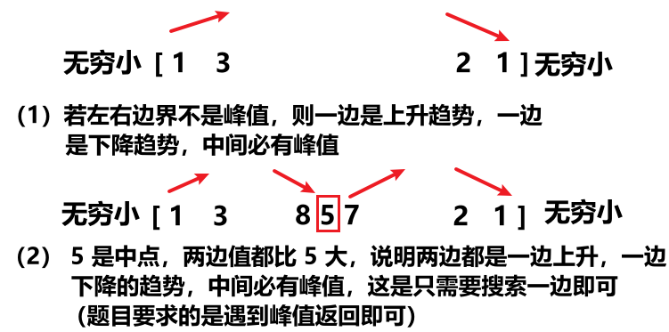

<h1 style="text-align: center; font-weight: bold;">二分搜索入门</h1>

---

## 基本介绍

### 应用场景

> #### （1）在有序数组中确定 num 存在还是不存在
>
> #### （2）在有序数组中找 >=num 的最左位置
>
> #### （3）在有序数组中找 <=num 的最右位置
>
> #### （4）<span style="color: red;">二分搜索不一定发生在有序数组上</span>（比如寻找峰值问题）
>
> #### （5）“ 二分答案法 ” 这个非常重要的算法，后续学习

### 时间复杂度

> #### 如果数组长度为 n，那么二分搜索搜索次数是 log n 次，以 2 为底，二分搜索时间复杂度 O (log₂n)

## 二分搜索

### 题目链接

> #### https://leetcode.cn/problems/binary-search/

### 基本介绍

> #### 二分搜索是利用<span style="color: red;">数组有序</span>的特点，通过砍半来缩小搜索范围，优化了时间复杂度

### 代码实现

> #### ⚠️ 注意：以下代码写法区间为<span style="color: red;">左闭右闭</span>区间

```java
class Solution1 {
    public int search(int[] nums, int target) {
        // 避免当 target 小于nums[0] nums[nums.length - 1] 时多次循环运算
        if(target < nums[0] || target > nums[nums.length - 1]){
            return -1;
        }
        int left = 0;
        int right = nums.length - 1;
        // 因为 left = right 在区间上有意义，所以取等
        while (left <= right) {
            // int mid = left + (right - left) >> 2;
            int mid = left + (right - left) / 2;
            /*
                中间值比目标值大，根据数组有序的特点，则右边的值不可能有比目标值小的元素，
                在左边找，更新右区间
            */
            if (nums[mid] > target) {
                right = mid - 1; // 由区间的定义知 mid 可以被取到，下一轮比较不希望再比较 mid
            /*
                中间值比目标值小，根据数组有序的特点，则左边的值不可能有比目标值大的元素，
                在右边找，更新左区间
            */
            } else if (nums[mid] < target) {
                left = mid + 1;
            } else { // 此时 num[mid] = target，返回下标
                return mid;
            }
        }
        return -1; // 没有找到
    }
}
```

## >=num 的最左位置

> #### 初始值 anss = -1， L - R 范围上有一个中点
>
> #### （1）中点 >= num，记答案，往左二分（num 右边的数肯定比中点还大，看看左边有没有 >= num 的最左数）
>
> #### （2）中点 < num，不记答案，往右二分（num 左边的数肯定比中点小，中点右边的数才是大的，此时往右找 >= num 的最左数）

```java
// 保证arr有序，才能用这个方法
// 有序数组中找>=num的最左位置
public static int findLeft(int[] arr, int num) {
    int l = 0, r = arr.length - 1, m = 0;
    int ans = -1;
    while (l <= r) {
        // m = (l + r) / 2;
        // m = l + (r - l) / 2;
        m = l + ((r - l) >> 1);
        if (arr[m] >= num) {
            ans = m;
            r = m - 1;
        } else {
            l = m + 1;
        }
    }
    return ans;
}
```

## <=num 的最右位置

```java
// 保证arr有序，才能用这个方法
// 有序数组中找<=num的最右位置
public static int findRight(int[] arr, int num) {
    int l = 0, r = arr.length - 1, m = 0;
    int ans = -1;
    while (l <= r) {
        m = l + ((r - l) >> 1);
        if (arr[m] <= num) {
            ans = m;
            l = m + 1;
        } else {
            r = m - 1;
        }
    }
    return ans;
}
```

## ⭐ 找峰值（数组不一定有序）

### 题目链接

> #### https://leetcode.cn/problems/find-peak-element/

### 思路分析

<br/>


### 题解

```java
class Solution {
    public int findPeakElement(int[] nums) {
        if (nums.length == 1) {
            return 0;
        }
        // 检测左右边界是否是峰值
        if (nums[0] > nums[1]) {
            return 0;
        }
        if (nums[nums.length - 1] > nums[nums.length - 2]) {
            return nums.length - 1;
        }
        // 左右边界都不是峰值，在中间二分搜索
        int l = 1;
        int r = nums.length - 2;
        int ans = -1;
        // 左闭右闭：[l , r]
        while (l <= r) {
            // 取中点
            int mid = (l + r) / 2;
            // 如果中点左边的值比中点大，说明中点附近是下降趋势，往左边搜索
            if (nums[mid - 1] > nums[mid]) {
                r = mid - 1;
            } else if (nums[mid] < nums[mid + 1]) {
                // 中点附近是上升趋势，往右边搜索
                l = mid + 1;
            } else {
                // 中点左边、右边的值都比中点小，中点是峰值
                ans = mid;
                // 找到峰值，直接返回
                break;
            }
        }
        return ans;
    }
}
```
