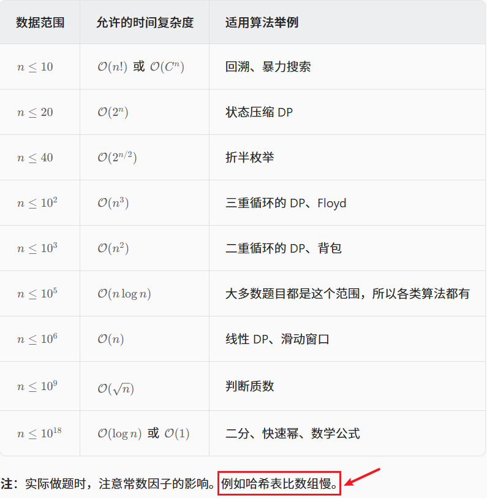

<h1 style="text-align: center; font-weight: bold;">根据数据量猜解法技巧</h1>

---

## 基本事实

> #### C / C++运行时间 <span style="color: red;">1s</span>，java / python / go 等其他语言运行时间 <span style="color: red;">1s ~ 2s</span>
>
> #### 对应的常数指令操作量是 <span style="color: red;">10<sup>7</sup> ~ 10<sup>8</sup></span>，不管什么测试平台，不管什么 cpu，都是这个数量级
>
> #### 所以可以根据这个基本事实，来猜测自己设计的算法最终有没有可能在规定时间内通过

::: tip <span style="font-size:18px;font-weight:bold;">Tip</span>

#### 这个技巧太重要了！既可以提前获知自己的方法能不能通过，也可以对题目的分析有引导作用！根据数量级匹配相应的算法，可能可以解决题目

:::

## 必要条件

> #### 题目要给定各个入参的范围最大值，正式笔试、比赛的题目一定都会给，面试中要和面试官确认
>
> #### 对于自己设计的算法，时间复杂度要有准确的估计

## ⭐ 问题规模可用算法

| n 表示问题规模      | <span style="color:red;">logn</span> | <span style="color:red;">n</span> | <span style="color:red;">n \* logn</span> | <span style="color:red;">n \* &#8730;n</span> | <span style="color:red;">n <sup>2</sup></span> | <span style="color:red;">2 <sup>n</sup></span> | <span style="color:red;">n !</span> |
| ------------------- | ------------------------------------ | --------------------------------- | ----------------------------------------- | --------------------------------------------- | ---------------------------------------------- | ---------------------------------------------- | ----------------------------------- |
| n <= 11             | Yes                                  | Yes                               | Yes                                       | Yes                                           | Yes                                            | Yes                                            | Yes                                 |
| n <= 25             | Yes                                  | Yes                               | Yes                                       | Yes                                           | Yes                                            | Yes                                            | No                                  |
| n <= 5000           | Yes                                  | Yes                               | Yes                                       | Yes                                           | Yes                                            | No                                             | No                                  |
| n <= 10<sup>5</sup> | Yes                                  | Yes                               | Yes                                       | Yes                                           | No                                             | No                                             | No                                  |
| n <= 10<sup>6</sup> | Yes                                  | Yes                               | Yes                                       | No                                            | No                                             | No                                             | No                                  |
| n <= 10<sup>7</sup> | Yes                                  | Yes                               | No                                        | No                                            | No                                             | No                                             | No                                  |
| n >= 10<sup>8</sup> | Yes                                  | No                                | No                                        | No                                            | No                                             | No                                             | No                                  |

> #### 上面每个复杂度，课上都讲过类似的过程了。
>
> #### 除了 <span style="color:red">n \* &#8730;n</span>，这个复杂度常出现在 “ <span style="color:red">莫队算法</span> ” 能解决的相关题目里，后续的【挺难】课程会有系统讲述
>
> #### 这张表其实作用有限，因为时间复杂度的估计很多时候并不是一个入参决定，可能是多个入参共同决定，比如 （n \* m）, O（n + m）等
>
> #### 所以最关键的就是记住常数指令操作量是 <span style="color:red;">10<sup>7</sup> ~ 10<sup>8</sup></span>，然后方法是什么复杂度就可以估计能否通过了，<span style="color:red;">一般会卡在该数量级合理的范围内时间复杂度最差的这个边界</span>
>
> #### 例如：已知数量级 n，代入计算判断是否在 <span style="color:red;">10<sup>7</sup> ~ 10<sup>8</sup></span> 这个数量级内，如果超出，需要考虑降低，进而推算出合理的时间复杂度，进而考虑相关的可能算法

<br/>


## 最优的技能释放顺序

### 题目链接

> #### https://www.nowcoder.com/practice/d88ef50f8dab4850be8cd4b95514bbbd
>
> #### 现在有一个打怪类型的游戏，这个游戏是这样的，你有 n 个技能
>
> #### 每一个技能会有一个伤害，同时<span style="color:red">若怪物小于等于一定的血量，则该技能可能造成双倍伤害</span>
>
> #### 每一个技能最多只能释放一次，已知怪物有 m 点血量
>
> #### 现在想问你最少用几个技能能消灭掉他（血量小于等于 0）
>
> #### 技能的数量是 n，怪物的血量是 m
>
> #### i 号技能的伤害是 x[i]，i 号技能触发双倍伤害的血量最小值是 y[i]
>
> #### 1 <= n <= 10
>
> #### 1 <= m、x[i]、y[i] <= 10<sup>6</sup>

### 思路分析

> #### 首先题目要求使用最少技能数量，那说明释放技能的<span style="color:red">顺序</span>是有讲究的
>
> #### 观察到技能的最大限制就 10 个，然而打败怪兽必然要释放技能，且释放顺序是有讲究的，这样才能达到最小，所以根据数量级推算，卡<span style="color:red;">最差</span>的时间复杂度
>
> #### 10！并没有超出 <span style="color:red;">10<sup>7</sup> ~ 10<sup>8</sup></span> 这个数量级范围，时间复杂度卡在 <span style="color:red;">O（n ！）</span> ，使用<span style="color:red;">全排列</span>
>
> #### 枚举所有技能的释放顺序，逐个统计符合条件的顺序即可

### 代码实现

```java
import java.io.*;

public class Main {

    public static int MAXN = 11;

    public static int[] kill = new int[MAXN];

    public static int[] blood = new int[MAXN];

    public static void main(String[] args) throws Exception {
        BufferedReader br = new BufferedReader(new InputStreamReader(System.in));
        StreamTokenizer in = new StreamTokenizer(br);
        PrintWriter out = new PrintWriter(new OutputStreamWriter(System.out));
        while (in.nextToken() != StreamTokenizer.TT_EOF) {
            int t = (int) in.nval;
            for (int i = 0; i < t; i++) {
                in.nextToken();
                int n = (int) in.nval;
                in.nextToken();
                int m = (int) in.nval;
                for (int j = 0; j < n; j++) {
                    in.nextToken();
                    kill[j] = (int) in.nval;
                    in.nextToken();
                    blood[j] = (int) in.nval;
                }
                int ans = traversal(n, 0, m);
                out.println(ans == Integer.MAX_VALUE ? -1 : ans);
            }
        }
        out.flush();
        br.close();
        out.close();
    }

    // kill[i]、blood[i]
    // n ：一共几个技能
    // i ：当前来到了第几号技能
    // r ：怪兽目前的剩余血量
    public static int traversal(int n, int i, int r) {
        if (r <= 0) {
            // 每次血量减完 i 就会来到下一个位置
            // 此时的 i 来到的下标大小即表示之前
            // 用了多少个技能，也表示在 i - 1 位
            // 置使用了技能可以将怪物击败
            return i;
        }
        // 遍历到末尾了，剩余血量 r > 0，不可能击败
        if (i == n) {
            return Integer.MAX_VALUE;
        }
        // 返回至少需要几个节能可以将怪物击败
        int ans = Integer.MAX_VALUE;
        // 枚举所有技能的使用顺序，收集符合条件的情况
        // 全排列实现逻辑
        for (int j = i; j < n; j++) {
            swap(i, j);
            ans = Math.min(ans, traversal(n, i + 1, r - (r > blood[i] ? kill[i] : kill[i] * 2)));
            swap(i, j);
        }
        return ans;
    }

    // 一个技能对应一定的伤害
    // 技能顺序换了，伤害也要跟着换
    public static void swap(int i, int j) {
        int temp = kill[i];
        kill[i] = kill[j];
        kill[j] = temp;

        temp = blood[i];
        blood[i] = blood[j];
        blood[j] = temp;
    }
}
```

## 超级回文数的数目

### 题目链接

> #### https://leetcode.cn/problems/super-palindromes/
>
> #### 如果一个<span style="color:red">正整数自身是回文数，而且它也是一个回文数的平方</span>，那么我们称这个数为超级回文数
>
> #### 现在，给定两个正整数 L 和 R （以字符串形式表示）
>
> #### 返回包含在范围 [L，R] 中的超级回文数的数目
>
> #### 1 <= len（L） <= 18
>
> #### 1 <= len（R） <= 18
>
> #### L 和 R 是表示 [1，10<sup>18</sup> ) 范围的整数的字符串

### 思路分析

> #### 题目的数量级已经来到了 10<sup>18</sup>，相当大，根据题目的意思，如果从小到大枚举，必然超时
>
> #### 相对枚举每一个数，如果该数的数量级很大，那必然超时
>
> #### 我们可以枚举<span style="color:red">根号 x</span>，此时的数量级来到 <span style="color:red">10<sup>9</sup></span>，如果根号 x 是回文数，若根号 x 的平方落在 [L, R] 范围内，且根号 x 的平方也是回文数，那 x 就是超级回文数
>
> #### 数量级 <span style="color:red">10<sup>9</sup></span> 还是太大，常数指令操作量是 <span style="color: red;">10<sup>7</sup> ~ 10<sup>8</sup></span>，需要继续降数量级
>
> #### 根据回文的特点，该数呈<span style="color:red">对称关系</span>，而回文数分由<span style="color:red">奇数位和偶数位</span>构成的回文数
>
> #### <span style="color:red">枚举回文数的一半</span>，运用算法<span style="color:red">生成最后的回文数</span>即可，数量级来到 <span style="color: red;">10<sup>5</sup></span>
>
> #### 判断超级回文数 x -> 枚举根号 x -> 枚举回文数的一半，数量级由<span style="color: red;">10<sup>18</sup> -> 10<sup>5</sup></span>，小代价，办大事

### 代码实现

```java
class Solution {
    public int superpalindromesInRange(String left, String right) {
        long l = Long.valueOf(left);
        long r = Long.valueOf(right);
        // l ... r
        // 根号 x，范围限制 limit
        long limit = (long) Math.sqrt((double) r);
        // seed ： 枚举量很小，10^18 -> 10^9 -> 10^5
        // seed ： 奇数长度回文、偶数长度回文两种情况
        long seed = 1;
        // num ： 表示根号 x，num^2 -> x
        long num = 0;
        int ans = 0;
        do {
            // 生成偶数长度的回文数
            // 123 -> 123321
            num = evenEnlarge(seed);
            // 如果 num^2 在 l ... r 范围内
            // 且 num^2 是回文数，则 num 就
            // 是超级回文数
            if (check(num * num,l, r)){
                ans++;
            }
            // 生成奇数长度的回文数
            // 123 -> 12321
            num = oddEnlarge(seed);
            if (check(num * num,l, r)){
                ans++;
            }
            // 123 -> 124 -> 125，累加继续枚举
            seed++;
        } while (num < limit);
        return ans;
    }

    // 根据种子扩充到 偶数 长度的回文数字并返回
    public long evenEnlarge(long seed) {
        // 123 -> 123321
        long ans = seed;
        while (seed != 0) {
            ans = ans * 10 + seed % 10;
            seed /= 10;
        }
        return ans;
    }

    // 根据种子扩充到 奇数 长度的回文数字并返回
    public long oddEnlarge(long seed) {
        // 123 -> 12321
        long ans = seed;
        // 对乘轴只有一个数，最后一个数不要，先除掉
        seed /= 10;
        while (seed != 0) {
            ans = ans * 10 + seed % 10;
            seed /= 10;
        }
        return ans;
    }

    // 判断 num 是不是在 [l,r] 范围内的回文数
    public boolean check(long num, long l, long r) {
        return num >= l && num <= r && isPalindrome(num);
    }

    // 判断 num 是否是回文数
    public boolean isPalindrome(long num) {
		long offset = 1;
		// 注意这么写是为了防止溢出
		while (num / offset >= 10) {
			offset *= 10;
		}
		// num    : 52725
		// offset : 10000
		// 首尾判断
		while (num != 0) {
			if (num / offset != num % 10) {
				return false;
			}
			num = (num % offset) / 10;
			offset /= 100;
		}
		return true;
    }
}
```

### 打表过程

> #### 发现这么大的范围才一共 <span style="color: red;">86</span> 个超级回文数
>
> #### 86 这个数量级太小了，直接根据给定的范围 [l，r] 枚举对应范围的超级回文数即可

```java
import java.util.ArrayList;
import java.util.List;

public class Code02_SuperPalindromes {

	// [left, right]有多少超级回文数
	// 返回数量
	public static int superpalindromesInRange1(String left, String right) {
		long l = Long.valueOf(left);
		long r = Long.valueOf(right);
		// l....r  long
		// x根号，范围limit
		long limit = (long) Math.sqrt((double) r);
		// seed : 枚举量很小，10^18 -> 10^9 -> 10^5
		// seed : 奇数长度回文、偶数长度回文
		long seed = 1;
		// num : 根号x，num^2 -> x
		long num = 0;
		int ans = 0;
		do {
			//  seed生成偶数长度回文数字
			// 123 -> 123321
			num = evenEnlarge(seed);
			if (check(num * num, l, r)) {
				ans++;
			}
			//  seed生成奇数长度回文数字
			// 123 -> 12321
			num = oddEnlarge(seed);
			if (check(num * num, l, r)) {
				ans++;
			}
			// 123 -> 124 -> 125
			seed++;
		} while (num < limit);
		return ans;
	}

	// 根据种子扩充到偶数长度的回文数字并返回
	public static long evenEnlarge(long seed) {
		long ans = seed;
		while (seed != 0) {
			ans = ans * 10 + seed % 10;
			seed /= 10;
		}
		return ans;
	}

	// 根据种子扩充到奇数长度的回文数字并返回
	public static long oddEnlarge(long seed) {
		long ans = seed;
		seed /= 10;
		while (seed != 0) {
			ans = ans * 10 + seed % 10;
			seed /= 10;
		}
		return ans;
	}

	// 判断ans是不是属于[l,r]范围的回文数
	public static boolean check(long ans, long l, long r) {
		return ans >= l && ans <= r && isPalindrome(ans);
	}

	// 验证long类型的数字num，是不是回文数字
	public static boolean isPalindrome(long num) {
		long offset = 1;
		// 注意这么写是为了防止溢出
		while (num / offset >= 10) {
			offset *= 10;
		}
		// num    : 52725
		// offset : 10000
		// 首尾判断
		while (num != 0) {
			if (num / offset != num % 10) {
				return false;
			}
			num = (num % offset) / 10;
			offset /= 100;
		}
		return true;
	}

    // 打印出所有的超级回文数，找规律
	public static List<Long> collect() {
		long l = 1;
		long r = Long.MAX_VALUE;
		long limit = (long) Math.sqrt((double) r);
		long seed = 1;
		long enlarge = 0;
		ArrayList<Long> ans = new ArrayList<>();
		do {
			enlarge = evenEnlarge(seed);
			if (check(enlarge * enlarge, l, r)) {
				ans.add(enlarge * enlarge);
			}
			enlarge = oddEnlarge(seed);
			if (check(enlarge * enlarge, l, r)) {
				ans.add(enlarge * enlarge);
			}
			seed++;
		} while (enlarge < limit);
		ans.sort((a, b) -> a.compareTo(b));
		return ans;
	}

	public static void main(String[] args) {
		List<Long> ans = collect();
		for (long p : ans) {
			System.out.println(p + "L,");
		}
		System.out.println("size : " + ans.size());
	}

}
```

### 最优解

```java
class Solution {
    // 给定范围 [l,r]，遍历找到这个范围对应的超级回文数
    public int superpalindromesInRange(String left, String right) {
        long l = Long.parseLong(left);
        long r = Long.parseLong(right);
        int i = 0;
        for (; i < record.length; i++) {
            if (record[i] >= l) {
                break;
            }
        }
        int j = record.length - 1;
        for (; j >= 0; j--) {
            if (record[j] <= r) {
                break;
            }
        }
        // 返回超级回文数的个数
        return j - i + 1;
    }

    public long[] record = new long[] {
            1L,
            4L,
            9L,
            121L,
            484L,
            10201L,
            12321L,
            14641L,
            40804L,
            44944L,
            1002001L,
            1234321L,
            4008004L,
            100020001L,
            102030201L,
            104060401L,
            121242121L,
            123454321L,
            125686521L,
            400080004L,
            404090404L,
            10000200001L,
            10221412201L,
            12102420121L,
            12345654321L,
            40000800004L,
            1000002000001L,
            1002003002001L,
            1004006004001L,
            1020304030201L,
            1022325232201L,
            1024348434201L,
            1210024200121L,
            1212225222121L,
            1214428244121L,
            1232346432321L,
            1234567654321L,
            4000008000004L,
            4004009004004L,
            100000020000001L,
            100220141022001L,
            102012040210201L,
            102234363432201L,
            121000242000121L,
            121242363242121L,
            123212464212321L,
            123456787654321L,
            400000080000004L,
            10000000200000001L,
            10002000300020001L,
            10004000600040001L,
            10020210401202001L,
            10022212521222001L,
            10024214841242001L,
            10201020402010201L,
            10203040504030201L,
            10205060806050201L,
            10221432623412201L,
            10223454745432201L,
            12100002420000121L,
            12102202520220121L,
            12104402820440121L,
            12122232623222121L,
            12124434743442121L,
            12321024642012321L,
            12323244744232321L,
            12343456865434321L,
            12345678987654321L,
            40000000800000004L,
            40004000900040004L,
            1000000002000000001L,
            1000220014100220001L,
            1002003004003002001L,
            1002223236323222001L,
            1020100204020010201L,
            1020322416142230201L,
            1022123226223212201L,
            1022345658565432201L,
            1210000024200000121L,
            1210242036302420121L,
            1212203226223022121L,
            1212445458545442121L,
            1232100246420012321L,
            1232344458544432321L,
            1234323468643234321L,
            4000000008000000004L
    };
}
```

## ⭐ 判断是否是回文数

### 题目链接

> #### https://leetcode.cn/problems/palindrome-number/

### 思路分析

> #### 初始时候设定 offset 跟 num 一样的位数
>
> #### （1）num ： 765567
>
> #### （2）offset ： 100000
>
> #### （3）<span style="color:red">提取</span>出 num 的头部数字：num / offset
>
> #### （4）<span style="color:red">提取</span>出 num 的尾部数字：num % 10
>
> #### 后续去掉头尾数字，同时将 offset 和 num 对齐
>
> #### （1）<span style="color:red">去掉</span> num 的头部数字：num % offset
>
> #### （2）<span style="color:red">去掉</span> num 的尾部数字：（num % offset） / 10
>
> #### （3）offset 和 num 对齐：offset /= 100

### 代码实现

```java
class Solution {
    public boolean isPalindrome(int num) {
        if (num < 0) {
            return false;
        }
        int offset = 1;
        // 注意这么写是为了防止溢出
        // 这里目的是为了和 num 对齐
        //    num ： 765567
        // offset ： 100000
        // 如果不符合条件，说明 offset 没乘到位
        while (num / offset >= 10) {
            offset *= 10;
        }
        // 首尾判断
        while (num != 0) {
            // num / offset ：取出头部数字
            // num % 10 ：取出末尾数字
            if (num / offset != num % 10) {
                return false;
            }
            // 处理前
            //   num  ：52725
            // offset ：10000
            // (num % offset) -> 2725 消除头部数字
            // (num % offset) / 10 -> 272 消除尾部数字
            // 处理后
            //   num  ：272
            // offset ：100
            num = (num % offset) / 10;
            // 让 offset 和 num 重新对齐
            // 因为每次消除了头尾两个数字
            // 所以除以100 也消去两个数字
            offset /= 100;
        }
        return true;
    }
}
```
