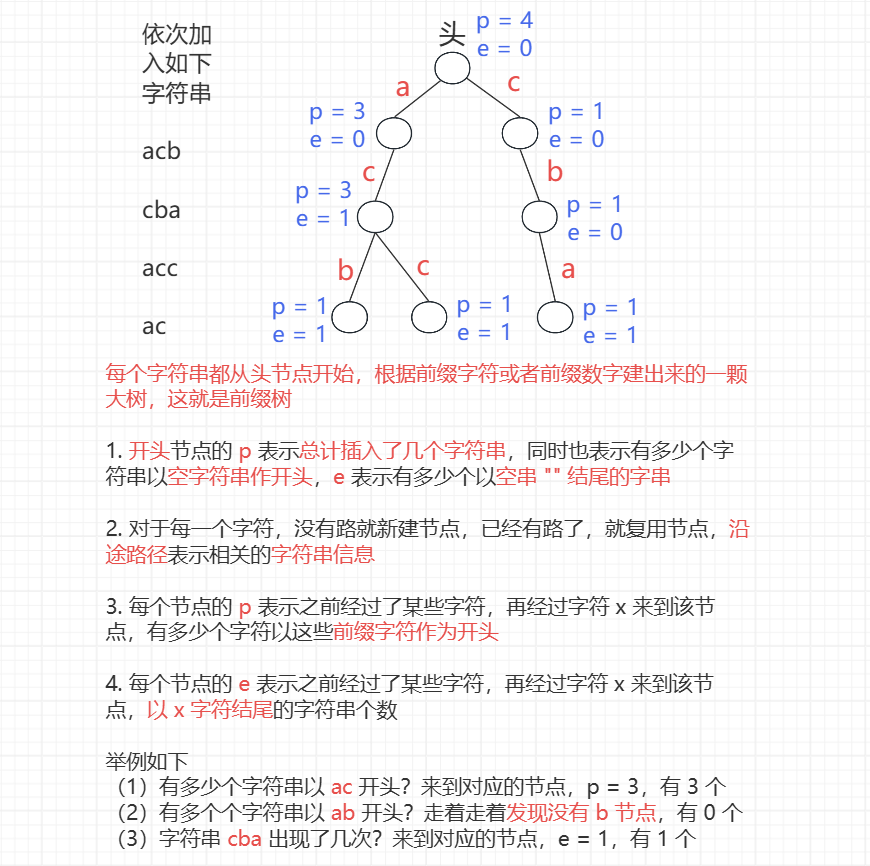
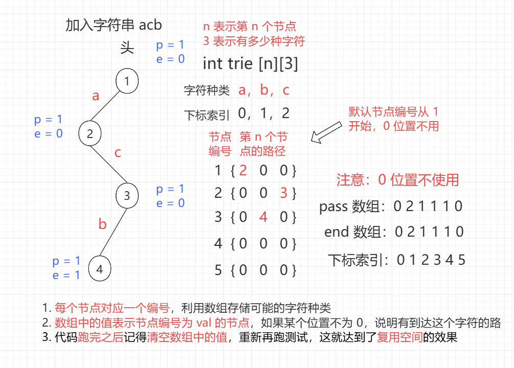

<h1 style="text-align: center; font-weight: bold;">前缀树原理与代码详解</h1>

---

## 基本介绍

> #### 前缀树又叫<span style="color:red">字典树</span>，英文名 <span style="color:red">trie</span>
>
> #### 每个样本<span style="color:red">都从头节点开始</span>根据前缀字符或者前缀数 建出来的一棵大树，就是前缀树
>
> #### 没有路就新建节点，已经有路了，就<span style="color:red">复用</span>节点
>
> #### 前缀树的使用场景：需要<span style="color:red">根据前缀信息来查询</span>的场景
>
> #### 前缀树的<span style="color:red">优点</span>：根据前缀信息选择树上的分支，可以<span style="color:red">节省大量的时间</span>
>
> #### 前缀树的<span style="color:red">缺点</span>：<span style="color:red">比较浪费空间</span>，和总字符数量有关，字符的种类有关
>
> #### 前缀树的定制：<span style="color:red">pass、end</span> 等信息

## 结构图解

<br/>


## 类描述实现（不推荐）

### 题目链接

> #### https://www.nowcoder.com/practice/7f8a8553ddbf4eaab749ec988726702b

### 数组实现

```java
import java.io.*;

public class Main {

    public static int m, op;

    public static String[] splits;

    public static void main(String[] args) throws IOException {
        BufferedReader in = new BufferedReader(new InputStreamReader(System.in));
        PrintWriter out = new PrintWriter(new OutputStreamWriter(System.out));
        String line = null;
        Trie trie = new Trie();
        while ((line = in.readLine()) != null) {
            m = Integer.valueOf(line);
            for (int i = 1; i <= m; i++) {
                splits = in.readLine().split(" ");
                op = Integer.valueOf(splits[0]);
                if (op == 1) {
                    trie.insert(splits[1]);
                } else if (op == 2) {
                    trie.delete(splits[1]);
                } else if (op == 3) {
                    out.println(trie.search(splits[1]) > 0 ? "YES" : "NO");
                } else if (op == 4) {
                    out.println(trie.prefixNumber(splits[1]));
                }
            }
        }
        out.flush();
        in.close();
        out.close();
    }
}

class Trie {

    // 定义头节点指针
    private TrieNode root;

    // 头节点
    public Trie() {
        root = new TrieNode();
    }

    // 插入字符串，构建前缀树
    public void insert(String word) {
        // 定义节点遍历指针
        TrieNode node = root;
        node.pass++;
        // 遍历所有每一个字符
        for (int i = 0, path; i < word.length(); i++) {
            // path 的值是下标索引，每一个下标对应一条路
            // 即这一句表示得到每一个字符对应走向那条路
            path = word.charAt(i) - 'a';
            // 如果没有走向这个字符的路，就创建出来
            if (node.nexts[path] == null) {
                node.nexts[path] = new TrieNode();
            }
            // 如果有，就更新节点信息，同时移动遍历指针
            node = node.nexts[path];
            node.pass++;
        }
        // 遍历完了，更新节点的 end 值
        node.end++;
    }

    // 查询前缀树里有多少字符串以 pre 做前缀
    public int prefixNumber(String pre) {
        TrieNode node = root;
        for (int i = 0, path; i < pre.length(); i++) {
            path = pre.charAt(i) - 'a';
            // 没有到该节点的路，当前没有这个前缀，返回 0
            if (node.nexts[path] == null) {
                return 0;
            }
            node = node.nexts[path];
        }
        return node.pass;
    }

    // 查询前缀树中字符串 str 的个数
    public int search(String word) {
        TrieNode node = root;
        for (int i = 0, path; i < word.length(); i++) {
            path = word.charAt(i) - 'a';
            if (node.nexts[path] == null) {
                return 0;
            }
            node = node.nexts[path];
        }
        return node.end;
    }

    // 在前缀树中删除某个字符串
    // 如果之前 str 插入过前缀树，那么此时删掉一次
    // 如果之前 str 没有插入过前缀树，那么什么也不做
    public void delete(String word) {
        if (search(word) > 0) {
            TrieNode node = root;
            node.pass--;
            for (int i = 0, path; i < word.length(); i++) {
                path = word.charAt(i) - 'a';
                // 如果为 0，后续的所有节点都不可能到达，置空
                // 剩余的节点会有 JVM 回收，无需手动释放
                if (--node.nexts[path].pass == 0) {
                    node.nexts[path] = null;
                    return;
                }
                node = node.nexts[path];
            }
            // 还有一种可能就是后续的节点还有用，只是以该节点
            // 为结尾的字符串删除了，更新节点的 end 值即可
            node.end--;
        }
    }

    class TrieNode {
        // 记录前缀信息
        public int pass;

        public int end;

        // 存储所有可能到达的字符
        public TrieNode[] nexts;

        public TrieNode() {
            pass = 0;
            end = 0;
            // 假设只有 26 个小写字母
            // 根据实际情况改变大小
            nexts = new TrieNode[26];
        }
    }
}
```

### 哈希表实现

> #### 如果字符的种类很多，那就会有非常多的分叉，此时可以用哈希表来存储这些分叉
>
> #### <span style="color:red">key 是路的数值，vlaue 是节点的地址</span>
>
> #### 需要判断有没有某一条路，直接查表即可

```java
import java.io.*;
import java.util.HashMap;

public class Main {

    public static int m, op;

    public static String[] splits;

    public static void main(String[] args) throws IOException {
        BufferedReader in = new BufferedReader(new InputStreamReader(System.in));
        PrintWriter out = new PrintWriter(new OutputStreamWriter(System.out));
        String line = null;
        Trie trie = new Trie();
        while ((line = in.readLine()) != null) {
            m = Integer.valueOf(line);
            for (int i = 1; i <= m; i++) {
                splits = in.readLine().split(" ");
                op = Integer.valueOf(splits[0]);
                if (op == 1) {
                    trie.insert(splits[1]);
                } else if (op == 2) {
                    trie.delete(splits[1]);
                } else if (op == 3) {
                    out.println(trie.search(splits[1]) > 0 ? "YES" : "NO");
                } else if (op == 4) {
                    out.println(trie.prefixNumber(splits[1]));
                }
            }
        }
        out.flush();
        in.close();
        out.close();
    }
}

class Trie {

    // 定义头节点指针
    private TrieNode root;

    // 头节点
    public Trie() {
        root = new TrieNode();
    }

    // 插入字符串，构建前缀树
    public void insert(String word) {
        // 定义节点遍历指针
        TrieNode node = root;
        node.pass++;
        // 遍历所有每一个字符
        for (int i = 0, path; i < word.length(); i++) {
            // path 的值是下标索引，每一个下标对应一条路
            // 即这一句表示得到每一个字符对应走向那条路
            path = word.charAt(i) - 'a';
            // 如果没有走向这个字符的路，就创建出来
            if (!node.nexts.containsKey(path)) {
                node.nexts.put(path, new TrieNode());
            }
            // 如果有，就更新节点信息，同时移动遍历指针
            node = node.nexts.get(path);
            node.pass++;
        }
        // 遍历完了，更新节点的 end 值
        node.end++;
    }

    // 查询前缀树里有多少字符串以 pre 做前缀
    public int prefixNumber(String pre) {
        TrieNode node = root;
        for (int i = 0, path; i < pre.length(); i++) {
            path = pre.charAt(i) - 'a';
            // 没有到该节点的路，当前没有这个前缀，返回 0
            if (!node.nexts.containsKey(path)) {
                return 0;
            }
            node = node.nexts.get(path);
        }
        return node.pass;
    }

    // 查询前缀树中字符串 str 的个数
    public int search(String word) {
        TrieNode node = root;
        for (int i = 0, path; i < word.length(); i++) {
            path = word.charAt(i) - 'a';
            if (!node.nexts.containsKey(path)) {
                return 0;
            }
            node = node.nexts.get(path);
        }
        return node.end;
    }

    // 在前缀树中删除某个字符串
    // 如果之前 str 插入过前缀树，那么此时删掉一次
    // 如果之前 str 没有插入过前缀树，那么什么也不做
    public void delete(String word) {
        if (search(word) > 0) {
            TrieNode node = root;
            TrieNode next;
            node.pass--;
            for (int i = 0, path; i < word.length(); i++) {
                path = word.charAt(i) - 'a';
                next = node.nexts.get(path);
                // 如果为 0，后续的所有节点都不可能到达，置空
                // 剩余的节点会有 JVM 回收，无需手动释放
                if (--next.pass == 0) {
                    node.nexts.remove(path);
                    return;
                }
                node = next;
            }
            // 还有一种可能就是后续的节点还有用，只是以该节点
            // 为结尾的字符串删除了，更新节点的 end 值即可
            node.end--;
        }
    }

    class TrieNode {
        // 记录前缀信息
        public int pass;

        public int end;

        // 用哈希表存储所有可能到达的字符
        public HashMap<Integer, TrieNode> nexts;

        public TrieNode() {
            pass = 0;
            end = 0;
            // 假设只有 26 个小写字母
            // 根据实际情况改变大小
            nexts = new HashMap<>();
        }
    }
}
```

### 缺陷分析

> #### 类实现是基于<span style="color:red">动态数组</span>实现的，<span style="color:red">每次</span>都会<span style="color:red">申请</span>新的内存空间
>
> #### 在 OJ 判题系统中，内存的计算是逐层累加的，每跑完一次测试用例，动态申请的空间销毁，但是会累加计算内存，再跑下一组测试用例继续计算
>
> #### 最终的空间使用的结果都算累加的这个结果，累加过程中<span style="color:red">可能会导致内存超过限制</span>

## 静态数组实现（推荐）

### 题目链接

> #### https://www.nowcoder.com/practice/7f8a8553ddbf4eaab749ec988726702b

### 思路分析

> #### 通过节点编号来表示节点，而不是真的创建一个节点，空间使用更优

<br/>


### Main 中实现写法

```java
import java.io.*;
import java.util.Arrays;

public class Main {

    // 如果将来增加了数据量，就改大这个值
    public static int MAXN = 150001;

    public static int[][] tree = new int[MAXN][26];

    public static int[] end = new int[MAXN];

    public static int[] pass = new int[MAXN];

    public static int cnt;

    public static void build() {
        // 头节点的编号为 1
        cnt = 1;
    }

    public static void insert(String word) {
        // 头节点的编号是 1
        int cur = 1;
        pass[cur]++;
        for (int i = 0, path; i < word.length(); i++) {
            path = word.charAt(i) - 'a';
            // 没有到达该节点的路，建立出来
            if (tree[cur][path] == 0) {
                tree[cur][path] = ++cnt;
            }
            cur = tree[cur][path];
            pass[cur]++;
        }
        end[cur]++;
    }

    public static int prefixNumber(String pre) {
        int cur = 1;
        for (int i = 0, path; i < pre.length(); i++) {
            path = pre.charAt(i) - 'a';
            if (tree[cur][path] == 0) {
                return 0;
            }
            cur = tree[cur][path];
        }
        return pass[cur];
    }

    public static int search(String word) {
        int cur = 1;
        for (int i = 0, path; i < word.length(); i++) {
            path = word.charAt(i) - 'a';
            if (tree[cur][path] == 0) {
                return 0;
            }
            cur = tree[cur][path];
        }
        return end[cur];
    }

    public static void delete(String word) {
        if (search(word) > 0) {
            int cur = 1;
            pass[cur]--;
            for (int i = 0, path; i < word.length(); i++) {
                path = word.charAt(i) - 'a';
                // 后续的节点都无法到达，直接置为 0
                if (--pass[tree[cur][path]] == 0) {
                    tree[cur][path] = 0;
                    return;
                }
                cur = tree[cur][path];
            }
            end[cur]--;
        }
    }

    // 因为要跑多组测试用例，而使用的是静态空间
    // 为了避免脏数据污染，所以这里要清空数据
    public static void clear() {
        // 并不需要全部清空，cnt 代表使用了多少空间
        for (int i = 1; i <= cnt; i++) {
            Arrays.fill(tree[i], 0);
            end[i] = 0;
            pass[i] = 0;
        }
    }

    public static int m, op;

    public static String[] splits;

    public static void main(String[] args) throws IOException {
        BufferedReader in = new BufferedReader(new InputStreamReader(System.in));
        PrintWriter out = new PrintWriter(new OutputStreamWriter(System.out));
        String line = null;
        while ((line = in.readLine()) != null) {
            build();
            m = Integer.valueOf(line);
            for (int i = 1; i <= m; i++) {
                splits = in.readLine().split(" ");
                op = Integer.valueOf(splits[0]);
                if (op == 1) {
                    insert(splits[1]);
                } else if (op == 2) {
                    delete(splits[1]);
                } else if (op == 3) {
                    out.println(search(splits[1]) > 0 ? "YES" : "NO");
                } else if (op == 4) {
                    out.println(prefixNumber(splits[1]));
                }
            }
            clear();
        }
        out.flush();
        in.close();
        out.close();
    }

}
```

### 类封装写法

```java
import java.io.*;
import java.util.Arrays;

public class Main {

    public static int m, op;

    public static String[] splits;

    public static void main(String[] args) throws IOException {
        BufferedReader in = new BufferedReader(new InputStreamReader(System.in));
        PrintWriter out = new PrintWriter(new OutputStreamWriter(System.out));
        String line = null;
        Trie trie = new Trie();
        while ((line = in.readLine()) != null) {
            trie.build();
            m = Integer.valueOf(line);
            for (int i = 1; i <= m; i++) {
                splits = in.readLine().split(" ");
                op = Integer.valueOf(splits[0]);
                if (op == 1) {
                    trie.insert(splits[1]);
                } else if (op == 2) {
                    trie.delete(splits[1]);
                } else if (op == 3) {
                    out.println(trie.search(splits[1]) > 0 ? "YES" : "NO");
                } else if (op == 4) {
                    out.println(trie.prefixNumber(splits[1]));
                }
            }
            trie.clear();
        }
        out.flush();
        in.close();
        out.close();
    }

}

class Trie {

    // 如果将来增加了数据量，就改大这个值
    public static int MAXN = 150001;

    public static int[][] tree = new int[MAXN][26];

    public static int[] end = new int[MAXN];

    public static int[] pass = new int[MAXN];

    public static int cnt;

    public void build() {
        cnt = 1;
    }

    public void insert(String word) {
        int cur = 1;
        pass[cur]++;
        for (int i = 0, path; i < word.length(); i++) {
            path = word.charAt(i) - 'a';
            if (tree[cur][path] == 0) {
                tree[cur][path] = ++cnt;
            }
            cur = tree[cur][path];
            pass[cur]++;
        }
        end[cur]++;
    }

    public int search(String word) {
        int cur = 1;
        for (int i = 0, path; i < word.length(); i++) {
            path = word.charAt(i) - 'a';
            if (tree[cur][path] == 0) {
                return 0;
            }
            cur = tree[cur][path];
        }
        return end[cur];
    }

    public int prefixNumber(String pre) {
        int cur = 1;
        for (int i = 0, path; i < pre.length(); i++) {
            path = pre.charAt(i) - 'a';
            if (tree[cur][path] == 0) {
                return 0;
            }
            cur = tree[cur][path];
        }
        return pass[cur];
    }

    public void delete(String word) {
        if (search(word) > 0) {
            int cur = 1;
            // 下面这一行代码，讲课的时候没加
            // 本题不会用到pass[1]的信息，所以加不加都可以，不过正确的写法是加上
            pass[cur]--;
            for (int i = 0, path; i < word.length(); i++) {
                path = word.charAt(i) - 'a';
                if (--pass[tree[cur][path]] == 0) {
                    tree[cur][path] = 0;
                    return;
                }
                cur = tree[cur][path];
            }
            end[cur]--;
        }
    }

    public void clear() {
        for (int i = 1; i <= cnt; i++) {
            Arrays.fill(tree[i], 0);
            end[i] = 0;
            pass[i] = 0;
        }
    }
}
```

### 缺陷分析

> #### Java 字符串理论上最大长度是 Integer.MAX_VALUE（约 21 亿），但在 class 文件格式中，常量池索引是 16 位，所以某些结构（如方法参数数量、单个字符串常量）编译时常量<span style="color:red">不能超过 65535 字节</span>
>
> #### 如果需要表示的<span style="color:red">字符种类巨大</span>，即如果路的可能性范围较大，静态数组就无法实现了，<span style="color:red">可以用每一位的信息建树，目标值由每一位的信息构建</span>，这将再下节课前缀树的题目里展示
