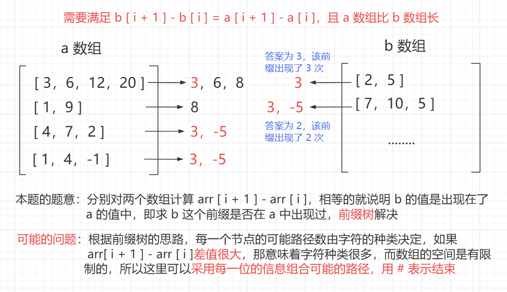

<h1 style="text-align: center; font-weight: bold;">前缀树相关题目</h1>

---

## 接头密钥

### 题目链接

> #### https://www.nowcoder.com/practice/c552d3b4dfda49ccb883a6371d9a6932

### 思路分析

<br/>


### 代码实现

```java
import java.util.*;

public class Solution {

    public static int[] countConsistentKeys(int[][] b, int[][] a) {
        build();
        StringBuilder builder = new StringBuilder();
        // [ 3, 6, 50, 10 ] --> "3#44#-40#"
        for (int[] nums : a) {
            // 清空内容，但是空间仍然保留
            // 下次直接复用，效率高
            builder.setLength(0);
            for (int i = 1; i < nums.length; i++) {
                builder.append(String.valueOf(nums[i] - nums[i - 1]) + "#");
            }
            insert(builder.toString());
        }
        int[] ans = new int[b.length];
        for (int i = 0; i < b.length; i++) {
            builder.setLength(0);
            int[] nums = b[i];
            for (int j = 1; j < nums.length; j++) {
                builder.append(String.valueOf(nums[j] - nums[j - 1]) + "#");
            }
            ans[i] = prefixNumber(builder.toString());
        }
        // 使用全局静态空间，为了不影响下一组测试用例
        // 的测试结果，需要清空本组测试用例产生的脏数据
        clear();
        return ans;
    }

    public static int MAXN = 2000001;

    // 数字 0-9 对应下标 0 - 9
    // # 符号对应下标 10
    // - 符号对应下标 11
    public static int[][] tree = new int[MAXN][12];

    // 本题只需要求前缀，所以没有使用 end 数组
    public static int[] pass = new int[MAXN];

    public static int cnt;

    public static void build() {
        // 节点编号默认从 1 开始
        //  0 号位置不用
        cnt = 1;
    }

    public static int path(char cha) {
        if (cha == '#') {
            return 10;
        } else if (cha == '-') {
            return 11;
        } else {
            return cha - '0';
        }
    }

    public static void insert(String word) {
        int cur = 1;
        pass[cur]++;
        for (int i = 0, path; i < word.length(); i++) {
            path = path(word.charAt(i));
            if (tree[cur][path] == 0) {
                tree[cur][path] = ++cnt;
            }
            cur = tree[cur][path];
            pass[cur]++;
        }
    }

    public static int prefixNumber(String pre) {
        int cur = 1;
        for (int i = 0, path; i < pre.length(); i++) {
            path = path(pre.charAt(i));
            if (tree[cur][path] == 0) {
                return 0;
            }
            cur = tree[cur][path];
        }
        return pass[cur];
    }

    public static void clear() {
        for (int i = 1; i <= cnt; i++) {
            Arrays.fill(tree[i], 0);
            pass[i] = 0;
        }
    }
}
```

## 数组中两数最大异或值

### 题目链接

> #### https://leetcode.cn/problems/maximum-xor-of-two-numbers-in-an-array/description/

### 思路分析

#### （1）前缀树实现

> #### 异或的性质（1）二进制位不同为 1，相同为 0（2）异或的交换律
>
> #### 异或值需要尽可能大，说明高位的二进制位的异或结果尽可能为 1，那就可以根据该数的二进制位，找到是否有其期望的结果，使得二者异或可以使得该高位的二进制值为 1
>
> #### ⚠️ 注意：题目说的是数都是<span style="color:red;">非负整数</span>，最高位位符号位，非负为 0
>
> #### 假设当前数为 ans（0 0 0 1 0），期望的异或结果是该二进制位置上的值为 1（即 0 1 1 1 1），记为 want，那 ans 需要跟一个数异或的到 want，这个需要得到的数记为 s
>
> #### ans ^ s = want，根据异或的交换律性质，<span style="color:red;">s = want ^ ans</span>，那就查询是否有 s 这个数，使得 s 的二进制高位跟 ans 异或后可以得到 want，即<span style="color:red">有没有高位符合要求的前缀</span>，转为前缀树问题
>
> #### 对于每一个数 num，二进制位中的<span style="color:red">高位为 0 的这些前缀没有意义</span>，放在前缀树中还浪费空间，因此只需要从二进制位中的高位中第一个为 1 的二进制位开始进行异或查询，这样的目的是<span style="color:red">节省空间</span>

#### （2）哈希表实现

> #### ⭐ 如何保留前面的二进制状态，后面的二进制状态都变为 0 ？ <span style="color:red">（ num >> i ） << i</span>
>
> #### 从高位中第一个二进制状态为 1 的位开始，其后面的位不考虑，都置为 0，运用上面这个技巧
>
> #### 从高位中第一个二进制状态为 1 的位开始往低位讨论，看能否达成期望的目标，思路和前缀树类似，前缀信息转用哈希表存储，如果表里有符合要求的前缀，则说明可以达到期望，更新最大异或结果
>
> #### 这个过程其实就是前缀树中 <span style="color:red">maxXor</span> 函数的实现过程，前缀信息由<span style="color:red">前缀树存储转为哈希表存储</span>
>
> #### 哈希表的<span style="color:red">常数时间</span>会比前缀树<span style="color:red">更优</span>，所以力扣上哈希表的实现会跑的更快

### 前缀树实现

```java
class Solution {
    public static int findMaximumXOR(int[] nums) {
        // 根据二进制位来建树
        build(nums);
        // 本题中，自己可以和自己异或，结果为 0
        int ans = 0;
        // 遍历每一个数字，maxXor 告诉当前数字，
        // 哪个数字跟我异或的值最大，返回
        // 不断更新异或的最大值
        for (int num : nums) {
            ans = Math.max(ans, maxXor(num));
        }
        // 使用全局静态空间，记得清理脏数据
        clear();
        return ans;
    }

    // 准备这么多静态空间就够了，实验出来的
    // 如果测试数据升级了规模，就改大这个值
    public static int MAXN = 3000001;

    // 只关注每个数的二进制状态
    public static int[][] tree = new int[MAXN][2];

    // 前缀树目前使用了多少空间
    public static int cnt;

    // 数字只需要从哪一位开始考虑
    public static int high;

    public static void build(int[] nums) {
        cnt = 1;
        // 找最大值
        int max = Integer.MIN_VALUE;
        for (int num : nums) {
            max = Math.max(max, num);
        }
        // 高位为 0 的二进制位无意义
        // 无需放到前缀树中，浪费空间
        high = 31 - Integer.numberOfLeadingZeros(max);
        for (int num : nums) {
            insert(num);
        }
    }

    public static void insert(int num) {
        int cur = 1;
        for (int i = high, path; i >= 0; i--) {
            // 记录的是每一位的二进制状态
            path = (num >> i) & 1;
            if (tree[cur][path] == 0) {
                tree[cur][path] = ++cnt;
            }
            cur = tree[cur][path];
        }
    }

    // 给定一个数 num，返回谁跟 num 异或
    // 的值是最大的，将这个最大值返回
    public static int maxXor(int num) {
        // 最终的异或结果
        int ans = 0;
        int cur = 1;
        for (int i = high, status, want; i >= 0; i--) {
            // status ：取出第 i 位的状态
            status = (num >> i) & 1;
            // want ：num 第 i 位希望遇到的状态
            // 目标 --> status ^ ? = 1
            // 根据异或的交换律性质求得 want 的值
            want = status ^ 1;
            // 查询前缀树中有没有 want 这个希望的状态
            // 如果没有，则 want 就是其反面，再异或得到反面
            if (tree[cur][want] == 0) {
                want ^= 1;
            }
            // 将结果记录下来，继续检查下一位
            ans |= (status ^ want) << i;
            cur = tree[cur][want];
        }
        return ans;
    }

    public static void clear() {
        for (int i = 1; i <= cnt; i++) {
            tree[i][0] = 0;
            tree[i][1] = 0;
        }
    }
}
```

### 哈希表实现

```java
class Solution {
    public static int findMaximumXOR(int[] nums) {
        int max = Integer.MIN_VALUE;
        for (int num : nums) {
            max = Math.max(num, max);
        }
        int ans = 0;
        HashSet<Integer> set = new HashSet<>();
        for (int i = 31 - Integer.numberOfLeadingZeros(max); i >= 0; i--) {
            // ans ：31 ... i+1 位已达成目标，现在讨论第 i 位是否也可以达成
            int want = ans | (1 << i);
            // 每次循环讨论一位，讨论前先清空
            set.clear();
            for (int num : nums) {
                // num ： 31 .... i，将 i 位置后的二进制位置为 0
                // 每次只讨论 i 位置是否能达成期望的目标
                num = (num >> i) << i;
                set.add(num);
                // num ^ ? = want --> ? = want ^ num
                if (set.contains(want ^ num)) {
                    // 如果有想要的期望，更新最大异或值
                    // 结束该位的讨论，继续讨论下一位
                    ans = want;
                    break;
                }
            }
        }
        return ans;
    }
}
```

## 二维数组中搜索单词

### 题目链接

> #### https://leetcode.cn/problems/word-search-ii/

### 思路分析

> #### 本题主要考察剪枝的应用，前缀树可以很好的<span style="color:red">实现剪枝</span>，同时也可以有很多<span style="color:red">妙用</span>
>
> #### （1）指导递归的展开，实现<span style="color:red">剪枝</span>：判断某个节点<span style="color:red">是否有必要去搜索</span>，可以查询前缀树中<span style="color:red">是否有到该节点的路</span>，如果没有，则无需搜索
>
> #### （2）每个节点增加 <span style="color:red">String 属性</span>，如果某个节点是<span style="color:red">字符串的结尾</span>，则将 String 属性<span style="color:red">不为空</span>，且置为该字符串，<span style="color:red">方便收集结果</span>，<span style="color:red">收集完成后置空</span>，再也用不到了
>
> #### （3）pass 信息剪枝：每次收集节点的时候把节点的 pass 值减少，收集完了返回，沿途的节点的 pass 都更新，当下一次递归时候，发现前缀树中某个节点的 pass 值为 0，不能走，这就说明<span style="color:red">前面已经收集过了，不能重复收集</span>，这就实现了剪枝

### 前缀树实现

```java
class Solution {
    public List<String> findWords(char[][] board, String[] words) {
        build(words);
        List<String> ans = new ArrayList<>();
        for (int i = 0; i < board.length; i++) {
            for (int j = 0; j < board[0].length; j++) {
                dfs(board, i, j, 1, ans);
            }
        }
        // 使用全局静态空间，记得清理脏数据
        clear();
        return ans;
    }

    // borod ： 二维网格
    // i，j ： 此时来到的格子位置，i 行，j 列
    // cur ： 前缀树节点的编号，刚来到一个格子的时候还没走过树上的路径，还在节点处
    // List<String> ans ：收集到了那些字符串，都加入 ans
    // 返回值 ： 收集到了几个字符串
    public static int dfs(char[][] board, int i, int j, int cur, List<String> ans) {
        // 越界或者走了回头路，直接返回 0

        if (i < 0 || i >= board.length || j < 0 || j >= board[0].length || board[i][j] == 0) {
            return 0;
        }
        // 不越界且不是回头路，记录当前字符
        char temp = board[i][j];
        // 查询是否有到这个节点的必要
        int road = temp - 'a';
        cur = tree[cur][road];
        // 节点编号从 1 开始
        // pass[cur] == 0 说明要么 cur 为 0，要么 cur ≠ 0 但是 pass[cur] == 0
        // 可以合并为一句 --> pass[cur] == 0
        //        if (cur == 0 || pass[cur] == 0) {
        //            return 0;
        //        }
        if (pass[cur] == 0) {
            return 0;
        }

        // i，j 位置有必要来
        // fix ： 从当前 i，j 位置出发，一共收集到了几个字符串
        int fix = 0;
        if (end[cur] != null) {
            fix++;
            ans.add(end[cur]);
            // 收集过了，后面再也用不到了，置空
            end[cur] = null;
        }
        // 把 i，j 位置的字符改成 0，后续的过程是不可以再来到 i，j 位置的
        board[i][j] = 0;
        fix += dfs(board, i - 1, j, cur, ans);
        fix += dfs(board, i + 1, j, cur, ans);
        fix += dfs(board, i, j - 1, cur, ans);
        fix += dfs(board, i, j + 1, cur, ans);
        // 收集过了无需重复收集，这里实现的
        pass[cur] -= fix;
        // 恢复现场
        board[i][j] = temp;
        return fix;
    }

    public static int MAXN = 10001;

    public static int[][] tree = new int[MAXN][26];

    public static int[] pass = new int[MAXN];

    public static String[] end = new String[MAXN];

    public static int cnt;

    public static void build(String[] words) {
        cnt = 1;
        for (String word : words) {
            // 头节点
            int cur = 1;
            pass[cur]++;
            for (int i = 0, path; i < word.length(); i++) {
                path = word.charAt(i) - 'a';
                if (tree[cur][path] == 0) {
                    tree[cur][path] = ++cnt;
                }
                cur = tree[cur][path];
                pass[cur]++;
            }
            end[cur] = word;
        }
    }

    public static void clear() {
        for (int i = 1; i <= cnt; i++) {
            Arrays.fill(tree[i], 0);
            pass[i] = 0;
            end[i] = null;
        }
    }
}
```

### 回溯算法实现

```java
class Solution {
    Set<String> set = new HashSet<>();
    List<String> ans = new ArrayList<>();
    char[][] grid;
    int[][] dirs = new int[][]{{1, 0}, {-1, 0}, {0, 1}, {0, -1}};
    boolean[][] visited = new boolean[15][15];

    public List<String> findWords(char[][] board, String[] words) {
        grid = board;
        for (String w : words) {
            set.add(w);
        }

        StringBuilder sb = new StringBuilder();
        for (int x = 0; x < grid.length; x++) {
            for (int y = 0; y < grid[0].length; y++) {
                visited[x][y] = true;
                sb.append(grid[x][y]);
                dfs(x, y, sb);
                visited[x][y] = false;
                sb.deleteCharAt(sb.length() - 1);
            }
        }
        return ans;
    }

    public void dfs(int x, int y, StringBuilder sb) {
        // 如果当前爆搜到的字符串长度超过 10，直接剪枝；
        if (sb.length() > 10) {
            return;
        }

        // 如果当前搜索到的字符串在 Set 中，则添加到答案
        // 同时了防止下一次再搜索到该字符串，需要将该字符串从 Set 中移除
        if (set.contains(sb.toString())) {
            ans.add(sb.toString());
            set.remove(sb.toString());
        }

        for (int i = 0; i < dirs.length; i++) {
            int nextX = x + dirs[i][0];
            int nextY = y + dirs[i][1];

            // 检验是否越界
            if (nextX < 0 || nextX >= grid.length || nextY < 0 || nextY >= grid[0].length) {
                continue;
            }

            // 递归条件：下一个点没被访问过
            if (!visited[nextX][nextY]) {
                visited[nextX][nextY] = true;
                sb.append(grid[nextX][nextY]);

                dfs(nextX, nextY, sb);

                sb.deleteCharAt(sb.length() - 1);
                visited[nextX][nextY] = false;
            }
        }
    }
}
```
