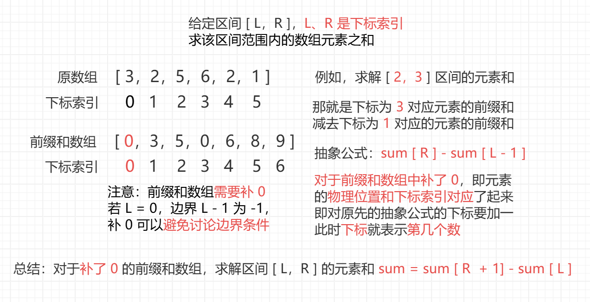
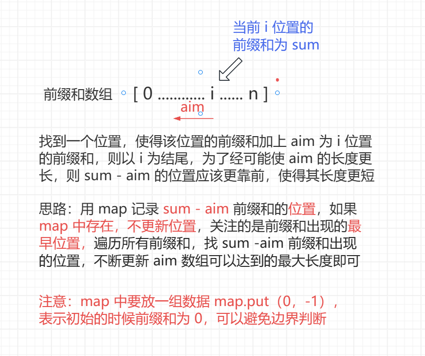

<h1 style="text-align: center; font-weight: bold;">构建前缀信息的技巧</h1>

---

## ⭐ 常用技巧

> #### 构建某个前缀信息<span style="color:red">最早出现、最晚出现、出现次数</span>等，是很常见的技巧，除此之外，还有很多种类的前缀信息可以构建出来，解决很多子数组相关问题

## 一维前缀和

### 题目链接

> #### https://leetcode.cn/problems/range-sum-query-immutable/

### 思路分析

> #### 构建<span style="color:red">前缀和数组</span>

<br/>


### 代码实现

```java
class NumArray {

    public int[] sum;

    public NumArray(int[] nums) {
        sum = new int[nums.length + 1];
        // 0 位置不用，从 1 开始统计前缀和
        // 此时的 i 表示物理位置，即第几个数
        // 所以在 nums 数组中 i 位置的数的下标索引为 i - 1
        for (int i = 1; i <= nums.length; i++) {
            // 当前位置的前缀和 = 前一个数的前缀和 + 当前数字
            sum[i] = sum[i - 1] + nums[i - 1];
        }
    }

    public int sumRange(int left, int right) {
        // [left, right] ，对应第 left + 1 个数到第 right + 1 个数
        // 前缀和为第 right + 1 个数的前缀和 - 第 left 个数的前缀和
        return sum[right + 1] - sum[left];
    }
}
/**
 * Your NumArray object will be instantiated and called as such:
 * NumArray obj = new NumArray(nums);
 * int param_1 = obj.sumRange(left,right);
 */
```

## 和为 aim 的最长子数组

### 题目链接

> #### https://www.nowcoder.com/practice/36fb0fd3c656480c92b569258a1223d5

### 思路分析

> #### 构建前缀和<span style="color:red">最早出现的位置</span>

<br/>


::: tip <span style="font-size:18px;font-weight:bold;">Tip</span>

#### 例如：aim 为 5，而数组只有 5，下标为 0

#### （1）0 位置的前缀和 sum = 5

#### （2）查询 sum - aim = 0 这个前缀和出现在哪，发现没有出现过

#### （3）但是 5 自己可以构成一个子数组，使得子数组的和为 aim，<span style="color:red">错过答案了</span>

#### 为什么会错失答案？原因是<span style="color:red"> 0 -1 这条记录没加</span>，因为 0 这个前缀和在没有数的时候就出现了

:::

### 代码实现

```java
import java.io.*;
import java.util.HashMap;

public class Main {

    public static int MAXN = 100001;

    public static int[] arr = new int[MAXN];

    public static int n, aim;

    // key : 某个前缀和
    // value : 这个前缀和最早出现的位置
    public static HashMap<Integer, Integer> map = new HashMap<>();

    public static void main(String[] args) throws Exception {
        BufferedReader br = new BufferedReader(new InputStreamReader(System.in));
        StreamTokenizer in = new StreamTokenizer(br);
        PrintWriter out = new PrintWriter(new OutputStreamWriter(System.out));

        while (in.nextToken() != StreamTokenizer.TT_EOF) {
            n = (int) in.nval;
            in.nextToken();
            aim = (int) in.nval;
            for (int i = 0; i < n; i++) {
                in.nextToken();
                arr[i] = (int) in.nval;
            }
            out.println(compute());
        }
        out.flush();
        out.close();
        br.close();
    }

    public static int compute() {
        map.clear();
        // 重要的地方，需要放入 0 -1 这组数据
        // 0 这个前缀和，一个数字也没有的时候久存在了
        map.put(0, -1);
        int ans = 0;
        for (int i = 0, sum = 0; i < n; i++) {
            sum += arr[i];
            // 如果前缀和出现过，不更新，只记录最早出现的位置
            if (map.containsKey(sum - aim)) {
                ans = Math.max(ans, i - map.get(sum - aim));
            }
            if (!map.containsKey(sum)) {
                map.put(sum, i);
            }
        }
        return ans;
    }
}
```

## 和为 aim 的子数组个数

### 题目链接

> #### https://leetcode.cn/problems/subarray-sum-equals-k/

### 思路分析

> #### 构建前缀和的<span style="color:red">出现的次数</span>
>
> #### 本题是上一题的转化，统计 <span style="color:red">sum - aim 前缀和出现的次数</span>即为和为 K 的子数组个数
>
> #### ⚠️ 注意：将 <span style="color:red">0 1 这组数据</span>放入 map 中，表示 0 这个前缀和在没有数字的时候已经出现了 1 次

### 代码实现

```java
class Solution {
    // 原来是 int k，这里改成 aim
    public int subarraySum(int[] nums, int aim) {
        HashMap<Integer, Integer> map = new HashMap<>();
        // 表示没有数字的时候， 0 这个前缀和就已经出现了 1 次
        map.put(0, 1);
        int ans = 0;
        for (int i = 0, sum = 0; i < nums.length; i++) {
            sum += nums[i];
            // sum - aim 这个前缀和出现的次数即为 ans
            ans += map.getOrDefault(sum - aim, 0);
            // 记得统计 sum 前缀和出现次数
            map.put(sum, map.getOrDefault(sum, 0) + 1);
        }
        return ans;
    }
}
```

## 元素个数相同的最长子数组

### 题目链接

> #### https://www.nowcoder.com/practice/545544c060804eceaed0bb84fcd992fb

### 思路分析

> #### 构建前缀和<span style="color:red">最早出现的位置</span>
>
> #### 对于元素个数相同的问题，可以<span style="color:red">转化为状态</span>，例如：正数认为是 1，负数认为是 -1
>
> #### 因为元素个数相同，即转化为求累加和 aim = 0 的最长子数组长度，转化为第一题
>
> #### ⚠️ 注意：将 <span style="color:red">0 -1 这组数据</span>放入 map 中，表示 0 这个前缀和在没有数字的时候已经出现了

### 代码实现

```java
import java.io.*;
import java.util.HashMap;

public class Main {

    public static int MAXN = 100001;

    public static int[] arr = new int[MAXN];

    public static int n;

    public static HashMap<Integer, Integer> map = new HashMap<>();

    public static void main(String[] args) throws IOException {
        BufferedReader br = new BufferedReader(new InputStreamReader(System.in));
        StreamTokenizer in = new StreamTokenizer(br);
        PrintWriter out = new PrintWriter(new OutputStreamWriter(System.out));
        while (in.nextToken() != StreamTokenizer.TT_EOF) {
            n = (int) in.nval;
            for (int i = 0, num; i < n; i++) {
                in.nextToken();
                num = (int) in.nval;
                // 状态转化，正数认为是 1，负数认为是 -1
                arr[i] = num != 0 ? (num > 0 ? 1 : -1) : 0;
            }
            out.println(compute());
        }
        out.flush();
        out.close();
        br.close();
    }

    public static int compute() {
        map.clear();
        map.put(0, -1);
        int ans = 0;
        for (int i = 0, sum = 0; i < n; i++) {
            sum += arr[i];
            if (map.containsKey(sum)) {
                ans = Math.max(ans, i - map.get(sum));
            } else {
                map.put(sum, i);
            }
        }
        return ans;
    }
}
```

## 表现良好的最长时间段

### 题目链接

> #### https://leetcode.cn/problems/longest-well-performing-interval/

### 思路分析

> #### 构建前缀和<span style="color:red">最早出现的位置</span>
>
> #### 题意中<span style="color:red">有效子数组</span>指的是 （> 8 的元素个数） > （<= 8 的元素个数），需要找出最长的
>
> #### 还是可以做<span style="color: red;">状态转化</span>，将 > 8 认为是 1，<= 8 认为是 -1，即求子数组累加和 >= 1 的最长子数组
>
> #### 情况一：i 位置的前缀和 <span style="color:red">> 0</span>，说明（> 8 的元素个数） > （<= 8 的元素个数） 这个条件成立，则最长子数组的长度为 <span style="color:red">i + 1</span>
>
> #### 情况二：i 位置的前缀和 <span style="color:red">< 0</span>，而数组转化后不是 1 就是 -1，如果前缀和要增加或者减少，那也<span style="color:red">只能一点点的增加或者减少</span>，例如 i 位置的前缀和为 -3，只需要找前缀和为 -4 的<span style="color:red">最早出现</span>在哪里，例如说有一个前缀和为 -5，则它的位置一定在 -4 的后边，又比如有一个前缀和为 -6，则它的位置一定在 -5 的后边，因为数组中只有 1 和 -1，前缀和只能<span style="color:red">一点点</span>的增加或者减少，即只有查找前缀和 -4 出现的<span style="color:red">最早位置</span>才能使得有效数组的长度尽可能的长
>
> #### ⚠️ 注意：将 <span style="color:red">0 -1 这组数据</span>放入 map 中，表示 0 这个前缀和在没有数字的时候已经出现了

### 代码实现

```java
class Solution {
    public int longestWPI(int[] hours) {
        HashMap<Integer, Integer> map = new HashMap<>();
        // 0 这个前缀和在一个数也没有的时候就已经出现了
        map.put(0, -1);
        int ans = 0;
        for (int i = 0, sum = 0; i < hours.length; i++) {
            // 状态转化
            sum += hours[i] > 8 ? 1 : -1;
            // 此时的子数组符合题目要求
            if (sum > 0) {
                ans = i + 1;
            } else {
                // sum < 0，找前缀和 sum - 1 的最早出现位置
                if (map.containsKey(sum - 1)) {
                    ans = Math.max(ans, i - map.get(sum - 1));
                }
            }
            if (!map.containsKey(sum)) {
                map.put(sum, i);
            }
        }
        return ans;
    }
}
```

## 使数组和能被 P 整除

### 题目链接

> #### https://leetcode.cn/problems/make-sum-divisible-by-p/description/

### 思路分析

> #### 构建前缀和<span style="color:red">余数最晚出现的位置</span>
>
> #### 设置一个 map，key 为前缀和 % p 的余数，value 为最晚出现位置
>
> #### 假设一个数组整体和 % p 的余数为 4，0 到 i 位置的和 % p 的余数为 6，从 i 位置往前面找，拿掉一个子数组和 % p 的余数为 4 的，就可以实现整个数组可以被 p 整除
>
> #### 那如何找到余数为 4 的这个子数组，且使其尽量的短呢？即只需要寻找余数为 2 （6 - 4）的子数组的最晚出现位置，遍历每一个位置的 i，不断更新最短子数组的长度即可
>
> #### 情况一：i 位置的余数 cur <span style="color:red">></span> 整体的余数 mod，需要找余数 i - cur 的最晚出现位置
>
> #### 情况二：i 位置的余数 cur <span style="color:red"><</span> 整体的余数 mod，需要找余数 cur - mod <span style="color:red">+ p</span> 的最晚出现位置
>
> #### 为什么要 +p ？因为题目中的数据给定 <span style="color:red">num [ i ] >= 1</span>，即余数不会出现负数， +p 可以<span style="color:red">等效处理</span>，具体原因见同余定理笔记中<span style="color:red">减法同余</span>的 Tip 部分内容，做了详细的解释
>
> #### ⚠️ 注意：将 <span style="color:red">0 -1 这组数据</span>放入 map 中，表示 0 这个前缀和在没有数字的时候已经出现了

### 代码实现

```java
class Solution {
    public int minSubarray(int[] nums, int p) {
        // 整体余数
        int mod = 0;
        // 性质的逆运用：(a % p) % p 等价于 a % p
        // 带入逐步递归，最后发现就是对整体求和然后 % p
        for (int num : nums) {
            mod = (mod + num) % p;
        }
        if (mod == 0) {
            return 0;
        }
        //   key ：前缀和 %p 的余数
        // value ：最晚出现的位置
        HashMap<Integer, Integer> map = new HashMap<>();
        // 0 这个前缀和在一个数也没有的时候就出现了
        map.put(0, -1);
        int ans = Integer.MAX_VALUE;
        for (int i = 0, cur = 0, find; i < nums.length; i++) {
            // 0 ... i 这部分的余数
            cur = (cur + nums[i]) % p;
            find = cur >= mod ? (cur - mod) : (cur + p - mod);
            // find = (cur + p - mod) % p;
            if (map.containsKey(find)) {
                ans = Math.min(ans, i - map.get(find));
            }
            // 因为要的是最晚位置，直接更新
            map.put(cur, i);
        }
        return ans == nums.length ? -1 : ans;
    }
}
```

### ⭐ 区间和取模的写法

> #### 加法同余性质：（a + b） % p = （a % p + b % p） % p，<span style="color:red">即 a % p 等价于 （a % p） % p</span>
>
> #### 第一轮推导：mod = （0 + x1​） % p = （x1​）% p
>
> #### 第二轮推导：mod = （（<span style="color:red">x1 % p</span>）​ + x2​） % p = （<span style="color:red">x1</span>​ + x2​） % p，标红部分是<span style="color:red">性质的逆应用</span>
>
> #### .................
>
> #### 第 n 轮推导： mod = （（<span style="color:red">X1 % p</span>）​ + ... + （Xn-1 % p） + Xn​） % p = （<span style="color:red">x1​ + ... + xn</span>​） % p
>
> #### 对于 <span style="color:red">0 到 i 这个区间</span>，该区间的和 %p 的结果为，for 循环遍历每个数，初始 mod = 0
>
> #### mod = （mod + num [ i ]）% p

```java
// 1. 求整个数组的和 %p 的结果
int mod = 0;
for (int num : nums) {
    mod = (mod + num) % p;
}

// 2. 给定区间 0，i，求该区间和 %p 的结果
long mod = 0; // 防止溢出，更安全的写法
for (int i = 0; i < nums.length; i++) {
    mod = (mod + nums[i]) % p;
    // 余数小于 0，而余数要求取正数，+p
    // 为什么 +p 可以用减法同余来理解
    if (mod < 0) {
        mod += p;
    }
    // 取余前缀和，表示 i 位置即之前所有数之和取余的结果
    // 注意：sum 数组基于一位前缀和模板，采用 n + 1 的长度，0 位置不用
    sum[i + 1] = (int) mod;
}

// 3. 给定区间 i，j，求该区间所有数求和取余的结果
//   考虑到余数可能为负数，+p 处理
//   注意：sum 数组基于一位前缀和模板，采用 n + 1 的长度，0 位置不用
int ans = (sum[j + 1] - sum[i] + p) % p;
```

## 偶数次元音的最长子字符串

### 题目链接

> #### https://leetcode.cn/problems/find-the-longest-substring-containing-vowels-in-even-counts/

### 思路分析

> #### 构建前缀<span style="color:red">奇偶状态最早出现的位置</span>
>
> #### 对于 a e i o u 这五位，出现<span style="color:red">偶数次</span>，记为<span style="color:red">状态 0</span>，出现<span style="color:red">奇数</span>次，记为<span style="color:red">状态 1</span>，可以用<span style="color:red">位运算</span>表示
>
> #### 对于一个字串，0 到 i 位置 a e i o u 有一个状态，那只需要在 i 位置往前寻找一个前缀字符串，该字符串的状态和 0 到 i 的<span style="color:red">状态相同</span>，那中间的字串的每个字符就是出现偶数次的，为什么？
>
> #### 对于每一个字符，<span style="color:red">奇数 + 偶数 = 奇数，偶数 + 偶数 = 偶数</span>，利用奇偶性来推测

### 代码实现

```java
class Solution {
    public int findTheLongestSubstring(String s) {
        int n = s.length();
        // 偶数次，记为状态 0，出现奇数次，记为状态 1
        // 只有 5 个元音字符，状态就是 5 位，32 位就够用了
        // map[i] 表示状态 i 对应的最长子串的长度
        int[] map = new int[32];
        // 例如 map[...01100] = -2
        // 用 -2 表示这个状态之前没有出现过
        Arrays.fill(map, -2);
        // 0 0 0 0 0
        // u o i e a
        // 上面这个状态天然是偶数状态，用 -1 表示
        // 在一个数也没有的时候就出现过了
        map[0] = -1;
        int ans = 0;
        for (int i = 0, status = 0, m; i < n; i++) {
            // status 表示 0 ... i-1 字符串上 a e i o u 的奇偶性
            // s[i] 表示当前字符
            // 情况 1 ：当前字符不是原因，status 不变
            // 情况 2： 当前字符是元音，a ~ u(0 ~ 4)，修改相应的状态
            // m : 需要修改哪一位的状态，拿到对应的下标索引
            m = move(s.charAt(i));
            // m != -1 说明遇到元音，修改对应字符的状态
            if (m != -1) {
                // 异或运算实现改变状态，0 变 1，1 变 0
                status ^= (1 << m);
            }
            // 此时 status 变成 0 ... i 字符串上 a e i o u 的奇偶性
            // 找同样的状态最早出现在哪，之前出现过，更新字符串最大长度
            if (map[status] != -2) {
                ans = Math.max(ans, i - map[status]);
            } else {
                // 第一次出现，记录当前状态最早出现在 i 位置
                map[status] = i;
            }
        }
        return ans;
    }

    // 返回元音对应的下标索引
    public int move(char cha) {
        switch (cha) {
            case 'a':
                return 0;
            case 'e':
                return 1;
            case 'i':
                return 2;
            case 'o':
                return 3;
            case 'u':
                return 4;
            default:
                return -1;
        }
    }
}
```
