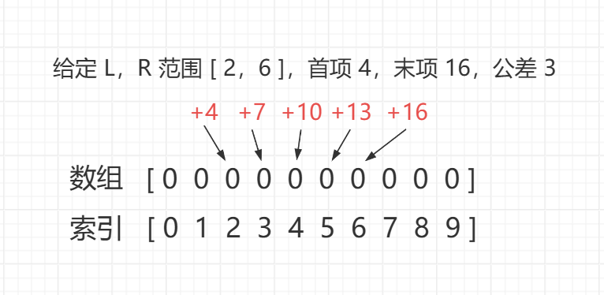
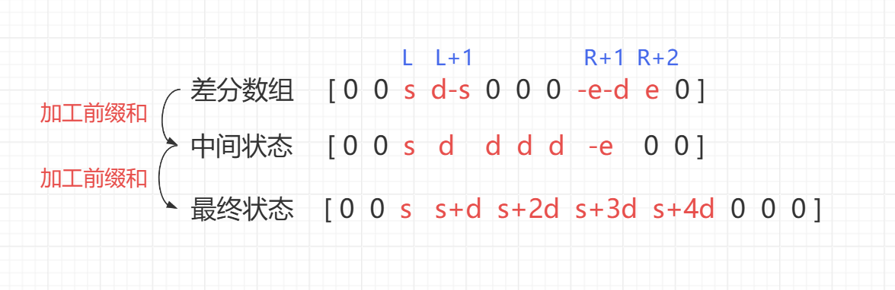
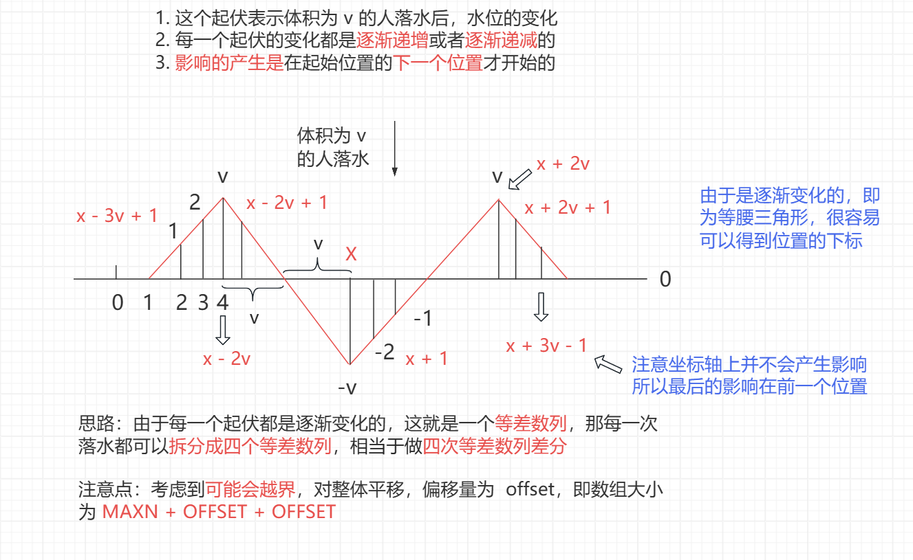

<h1 style="text-align: center; font-weight: bold;">一维差分与等差数列差分</h1>

---

## 什么是差分？

### 基本介绍

> #### 在数组的某个区间上<span style="color:red">做同一个操作</span>（加一个数或减一个数），需要返回结果
>
> #### ⚠️ 注意：<span style="color:red">不支持边操作边查询</span>，这是<span style="color:red">线段树</span>或者<span style="color:red">树状数组</span>可以实现的

### 模板思路

> #### 对于区间 [L，R]，需要对这个区间的数都做某个操作
>
> #### 在<span style="color:red"> L </span>位置<span style="color:red">加</span>上某个数（效果<span style="color:red">生效</span>的左边界）
>
> #### 区间的<span style="color:red"> R + 1 </span>位置<span style="color:red">减</span>去某个数（效果<span style="color:red">失效</span>的右边界）
>
> #### 从左往右遍历整个数组<span style="color:red">计算前缀和</span>，最后的结果就是答案

## 一维差分

### 模板题目

> #### https://leetcode.cn/problems/corporate-flight-bookings/

### 思路分析

> #### 一维差分模板题，在 <span style="color:red"> L </span> 位置<span style="color:red">加上</span>预定的航班数，在 <span style="color:red"> R + 1 </span> 位置<span style="color:red">减去</span>预定的航班数
>
> #### 遍历整个数组加工<span style="color:red">一遍</span>前缀和，得到的结果就是答案，返回该数组即可

### 代码实现

```java
class Solution {
    public int[] corpFlightBookings(int[][] bookings, int n) {
        // 差分数组，长度设置为 n + 2
        // 因为编号从 1 开始，同时需要在 R + 1 位置操作
        int[] cnt = new int[n + 2];

        // 差分操作
        for (int[] booking : bookings) {
            // L 位置
            cnt[booking[0]] += booking[2];
            // R + 1 位置
            cnt[booking[1] + 1] -= booking[2];
        }

        // 加工前缀和
        for (int i = 1; i < cnt.length; i++) {
            cnt[i] += cnt[i - 1];
        }

        int[] ans = new int[n];
        for (int i = 0; i < ans.length; i++) {
            ans[i] = cnt[i + 1];
        }
        return ans;
    }
}
```

## 等差数列差分

### 问题描述

> #### 一开始 1~n 范围上的数字都是 0，接下来一共有 m 个操作，每次操作对 l~r 范围上依次加上首项 s、末项 e、公差 d 的数列最终 1~n 范围上的每个数字都要正确得到

<br/>


### 原理分析

> #### 给定范围 L，R，s 是首项，e 是末项，d 是公差
>
> #### 运用 <span style="color:red">set 方法</span>实现以下步骤
>
> #### arr [ l ] += s
>
> #### arr [ l + 1 ] += d - s
>
> #### arr [ r + 1 ] -= d + e
>
> #### arr [ r + 2 ] += e
>
> #### 最后用 <span style="color:red">build 方法</span>来<span style="color:red">两遍</span>前缀和，得到的结果即为答案

<br/>


### 模板题目

> #### https://www.luogu.com.cn/problem/P4231

### 代码实现

```java
import java.io.*;

public class Main {

    public static int MAXN = 10000005;

    public static long[] arr = new long[MAXN];

    public static int n, m;

    public static void main(String[] args) throws Exception {
        BufferedReader br = new BufferedReader(new InputStreamReader(System.in));
        StreamTokenizer in = new StreamTokenizer(br);
        PrintWriter out = new PrintWriter(new OutputStreamWriter(System.out));
        while (in.nextToken() != StreamTokenizer.TT_EOF) {
            n = (int) in.nval;
            in.nextToken();
            m = (int) in.nval;
            // 根据等差数列，末项 e  = s + (r - l) * d
            // 范围 l，r，首项 s，末项 e，公差 d  = (e - s) / (r - l)
            for (int i = 0, l, r, s, e; i < m; i++) {
                in.nextToken();
                l = (int) in.nval;
                in.nextToken();
                r = (int) in.nval;
                in.nextToken();
                s = (int) in.nval;
                in.nextToken();
                e = (int) in.nval;
                set(l, r, s, e, (e - s) / (r - l));
            }
            build();
            long max = 0;
            long xor = 0;
            // 柱子编号从 1 开始，共有 n 根柱子
            for (int i = 1; i <= n; i++) {
                max = Math.max(max, arr[i]);
                xor ^= arr[i];
            }
            out.println(xor + " " + max);
        }
        out.flush();
        br.close();
        out.close();
    }

    public static void set(int l, int r, int s, int e, int d) {
        arr[l] += s;
        arr[l + 1] += d - s;
        arr[r + 1] -= d + e;
        arr[r + 2] += e;
    }

    public static void build() {
        for (int i = 1; i <= n; i++) {
            arr[i] += arr[i - 1];
        }
        for (int i = 1; i <= n; i++) {
            arr[i] += arr[i - 1];
        }
    }
}
```

## 落水后的水位

### 题目链接

> #### https://www.luogu.com.cn/problem/P5026

### 思路分析

<br/>


### 代码实现

```java
import java.io.*;

public class Main {

    // 题目说了m <= 10^6，代表湖泊宽度
    // 这就是 MAXN 的含义，湖泊最大宽度的极限
    public static int MAXN = 1000001;

    // 数值保护，因为题目中v最大是 10000
    // 所以左侧影响最远的位置到达了x - 3 * v + 1
    // 所以右侧影响最远的位置到达了x + 3 * v - 1
    // x如果是正式的位置(1~m)，那么左、右侧可能超过正式位置差不多 30000 的规模
    // 这就是 OFFSET 的含义
    public static int OFFSET = 30001;

    // 湖泊宽度是 MAXN，是正式位置的范围
    // 左、右侧可能超过正式位置差不多 OFFSET 的规模
    // 所以准备一个长度为OFFSET + MAXN + OFFSET的数组
    // 这样一来，左侧影响最远的位置...右侧影响最远的位置，
    // 都可以被arr中的下标表示出来，就省去了很多越界讨论
    public static int[] arr = new int[OFFSET + MAXN + OFFSET];

    public static int n, m;

    public static void main(String[] args) throws Exception {
        BufferedReader br = new BufferedReader(new InputStreamReader(System.in));
        StreamTokenizer in = new StreamTokenizer(br);
        PrintWriter out = new PrintWriter(new OutputStreamWriter(System.out));
        while (in.nextToken() != StreamTokenizer.TT_EOF) {
            // n 有多少个人落水，每个人落水意味着四个等差数列操作
            n = (int) in.nval;
            in.nextToken();
            // 一共有多少位置，1~m个位置，最终要打印每个位置的水位
            m = (int) in.nval;
            for (int i = 0, v, x; i < n; i++) {
                in.nextToken();
                v = (int) in.nval;
                in.nextToken();
                x = (int) in.nval;
                // v 体积的人，在 x 处落水，修改差分数组
                fall(v, x);
            }
            // 生成最终的水位数组
            build();
            // 开始收集答案
            // 0...OFFSET 这些位置是辅助位置，为了防止越界设计的
            // 从 OFFSET+1 开始往下数 m 个，才是正式的位置 1...m
            // 打印这些位置，就是返回正式位置 1...m 的水位
            int start = OFFSET + 1;
            out.print(arr[start++]);
            for (int i = 2; i <= m; i++) {
                out.print(" " + arr[start++]);
            }
            out.println();
        }
        out.flush();
        out.close();
        br.close();
    }

    public static void fall(int v, int x) {
        set(x - 3 * v + 1, x - 2 * v, 1, v, 1);
        set(x - 2 * v + 1, x, v - 1, -v, -1);
        set(x + 1, x + 2 * v, -v + 1, v, 1);
        set(x + 2 * v + 1, x + 3 * v - 1, v - 1, 1, -1);
    }

    public static void set(int l, int r, int s, int e, int d) {
        // 为了防止 x - 3 * v + 1 出现负数下标，进而有很多很烦的边界讨论
        // 所以任何位置，都加上一个较大的数字（OFFSET）
        // 这样一来，所有下标就都在0以上了，省去了大量边界讨论
        // 这就是为什么arr在初始化的时候要准备OFFSET + MAXN + OFFSET这么多的空间
        arr[l + OFFSET] += s;
        arr[l + 1 + OFFSET] += d - s;
        arr[r + 1 + OFFSET] -= d + e;
        arr[r + 2 + OFFSET] += e;
    }

    public static void build() {
        for (int i = 1; i <= m + OFFSET; i++) {
            arr[i] += arr[i - 1];
        }
        for (int i = 1; i <= m + OFFSET; i++) {
            arr[i] += arr[i - 1];
        }
    }
}
```
