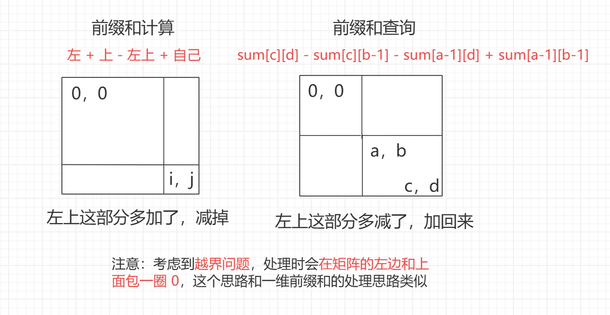
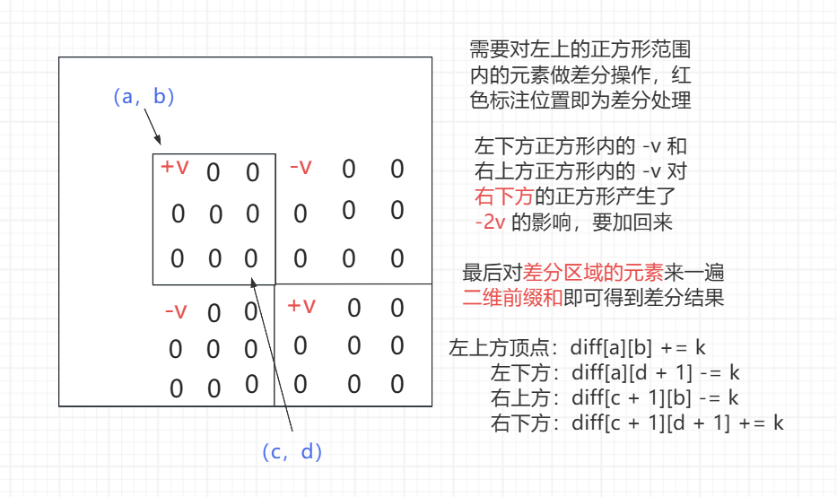

<h1 style="text-align: center; font-weight: bold;">二维前缀和，二维差分，离散化技巧</h1>

---

## 二维前缀和

### 原理解析

<br/>


### 模板题目

> #### https://leetcode.cn/problems/range-sum-query-2d-immutable/

### 代码实现

```java
class NumMatrix {

    public int[][] sum;

    public NumMatrix(int[][] matrix) {
        int n = matrix.length;
        int m = matrix[0].length;
        // 防止越界，在矩阵的左边和上方包一圈 0
        sum = new int[n + 1][m + 1];
        for (int a = 1, c = 0; c < n; a++, c++) {
            for (int b = 1, d = 0; d < m; b++, d++) {
                // 平移处理
                // 原来的 i,j 位置的值拷贝到 i+1,j+1 位置
                sum[a][b] = matrix[c][d];
            }
        }

        // 计算前缀和
        // 包了 0，起始位置为 1,1 开始计算
        for (int i = 1; i <= n; i++) {
            for (int j = 1; j <= m; j++) {
                // 左 + 上 - 左上 + 自己
                sum[i][j] += sum[i - 1][j] + sum[i][j - 1] - sum[i - 1][j - 1];
            }
        }
    }

    // 原来是 row 1,col 1, row 2,col 2，这里改成 a,b,c,d
    public int sumRegion(int a, int b, int c, int d) {
        // 平移前的前缀和查询公式
        // sum[c][d] - sum[c][b-1] - sum[a-1][d] + sum[a-1][b-1]
        // 因为实在平移后的矩阵中算前缀和，所以 c++,d++
        // 因为在原始前缀和查询公式中 a,b 都会减一，又因为是平移处理的
        // 所以 a,b 不用平移，天然的表示减一位置
        // 简单理解：因为要平移，所以对原始前缀和查询公式所有位置 +1 处理
        c++;
        d++;
        return sum[c][d] - sum[c][b] - sum[a][d] + sum[a][b];
    }

    //        public int sumRegion(int a, int b, int c, int d) {
    //            a++;
    //            b++;
    //            c++;
    //            d++;
    //            return sum[c][d] - sum[c][b-1] - sum[a-1][d] + sum[a-1][b-1];
    //        }
}

/**
 * Your NumMatrix object will be instantiated and called as such:
 * NumMatrix obj = new NumMatrix(matrix);
 * int param_1 = obj.sumRegion(row1,col1,row2,col2);
 */
```

## 边框都是 1 的最大正方形

### 题目链接

> #### https://leetcode.cn/problems/largest-1-bordered-square/

### 思路分析

> #### 时间复杂度：O（m \* n \* min（m，n）），m，n 表示所<span style="color:red;">左上角点</span>的可能位置，<span style="color:red;">min（m，n）</span>表示正方形<span style="color:red;">边长的可能性</span>
>
> #### 如果确定每个正方形后再去遍历边长判断是否都为 1，则复杂度还要再原基础上再 \* 4 \* min（m，n），而本题优化的点就是在判断这里能不能更快
>
> #### 判断周长是否全为 1，可以用外围的面积减去内部的面积，如果<span style="color:red;">面积差值 = 4 \* 边长</span>，那就是合法的正方形，计算面积的过程可以使用<span style="color:red;">二位前缀和</span>实现
>
> #### 只关心每个位置的二维前缀和，用于计算面积进而判断是否合法，原数组并不关心，所以可以复用原数组，将其转为二维前缀和数组，复用后<span style="color:red;">无法补 0，注意边界条件的判断</span>，复用了原数组还节省了空间

> #### 空间复杂度：O（1）

### 代码实现

```java
class Solution {
    public int largest1BorderedSquare(int[][] grid) {
        int n = grid.length;
        int m = grid[0].length;
        build(n, m, grid);
        // 特判：如果前缀和都为 0，压根就没有 1
        if (sum(grid, 0, 0, n - 1, m - 1) == 0) {
            return 0;
        }
        // 1 * 1 的正方形肯定存在，找更大的正方形
        int ans = 1;
        // 枚举所有可能的左上角顶点
        for (int a = 0; a < n; a++) {
            for (int b = 0; b < m; b++) {
                // 左上角顶点 (a,b)，右下角顶点 (c,d)，枚举可能的边长
                // +ans 表示剪枝，在原来相对大的正方形的基础上找更大的
                // 不要重复遍历已经遍历过的部分，边长 k 从 ans + 1 开始
                for (int c = a + ans, d = b + ans, k = ans + 1; c < n && d < m; c++, d++, k++) {
                    // 找到了更大的正方形边长，更新答案
                    // 外层大正方形边长为 k，内层正方形的周长：（k - 1） * 2
                    if (sum(grid, a, b, c, d) - sum(grid, a + 1, b + 1, c - 1, d - 1) == (k - 1) << 2) {
                        ans = k;
                    }
                }
            }
        }
        return ans * ans;

    }

    // 将原始数组 g 变成前缀和数组，复用自己
    // 注意这里无法补 0，需要注意边界判断
    // 计算二维前缀和：左 + 上 - 左上 + 自己
    public static void build(int n, int m, int[][] g) {
        for (int i = 0; i < n; i++) {
            for (int j = 0; j < m; j++) {
                g[i][j] += get(g, i, j - 1) + get(g, i - 1, j) - get(g, i - 1, j - 1);
            }
        }
    }

    // 二维前缀和查询，左上角顶点 (a,b)，右下角顶点 (c,d)
    public static int sum(int[][] g, int a, int b, int c, int d) {
        // 加上特判，例如只有 2 * 2 的正方形，就没有内部空间，但是计算后 a,c 错位了
        return a > c ? 0 : (g[c][d] - get(g, c, b - 1) - get(g, a - 1, d) + get(g, a - 1, b - 1));
    }

    // 由于无法补 0，写一个方法处理越界情况
    public static int get(int[][] g, int i, int j) {
        return (i < 0 || j < 0) ? 0 : g[i][j];
    }
}
```

## 二维差分

### 原理分析

> #### ⚠️ 注意：会在矩阵外层包一圈 0，可以避免很多边界的讨论

<br/>


### 模板题目

> #### https://www.luogu.com.cn/problem/P3397

### 代码实现

```java
import java.io.*;

public class Main {

    // 外围会包一层 0 ，避免了很多边界处理
    // 对于行和列都多出了 2 行（列），所以要加 2
    public static int MAXN = 1002;

    public static int[][] diff = new int[MAXN][MAXN];

    public static int n, q;

    public static void main(String[] args) throws Exception {
        BufferedReader br = new BufferedReader(new InputStreamReader(System.in));
        StreamTokenizer in = new StreamTokenizer(br);
        PrintWriter out = new PrintWriter(new OutputStreamWriter(System.out));
        while (in.nextToken() != StreamTokenizer.TT_EOF) {
            n = (int) in.nval;
            in.nextToken();
            q = (int) in.nval;
            for (int i = 1, a, b, c, d; i <= q; i++) {
                in.nextToken();
                a = (int) in.nval;
                in.nextToken();
                b = (int) in.nval;
                in.nextToken();
                c = (int) in.nval;
                in.nextToken();
                d = (int) in.nval;
                add(a, b, c, d, 1);
            }
            build();
            for (int i = 1; i <= n; i++) {
                out.print(diff[i][1]);
                for (int j = 2; j <= n; j++) {
                    out.print(" " + diff[i][j]);
                }
                out.println();
            }
            clear();
        }
        out.flush();
        out.close();
        br.close();
    }

    // 差分处理
    public static void add(int a, int b, int c, int d, int k) {
        diff[a][b] += k;
        // 右上方
        diff[c + 1][b] -= k;
        // 左下方
        diff[a][d + 1] -= k;
        // 右下方
        diff[c + 1][d + 1] += k;
    }

    // 加工前缀和
    public static void build() {
        for (int i = 1; i <= n; i++) {
            for (int j = 1; j <= n; j++) {
                // 左 + 上 - 左上 + 自己
                diff[i][j] += diff[i][j - 1] + diff[i - 1][j] - diff[i - 1][j - 1];
            }
        }
    }

    // 采用静态空间，清理脏数据，不影响下一组测试用例
    public static void clear() {
        for (int i = 1; i <= n + 1; i++) {
            for (int j = 1; j <= n + 1; j++) {
                diff[i][j] = 0;
            }
        }
    }
}
```

## 二维前缀和 + 差分

### 题目链接

> #### https://leetcode.cn/problems/stamping-the-grid/

### 思路分析

> #### <span style="color:red;">1</span> 表示<span style="color:red;">不能贴</span>邮票的区域，<span style="color:red;">0</span> 表示<span style="color:red;">可以贴</span>邮票的区域
>
> #### 遍历每一个 0，来到一个 0 位置判断能不能贴
>
> #### 二维前缀和：当前 0 位置开始找出邮票大小的区域，如果前缀和 > 0，说明该区域有 0，不能贴邮票
>
> #### 二维差分：贴了邮票，该区域就不能贴邮票了，利用差分将该区域都修改为 1
>
> #### 如果原始数组中 0 位置的元素在差分数组中对应位置的值是 1，说明 0 位置贴贴上了邮票，否则就没有贴上邮票
>
> #### 最后判断原始矩阵和差分矩阵中<span style="color:red;">对应位置的元素是不是 0</span>，如果是 0，说明没有贴上邮票，返回 false

### 代码实现

```java
class Solution {
    // 时间复杂度O(n*m)，额外空间复杂度O(n*m)
    // 原来是 int stampHeight, int stampWidth，这里改成 int h, int w
    public boolean possibleToStamp(int[][] grid, int h, int w) {
        int n = grid.length;
        int m = grid[0].length;
        // sum 是前缀和数组，左边和上面包一层 0，避免边界讨论
        int[][] sum = new int[n + 1][m + 1];
        // 将原始数组的内容拷贝到 sum 数组中，再做前缀和处理
        for (int i = 0; i < n; i++) {
            for (int j = 0; j < m; j++) {
                sum[i + 1][j + 1] = grid[i][j];
            }
        }
        // 加工前缀和，得到前缀和数组的结果
        build(sum);
        // diff 是差分数组，外层包一圈 0，避免边界讨论
        // 当贴邮票的时候，不在原始矩阵里贴，在差分矩阵里贴
        // 原始矩阵就用来判断能不能贴邮票，不进行修改
        // 每贴一张邮票都在差分矩阵里修改
        int[][] diff = new int[n + 2][m + 2];
        for (int a = 1, c = a + h - 1; c <= n; a++, c++) {
            for (int b = 1, d = b + w - 1; d <= m; b++, d++) {
                if (sumRegion(sum, a, b, c, d) == 0) {
                    // 原始矩阵中 (a,b)左上角点
                    // 根据邮票规格，h、w，算出右下角点(c,d)
                    // 如果这个区域的元素都是 0 ，则说明
                    // sumRegion(sum, a, b, c, d) == 0
                    // 那么此时这个区域可以贴邮票
                    add(diff, a, b, c, d);
                }
            }
        }
        // 加工前缀和，得到差分数组的结果
        build(diff);

        // 检查所有的格子，如果原始数组和差分数组中对应位置的元素为 0
        // 说明不能贴邮票，不符合题意，返回 false
        for (int i = 0; i < n; i++) {
            for (int j = 0; j < m; j++) {
                // diff 数组是包了一层 0 的，注意平移关系
                if (grid[i][j] == 0 && diff[i + 1][j + 1] == 0) {
                    return false;
                }
            }
        }
        return true;
    }

    // 加工前缀和
    public void build(int[][] m) {
        for (int i = 1; i < m.length; i++) {
            for (int j = 1; j < m[0].length; j++) {
                // 左 + 上 - 左上 + 自己
                m[i][j] += m[i - 1][j] + m[i][j - 1] - m[i - 1][j - 1];
            }
        }
    }

    // 前缀和查询
    public int sumRegion(int[][] sum, int a, int b, int c, int d) {
        return sum[c][d] - sum[c][b - 1] - sum[a - 1][d] + sum[a - 1][b - 1];
    }

    // 差分处理
    public void add(int[][] diff, int a, int b, int c, int d) {
        // 左上方
        diff[a][b] += 1;
        // 右下方
        diff[c + 1][d + 1] += 1;
        // 左下方
        diff[c + 1][b] -= 1;
        // 右上方
        diff[a][d + 1] -= 1;
    }
}
```

## 离散化技巧

### 原理分析

> #### （1）当边长出现<span style="color:red">小数，负数，无法转换为数组下标</span>的时候，可以等比例缩放边长
>
> #### 对于本题，用左右上下表示力场的边界，r 表示力场的边长，（x，y）为力场的中心点坐标
>
> #### 则 <span style="color:red">X 左 = 2 \* x - r，X 右 = 2 \* x + r，Y 下 = 2 \* y - r，Y 上 = 2 \* y + r</span>
>
> #### （2）当<span style="color:red">数值的范围很大</span>时，然而题目<span style="color:red">只关心种类</span>的数量，可以忽略原始的真实大小，关注数量，使用离散化数组压缩存储，<span style="color:red">排序 + 去重实现，重新编号</span>，每个数值对应一个编号
>
> #### 例如 x 为 120，去重排序后找到 120 对应的数组索引下标，<span style="color:red">编号 = 下标索引 + 1</span>，计算 120 对应的编号，则后续再出现 120 的时候，就认为 120 对应的编号表示 120 这个位置，而不用根据真实的值开辟空间
>
> #### 原因：（1）如果数值很大，数据需要开辟的空间也很大（2）如果数组中有很多重复的元素，就浪费了很多空间，使用同一个编号就可以表示多个相同的值，同时编号远远比元素的真实值小的多，这样就大大的节省了空间

### 题目链接

> #### https://leetcode.cn/problems/xepqZ5/

### 思路分析

> #### 本题的叠加力场就是铺地毯场景，即对每一个力场做差分处理，只要有力场存在，则该力场范围内的元素全部加一，最后遍历所有格子，找出最大的格子的值，这就是叠加力场的值
>
> #### 本题有两个点需要<span style="color:red;">离散化处理</span>，一是顶点坐标可能<span style="color:red;">出现小数</span>，二是每个力场中心点坐标和边长会很大，根据题目数据，可以达到 10<sup>9</sup>，显然不可能开辟这么大的内存空间，不关注力场的实际大小，<span style="color:red;">只关注力场的个数</span>，维持相对位置关系即可，相当于等比例缩放

### 代码实现

```java
class Solution {
    // 原来这里是 forceField，这里改成 fields
    // 时间复杂度O(n^2)，额外空间复杂度O(n^2)，n是力场的个数
    public int fieldOfGreatestBlessing(int[][] fields) {
        int n = fields.length;
        // n ：矩阵的个数，一个力场带来两个边界
        long[] xs = new long[n << 1];
        long[] ys = new long[n << 1];
        // 离散化处理 1，等比例缩放，去除小数的影响
        for (int i = 0, k = 0, p = 0; i < n; i++) {
            // x,y 中心坐标，r 正方形的边长
            long x = fields[i][0];
            long y = fields[i][1];
            long r = fields[i][2];
            // 左边界
            xs[k++] = (x << 1) - r;
            // 右边界
            xs[k++] = (x << 1) + r;
            // 下边界
            ys[p++] = (y << 1) - r;
            // 上边界
            ys[p++] = (y << 1) + r;
        }
        // 离散化处理 2，排序 + 去重，压缩存储
        // xs数组中，排序了且相同值只留一份，返回有效长度，ys 同理
        int sizex = sort(xs);
        int sizey = sort(ys);

        // 差分数组，外层包了一圈 0，避免边界讨论
        // n 个力场，sizex：2 * n，sizey：2 * n
        int[][] diff = new int[sizex + 2][sizey + 2];
        for (int i = 0, a, b, c, d; i < n; i++) {
            long x = fields[i][0];
            long y = fields[i][1];
            long r = fields[i][2];
            // 这里不再用真实值，而是用其对应的编号，达到节省空间的目的
            a = rank(xs, (x << 1) - r, sizex);
            b = rank(ys, (y << 1) - r, sizey);
            c = rank(xs, (x << 1) + r, sizex);
            d = rank(ys, (y << 1) + r, sizey);
            add(diff, a, b, c, d);
        }

        int ans = 0;
        for (int i = 1; i < diff.length; i++) {
            for (int j = 1; j < diff[0].length; j++) {
                // 加工前缀和：左 + 上 - 左上 + 自己
                // 加工前缀和的同时同步更新最大力场强度
                diff[i][j] += diff[i - 1][j] + diff[i][j - 1] - diff[i - 1][j - 1];
                ans = Math.max(ans, diff[i][j]);
            }
        }
        return ans;
    }

    // nums 有序数组，有效长度为 size，且 0 ~ size-1 范围上无重复值
    // 已知 v 一定在 nums[0 ~ size -1] 上，返回 v 所对应的编号
    // 使用二分查找实现，优化时间复杂度
    public int rank(long[] nums, long v, int size) {
        int l = 0;
        int r = size - 1;
        int ans = 0;
        while (l <= r) {
            int mid = (l + r) / 2;
            if (nums[mid] >= v) {
                ans = mid;
                r = mid - 1;
            } else {
                l = mid + 1;
            }
        }
        // 注意：返回的是编号，ans 是索引下标
        return ans + 1;
    }

    // 排序 + 去重，返回有效元素的个数，size 控制
    // 返回数组中有效元素的个数
    public int sort(long[] nums) {
        Arrays.sort(nums);
        int size = 1;
        for (int i = 1; i < nums.length; i++) {
            // 不相等就填过来，相同就跳过
            if (nums[i] != nums[size - 1]) {
                nums[size++] = nums[i];
            }
        }
        return size;
    }

    // 二维差分
    public void add(int[][] diff, int a, int b, int c, int d) {
        // 左上方
        diff[a][b] += 1;
        // 右上方
        diff[c + 1][b] -= 1;
        // 左下方
        diff[a][d + 1] -= 1;
        // 右下方
        diff[c + 1][d + 1] += 1;
    }
}
```
