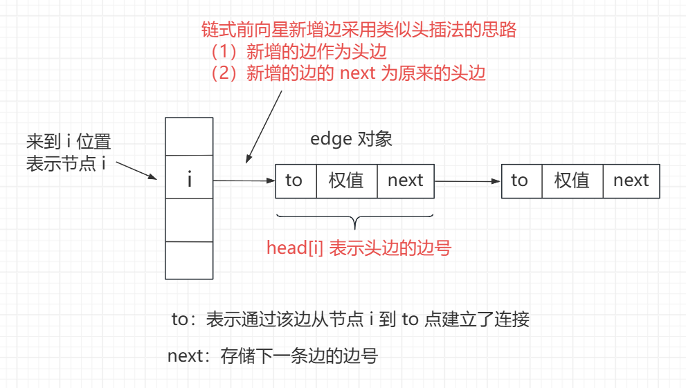

<h1 style="text-align: center; font-weight: bold;">建图，链式前向星，拓扑排序</h1>

---

## 基本介绍

> #### 有向 vs 无向、不带权 vs 带权，入参一般为<span style="color:red">节点数量 n 和所有的边</span> 或者<span style="color:red">直接给图</span>
>
> #### 建图的三种方式
>
> #### （1）邻接矩阵（适合点的数量不多的图）
>
> #### （2）邻接表（最常用的方式）
>
> #### （3）链式前向星（空间要求严苛情况下使用。比赛必用，大厂笔试、面试不常用）

::: tip <span style="font-size:18px;font-weight:bold;">Tip</span>

#### 【必备】课程里涉及图的内容：建图、链式前向星、拓扑排序、最小生成树、bfs、双向广搜、最短路（Dijkstra、A\*、Floyd、Bellman-Ford、SPFA）

#### 【挺难】课程里涉及图的内容：基环树、欧拉回路、割点和桥、强连通分量、双连通分量、最大流、费用流、二分图的最大匹配

:::

## 邻接矩阵建图

### 基本介绍

> #### 通过二维矩阵存储图，graph [ i ] [ j ] 表示 i 与 j 的联系，也可以表示权值
>
> #### <span style="color:red">无向图</span>是特殊的有向图，则 graph [ i ] [ j ] 与 graph [ j ] [ i ] 都要设置

### 代码实现

```java
public class Main {

    // 点的最大数量
    public static int MAXN = 11;

    // 邻接矩阵方式建图
    public static int[][] graph1 = new int[MAXN][MAXN];

    public static void build(int n) {
        // 邻接矩阵清空
        for (int i = 1; i <= n; i++) {
            for (int j = 1; j <= n; j++) {
                graph1[i][j] = 0;
            }
        }
    }

    // 邻接矩阵建立有向图带权图
    public static void directGraph(int[][] edges) {
        for (int[] edge : edges) {
            graph1[edge[0]][edge[1]] = edge[2];
        }
    }

    // 邻接矩阵建立无向图带权图
    public static void undirectGraph(int[][] edges) {
        // 邻接矩阵建图
        for (int[] edge : edges) {
            graph1[edge[0]][edge[1]] = edge[2];
            graph1[edge[1]][edge[0]] = edge[2];
        }
    }

    public static void traversal(int n) {
        System.out.println("邻接矩阵遍历 :");
        for (int i = 1; i <= n; i++) {
            for (int j = 1; j <= n; j++) {
                System.out.print(graph1[i][j] + " ");
            }
            System.out.println();
        }
    }

    public static void main(String[] args) {
        // 理解了带权图的建立过程，也就理解了不带权图
        // 点的编号为 1...n
        // 例子 1 自己画一下图，有向带权图，然后打印结果
        int n1 = 4;
        int[][] edges1 = {{1, 3, 6}, {4, 3, 4}, {2, 4, 2}, {1, 2, 7}, {2, 3, 5}, {3, 1, 1}};
        build(n1);
        directGraph(edges1);
        traversal(n1);
        System.out.println("==============================");
        // 例子 2 自己画一下图，无向带权图，然后打印结果
        int n2 = 5;
        int[][] edges2 = {{3, 5, 4}, {4, 1, 1}, {3, 4, 2}, {5, 2, 4}, {2, 3, 7}, {1, 5, 5}, {4, 2, 6}};
        build(n2);
        undirectGraph(edges2);
        traversal(n2);
    }
}

/*

输出结果如下

邻接矩阵遍历 :
0 7 6 0
0 0 5 2
1 0 0 0
0 0 4 0
==============================
邻接矩阵遍历 :
0 0 0 1 5
0 0 7 6 4
0 7 0 2 4
1 6 2 0 0
5 4 4 0 0

*/
```

## 邻接表建图

### 基本介绍

> #### 邻接表采用<span style="color:red">数组 + 单向链表</span>的结构，数组中每个元素节点后挂架一个链表，表示与该元素相连的元素都存储在链表中，同样分有权与无权图，若是有权图，链表中的值可以采用数组来存储

### 代码实现

```java
import java.util.ArrayList;

public class Main {

    // 点的最大数量
    public static int MAXN = 11;

    // 邻接表方式建图
    // public static ArrayList<ArrayList<Integer>> graph2 = new ArrayList<>();
    public static ArrayList<ArrayList<int[]>> graph2 = new ArrayList<>();

    public static void build(int n) {
        // 邻接表清空和准备
        graph2.clear();
        // 下标需要支持 1 ~ n，所以加入 n + 1 个列表，0下标准备但不用
        for (int i = 0; i <= n; i++) {
            graph2.add(new ArrayList<>());
        }
    }

    public static void directGraph(int[][] edges) {
        // 邻接表建图
        for (int[] edge : edges) {
            // graph2.get(edge[0]).add(edge[1]);
            graph2.get(edge[0]).add(new int[] { edge[1], edge[2] });
        }
    }

    public static void undirectGraph(int[][] edges) {
        // 邻接表建图
        for (int[] edge : edges) {
            // graph2.get(edge[0]).add(edge[1]);
            // graph2.get(edge[1]).add(edge[0]);
            graph2.get(edge[0]).add(new int[] { edge[1], edge[2] });
            graph2.get(edge[1]).add(new int[] { edge[0], edge[2] });
        }
    }

    public static void traversal(int n) {
        System.out.println("邻接表遍历 :");
        for (int i = 1; i <= n; i++) {
            System.out.print(i + "(邻居、边权) : ");
            for (int[] edge : graph2.get(i)) {
                System.out.print("(" + edge[0] + "," + edge[1] + ") ");
            }
            System.out.println();
        }
    }

    public static void main(String[] args) {
        // 理解了带权图的建立过程，也就理解了不带权图
        // 点的编号为 1...n
        // 例子 1 自己画一下图，有向带权图，然后打印结果
        int n1 = 4;
        int[][] edges1 = { { 1, 3, 6 }, { 4, 3, 4 }, { 2, 4, 2 }, { 1, 2, 7 }, { 2, 3, 5 }, { 3, 1, 1 } };
        build(n1);
        directGraph(edges1);
        traversal(n1);
        System.out.println("==============================");
        // 例子 2 自己画一下图，无向带权图，然后打印结果
        int n2 = 5;
        int[][] edges2 = { { 3, 5, 4 }, { 4, 1, 1 }, { 3, 4, 2 }, { 5, 2, 4 }, { 2, 3, 7 }, { 1, 5, 5 }, { 4, 2, 6 } };
        build(n2);
        undirectGraph(edges2);
        traversal(n2);
    }
}

/*

输出结果如下

邻接表遍历 :
1(邻居、边权) : (3,6) (2,7)
2(邻居、边权) : (4,2) (3,5)
3(邻居、边权) : (1,1)
4(邻居、边权) : (3,4)
==============================
邻接表遍历 :
1(邻居、边权) : (4,1) (5,5)
2(邻居、边权) : (5,4) (3,7) (4,6)
3(邻居、边权) : (5,4) (4,2) (2,7)
4(邻居、边权) : (1,1) (3,2) (2,6)
5(邻居、边权) : (3,4) (2,4) (1,5)

*/
```

## 链式前向星建图

### 基本介绍

> #### 链式前向星可以理解为是对邻接表的扩展，邻接表中每个单链表中存储的元素是动态变化的，空间大小是不确定的，而链式前向星在单链表中存储的不再是每一个点，存储的是<span style="color:red">边对象</span>
>
> #### head 数组：下标表示点的编号，值表示该点位置处链接的头边对应的边号
>
> #### next 数组：下标表示边号，值表示下一条边的边号
>
> #### to 数组：下标表示边号，值表示去往的点
>
> #### weight 数组：下标表示边号，值表示权重
>
> #### cnt 变量：表示当前边对应的边号

<br/>


### 代码实现

```java
import java.util.Arrays;

public class Main {

    // 点的最大数量
    public static int MAXN = 11;

    // 边的最大数量
    // 只有链式前向星方式建图需要这个数量
    // 注意如果无向图的最大数量是 m 条边，数量要准备 m*2
    // 因为一条无向边要加两条有向边
    public static int MAXM = 21;

    // 链式前向星方式建图
    public static int[] head = new int[MAXN];

    public static int[] next = new int[MAXM];

    public static int[] to = new int[MAXM];

    // 如果边有权重，那么需要这个数组
    public static int[] weight = new int[MAXM];

    // 如果加入一条边，则当前的边是 cnt 号边，cnt++
    public static int cnt;

    public static void build(int n) {
        // 链式前向星清空
        cnt = 1;
        // 下标需要支持 1 ~ n，0下标准备但不用
        Arrays.fill(head, 1, n + 1, 0);
    }

    // 链式前向星加边
    public static void addEdge(int u, int v, int w) {
        // u -> v , 边权重是 w
        next[cnt] = head[u];
        to[cnt] = v;
        weight[cnt] = w;
        head[u] = cnt++;
    }

    public static void directGraph(int[][] edges) {
        // 链式前向星建图
        for (int[] edge : edges) {
            addEdge(edge[0], edge[1], edge[2]);
        }
    }

    public static void undirectGraph(int[][] edges) {
        // 链式前向星建图
        for (int[] edge : edges) {
            addEdge(edge[0], edge[1], edge[2]);
            addEdge(edge[1], edge[0], edge[2]);
        }
    }

    public static void traversal(int n) {
        System.out.println("链式前向星 :");
        for (int i = 1; i <= n; i++) {
            System.out.print(i + "(邻居、边权) : ");
            // 注意这个 for 循环，链式前向星的方式遍历
            for (int ei = head[i]; ei > 0; ei = next[ei]) {
                System.out.print("(" + to[ei] + "," + weight[ei] + ") ");
            }
            System.out.println();
        }
    }

    public static void main(String[] args) {
        // 理解了带权图的建立过程，也就理解了不带权图
        // 点的编号为 1...n
        // 例子 1 自己画一下图，有向带权图，然后打印结果
        int n1 = 4;
        int[][] edges1 = {{1, 3, 6}, {4, 3, 4}, {2, 4, 2}, {1, 2, 7}, {2, 3, 5}, {3, 1, 1}};
        build(n1);
        directGraph(edges1);
        traversal(n1);
        System.out.println("==============================");
        // 例子 2 自己画一下图，无向带权图，然后打印结果
        int n2 = 5;
        int[][] edges2 = {{3, 5, 4}, {4, 1, 1}, {3, 4, 2}, {5, 2, 4}, {2, 3, 7}, {1, 5, 5}, {4, 2, 6}};
        build(n2);
        undirectGraph(edges2);
        traversal(n2);
    }
}

/*

输出结果如下

链式前向星 :
1(邻居、边权) : (2,7) (3,6)
2(邻居、边权) : (3,5) (4,2)
3(邻居、边权) : (1,1)
4(邻居、边权) : (3,4)
==============================
链式前向星 :
1(邻居、边权) : (5,5) (4,1)
2(邻居、边权) : (4,6) (3,7) (5,4)
3(邻居、边权) : (2,7) (4,2) (5,4)
4(邻居、边权) : (2,6) (3,2) (1,1)
5(邻居、边权) : (1,5) (2,4) (3,4)

*/
```

## 拓扑排序

### 基本介绍

> #### 每个节点的前置节点都在这个节点之前，要求：<span style="color:red">有向图、没有环</span>
>
> #### 拓扑排序的顺序可能不只一种。拓扑排序也可以用来<span style="color:red">判断有没有环</span>
>
> #### （1）在图中找到所有入度为 0 的点
>
> #### （2）把所有入度为 0 的点在图中删掉，重点是删掉影响！继续找到入度为 0 的点并删掉影响
>
> #### （3）直到所有点都被删掉，依次删除的顺序就是正确的拓扑排序结果
>
> #### （4）如果无法把所有的点都删掉，说明有向图里有环

### 模板题

> #### 力扣：https://leetcode.cn/problems/course-schedule-ii/description/
>
> #### 牛客：https://www.nowcoder.com/practice/88f7e156ca7d43a1a535f619cd3f495c

### 邻接表建图-力扣

```java
class Solution {
    public int[] findOrder(int numCourses, int[][] prerequisites) {
        ArrayList<ArrayList<Integer>> graph = new ArrayList<>();
        // 采用邻接表建图
        for (int i = 0; i < numCourses; i++) {
            graph.add(new ArrayList<>());
        }

        int[] inDegree = new int[numCourses];
        for (int[] edge : prerequisites) {
            // 注意依赖关系，想要学习课程 0 ，需要先完成课程 1
            graph.get(edge[1]).add(edge[0]);
            // 记录每个节点的入度
            inDegree[edge[0]]++;
        }

        // 数组实现队列，常数时间更好
        int[] queue = new int[numCourses];
        int l = 0;
        int r = 0;
        // 找到入度为 0 的节点，将该节点加入队列
        for (int i = 0; i < numCourses; i++) {
            if (inDegree[i] == 0) {
                queue[r++] = i;
            }
        }

        // 收集入度为 0 的节点个数，如果与总结点数不同，则存在环
        int cnt = 0;
        while (l < r) {
            // 取出队头元素。消除对与其相连节点的影响
            int cur = queue[l++];
            cnt++;
            for (int next : graph.get(cur)) {
                // 消除影响，更新入度
                inDegree[next]--;
                if (inDegree[next] == 0) {
                    queue[r++] = next;
                }
            }
        }
        // 根据题目要求，如果存在环，就返回一个空数组
        return cnt == numCourses ? queue : new int[0];
    }
}
```

### 邻接表建图-牛客

```java
import java.io.BufferedReader;
import java.io.IOException;
import java.io.InputStreamReader;
import java.io.OutputStreamWriter;
import java.io.PrintWriter;
import java.io.StreamTokenizer;
import java.util.ArrayList;
import java.util.Arrays;

public class Main {

    public static int MAXN = 200001;

    // 拓扑排序，用到队列
    public static int[] queue = new int[MAXN];

    public static int l, r;

    // 拓扑排序，入度表
    public static int[] indegree = new int[MAXN];

    // 收集拓扑排序的结果
    // ans 无需清空，再后续的测试中会将脏数据覆盖
    public static int[] ans = new int[MAXN];

    public static int n, m;

    public static void main(String[] args) throws IOException {
        BufferedReader br = new BufferedReader(new InputStreamReader(System.in));
        StreamTokenizer in = new StreamTokenizer(br);
        PrintWriter out = new PrintWriter(new OutputStreamWriter(System.out));
        while (in.nextToken() != StreamTokenizer.TT_EOF) {
            n = (int) in.nval;
            in.nextToken();
            m = (int) in.nval;
            // 动态建图，比赛肯定不行，但是一般大厂笔试、面试允许
            ArrayList<ArrayList<Integer>> graph = new ArrayList<>();
            for (int i = 0; i <= n; i++) {
                graph.add(new ArrayList<>());
            }
            Arrays.fill(indegree, 0, n + 1, 0);
            for (int i = 0, from, to; i < m; i++) {
                in.nextToken();
                from = (int) in.nval;
                in.nextToken();
                to = (int) in.nval;
                graph.get(from).add(to);
                indegree[to]++;
            }
            if (!topoSort(graph)) {
                out.println(-1);
            } else {
                for (int i = 0; i < n - 1; i++) {
                    out.print(ans[i] + " ");
                }
                out.println(ans[n - 1]);
            }
        }
        out.flush();
        out.close();
        br.close();
    }

    // 有拓扑排序返回true
    // 没有拓扑排序返回false
    public static boolean topoSort(ArrayList<ArrayList<Integer>> graph) {
        l = r = 0;
        for (int i = 1; i <= n; i++) {
            if (indegree[i] == 0) {
                queue[r++] = i;
            }
        }
        int fill = 0;
        while (l < r) {
            int cur = queue[l++];
            ans[fill++] = cur;
            for (int next : graph.get(cur)) {
                if (--indegree[next] == 0) {
                    queue[r++] = next;
                }
            }
        }
        return fill == n;
    }
}
```

### 链式前向星建图-牛客

```java
import java.io.BufferedReader;
import java.io.IOException;
import java.io.InputStreamReader;
import java.io.OutputStreamWriter;
import java.io.PrintWriter;
import java.io.StreamTokenizer;
import java.util.Arrays;

public class Main {

	public static int MAXN = 200001;

	public static int MAXM = 200001;

	// 建图相关，链式前向星
	public static int[] head = new int[MAXN];

	public static int[] next = new int[MAXM];

	public static int[] to = new int[MAXM];

	public static int cnt;

	// 拓扑排序，用到队列
	public static int[] queue = new int[MAXN];

	public static int l, r;

	// 拓扑排序，入度表
	public static int[] indegree = new int[MAXN];

	// 收集拓扑排序的结果
	public static int[] ans = new int[MAXN];

	public static int n, m;

	public static void build(int n) {
		cnt = 1;
		Arrays.fill(head, 0, n + 1, 0);
		Arrays.fill(indegree, 0, n + 1, 0);
	}

	// 用链式前向星建图
	public static void addEdge(int f, int t) {
		next[cnt] = head[f];
		to[cnt] = t;
		head[f] = cnt++;
	}

	public static void main(String[] args) throws IOException {
		BufferedReader br = new BufferedReader(new InputStreamReader(System.in));
		StreamTokenizer in = new StreamTokenizer(br);
		PrintWriter out = new PrintWriter(new OutputStreamWriter(System.out));
		while (in.nextToken() != StreamTokenizer.TT_EOF) {
			n = (int) in.nval;
			in.nextToken();
			m = (int) in.nval;
			build(n);
			for (int i = 0, from, to; i < m; i++) {
				in.nextToken();
				from = (int) in.nval;
				in.nextToken();
				to = (int) in.nval;
				addEdge(from, to);
				indegree[to]++;
			}
			if (!topoSort()) {
				out.println(-1);
			} else {
				for (int i = 0; i < n - 1; i++) {
					out.print(ans[i] + " ");
				}
				out.println(ans[n - 1]);
			}
		}
		out.flush();
		out.close();
		br.close();
	}

	public static boolean topoSort() {
		l = r = 0;
		for (int i = 1; i <= n; i++) {
			if (indegree[i] == 0) {
				queue[r++] = i;
			}
		}
		int fill = 0;
		while (l < r) {
			int cur = queue[l++];
			ans[fill++] = cur;
			// 用链式前向星的方式，遍历 cur 的相邻节点
			for (int ei = head[cur]; ei != 0; ei = next[ei]) {
				if (--indegree[to[ei]] == 0) {
					queue[r++] = to[ei];
				}
			}
		}
		return fill == n;
	}
}
```

## 字典序最小的拓扑排序

### 题目连接

> #### https://www.luogu.com.cn/problem/U107394

### 思路分析

> #### 本题还是拓扑排序的模板，只不过要求是最小字典序，用<span style="color:red">小根堆</span>维护即可，并用<span style="color:red">数组实现堆</span>

### 代码实现

```java
import java.io.BufferedReader;
import java.io.IOException;
import java.io.InputStreamReader;
import java.io.OutputStreamWriter;
import java.io.PrintWriter;
import java.io.StreamTokenizer;
import java.util.Arrays;

public class Main {

	public static int MAXN = 100001;

	public static int MAXM = 100001;

	// 建图相关，链式前向星
	public static int[] head = new int[MAXN];

	public static int[] next = new int[MAXM];

	public static int[] to = new int[MAXM];

	public static int cnt;

	// 拓扑排序，不用队列，用小根堆，为了得到字典序最小的拓扑排序
	public static int[] heap = new int[MAXN];

	public static int heapSize;

	// 拓扑排序，入度表
	public static int[] indegree = new int[MAXN];

	// 收集拓扑排序的结果
	public static int[] ans = new int[MAXN];

	public static int n, m;

	// 清理之前的脏数据
	public static void build(int n) {
		cnt = 1;
		heapSize = 0;
		Arrays.fill(head, 0, n + 1, 0);
		Arrays.fill(indegree, 0, n + 1, 0);
	}

	// 用链式前向星建图
	public static void addEdge(int f, int t) {
		next[cnt] = head[f];
		to[cnt] = t;
		head[f] = cnt++;
	}

	// 小根堆里加入数字
	public static void push(int num) {
		int i = heapSize++;
		heap[i] = num;
		// heapInsert 的过程
		while (heap[i] < heap[(i - 1) / 2]) {
			swap(i, (i - 1) / 2);
			i = (i - 1) / 2;
		}
	}

	// 小根堆里弹出最小值
	public static int pop() {
		int ans = heap[0];
		heap[0] = heap[--heapSize];
		// heapify 的过程
		int i = 0;
		int l = 1;
		while (l < heapSize) {
			int best = l + 1 < heapSize && heap[l + 1] < heap[l] ? l + 1 : l;
			best = heap[best] < heap[i] ? best : i;
			if (best == i) {
				break;
			}
			swap(best, i);
			i = best;
			l = i * 2 + 1;
		}
		return ans;
	}

	// 判断小根堆是否为空
	public static boolean isEmpty() {
		return heapSize == 0;
	}

	// 交换堆上两个位置的数字
	public static void swap(int i, int j) {
		int tmp = heap[i];
		heap[i] = heap[j];
		heap[j] = tmp;
	}

	public static void main(String[] args) throws IOException {
		BufferedReader br = new BufferedReader(new InputStreamReader(System.in));
		StreamTokenizer in = new StreamTokenizer(br);
		PrintWriter out = new PrintWriter(new OutputStreamWriter(System.out));
		while (in.nextToken() != StreamTokenizer.TT_EOF) {
			n = (int) in.nval;
			in.nextToken();
			m = (int) in.nval;
			build(n);
			for (int i = 0, from, to; i < m; i++) {
				in.nextToken();
				from = (int) in.nval;
				in.nextToken();
				to = (int) in.nval;
				addEdge(from, to);
				indegree[to]++;
			}
			topoSort();
			for (int i = 0; i < n - 1; i++) {
				out.print(ans[i] + " ");
			}
			out.println(ans[n - 1]);
		}
		out.flush();
		out.close();
		br.close();
	}

	public static void topoSort() {
		for (int i = 1; i <= n; i++) {
			if (indegree[i] == 0) {
				push(i);
			}
		}
		int fill = 0;
		while (!isEmpty()) {
			int cur = pop();
			ans[fill++] = cur;
			// 用链式前向星的方式，遍历cur的相邻节点
			for (int ei = head[cur]; ei != 0; ei = next[ei]) {
				if (--indegree[to[ei]] == 0) {
					push(to[ei]);
				}
			}
		}
	}
}
```

## 火星词典

### 题目链接

> #### https://leetcode.cn/problems/Jf1JuT/

### 思路分析

> #### 对于两个单词，能分出胜负说明某一位的字符存在字典序的大小关系，只需要从前往后遍历，看哪一位可以分出胜负，那就将二者建立一条边，最后进行拓扑排序，即可得出字典序的顺序
>
> #### 若出现了 abcd 在前，abc 在后的情况，则视为不符合条件，返回空字符串

### 代码实现

```java
class Solution {
    public String alienOrder(String[] words) {
        // 入度表
        int[] inDegree = new int[26];
        // 一开始都认为没有出现过
        Arrays.fill(inDegree, -1);
        for (String w : words) {
            for (int i = 0; i < w.length(); i++) {
                // 表示出现过
                inDegree[w.charAt(i) - 'a'] = 0;
            }
        }

        // 邻接表建图
        List<List<Integer>> graph = new ArrayList<>();
        for (int i = 0; i < 26; i++) {
            graph.add(new ArrayList<>());
        }
        for (int i = 0; i < words.length - 1; i++) {
            String cur = words[i];
            String next = words[i + 1];
            // 定义遍历指针，找出分出胜负的字符，建立一条边
            int j = 0;
            int len = Math.min(cur.length(), next.length());
            while (j < len) {
                if (cur.charAt(j) != next.charAt(j)) {
                    graph.get(cur.charAt(j) - 'a').add(next.charAt(j) - 'a');
                    inDegree[next.charAt(j) - 'a']++;
                    // 分出胜负，结束遍历
                    break;
                }
                j++;
            }
            // abcd 在前 abc 在后，不符合题意，返回空串
            if (j < cur.length() && j == next.length()) {
                return "";
            }
        }

        // 拓扑排序
        int[] queue = new int[26];
        int l = 0, r = 0;
        int kinds = 0;
        for (int i = 0; i < 26; i++) {
            if (inDegree[i] != -1) {
                kinds++;
            }
            if (inDegree[i] == 0) {
                queue[r++] = i;
            }
        }
        StringBuilder ans = new StringBuilder();
        while (l < r) {
            int cur = queue[l++];
            ans.append((char) (cur + 'a'));
            for (int next : graph.get(cur)) {
                if (--inDegree[next] == 0) {
                    queue[r++] = next;
                }
            }
        }
        return ans.length() == kinds ? ans.toString() : "";
    }
}
```

## 戳印序列

### 题目链接

> #### https://leetcode.cn/problems/stamping-the-sequence/

### 思路分析

> #### 核心：后面盖的印章会取消前面印章盖的错误的地方，<span style="color:red;">最后盖的印章无人取消，即错误点为 0</span>
>
> #### 从第一个字符开始，每次盖印章的长度，依次移动印章的开头，直到印章末尾到达字符串末尾，在这个过程中统计以每个开头盖下印章产生的错误点，从错误点为 0 的位置开始执行拓扑排序的过程，依次取消错误点，注意<span style="color:red;">不能重复取消</span>，入度点为 0 的点是后盖的
>
> #### 由于错误点为 0 的一定是最后盖的，所以最后收集的答案需要逆序输出

### 代码实现

```java
class Solution {
    public int[] movesToStamp(String stamp, String target) {
        char[] s = stamp.toCharArray();
        char[] t = target.toCharArray();
        // 印章的长度
        int m = stamp.length();
        int n = target.length();
        // 每个字符为开头盖下印章的长度，统计错误点
        int[] inDegree = new int[n - m + 1];
        // 初始默认错误点为印章的长度，即没有一个对的上的
        Arrays.fill(inDegree, m);
        List<List<Integer>> graph = new ArrayList<>();
        for (int i = 0; i < n; i++) {
            graph.add(new ArrayList<>());
        }
        int[] queue = new int[n - m + 1];
        int l = 0, r = 0;
        for (int i = 0; i < n - m + 1; i++) {
            // i 开头的字符位置盖印章，印章长度为 m
            for (int j = 0; j < m; j++) {
                // i 开头往下数 m 个，依次比对字符串
                if (s[j] == t[i + j]) {
                    // 如果发现错误点为 0，则入队
                    if (--inDegree[i] == 0) {
                        queue[r++] = i;
                    }
                } else {
                    // 该情况说明错误点还存在
                    // from：错误的位置
                    // to：i 开头的下标
                    // 边表示 i+j 这个错误位置影响了 i 这个开头
                    // 之后印章取消的时候即可对 i 开头中错误的位置取消
                    // 即体现为 错误的位置 -> i 开头，i 开头的入度减减
                    graph.get(i + j).add(i);
                }
            }
        }

        boolean[] visited = new boolean[n];
        int[] path = new int[n - m + 1];
        int size = 0;

        // 拓扑排序
        while (l < r) {
            int cur = queue[l++];
            // 收集答案
            path[size++] = cur;
            for (int i = 0; i < m; i++) {
                if (!visited[cur + i]) {
                    visited[cur + i] = true;
                    for (int next : graph.get(cur + i)) {
                        if (--inDegree[next] == 0) {
                            queue[r++] = next;
                        }
                    }
                }
            }
        }
        if (size != n - m + 1) {
            return new int[0];
        }
        // 逆序调整
        for (int i = 0, j = size - 1; i < j; i++, j--) {
            int temp = path[i];
            ;
            path[i] = path[j];
            path[j] = temp;
        }
        return path;
    }
}
```
