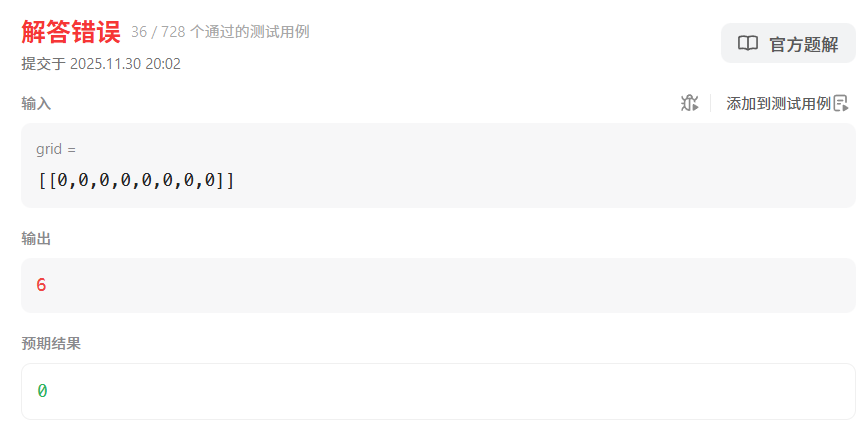

<h1 style="text-align: center; font-weight: bold;">695. 岛屿的最大面积</h1>

---

## 题目链接

> #### https://leetcode.cn/problems/max-area-of-island/description/

## 注意事项

> #### 卡码网：https://kamacoder.com/problempage.php?pid=1172
>
> #### 本题跟卡玛网上有个题差不多，打算采用同卡哥的相同思路，发现过不了



#### 具体解释如下

> #### result、count 是全局共享的，如果之前跑过别的测试（比如某个岛屿面积是 6），再跑这个全 0 的 grid，因为没有遇到 1，所以这次不会更新 result（），result 就保留了上次的值 6
>
> #### 以下思路是<span style="color:red">在 dfs 中处理节点</span>，递归累加 count 的值，最后返回，<span style="color:red">这是一个新的思路</span>

## 代码实现

```java
class Solution {
    public static int[][] dir = { { 0, 1 }, { 0, -1 }, { 1, 0 }, { -1, 0 } };

    public int maxAreaOfIsland(int[][] grid) {
        // n 行 m 列
        int n = grid.length;
        int m = grid[0].length;
        boolean[][] visited = new boolean[n][m];

        int result = 0;
        for (int i = 0; i < n; i++) {
            for (int j = 0; j < m; j++) {
                // 遇到 1 就把相连的节点都标记，说明是一片岛屿
                // 之后的循环再次遇到 1，则说明是一片新的岛屿
                if (!visited[i][j] && grid[i][j] == 1) {
                    // 在 dfs 中处理节点
                    int count = dfs(grid, visited, i, j);
                    result = Math.max(count, result);
                }
            }
        }

        return result;
    }

    public int dfs(int[][] grid, boolean[][] visited, int x, int y) {
        int count = 1;
        visited[x][y] = true;
        for (int i = 0; i < 4; i++) {
            int nextX = x + dir[i][0];
            int nextY = y + dir[i][1];
            // 检查越界
            if (nextX < 0 || nextY < 0 || nextX >= grid.length || nextY >= grid[0].length || visited[nextX][nextY]
                    || grid[nextX][nextY] == 0) {
                continue;
            }
            // 如果是陆地，且没有访问过，则进行 DFS
            if (!visited[nextX][nextY] && grid[nextX][nextY] == 1) {
                count += dfs(grid, visited, nextX, nextY);
            }
        }
        return count;
    }
}
```
