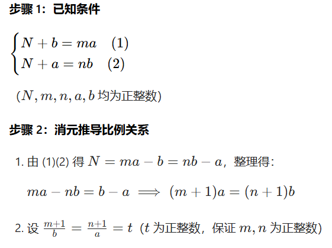
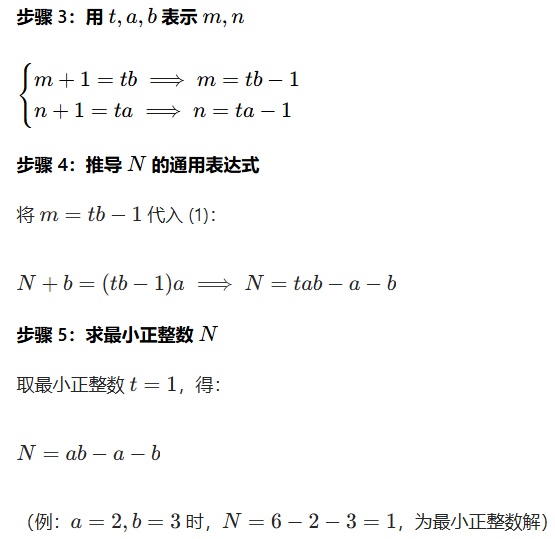

<h1 style="text-align: center; font-weight: bold;">第十六届 Java B 组省赛</h1>

---

## 真题链接

> #### 真题：https://www.lanqiao.cn/courses/2786/learning/?id=4223728&compatibility=false
>
> #### 模考：https://www.lanqiao.cn/paper/5714/result/

## 1. 逃离高塔

### 题目链接

> #### https://www.lanqiao.cn/problems/20560/learning/

### 思路分析

> #### 本题注意<span style="color: red;">强制类型转换</span>，使用 long 类型防止溢出

### 题解

```java
import java.util.Scanner;
// 1:无需package
// 2: 类名必须Main, 不可修改

public class Main {
    public static void main(String[] args) {
        // int ans = 0;
        // for(int i = 1; i <= 2025; i++){
        //     long num = (long)i * i * i;
        //     if(num % 10 == 3){
        //       ans++;
        //     }
        // }
        // System.out.println(ans);
        System.out.println(202);
    }
}
```

## 2. 消失的蓝宝

### 题目链接

> #### https://www.lanqiao.cn/problems/20553/learning/

### 思路分析

#### 本题就是数学题，推到如下

<br/>

<br/>


> #### 核心关系式：<span style="color:red">N = ab - a - b</span>

### 题解

```java
import java.util.Scanner;
// 1:无需package
// 2: 类名必须Main, 不可修改

public class Main {
    public static void main(String[] args) {
        long a = 20250412;
        long b = 20240413;
        long res = a * b - a - b;
        System.out.println(res);
    }
}
```

## 3. 电池分组

### 题目链接

> #### https://www.lanqiao.cn/problems/20547/learning/

### 思路分析

> #### 注意先初始 ans = 0，否则在异或运算的时候会报编译错误

### 题解

```java
import java.util.Scanner;
// 1:无需package
// 2: 类名必须Main, 不可修改

public class Main {
    public static void main(String[] args) {
        Scanner scanner = new Scanner(System.in);
        int T = scanner.nextInt();
        for (int i = 0; i < T; i++) {
            int N = scanner.nextInt();
            int[] num = new int[N];
            int ans = 0;
            for (int j = 0; j < N; j++) {
                num[j] = scanner.nextInt();
            }

            // 遍历
            for (int j = 0; j < num.length; j++) {
                ans ^= num[j];
            }

            if (ans == 0){
                System.out.println("YES");
            }else {
                System.out.println("NO");
            }
        }
        scanner.close();
    }
}
```

## 4. 魔法科考试

### 题目链接

> #### https://www.lanqiao.cn/problems/20541/learning/

### 思路分析

> #### （1）认真审题，题目要求的是多少种<span style="color:red">不同</span>的有效魔法，需要使用 <span style="color:red">HashSet 去重</span>
>
> #### （2）代码整体的时间复杂度主要依赖于<span style="color:red">质数判断</span>的实现，在官网提交需要考虑是否超时的问题，这里采用<span style="color:red">埃氏筛</span>
>
> #### （3）预先获得 isPrime 数组，而不是在每次循环中临时获取一个数组，让后判断

### 题解

```java
import java.util.*;

public class Main {

    // 使用埃拉托斯特尼筛法提前计算所有小于 m+n 的素数
    public static boolean[] ehrlich(int n) {
        // isPrime[i] = true 表示 i 是合数
        // isPrime[i] = false 表示 i 是质数
        // 初始时认为 0 ~ n 所有数都是质数
        boolean[] isPrime = new boolean[n + 1];

        for (int i = 2; i * i <= n; i++) {
            // i 是质数
            if (!isPrime[i]) {
                for (int j = i * i; j <= n; j += i) {
                    isPrime[j] = true;
                }
            }
        }
        return isPrime;
    }

    public static void main(String[] args) {
        Scanner scanner = new Scanner(System.in);
        int n = scanner.nextInt();
        int m = scanner.nextInt();

        int[] a = new int[n];
        int[] b = new int[m];

        for (int i = 0; i < n; i++) {
            a[i] = scanner.nextInt();
        }

        for (int i = 0; i < m; i++) {
            b[i] = scanner.nextInt();
        }

        HashSet<Integer> hashSet = new HashSet<>();

        int sum = m + n;
        boolean[] isPrime = ehrlich(sum);

        // 计算所有 a[i] + b[j] 的值，并判断是否为素数
        for (int i = 0; i < n; i++) {
            for (int j = 0; j < m; j++) {
                int s = a[i] + b[j];
                if (s <= m + n && !isPrime[s]) {
                    hashSet.add(s);
                }
            }
        }

        // 输出有效的魔法组合数
        System.out.println(hashSet.size());
        scanner.close();
    }
}
```

## 5. 爆破
