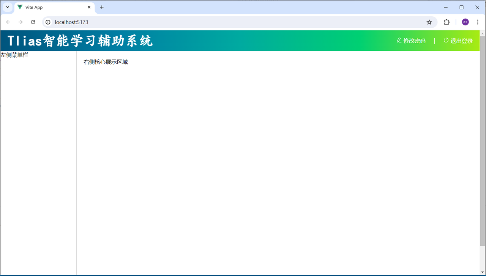
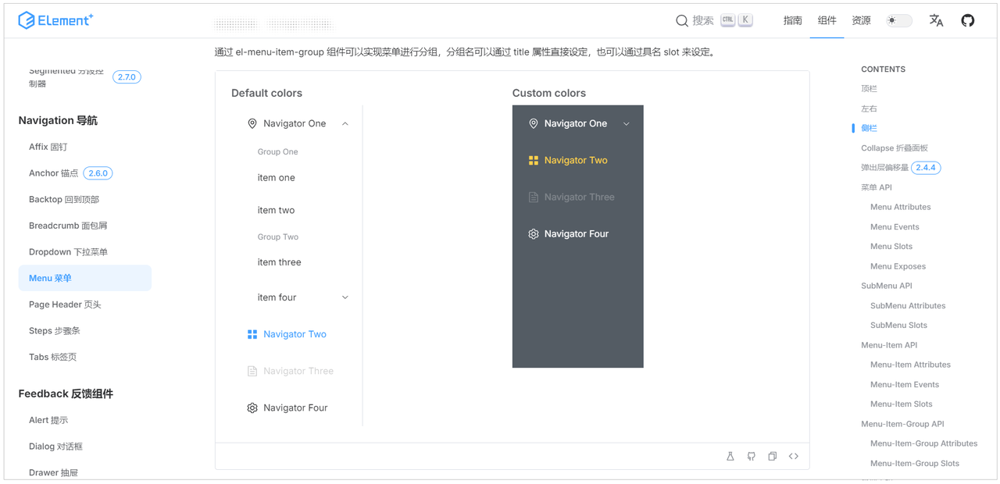

<h1 style="text-align: center;">页面基本结构</h1>

---

## 准备工作

> #### 下列代码是初始化后的代码，包含基本结构，在此基础上开发
>
> #### （1）初始化项目时，所有项为 NO，除了 VueRouter 为 YES
>
> #### （2）安装了 axios、ElementPlus 依赖
>
> #### （3）准备了每个模块的基础 vue 文件
>
> #### 链接: https://pan.baidu.com/s/17dV0oQ_WdjhXWdDX9WSdOg?pwd=31cq 提取码: 31cq

## 启动项目



## 布局容器介绍

#### Container 布局容器，用于布局的容器组件，方便快速搭建页面的基本结构

#### &lt;el-container&gt;：外层容器。 当子元素中包含 &lt;el-header&gt; 或 &lt;el-footer&gt; 时，全部子元素会垂直上下排列， 否则会水平左右排列

#### &lt;el-header&gt;：顶栏容器

#### &lt;el-aside&gt;：侧边栏容器

#### &lt;el-main&gt;：主要区域容器

#### &lt;el-footer&gt;：底栏容器

## 左侧菜单实现

#### 左侧菜单栏的制作，也不需要我们自己实现，其实在 ElementPlus 中已经提供了对应的菜单组件，我们可以直接参考

#### 其实就是复制过来，参考页面原型和需求，将其改造成我们需要的样子就可以了

<br/>


#### 然后就可以参考其提供的源码，复制到我们的侧边栏部分 &lt;el-aside&gt; ... &lt;/el-aside&gt;，然后根据我们案例的需要进行改造，改造成我们需要的样子即可

#### 最终左侧菜单栏的代码如下 ，大家可以直接导入到 views/layout/index.vue 的侧边栏区域 &lt;el-aside&gt; ... &lt;/el-aside&gt;

```html
<el-menu>
  <!-- 首页菜单 -->
  <el-menu-item index="/index">
    <el-icon><Promotion /></el-icon> 首页
  </el-menu-item>

  <!-- 班级管理菜单 -->
  <el-sub-menu index="/manage">
    <template #title>
      <el-icon><menu /></el-icon> 班级学员管理
    </template>
    <el-menu-item index="/clazz">
      <el-icon><HomeFilled /></el-icon>班级管理
    </el-menu-item>
    <el-menu-item index="/stu">
      <el-icon><UserFilled /></el-icon>学员管理
    </el-menu-item>
  </el-sub-menu>

  <!-- 系统信息管理 -->
  <el-sub-menu index="/system">
    <template #title>
      <el-icon><Tools /></el-icon>系统信息管理
    </template>
    <el-menu-item index="/dept">
      <el-icon><HelpFilled /></el-icon>部门管理
    </el-menu-item>
    <el-menu-item index="/emp">
      <el-icon><Avatar /></el-icon>员工管理
    </el-menu-item>
  </el-sub-menu>

  <!-- 数据统计管理 -->
  <el-sub-menu index="/report">
    <template #title>
      <el-icon><Histogram /></el-icon>数据统计管理
    </template>
    <el-menu-item index="/empReport">
      <el-icon><InfoFilled /></el-icon>员工信息统计
    </el-menu-item>
    <el-menu-item index="/stuReport">
      <el-icon><Share /></el-icon>学员信息统计
    </el-menu-item>
    <el-menu-item index="/log">
      <el-icon><Document /></el-icon>日志信息统计
    </el-menu-item>
  </el-sub-menu>
</el-menu>
```

#### 到目前为止，views/layout/index.vue 中的整体内容如下

```vue
<script setup></script>

<template>
  <div class="common-layout">
    <el-container>
      <!-- Header 区域 -->
      <el-header class="header">
        <span class="title">Tlias智能学习辅助系统</span>
        <span class="right_tool">
          <a href="">
            <el-icon><EditPen /></el-icon> 修改密码 &nbsp;&nbsp;&nbsp; |
            &nbsp;&nbsp;&nbsp;
          </a>
          <a href="">
            <el-icon><SwitchButton /></el-icon> 退出登录
          </a>
        </span>
      </el-header>

      <el-container>
        <!-- 左侧菜单 -->
        <el-aside width="200px" class="aside">
          <el-menu>
            <!-- 首页菜单 -->
            <el-menu-item index="/index">
              <el-icon><Promotion /></el-icon> 首页
            </el-menu-item>

            <!-- 班级管理菜单 -->
            <el-sub-menu index="/manage">
              <template #title>
                <el-icon><Menu /></el-icon> 班级学员管理
              </template>
              <el-menu-item index="/clazz">
                <el-icon><HomeFilled /></el-icon>班级管理
              </el-menu-item>
              <el-menu-item index="/stu">
                <el-icon><UserFilled /></el-icon>学员管理
              </el-menu-item>
            </el-sub-menu>

            <!-- 系统信息管理 -->
            <el-sub-menu index="/system">
              <template #title>
                <el-icon><Tools /></el-icon>系统信息管理
              </template>
              <el-menu-item index="/dept">
                <el-icon><HelpFilled /></el-icon>部门管理
              </el-menu-item>
              <el-menu-item index="/emp">
                <el-icon><Avatar /></el-icon>员工管理
              </el-menu-item>
            </el-sub-menu>

            <!-- 数据统计管理 -->
            <el-sub-menu index="/report">
              <template #title>
                <el-icon><Histogram /></el-icon>数据统计管理
              </template>
              <el-menu-item index="/empReport">
                <el-icon><InfoFilled /></el-icon>员工信息统计
              </el-menu-item>
              <el-menu-item index="/stuReport">
                <el-icon><Share /></el-icon>学员信息统计
              </el-menu-item>
              <el-menu-item index="/log">
                <el-icon><Document /></el-icon>日志信息统计
              </el-menu-item>
            </el-sub-menu>
          </el-menu>
        </el-aside>

        <el-main> 右侧核心展示区域 </el-main>
      </el-container>
    </el-container>
  </div>
</template>

<style scoped>
.header {
  background-image: linear-gradient(
    to right,
    #00547d,
    #007fa4,
    #00aaa0,
    #00d072,
    #a8eb12
  );
}

.title {
  color: white;
  font-size: 40px;
  font-family: 楷体;
  line-height: 60px;
  font-weight: bolder;
}

.right_tool {
  float: right;
  line-height: 60px;
}

a {
  color: white;
  text-decoration: none;
}

.aside {
  width: 220px;
  border-right: 1px solid #ccc;
  height: 730px;
}
</style>
```
