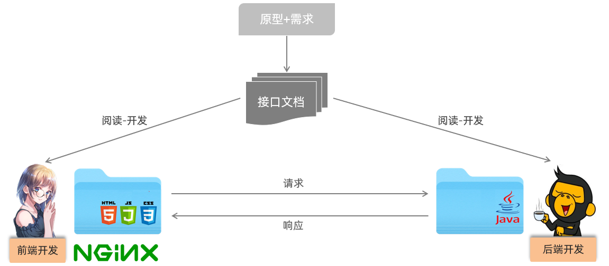
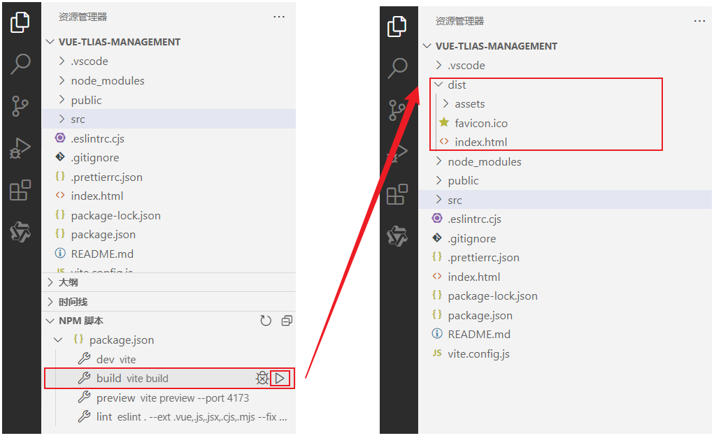
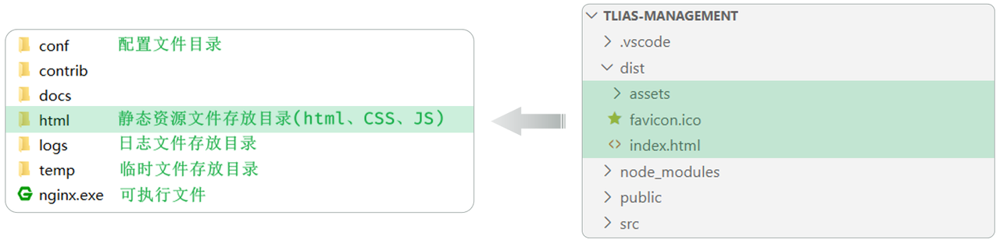

<h1 style="text-align: center;">打包部署</h1>

---

## 基本介绍

#### 到此呢，部门管理、员工管理、登录认证的功能，我们都已经完成了。 那接下来，我们就来说一下前端工程的打包部署。 前端项目最终开发完毕之后，是需要打包，然后部署在 nginx 服务器上运行的

<br/>


## 打包

<br/>


## 部署

### Nginx

> #### （1）官网：https://nginx.org/
>
> #### 安装包（百度网盘）：https://pan.baidu.com/s/1vHkeXHEvmjY8IMRrrMPRvQ?pwd=7btt
>
> #### （2）介绍：Nginx 是一款轻量级的 Web 服务器/反向代理服务器及电子邮件（IMAP/POP3）代理服务器。其特点是占有内存少，并发能力强，在各大型互联网公司都有非常广泛的使用

### 部署步骤

#### （1）打包完成之后，就可以将打包后的项目，部署到 nginx 服务器上了，记得将 nginx 解压到一个没有中文不带空格的目录中

#### （2）然后直接将 dist 目录中的内容，拷贝到 nginx 的解压目录中的 html 中即可 (html 目录下原有的两个文件, 可以直接删除)

<br/>


#### （3）然后，在 nginx 服务器的核心配置文件 conf/nginx 中，在 http 配置块里面 添加如下反向代理的配置

> #### <span style="color:red">注意：修改配置文件后需要执行 nginx.exe -s reload 命令重载配置文件</span>

```json
server {
    listen       80;
    server_name  localhost;
    client_max_body_size 10m;

    location / {
        root   html;
        index  index.html index.htm;
        try_files $uri $uri/ /index.html;
    }

    location ^~ /api/ {
        rewrite ^/api/(.*)$ /$1 break;
        proxy_pass http://localhost:8080;
    }

    error_page   500 502 503 504  /50x.html;
    location = /50x.html {
        root   html;
    }
}
```

### ⚠️ 注意事项

> #### Nginx 默认占用 80 端口号，如果 80 端口号被占用，可以在 nginx.conf 中修改端口号。(netstat –ano | findStr 80)

### Nginx 常用命令

> #### 启动服务器：nginx.exe
>
> #### 重载服务器：nginx.exe -s reload
>
> #### 停止服务器：nginx.exe -s stop

## Tlias 前端完整代码

> #### 链接：https://pan.baidu.com/s/1tIpZC5HWNNKHqQVc85axNg?pwd=zsdq 提取码: zsdq
