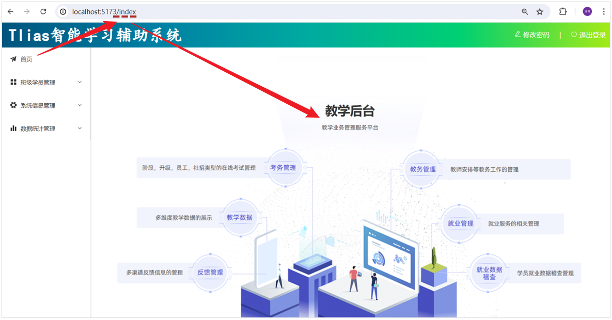
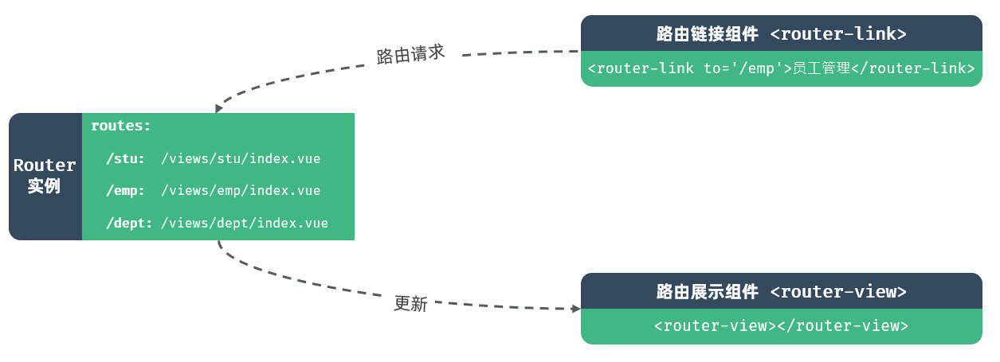
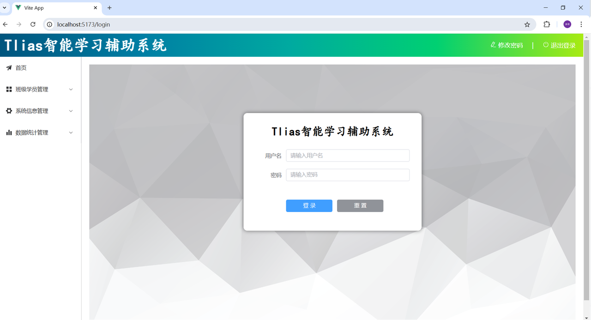
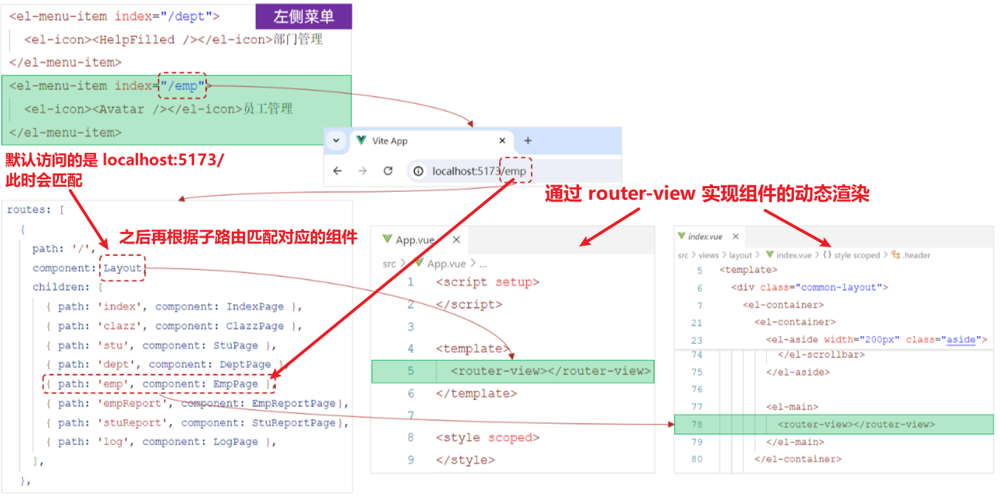

<h1 style="text-align: center;">VueRouter</h1>

---

> <h3>官网：<a href="https://router.vuejs.org/zh/" target="_blank">https://router.vuejs.org/zh/</a></h3>

## 基本介绍


> #### Vue Router：Vue 的官方路由。 为 Vue 提供富有表现力、可配置的、方便的路由
>
> #### Vue 中的路由，主要定义的是路径与组件之间的对应关系

#### 比如，我们打开一个网站，点击左侧菜单，地址栏的地址发生变化，地址栏地址一旦发生变化，在主区域显示对应的页面组件

<br/>


#### VueRouter 主要由以下三个部分组成，如下所示

<br/>


> #### VueRouter：路由器类，根据路由请求在路由视图中动态渲染选中的组件
>
> #### &lt;router-link&gt;：请求链接组件，浏览器会解析成&lt;a&gt;
>
> #### &lt;router-view&gt;：动态视图组件，用来渲染展示与路由路径对应的组件

## 基础路由配置

#### （1）在 views/layout/index.vue 中，调整代码，具体调整位置如下

> #### 在左侧菜单栏的 &lt;el-menu&gt; 标签上添加 router 属性，这会让 Element Plus 的 &lt;el-menu&gt; 组件自动根据路由来激活对应的菜单项
>
> #### 使用 &lt;router-view&gt; 组件来渲染根据路由动态变化的内容
>
> #### 确保每个 &lt;el-menu-item&gt; 的 index 属性值与你想要导航到的路径相匹配

```vue
<script setup>
// 无需额外导入，因为我们只是使用了 Element Plus 和 Vue Router 的基本功能
</script>

<template>
  <div class="common-layout">
    <el-container>
      <!-- Header 区域 -->
      <el-header class="header">
        <span class="title">Tlias智能学习辅助系统</span>
        <span class="right_tool">
          <a href="">
            <el-icon><EditPen /></el-icon> 修改密码 &nbsp;&nbsp;&nbsp; |
            &nbsp;&nbsp;&nbsp;
          </a>
          <a href="">
            <el-icon><SwitchButton /></el-icon> 退出登录
          </a>
        </span>
      </el-header>

      <el-container>
        <!-- 左侧菜单 -->
        <el-aside width="200px" class="aside">
          <el-menu router>
            <!-- 首页菜单 -->
            <el-menu-item index="/index">
              <el-icon><Promotion /></el-icon> 首页
            </el-menu-item>

            <!-- 班级管理菜单 -->
            <el-sub-menu index="/manage">
              <template #title>
                <el-icon><Menu /></el-icon> 班级学员管理
              </template>
              <el-menu-item index="/clazz">
                <el-icon><HomeFilled /></el-icon>班级管理
              </el-menu-item>
              <el-menu-item index="/stu">
                <el-icon><UserFilled /></el-icon>学员管理
              </el-menu-item>
            </el-sub-menu>

            <!-- 系统信息管理 -->
            <el-sub-menu index="/system">
              <template #title>
                <el-icon><Tools /></el-icon>系统信息管理
              </template>
              <el-menu-item index="/dept">
                <el-icon><HelpFilled /></el-icon>部门管理
              </el-menu-item>
              <el-menu-item index="/emp">
                <el-icon><Avatar /></el-icon>员工管理
              </el-menu-item>
            </el-sub-menu>

            <!-- 数据统计管理 -->
            <el-sub-menu index="/report">
              <template #title>
                <el-icon><Histogram /></el-icon>数据统计管理
              </template>
              <el-menu-item index="/emp">
                <el-icon><InfoFilled /></el-icon>员工信息统计
              </el-menu-item>
              <el-menu-item index="/stu">
                <el-icon><Share /></el-icon>学员信息统计
              </el-menu-item>
              <el-menu-item index="/log">
                <el-icon><Document /></el-icon>日志信息统计
              </el-menu-item>
            </el-sub-menu>
          </el-menu>
        </el-aside>

        <!-- 主展示区域 -->
        <el-main>
          <router-view></router-view>
        </el-main>
      </el-container>
    </el-container>
  </div>
</template>

<style scoped>
.header {
  background-image: linear-gradient(
    to right,
    #00547d,
    #007fa4,
    #00aaa0,
    #00d072,
    #a8eb12
  );
}

.title {
  color: white;
  font-size: 40px;
  font-family: 楷体;
  line-height: 60px;
  font-weight: bolder;
}

.right_tool {
  float: right;
  line-height: 60px;
}

a {
  color: white;
  text-decoration: none;
}

.aside {
  width: 220px;
  border-right: 1px solid #ccc;
  height: 730px;
}
</style>
```

#### （2）在 router/index.js 中配置请求路径与组件之间的关系

```js
import { createRouter, createWebHistory } from "vue-router";

import IndexView from "@/views/index/index.vue";
import ClazzView from "@/views/clazz/index.vue";
import StuView from "@/views/stu/index.vue";
import DeptView from "@/views/dept/index.vue";
import EmpView from "@/views/emp/index.vue";
import EmpReportView from "@/views/report/emp/index.vue";
import StuReportView from "@/views/report/stu/index.vue";
import LogView from "@/views/log/index.vue";
import LoginView from "@/views/login/index.vue";

const routes = [
  { path: "/index", component: IndexView },
  { path: "/clazz", component: ClazzView },
  { path: "/stu", component: StuView },
  { path: "/dept", component: DeptView },
  { path: "/emp", component: EmpView },
  { path: "/report/emp", component: EmpReportView },
  { path: "/report/stu", component: StuReportView },
  { path: "/log", component: LogView },
  { path: "/login", component: LoginView },
];

const router = createRouter({
  history: createWebHistory(),
  routes,
});

export default router;
```

## 完善路由配置

#### 上述我们只是完成了最基本的路由配置。 并经过测试我们发现，如果我们访问 /login 路径，会发现，登录页面是在 layout 页面中嵌套展示的，这肯定是不合适的

<br/>


#### 配置嵌套路由，让不同的组件在 layout 页面中嵌套展示

#### 默认访问的是根路径，只会展示 layout 页面，而不会展示其他的组件，为了实现在访问根路径时，默认访问 index 页面，需要配置<span style="color:red">从定向属性</span>

#### 最终配置形式如下，在 router/index.js 中做如下配置

```js
import { createRouter, createWebHistory } from "vue-router";

import IndexView from "@/views/index/index.vue";
import ClazzView from "@/views/clazz/index.vue";
import DeptView from "@/views/dept/index.vue";
import EmpView from "@/views/emp/index.vue";
import LogView from "@/views/log/index.vue";
import StuView from "@/views/stu/index.vue";
import EmpReportView from "@/views/report/emp/index.vue";
import StuReportView from "@/views/report/stu/index.vue";
import LayoutView from "@/views/layout/index.vue";
import LoginView from "@/views/login/index.vue";

const router = createRouter({
  history: createWebHistory(import.meta.env.BASE_URL),
  routes: [
    {
      path: "/",
      name: "",
      component: LayoutView,
      redirect: "/index", //重定向
      children: [
        { path: "index", name: "index", component: IndexView },
        { path: "clazz", name: "clazz", component: ClazzView },
        { path: "stu", name: "stu", component: StuView },
        { path: "dept", name: "dept", component: DeptView },
        { path: "emp", name: "emp", component: EmpView },
        { path: "log", name: "log", component: LogView },
        { path: "/report/emp", name: "/report/emp", component: EmpReportView },
        { path: "/report/stu", name: "/report/stu", component: StuReportView },
      ],
    },
    { path: "/login", name: "login", component: LoginView },
  ],
});

export default router;
```

#### 修改根组件 App.vue

```vue
<script setup></script>

<template>
  <router-view></router-view>
</template>

<style scoped></style>
```

## 路由访问流程



> #### （1）当点击左侧菜单栏的员工管理菜单时，最终地址栏会访问路径 /emp
>
> #### （2）此时 VueRouter，会自动的到所配置的路由表（router/index.js）中，查找与该路径对应的组件，并展示在路由展示组件 &lt;router-view&gt; 对应的位置中
