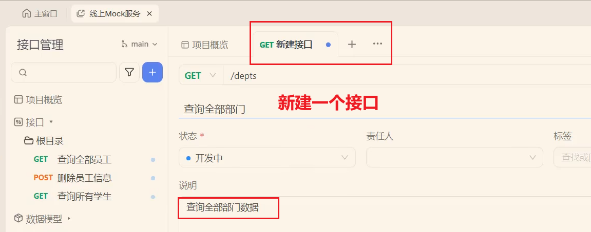
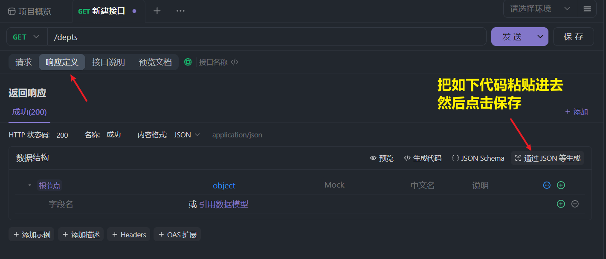
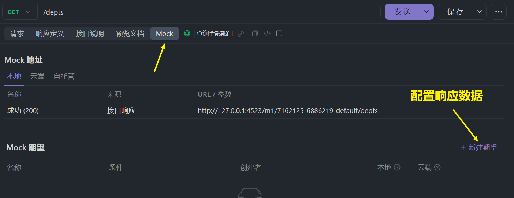
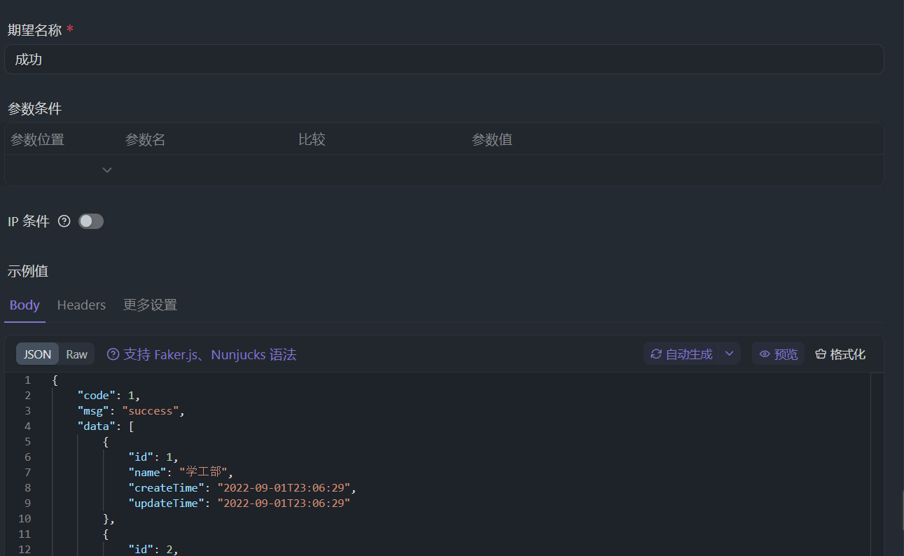

<h1 style="text-align: center;">VueRouter</h1>

---

## 基本介绍

> #### 基于前后端开发模式，前后端并行开发，前端开发完成后需要测试，无法从后端请求实时数据，需要模拟数据，这是就可以借助 Mock 服务生成假数据，给前端返回用于测试

## Mock 配置

> #### 基于 ApiFox 的 Mock 服务配置


<br/>


```json
{
  "code": 1,
  "msg": "success",
  "data": [
    {
      "id": 1,
      "name": "学工部",
      "createTime": "2022-09-01T23:06:29",
      "updateTime": "2022-09-01T23:06:29"
    },
    {
      "id": 2,
      "name": "教研部",
      "createTime": "2022-09-01T23:06:29",
      "updateTime": "2022-09-01T23:06:29"
    }
  ]
}
```

<br/>

<br/>


```json
{
  "code": 1,
  "msg": "success",
  "data": [
    {
      "id": 1,
      "name": "学工部",
      "createTime": "2022-09-01T23:06:29",
      "updateTime": "2022-09-01T23:06:29"
    },
    {
      "id": 2,
      "name": "教研部",
      "createTime": "2022-09-01T23:06:29",
      "updateTime": "2022-09-01T23:06:29"
    },
    {
      "id": 3,
      "name": "后勤部",
      "createTime": "2022-09-01T23:06:29",
      "updateTime": "2022-09-01T23:06:29"
    },
    {
      "id": 4,
      "name": "咨询部",
      "createTime": "2022-09-01T23:06:29",
      "updateTime": "2022-09-01T23:06:29"
    },
    {
      "id": 5,
      "name": "财务部",
      "createTime": "2022-09-01T23:06:29",
      "updateTime": "2022-09-01T23:06:29"
    },
    {
      "id": 6,
      "name": "人事部",
      "createTime": "2022-09-01T23:06:29",
      "updateTime": "2022-09-01T23:06:29"
    }
  ]
}
```
