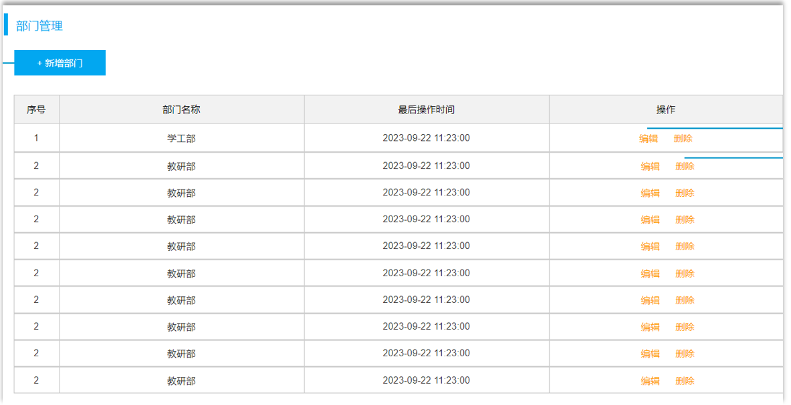
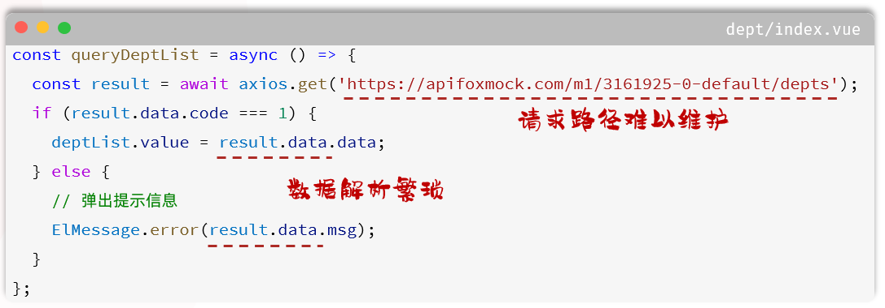
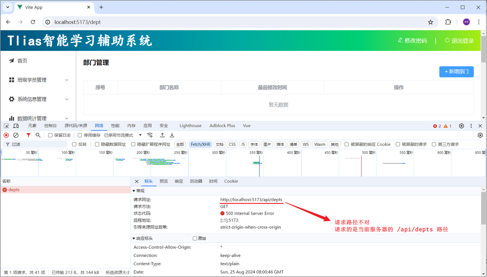
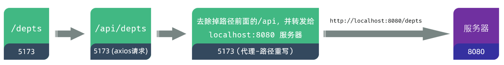
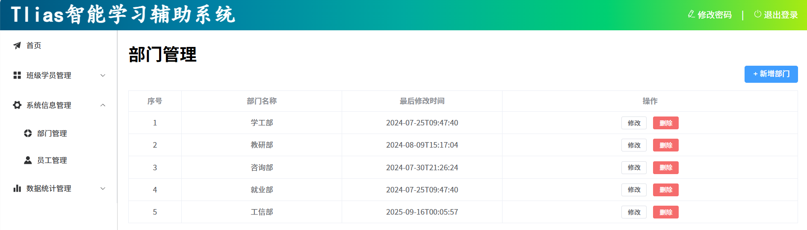
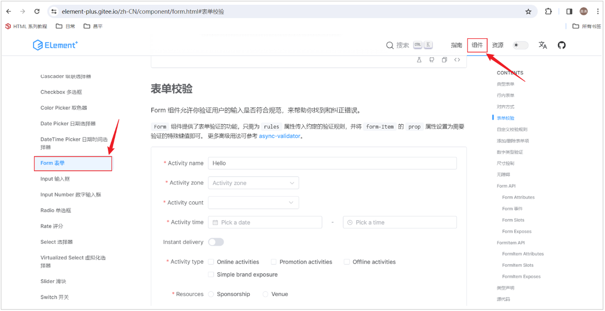
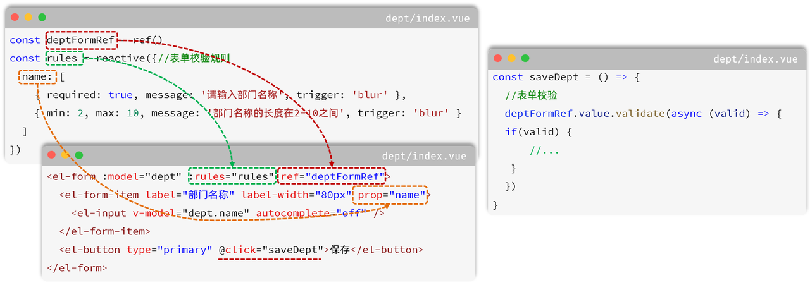

<h1 style="text-align: center;">部门管理</h1>

---

## 列表查询

### 需求分析

> #### 根据页面原型、需求说明、接口文档，先完成页面的基本布局，可以参考 ElementPlus 中的组件，拷贝过来适当做一个改造



### 代码实现

> #### 部门管理组件 src/views/dept/index.vue 具体的页面布局代码如下
>
> #### 表格中每一列展示的 <span style="color:red">prop 属性</span> 都是根据接口文档来的，接口文档返回什么样的数据，我们就安装对应的数据格式进行解析

```vue
<script setup>
import { ref } from "vue";

// 示例数据
const deptList = ref([
  {
    id: 1,
    name: "学工部",
    createTime: "2024-09-01T23:06:29",
    updateTime: "2024-09-01T23:06:29",
  },
  {
    id: 2,
    name: "教研部",
    createTime: "2024-09-01T23:06:29",
    updateTime: "2024-09-01T23:06:29",
  },
]);

// 编辑部门 - 根据ID查询回显数据
const handleEdit = (id) => {
  console.log(`Edit item with ID ${id}`);
  // 在这里实现编辑功能
};

// 删除部门 - 根据ID删除部门
const handleDelete = (id) => {
  console.log(`Delete item with ID ${id}`);
  // 在这里实现删除功能
};
</script>

<template>
  <h1>部门管理</h1>

  <!-- 按钮靠页面右侧显示 -->
  <el-button type="primary" @click="handleEdit" style="float: right;">
    + 新增部门</el-button
  >
  <br /><br />

  <el-table :data="deptList" border style="width: 100%;">
    <el-table-column type="index" label="序号" width="100" align="center" />
    <el-table-column prop="name" label="部门名称" width="300" align="center" />
    <el-table-column
      prop="updateTime"
      label="最后修改时间"
      width="300"
      align="center"
    />
    <el-table-column fixed="right" label="操作" align="center">
      <template #default="scope">
        <el-button size="small" @click="handleEdit(scope.row.id)"
          >修改</el-button
        >
        <el-button
          size="small"
          type="danger"
          @click="handleDelete(scope.row.id)"
          >删除</el-button
        >
      </template>
    </el-table-column>
  </el-table>
</template>

<style scoped></style>
```

### 加载数据

#### 根据需求，需要在新增、修改、删除部门之后，加载最新的部门数据。 在打开页面之后，也需要自动加载部门数据，那接下来，我们就需要基于 axios 发送异步请求，动态获取数据

#### 在页面加载完成后，发送异步请求（`https://m1.apifoxmock.com/m1/7162125-6886219-default/depts`），动态加载数据，src/views/dept/index.vue 完整代码如下

```vue
<script setup>
import { ref, onMounted } from "vue";
import axios from "axios";

//声明列表展示数据
let deptList = ref([]);

//动态加载数据-查询部门
const queryAll = async () => {
  const result = await axios.get(
    "https://apifoxmock.com/m1/3161925-0-default/depts"
  );
  deptList.value = result.data.data;
};

//钩子函数
onMounted(() => {
  queryAll();
});

// 编辑部门 - 根据ID查询回显数据
const handleEdit = (id) => {
  console.log(`Edit item with ID ${id}`);
  // 在这里实现编辑功能
};

// 删除部门 - 根据ID删除部门
const handleDelete = (id) => {
  console.log(`Delete item with ID ${id}`);
  // 在这里实现删除功能
};
</script>

<template>
  <h1>部门管理</h1>

  <!-- 按钮靠页面右侧显示 -->
  <el-button type="primary" @click="handleEdit" style="float: right;">
    + 新增部门</el-button
  >
  <br /><br />

  <el-table :data="deptList" border style="width: 100%;">
    <el-table-column type="index" label="序号" width="100" align="center" />
    <el-table-column prop="name" label="部门名称" width="300" align="center" />
    <el-table-column
      prop="updateTime"
      label="最后修改时间"
      width="300"
      align="center"
    />
    <el-table-column fixed="right" label="操作" align="center">
      <template #default="scope">
        <el-button size="small" @click="handleEdit(scope.row.id)"
          >修改</el-button
        >
        <el-button
          size="small"
          type="danger"
          @click="handleDelete(scope.row.id)"
          >删除</el-button
        >
      </template>
    </el-table-column>
  </el-table>
</template>

<style scoped></style>
```

### 问题分析

#### 思考：直接在 Vue 组件中，基于 axios 发送异步请求，存在什么问题？



#### 我们刚才在完成部门列表查询时，是直接基于 axios 发送异步请求，直接将接口的请求地址放在组件文件 .vue 中。 而如果开发一个大型的项目，组件文件可能会很多很多很多，如果前端开发完毕，进行前后端联调测试了，需要修改请求地址，那么此时，就需要找到每一个 .vue 文件，然后挨个修改。 所以上述的代码，虽然实现了动态加载数据的功能。 但是存在以下问题

> #### （1）请求路径难以维护
>
> #### （2）数据解析繁琐

### 程序优化

#### （1）为了解决上述问题，我们在前端项目开发时，通常会定义一个请求处理的工具类 - src/utils/request.js 。 在这个工具类中，对 axios 进行了封装。 具体代码如下

```js
import axios from "axios";

//创建axios实例对象
const request = axios.create({
  baseURL: "/api",
  timeout: 600000,
});

//axios的响应 response 拦截器
request.interceptors.response.use(
  (response) => {
    //成功回调
    return response.data;
  },
  (error) => {
    //失败回调
    return Promise.reject(error);
  }
);

export default request;
```

#### （2）而与服务端进行异步交互的逻辑，通常会按模块，封装在一个单独的 API 中，如：src/api/dept.js

```js
import request from "@/utils/request";

//列表查询
export const queryAllApi = () => request.get("/depts");
```

#### （3）修改 src/views/dept/index.vue 中的代码

#### 现在就不需要每次直接调用 axios 发送异步请求了，只需要将我们定义的对应模块的 API 导入进来，就可以直接使用了

```vue
<script setup>
import { ref, onMounted } from "vue";
import { queryAllApi } from "@/api/dept";

//声明列表展示数据
let deptList = ref([]);

//动态加载数据-查询部门
const queryAll = async () => {
  const result = await queryAllApi();
  deptList.value = result.data;
};

//钩子函数
onMounted(() => {
  queryAll();
});

// 编辑部门 - 根据ID查询回显数据
const handleEdit = (id) => {
  console.log(`Edit item with ID ${id}`);
  // 在这里实现编辑功能
};

// 删除部门 - 根据ID删除部门
const handleDelete = (id) => {
  console.log(`Delete item with ID ${id}`);
  // 在这里实现删除功能
};
</script>
```

#### 做完上面这三步之后，我们打开浏览器发现，并不能访问到接口数据。原因是因为，目前请求路径不对

<br/>


#### （4） 在 vite.config.js 中配置前端请求服务器的信息

#### 在服务器中配置代理 proxy 的信息，并在配置代理时，执行目标服务器。 以及 url 路径重写的规则

<br/>


```js
import { fileURLToPath, URL } from "node:url";

import { defineConfig } from "vite";
import vue from "@vitejs/plugin-vue";

// https://vitejs.dev/config/
export default defineConfig({
  plugins: [vue()],
  resolve: {
    alias: {
      "@": fileURLToPath(new URL("./src", import.meta.url)),
    },
  },
  server: {
    proxy: {
      "/api": {
        target: "http://localhost:8080",
        secure: false,
        changeOrigin: true,
        rewrite: (path) => path.replace(/^\/api/, ""),
      },
    },
  },
});
```

#### （5）然后，我们就可以启动服务器端的程序（将之前开发的服务端程序启动起来测试一下 ），进行测试了

> #### ⚠️ 注意：测试时，记得将<span style="color:red;">令牌校验的过滤器及拦截器</span>，以及记录日志的 <span style="color:red;">AOP</span> 程序<span style="color:red;">全部注释</span>



## 新增部门

### 代码实现

#### （1）在 src/views/dept/index.vue 中完成页面布局，并编写交互逻辑，完成数据绑定

```vue
<script setup>
import { ref, onMounted } from "vue";
import { ElMessage } from "element-plus";
import { queryAllApi, addDeptApi } from "@/api/dept";

// 声明列表展示数据
let deptList = ref([]);

// 动态加载数据 - 查询部门
const queryAll = async () => {
  const result = await queryAllApi();
  deptList.value = result.data;
};

// 钩子函数
onMounted(() => {
  queryAll();
});

// 编辑部门 - 根据ID查询回显数据
const handleEdit = (id) => {
  console.log(`Edit item with ID ${id}`);
  // 在这里实现编辑功能
};

// 删除部门 - 根据ID删除部门
const handleDelete = (id) => {
  console.log(`Delete item with ID ${id}`);
  // 在这里实现删除功能
};

const formTitle = ref("");
//新增部门
const add = () => {
  formTitle.value = "新增部门";
  showDialog.value = true;
  deptForm.value = { name: "" };
};

// 新增部门对话框的状态
const showDialog = ref(false);
// 表单数据
const deptForm = ref({ name: "" });
// 表单验证规则
const formRules = ref({
  name: [
    { required: true, message: "请输入部门名称", trigger: "blur" },
    { min: 2, max: 10, message: "长度在 2 到 10 个字符", trigger: "blur" },
  ],
});

// 表单标签宽度
const formLabelWidth = ref("120px");
// 表单引用
const deptFormRef = ref(null);

// 重置表单
const resetForm = () => {
  deptFormRef.value.resetFields();
};

// 提交表单
const save = async () => {
  await deptFormRef.value.validate(async (valid) => {
    if (!valid) return;
    // 提交表单
    const result = await addDeptApi(deptForm.value);
    if (result.code) {
      ElMessage.success("操作成功");
      // 关闭对话框
      showDialog.value = false;
      // 重置表单
      resetForm();
      // 重新加载数据
      queryAll();
    } else {
      ElMessage.error(result.msg);
    }
  });
};
</script>

<template>
  <h1>部门管理</h1>

  <!-- 按钮靠页面右侧显示 -->
  <el-button type="primary" @click="add()" style="float: right;">
    + 新增部门</el-button
  >
  <br /><br />

  <!-- 数据展示表格 -->
  <el-table :data="deptList" border style="width: 100%;">
    <el-table-column type="index" label="序号" width="100" align="center" />
    <el-table-column prop="name" label="部门名称" width="300" align="center" />
    <el-table-column
      prop="updateTime"
      label="最后修改时间"
      width="300"
      align="center"
    />
    <el-table-column fixed="right" label="操作" align="center">
      <template #default="scope">
        <el-button size="small" @click="handleEdit(scope.row.id)"
          >修改</el-button
        >
        <el-button
          size="small"
          type="danger"
          @click="handleDelete(scope.row.id)"
          >删除</el-button
        >
      </template>
    </el-table-column>
  </el-table>

  <!-- 新增部门的对话框 -->
  <el-dialog
    v-model="showDialog"
    :title="formTitle"
    width="30%"
    @close="resetForm"
  >
    <el-form :model="deptForm" :rules="formRules" ref="deptFormRef">
      <el-form-item label="部门名称" prop="name" label-width="80px">
        <el-input v-model="deptForm.name" autocomplete="off"></el-input>
      </el-form-item>
    </el-form>

    <template #footer>
      <span class="dialog-footer">
        <el-button @click="showDialog = false">取消</el-button>
        <el-button type="primary" @click="save">确定</el-button>
      </span>
    </template>
  </el-dialog>
</template>

<style scoped></style>
```

#### （2）src/api/dept.js 文件中完整代码如下

```js
import request from "@/utils/request";

//查询全部部门
export const queryAllApi = () => request.get("/depts");

//添加部门
export const addDeptApi = (data) => request.post("/depts", data);
```

### 表单校验

#### Form 组件允许你验证用户的输入是否符合规范，来帮助你找到和纠正错误。Form 组件提供了表单验证的功能，只需为 rules 属性传入约定的验证规则，并将 form-Item 的 prop 属性设置为需要验证的特殊键值即可

<br/>


#### 操作步骤

> #### （1）通过 ref 属性注册元素的引用
>
> #### （2）定义表单校验规则，通过 rules 属性与表单绑定，并通过 prop 属性绑定对应的表单项
>
> #### （3）表单提交时，校验表单，校验通过，则允许提交表单

<br/>


## 修改部门

### 查询回显

#### （1）在 src/api/dept.js 中定义根据 id 查询的请求

```js
//根据ID查询
export const queryInfoApi = (id) => request.get(`/depts/${id}`);
```

#### （2）在 src/views/dept/index.vue 中添加根据 ID 查询回显的逻辑，为修改按钮绑定事件 &lt;template&gt;&lt;/template&gt;

```html
<el-button size="small" @click="handleEdit(scope.row.id)">修改</el-button>
```

#### （3）在 &lt;script&gt; &lt;/script&gt; 添加 JS 逻辑

```js
// 编辑部门 - 根据ID查询回显数据
const handleEdit = async (id) => {
  console.log(`Edit item with ID ${id}`);
  formTitle.value = "修改部门";
  showDialog.value = true;
  deptForm.value = { name: "" };

  const result = await queryInfoApi(id);
  if (result.code) {
    deptForm.value = result.data;
  }
};
```

#### 到目前为止，完整的 src/views/dept/index.vue 代码如下

```vue
<script setup>
import { ref, onMounted } from "vue";
import { ElMessage } from "element-plus";
import { queryAllApi, addDeptApi, queryInfoApi } from "@/api/dept";

// 声明列表展示数据
let deptList = ref([]);

// 动态加载数据 - 查询部门
const queryAll = async () => {
  const result = await queryAllApi();
  deptList.value = result.data;
};

// 钩子函数
onMounted(() => {
  queryAll();
});

// 编辑部门 - 根据ID查询回显数据
const handleEdit = async (id) => {
  console.log(`Edit item with ID ${id}`);
  formTitle.value = "修改部门";
  showDialog.value = true;
  deptForm.value = { name: "" };

  const result = await queryInfoApi(id);
  if (result.code) {
    deptForm.value = result.data;
  }
};

const formTitle = ref("");
//新增部门
const add = () => {
  formTitle.value = "新增部门";
  showDialog.value = true;
  deptForm.value = { name: "" };
};

// 删除部门 - 根据ID删除部门
const handleDelete = (id) => {
  console.log(`Delete item with ID ${id}`);
  // 在这里实现删除功能
};

// 新增部门对话框的状态
const showDialog = ref(false);
// 表单数据
const deptForm = ref({ name: "" });
// 表单验证规则
const formRules = ref({
  name: [
    { required: true, message: "请输入部门名称", trigger: "blur" },
    { min: 2, max: 10, message: "长度在 2 到 10 个字符", trigger: "blur" },
  ],
});

// 表单引用
const deptFormRef = ref(null);

// 重置表单
const resetForm = () => {
  deptFormRef.value.resetFields();
};

// 提交表单
const save = async () => {
  await deptFormRef.value.validate(async (valid) => {
    if (!valid) return;
    // 提交表单
    const result = await addDeptApi(deptForm.value);
    if (result.code) {
      ElMessage.success("操作成功");
      // 关闭对话框
      showDialog.value = false;
      // 重置表单
      resetForm();
      // 重新加载数据
      queryAll();
    } else {
      ElMessage.error(result.msg);
    }
  });
};
</script>

<template>
  <h1>部门管理</h1>

  <!-- 按钮靠页面右侧显示 -->
  <el-button type="primary" @click="add()" style="float: right;">
    + 新增部门</el-button
  >
  <br /><br />

  <!-- 数据展示表格 -->
  <el-table :data="deptList" border style="width: 100%;">
    <el-table-column type="index" label="序号" width="100" align="center" />
    <el-table-column prop="name" label="部门名称" width="300" align="center" />
    <el-table-column
      prop="updateTime"
      label="最后修改时间"
      width="300"
      align="center"
    />
    <el-table-column fixed="right" label="操作" align="center">
      <template #default="scope">
        <el-button size="small" @click="handleEdit(scope.row.id)"
          >修改</el-button
        >
        <el-button
          size="small"
          type="danger"
          @click="handleDelete(scope.row.id)"
          >删除</el-button
        >
      </template>
    </el-table-column>
  </el-table>

  <!-- 新增部门的对话框 -->
  <el-dialog
    v-model="showDialog"
    :title="formTitle"
    width="30%"
    @close="resetForm"
  >
    <el-form :model="deptForm" :rules="formRules" ref="deptFormRef">
      <el-form-item label="部门名称" prop="name" label-width="80px">
        <el-input v-model="deptForm.name" autocomplete="off"></el-input>
      </el-form-item>
    </el-form>

    <template #footer>
      <span class="dialog-footer">
        <el-button @click="showDialog = false">取消</el-button>
        <el-button type="primary" @click="save">确定</el-button>
      </span>
    </template>
  </el-dialog>
</template>

<style scoped></style>
```

### 保存修改

#### 那应该如何辨别到底是新增，还是修改操作呢 ？

> #### 其实，我们只需要根据 deptForm 对象的 id 属性值，来判断即可
>
> #### 如果没有 id，则是新增操作
>
> #### 如果有 id，则是修改操作

#### （1）在 src/api/dept.js 中增加如下修改部门的请求

```js
//修改部门
export const updateDeptApi = (data) => request.put("/depts", data);
```

#### （2）在 src/views/dept/index.vue 中引入上述函数，并完善(修改) save 函数的逻辑

```js
import {
  queryAllApi,
  addDeptApi,
  queryInfoApi,
  updateDeptApi,
} from "@/api/dept";

// 提交表单
const save = async () => {
  await deptFormRef.value.validate(async (valid) => {
    if (!valid) return;
    // 提交表单
    let result = null;
    if (deptForm.value.id) {
      result = await updateDeptApi(deptForm.value); // 修改
    } else {
      result = await addDeptApi(deptForm.value); // 新增
    }
    if (result.code) {
      ElMessage.success("操作成功");
      // 关闭对话框
      showDialog.value = false;
      // 重置表单
      resetForm();
      // 重新加载数据
      queryAll();
    } else {
      ElMessage.error(result.msg);
    }
  });
};
```

### 完整代码

#### src/views/dept/index.vue 完整代码如下

```vue
<script setup>
import { ref, onMounted } from "vue";
import { ElMessage } from "element-plus";
import {
  queryAllApi,
  addDeptApi,
  queryInfoApi,
  updateDeptApi,
} from "@/api/dept";

// 声明列表展示数据
let deptList = ref([]);

// 动态加载数据 - 查询部门
const queryAll = async () => {
  const result = await queryAllApi();
  deptList.value = result.data;
};

// 钩子函数
onMounted(() => {
  queryAll();
});

const formTitle = ref("");
//新增部门
const add = () => {
  formTitle.value = "新增部门";
  showDialog.value = true;
  deptForm.value = { name: "" };
};

// 编辑部门 - 根据ID查询回显数据
const handleEdit = async (id) => {
  console.log(`Edit item with ID ${id}`);
  formTitle.value = "修改部门";
  showDialog.value = true;
  deptForm.value = { name: "" };

  const result = await queryInfoApi(id);
  if (result.code) {
    deptForm.value = result.data;
  }
};

// 删除部门 - 根据ID删除部门
const handleDelete = (id) => {
  console.log(`Delete item with ID ${id}`);
  // 在这里实现删除功能
};

// 新增部门对话框的状态
const showDialog = ref(false);
// 表单数据
const deptForm = ref({ name: "" });
// 表单验证规则
const formRules = ref({
  name: [
    { required: true, message: "请输入部门名称", trigger: "blur" },
    { min: 2, max: 10, message: "长度在 2 到 10 个字符", trigger: "blur" },
  ],
});

// 表单引用
const deptFormRef = ref(null);

// 重置表单
const resetForm = () => {
  deptFormRef.value.resetFields();
};

// 提交表单
const save = async () => {
  await deptFormRef.value.validate(async (valid) => {
    if (!valid) return;
    // 提交表单
    let result = null;
    if (deptForm.value.id) {
      result = await updateDeptApi(deptForm.value); // 修改
    } else {
      result = await addDeptApi(deptForm.value); // 新增
    }
    if (result.code) {
      ElMessage.success("操作成功");
      // 关闭对话框
      showDialog.value = false;
      // 重置表单
      resetForm();
      // 重新加载数据
      queryAll();
    } else {
      ElMessage.error(result.msg);
    }
  });
};
</script>

<template>
  <h1>部门管理</h1>

  <!-- 按钮靠页面右侧显示 -->
  <el-button type="primary" @click="add()" style="float: right;">
    + 新增部门</el-button
  >
  <br /><br />

  <!-- 数据展示表格 -->
  <el-table :data="deptList" border style="width: 100%;">
    <el-table-column type="index" label="序号" width="100" align="center" />
    <el-table-column prop="name" label="部门名称" width="300" align="center" />
    <el-table-column
      prop="updateTime"
      label="最后修改时间"
      width="300"
      align="center"
    />
    <el-table-column fixed="right" label="操作" align="center">
      <template #default="scope">
        <el-button size="small" @click="handleEdit(scope.row.id)"
          >修改</el-button
        >
        <el-button
          size="small"
          type="danger"
          @click="handleDelete(scope.row.id)"
          >删除</el-button
        >
      </template>
    </el-table-column>
  </el-table>

  <!-- 新增部门的对话框 -->
  <el-dialog
    v-model="showDialog"
    :title="formTitle"
    width="30%"
    @close="resetForm"
  >
    <el-form :model="deptForm" :rules="formRules" ref="deptFormRef">
      <el-form-item label="部门名称" prop="name" label-width="80px">
        <el-input v-model="deptForm.name" autocomplete="off"></el-input>
      </el-form-item>
    </el-form>

    <template #footer>
      <span class="dialog-footer">
        <el-button @click="showDialog = false">取消</el-button>
        <el-button type="primary" @click="save">确定</el-button>
      </span>
    </template>
  </el-dialog>
</template>

<style scoped></style>
```

## 删除部门

### 思路分析

> #### 点击删除按钮，需要删除当前这条数据，删除完成之后，刷新页面，展示出最新的数据
>
> #### 由于删除是一个比较危险的操作，为避免误操作，通常会在点击删除之后，弹出确认框进行确认
>
> #### Element 组件：ElMessageBox 消息弹出框组件

#### （1）在 src/api/dept.js 中增加如下删除部门的请求

```js
//删除部门
export const deleteDeptApi = (id) => request.delete(`/depts?id=${id}`);
```

#### （2）在 src/views/dept/index.vue 中为 删除 按钮绑定事件

```html
<el-button size="small" type="danger" @click="handleDelete(scope.row.id)"
  >删除</el-button
>
```

#### （3）在 src/views/dept/index.vue 编写根据 ID 删除数据的函数

```js
// 删除部门 - 根据ID删除部门
const handleDelete = (id) => {
  console.log(`Delete item with ID ${id}`);
  //删除部门时, 需要弹出一个确认框, 如果是确认, 则删除部门
  ElMessageBox.confirm("此操作将永久删除该部门, 是否继续?", "提示", {
    confirmButtonText: "确定",
    cancelButtonText: "取消",
    type: "warning",
  }).then(async () => {
    // 删除部门
    const result = await deleteDeptApi(id);
    if (result.code) {
      ElMessage.success("删除成功");
      queryAll();
    }
  });
};
```

#### （4）注意上述，用到了 ElementPlus 中的 ElMessageBox 组件，需要 import 导入进来。代码如下

```js
import { ElMessage, ElMessageBox } from "element-plus";
```

### 完整代码

#### 到目前为止，完整的 src/views/dept/index.vue 代码如下

```vue
<script setup>
import { ref, onMounted } from "vue";
import { ElMessage, ElMessageBox } from "element-plus";
import {
  queryAllApi,
  addDeptApi,
  queryInfoApi,
  updateDeptApi,
  deleteDeptApi,
} from "@/api/dept";

// 声明列表展示数据
let deptList = ref([]);

// 动态加载数据 - 查询部门
const queryAll = async () => {
  const result = await queryAllApi();
  deptList.value = result.data;
};

// 钩子函数
onMounted(() => {
  queryAll();
});

const formTitle = ref("");
//新增部门
const add = () => {
  formTitle.value = "新增部门";
  showDialog.value = true;
  deptForm.value = { name: "" };
};

// 编辑部门 - 根据ID查询回显数据
const handleEdit = async (id) => {
  console.log(`Edit item with ID ${id}`);
  formTitle.value = "修改部门";
  showDialog.value = true;
  deptForm.value = { name: "" };

  const result = await queryInfoApi(id);
  if (result.code) {
    deptForm.value = result.data;
  }
};

// 删除部门 - 根据ID删除部门
const handleDelete = (id) => {
  console.log(`Delete item with ID ${id}`);
  //删除部门时, 需要弹出一个确认框, 如果是确认, 则删除部门
  ElMessageBox.confirm("此操作将永久删除该部门, 是否继续?", "提示", {
    confirmButtonText: "确定",
    cancelButtonText: "取消",
    type: "warning",
  }).then(async () => {
    // 删除部门
    const result = await deleteDeptApi(id);
    if (result.code) {
      ElMessage.success("删除成功");
      queryAll();
    }
  });
};

// 新增部门对话框的状态
const showDialog = ref(false);
// 表单数据
const deptForm = ref({ name: "" });
// 表单验证规则
const formRules = ref({
  name: [
    { required: true, message: "请输入部门名称", trigger: "blur" },
    { min: 2, max: 10, message: "长度在 2 到 10 个字符", trigger: "blur" },
  ],
});

// 表单引用
const deptFormRef = ref(null);

// 重置表单
const resetForm = () => {
  deptFormRef.value.resetFields();
};

// 提交表单
const save = async () => {
  await deptFormRef.value.validate(async (valid) => {
    if (!valid) return;
    // 提交表单
    let result = null;
    if (deptForm.value.id) {
      result = await updateDeptApi(deptForm.value); // 修改
    } else {
      result = await addDeptApi(deptForm.value); // 新增
    }
    if (result.code) {
      ElMessage.success("操作成功");
      // 关闭对话框
      showDialog.value = false;
      // 重置表单
      resetForm();
      // 重新加载数据
      queryAll();
    } else {
      ElMessage.error(result.msg);
    }
  });
};
</script>

<template>
  <h1>部门管理</h1>

  <!-- 按钮靠页面右侧显示 -->
  <el-button type="primary" @click="add()" style="float: right;">
    + 新增部门</el-button
  >
  <br /><br />

  <!-- 数据展示表格 -->
  <el-table :data="deptList" border style="width: 100%;">
    <el-table-column type="index" label="序号" width="100" align="center" />
    <el-table-column prop="name" label="部门名称" width="300" align="center" />
    <el-table-column
      prop="updateTime"
      label="最后修改时间"
      width="300"
      align="center"
    />
    <el-table-column fixed="right" label="操作" align="center">
      <template #default="scope">
        <el-button size="small" @click="handleEdit(scope.row.id)"
          >修改</el-button
        >
        <el-button
          size="small"
          type="danger"
          @click="handleDelete(scope.row.id)"
          >删除</el-button
        >
      </template>
    </el-table-column>
  </el-table>

  <!-- 新增部门的对话框 -->
  <el-dialog
    v-model="showDialog"
    :title="formTitle"
    width="30%"
    @close="resetForm"
  >
    <el-form :model="deptForm" :rules="formRules" ref="deptFormRef">
      <el-form-item label="部门名称" prop="name" label-width="80px">
        <el-input v-model="deptForm.name" autocomplete="off"></el-input>
      </el-form-item>
    </el-form>

    <template #footer>
      <span class="dialog-footer">
        <el-button @click="showDialog = false">取消</el-button>
        <el-button type="primary" @click="save">确定</el-button>
      </span>
    </template>
  </el-dialog>
</template>

<style scoped></style>
```
