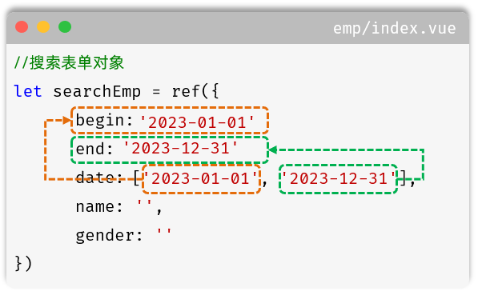
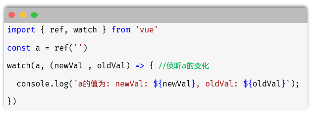
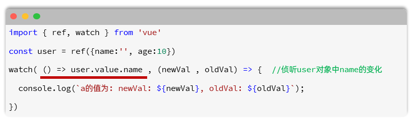
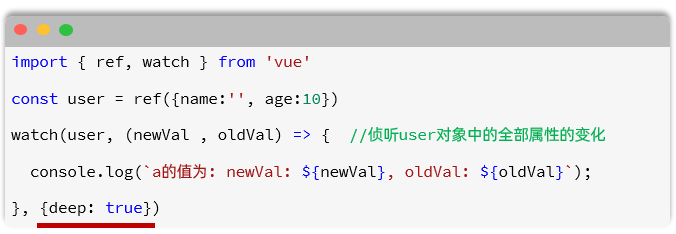

<h1 style="text-align: center;">条件分页查询</h1>

---

## 搜索表单

### 代码实现

#### （1）在 views/emp/index.vue 中的 &lt;script setup&gtl&lt;/script&gt; 中增加如下 js 代码

```js
import { ref } from "vue";

const searchEmp = ref({
  name: "",
  gender: "",
  date: [],
  begin: "",
  end: "",
});

const search = () => {
  // 处理查询逻辑
  console.log("Search:", searchEmp.value);
};

const clear = () => {
  // 清空表单
  searchEmp.value = {
    name: "",
    gender: "",
    date: [],
  };
  search();
};
```

#### （2）在 views/emp/index.vue 中的 &lt;template&gt;&lt;/template&gt; 中增加如下 js 代码

```js
<h1>员工管理</h1> <br>
<el-form :inline="true" :model="searchEmp">
<el-form-item label="姓名">
    <el-input v-model="searchEmp.name" placeholder="请输入员工姓名"></el-input>
</el-form-item>

<el-form-item label="性别">
    <el-select v-model="searchEmp.gender" placeholder="请选择">
    <el-option label="男" value="1"></el-option>
    <el-option label="女" value="2"></el-option>
    </el-select>
</el-form-item>

<el-form-item label="入职日期">
    <el-date-picker
    v-model="searchEmp.date"
    type="daterange"
    range-separator="至"
    start-placeholder="开始日期"
    end-placeholder="结束日期"
    value-format="YYYY-MM-DD"
    ></el-date-picker>
</el-form-item>

<el-form-item>
    <el-button type="primary" @click="search">查询</el-button>
    <el-button @click="clear">清空</el-button>
</el-form-item>
</el-form>
```

> <h3>⚠️注意：在element-plus中，提供的日期选择组件，最终提交的值的格式，如果为 2024-02-01 这种格式，需要设置value-format属性为 <span style="color: red;">YYYY-MM-DD</span></h3>

### 时间问题分析

#### （1）通过测试，我们可以看到，输入的入职日期的搜索条件，用的是 element-plus 的日期范围组件，开始时间和结束时间，两个值，是封装到了一个数组中

#### （2）而通过接口接口文档，我们可以可以看到最终在查询员工列表数据时，搜索条件中，入职日期的开始时间 和 结束时间，是两个值，一个是 begin 开始时间，一个是 end 结束时间

#### （3）那么此时，我们就需要将 searchEmp 对象中的 date 这个数组的值，解析出来，复制给 begin 和 end。而且，一旦 date 的值发生变化，我们就需要重新计算 begin 和 end 这两个时间，把数组中的第一个元素，赋值给 begin；第二个元素，赋值给 end



## watch 监听

### 需求分析

> #### 查询中包含起始时间和结束时间，需要将两个变量赋值给参数然后传递给后端，这两个时间是随时变化的，这时就可以借助 watch 监听实现数据的动态变化与赋值

### 基本介绍

#### （1）作用：侦听一个或多个<span style="color:red">响应式数据源</span>，并在数据源变化时调用所给的<span style="color:red">回调函数</span>

#### （2）用法

> #### 导入 watch 函数
>
> #### 执行 watch 函数，传入要侦听的响应式数据源（ref 对象）和回调函数

### 监听单个数据源



### 监听对象的单个属性



### 监听对象的全部属性

、

#### 第三个可选参数，常见两个选项

> #### deep（boolean）：是否深度侦听，<span style="color: red;">默认浅层侦听</span>
>
> #### immediate（boolean）：是否在侦听创建时立即触发回调函数

### Tlias 实现

#### 在输入的时间发生变化时，自动为 searchEmp 中的 begin，end 两个属性赋值

#### 具体代码如下，在 views/emp/index.vue 文件中的 &lt;script&gt;&lt;/script&gt; 中增加 watch 监听

```js
import { ref, watch } from "vue";

const searchEmp = ref({
  name: "",
  gender: "",
  date: [],
  begin: "",
  end: "",
});

//侦听searchEmp中的date属性
watch(
  () => searchEmp.value.date,
  (newValue, oldValue) => {
    if (newValue.length == 2) {
      searchEmp.value.begin = newValue[0];
      searchEmp.value.end = newValue[1];
    } else {
      searchEmp.value.begin = "";
      searchEmp.value.end = "";
    }
  }
);

const search = () => {
  // 处理查询逻辑
  console.log("Search:", searchEmp.value);
};

const clear = () => {
  // 清空表单
  searchEmp.value = {
    name: "",
    gender: "",
    date: [],
    begin: "",
    end: "",
  };
  search();
};
```

## 表格展示与分页

> #### views/emp/index.vue 完整代码如下

```vue
<script setup>
import { ref, watch } from "vue";

const searchEmp = ref({
  name: "",
  gender: "",
  date: [],
  begin: "",
  end: "",
});

//侦听searchEmp中的date属性
watch(
  () => searchEmp.value.date,
  (newValue, oldValue) => {
    if (newValue.length == 2) {
      searchEmp.value.begin = newValue[0];
      searchEmp.value.end = newValue[1];
    } else {
      searchEmp.value.begin = "";
      searchEmp.value.end = "";
    }
  }
);

const search = () => {
  // 处理查询逻辑
  console.log("Search:", searchEmp.value);
};

const clear = () => {
  // 清空表单
  searchEmp.value = {
    name: "",
    gender: "",
    date: [],
  };
  search();
};

// 示例数据
const empList = ref([
  {
    id: 1,
    username: "jinyong",
    password: "123456",
    name: "金庸",
    gender: 1,
    image:
      "https://web-framework.oss-cn-hangzhou.aliyuncs.com/2022-09-02-00-27-53B.jpg",
    job: 2,
    salary: 8000,
    entryDate: "2015-01-01",
    deptId: 2,
    deptName: "教研部",
    createTime: "2022-09-01T23:06:30",
    updateTime: "2022-09-02T00:29:04",
  },
]);

// 分页配置
const currentPage = ref(1);
const pageSize = ref(10);
const total = ref(0);

// 分页处理
const handleSizeChange = (val) => {
  search();
};
const handleCurrentChange = (val) => {
  search();
};
</script>

<template>
  <h1>员工管理</h1>
  <br />
  <el-form :inline="true" :model="searchEmp">
    <el-form-item label="姓名">
      <el-input
        v-model="searchEmp.name"
        placeholder="请输入员工姓名"
      ></el-input>
    </el-form-item>

    <el-form-item label="性别">
      <el-select v-model="searchEmp.gender" placeholder="请选择">
        <el-option label="男" value="1"></el-option>
        <el-option label="女" value="2"></el-option>
      </el-select>
    </el-form-item>

    <el-form-item label="入职日期">
      <el-date-picker
        v-model="searchEmp.date"
        type="daterange"
        range-separator="至"
        start-placeholder="开始日期"
        end-placeholder="结束日期"
        value-format="YYYY-MM-DD"
      ></el-date-picker>
    </el-form-item>

    <el-form-item>
      <el-button type="primary" @click="search">查询</el-button>
      <el-button @click="clear">清空</el-button>
    </el-form-item>
  </el-form>

  <el-button type="primary" @click=""> + 新增员工</el-button>
  <el-button type="danger" @click=""> - 批量删除</el-button>
  <br /><br />

  <!-- 表格 -->
  <el-table :data="empList" border style="width: 100%">
    <el-table-column
      type="selection"
      width="55"
      align="center"
    ></el-table-column>
    <el-table-column
      prop="name"
      label="姓名"
      width="120"
      align="center"
    ></el-table-column>
    <el-table-column label="性别" width="120" align="center">
      <template #default="scope">
        {{ scope.row.gender == 1 ? "男" : "女" }}
      </template>
    </el-table-column>
    <el-table-column label="头像" width="120" align="center">
      <template #default="scope">
        
      </template>
    </el-table-column>
    <el-table-column
      prop="deptName"
      label="部门名称"
      width="120"
      align="center"
    ></el-table-column>
    <el-table-column label="职位" width="120" align="center">
      <template #default="scope">
        <span v-if="scope.row.job == 1">班主任</span>
        <span v-else-if="scope.row.job == 2">讲师</span>
        <span v-else-if="scope.row.job == 3">学工主管</span>
        <span v-else-if="scope.row.job == 4">教研主管</span>
        <span v-else-if="scope.row.job == 5">咨询师</span>
        <span v-else>其他</span>
      </template>
    </el-table-column>
    <el-table-column
      prop="entryDate"
      label="入职日期"
      width="180"
      align="center"
    ></el-table-column>
    <el-table-column
      prop="updateTime"
      label="最后操作时间"
      width="200"
      align="center"
    ></el-table-column>
    <el-table-column label="操作" align="center">
      <template #default="scope">
        <el-button size="small" type="primary" @click="">编辑</el-button>
        <el-button size="small" type="danger" @click="">删除</el-button>
      </template>
    </el-table-column>
  </el-table>

  <br />

  <!-- 分页 -->
  <el-pagination
    @size-change="handleSizeChange"
    @current-change="handleCurrentChange"
    v-model:current-page="currentPage"
    v-model:page-size="pageSize"
    :page-sizes="[10, 20, 30, 40]"
    layout="total, sizes, prev, pager, next, jumper"
    :total="total"
  >
  </el-pagination>
</template>

<style scoped></style>
```

## 页面交互

#### （1）在 src/api 目录下再定义一个 emp.js

#### 我们可以一次性将增删改查相关的 api 操作的函数都定义好

```js
import request from "@/utils/request";

//查询员工列表数据
export const queryPageApi = (name, gender, begin, end, page, pageSize) =>
  request.get(
    `/emps?name=${name}&gender=${gender}&begin=${begin}&end=${end}&page=${page}&pageSize=${pageSize}`
  );

//新增
export const addApi = (emp) => request.post("/emps", emp);

//根据ID查询
export const queryInfoApi = (id) => request.get(`/emps/${id}`);

//修改
export const updateApi = (emp) => request.put("/emps", emp);

//删除
export const deleteApi = (ids) => request.delete(`/emps?ids=${ids}`);
```

#### （2）在 src/views/emp/index.vue 文件中完成页面交互实现

```vue
<script setup>
import { ref, watch, onMounted } from "vue";
import { queryPageApi } from "@/api/emp";

const searchEmp = ref({
  name: "",
  gender: "",
  date: [],
  begin: "",
  end: "",
});

//侦听searchEmp中的date属性
watch(
  () => searchEmp.value.date,
  (newValue, oldValue) => {
    if (newValue.length == 2) {
      searchEmp.value.begin = newValue[0];
      searchEmp.value.end = newValue[1];
    } else {
      searchEmp.value.begin = "";
      searchEmp.value.end = "";
    }
  }
);

onMounted(() => {
  search();
});

//查询员工
const search = async () => {
  console.log("Search:", searchEmp.value);
  const result = await queryPageApi(
    searchEmp.value.name,
    searchEmp.value.gender,
    searchEmp.value.begin,
    searchEmp.value.end,
    currentPage.value,
    pageSize.value
  );
  if (result.code) {
    empList.value = result.data.rows;
    total.value = result.data.total;
  }
};
const clear = () => {
  // 清空表单
  searchEmp.value = {
    name: "",
    gender: "",
    date: [],
    begin: "",
    end: "",
  };
  search();
};

// 示例数据
const empList = ref([
  {
    id: 1,
    username: "jinyong",
    password: "123456",
    name: "金庸",
    gender: 1,
    image:
      "https://web-framework.oss-cn-hangzhou.aliyuncs.com/2022-09-02-00-27-53B.jpg",
    job: 2,
    salary: 8000,
    entryDate: "2015-01-01",
    deptId: 2,
    deptName: "教研部",
    createTime: "2022-09-01T23:06:30",
    updateTime: "2022-09-02T00:29:04",
  },
]);

// 分页配置
const currentPage = ref(1);
const pageSize = ref(10);
const total = ref(0);

// 分页处理
const handleSizeChange = (val) => {
  search();
};
const handleCurrentChange = (val) => {
  search();
};
</script>

<template>
  <h1>员工管理</h1>
  <br />
  <el-form :inline="true" :model="searchEmp">
    <el-form-item label="姓名">
      <el-input
        v-model="searchEmp.name"
        placeholder="请输入员工姓名"
      ></el-input>
    </el-form-item>

    <el-form-item label="性别">
      <el-select v-model="searchEmp.gender" placeholder="请选择">
        <el-option label="男" value="1"></el-option>
        <el-option label="女" value="2"></el-option>
      </el-select>
    </el-form-item>

    <el-form-item label="入职日期">
      <el-date-picker
        v-model="searchEmp.date"
        type="daterange"
        range-separator="至"
        start-placeholder="开始日期"
        end-placeholder="结束日期"
        value-format="YYYY-MM-DD"
      ></el-date-picker>
    </el-form-item>

    <el-form-item>
      <el-button type="primary" @click="search">查询</el-button>
      <el-button @click="clear">清空</el-button>
    </el-form-item>
  </el-form>

  <el-button type="primary" @click=""> + 新增员工</el-button>
  <el-button type="danger" @click=""> - 批量删除</el-button>
  <br /><br />

  <!-- 表格 -->
  <el-table :data="empList" border style="width: 100%">
    <el-table-column
      type="selection"
      width="55"
      align="center"
    ></el-table-column>
    <el-table-column
      prop="name"
      label="姓名"
      width="120"
      align="center"
    ></el-table-column>
    <el-table-column label="性别" width="120" align="center">
      <template #default="scope">
        {{ scope.row.gender == 1 ? "男" : "女" }}
      </template>
    </el-table-column>
    <el-table-column label="头像" width="120" align="center">
      <template #default="scope">
        
      </template>
    </el-table-column>
    <el-table-column
      prop="deptName"
      label="部门名称"
      width="120"
      align="center"
    ></el-table-column>
    <el-table-column label="职位" width="120" align="center">
      <template #default="scope">
        <span v-if="scope.row.job == 1">班主任</span>
        <span v-else-if="scope.row.job == 2">讲师</span>
        <span v-else-if="scope.row.job == 3">学工主管</span>
        <span v-else-if="scope.row.job == 4">教研主管</span>
        <span v-else-if="scope.row.job == 5">咨询师</span>
        <span v-else>其他</span>
      </template>
    </el-table-column>
    <el-table-column
      prop="entryDate"
      label="入职日期"
      width="180"
      align="center"
    ></el-table-column>
    <el-table-column
      prop="updateTime"
      label="最后操作时间"
      width="200"
      align="center"
    ></el-table-column>
    <el-table-column label="操作" align="center">
      <template #default="scope">
        <el-button size="small" type="primary" @click="">编辑</el-button>
        <el-button size="small" type="danger" @click="">删除</el-button>
      </template>
    </el-table-column>
  </el-table>

  <br />

  <!-- 分页 -->
  <el-pagination
    @size-change="handleSizeChange"
    @current-change="handleCurrentChange"
    v-model:current-page="currentPage"
    v-model:page-size="pageSize"
    :page-sizes="[10, 20, 30, 40]"
    layout="total, sizes, prev, pager, next, jumper"
    :total="total"
  >
  </el-pagination>
</template>

<style scoped></style>
```
