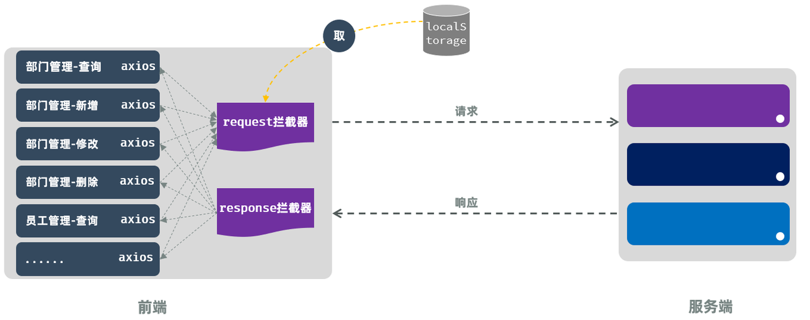
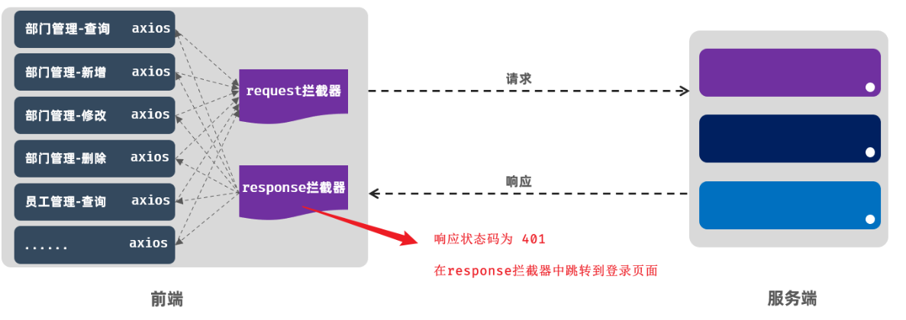
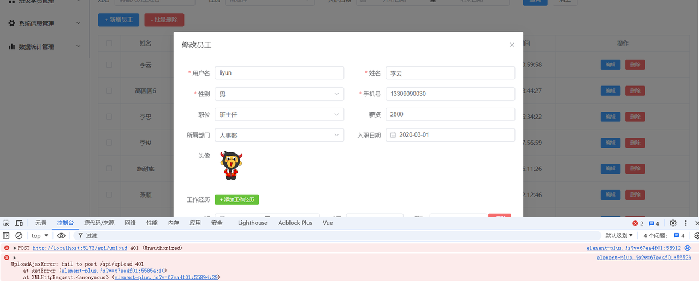

<h1 style="text-align: center;">登入登出</h1>

---

## 登入

### 登录实现

#### （1）定义登录请求的 api : src/api/login.js

```js
import request from "@/utils/request";

//登录
export const loginApi = (data) => request.post("/login", data);
```

#### （2）views / login / index.vue 中，script 标签代码

```vue
<script setup>
import { ref } from "vue";
import { loginApi } from "@/api/login";
import { ElMessage } from "element-plus";
import { useRouter } from "vue-router";

let loginForm = ref({ username: "", password: "" });
let router = useRouter();

//登录
const login = async () => {
  const result = await loginApi(loginForm.value);
  if (result.code) {
    // 登录成功
    ElMessage.success("登录成功");
    localStorage.setItem("loginUser", JSON.stringify(result.data));
    router.push("/"); // 跳转
  } else {
    ElMessage.error(result.msg);
  }
};

//取消
const clear = () => {
  loginForm.value = {
    username: "",
    password: "",
  };
};
</script>
```

#### （3）为按钮绑定事件

```html
<el-form-item>
  <el-button class="button" type="primary" @click="login">登 录</el-button>
  <el-button class="button" type="info" @click="clear">重 置</el-button>
</el-form-item>
```

### localStorage

#### （1）在登录成功之后，需要记录用户的登录信息，这里我们可以直接将用户的登录信息记录在浏览器端的 localStorage 本地存储中，以后需要使用登录的相关信息，直接从 localStorage 中取出即可

#### （2）localStorage 是浏览器提供的本地存储机制 (5MB)，存储形式为 <span style="color: red;">key-value</span> 形式，<span style="color: red;">键和值</span>都是<span style="color: red;">字符串</span>类型

#### （3）相关 API 方法

> #### localStorage.setItem(key, value)
>
> #### localStorage.getItem(key)
>
> #### localStorage.removeItem(key)
>
> #### localStorage.clear()

### 携带令牌访问

#### 我们可以思考一下，目前我们项目的 Ajax 请求，是不是都是基于 Axios 发送的，而在我们的项目中，我们是自己定义了一个 axios 的请求对象 request。所有的异步请求，是不都是基于 request 对象发起的，所以，我们可以借助于 <span style="color: red;">axios</span> 中提供的<span style="color: red;">拦截器</span>来进行统一处理

<br/>


#### 我们就需要在 request.js 中通过 axios 的拦截器实现此功能。具体代码实现如下

```js
//axios的请求 request 拦截器, 每次请求获取localStorage中的loginUser, 从中获取到token, 在请求头token中携带到服务端
request.interceptors.request.use((config) => {
  let loginUser = JSON.parse(localStorage.getItem("loginUser"));
  console.log(localStorage.getItem("loginUser"));
  if (loginUser) {
    config.headers.token = loginUser.token;
  }
  return config;
});
```

### 响应 401 跳转到登录页面

#### 目前，即使用户未登录的情况下访问服务器，服务器会响应 401 状态码，但是前端并不会跳转到登录页面。 因为，我们在前端并未做任何的拦截判断。接下来，我们就来实现此功能，我们只需要在服务端将数据响应给前端时，在 axios 的响应拦截器中统一判断处理即可

<br/>


#### 我们就需要在 request.js 中通过 axios 的响应拦截器实现此功能。具体代码如下

```js
import axios from "axios";
import { ElMessage } from "element-plus";
import router from "../router";

//创建axios实例对象
const request = axios.create({
  baseURL: "/api",
  timeout: 600000,
});

//axios的请求 request 拦截器, 每次请求获取localStorage中的loginUser, 从中获取到token, 在请求头token中携带到服务端
request.interceptors.request.use((config) => {
  let loginUser = JSON.parse(localStorage.getItem("loginUser"));
  console.log(localStorage.getItem("loginUser"));
  if (loginUser) {
    config.headers.token = loginUser.token;
  }
  return config;
});

//axios的响应 response 拦截器
request.interceptors.response.use(
  (response) => {
    //成功回调
    return response.data;
  },
  (error) => {
    //失败回调
    //如果响应的状态码为401, 则路由到登录页面
    if (error.response.status === 401) {
      ElMessage.error("登录失效, 请重新登录");
      router.push("/login");
    } else {
      ElMessage.success("接口访问异常");
    }
    return Promise.reject(error);
  }
);

export default request;
```

#### 后端程序中放开 Filter 的代码，让其拦截，回到前端访问 index 界面，在左侧菜单中访问任意项，测试时候在未登录的状态下会跳转的登录界面（如果已登录，需要点击 F12，找到应用程序，把本地存储中相关信息删除）

### 展示登录用户

#### views / layout / index.vue 中添加如下代码

```vue
<script setup>
import { ref, onMounted } from "vue";
const loginName = ref("");
//定义钩子函数, 获取登录用户名
onMounted(() => {
  //获取登录用户名
  let loginUser = JSON.parse(localStorage.getItem("loginUser"));
  if (loginUser) {
    loginName.value = loginUser.name;
  }
});
</script>

......
<!-- Header 区域 -->
<el-header class="header">
<span class="title">Tlias智能学习辅助系统</span>
<span class="right_tool">
    <a href="">
    <el-icon><EditPen /></el-icon> 修改密码 &nbsp;&nbsp;&nbsp; |  &nbsp;&nbsp;&nbsp;
    </a>
    <a href="">
    <el-icon><SwitchButton /></el-icon> 退出登录 【{{ loginName }}】
    </a>
</span>
</el-header>
......
```

## 登出

```vue
<script setup>
// 无需额外导入，因为我们只是使用了 Element Plus 和 Vue Router 的基本功能
import { useRouter } from "vue-router";
import { ref, onMounted } from "vue";
import { ElMessage, ElMessageBox } from "element-plus";

let router = useRouter();

const loginName = ref("");
//定义钩子函数, 获取登录用户名
onMounted(() => {
  //获取登录用户名
  let loginUser = JSON.parse(localStorage.getItem("loginUser"));
  if (loginUser) {
    loginName.value = loginUser.name;
  }
});

const logout = () => {
  //弹出确认框, 如果确认, 则退出登录, 跳转到登录页面
  ElMessageBox.confirm("确认退出登录吗?", "提示", {
    confirmButtonText: "确定",
    cancelButtonText: "取消",
    type: "warning",
  }).then(() => {
    //确认, 则清空登录信息
    ElMessage.success("退出登录成功");
    localStorage.removeItem("loginUser");
    router.push("/login"); //跳转到登录页面
  });
};
</script>

......
<!-- Header 区域 -->
<el-header class="header">
<span class="title">Tlias智能学习辅助系统</span>
<span class="right_tool">
    <a href="">
    <el-icon><EditPen /></el-icon> 修改密码 &nbsp;&nbsp;&nbsp; |  &nbsp;&nbsp;&nbsp;
    </a>
    <a href="javascript:void(0)" @click="logout">
    <el-icon><SwitchButton /></el-icon> 退出登录 【{{ loginName }}】
    </a>
</span>
</el-header>
.......
```

## 图片上传 401 问题

#### 目前，我们已经完成了部门管理，员工管理，以及登录退出等所有的功能。 但是其实目前程序中还存在一点小问题，那就是图片上传的时候，服务器端响应 401，如下图

<br/>


#### 出现这个问题的原因是因为图片上传我们使用的是 ElementPlus 中提供的 el-upload 组件，请求服务端的时候并未通过 axios，所以也并不会通过我们配置的 axios 的拦截器，携带请求头 token 了。 服务器端，拦截到请求之后，发现未携带令牌，就会出现这个问题

#### 那接下来，针对于这个文件上传的请求，我们则需要单独处理一下。处理思路如下

> #### 页面加载完毕后，从 localStorage 中获取登录员工信息，然后获取到 token 令牌
>
> #### 然后在文件上传时，在请求头中将令牌携带到服务端

#### （1）在 src/views/emp/index.vue 中的 &lt;script&gt;&lt;/script&gt; 添加如下代码

```js
//声明token
const token = ref("");

//获取token
const getToken = () => {
  const loginUser = JSON.parse(localStorage.getItem("loginUser"));
  if (loginUser && loginUser.token) {
    token.value = loginUser.token;
  }
};

onMounted(async () => {
  search();

  //加载所有部门数据
  const result = await queryAllDeptApi();
  if (result.code) {
    deptList.value = result.data;
  }

  getToken();
});
```

#### （2）在 src/views/emp/index.vue 中的 &lt;template&gt;&lt;/template&gt; 添加如下代码

```html
<!-- 第五行 -->
<el-row :gutter="20">
  <el-col :span="24">
    <el-form-item label="头像">
      <el-upload
        class="avatar-uploader"
        action="/api/upload"
        :headers="{'token': token}"
        :show-file-list="false"
        :on-success="handleAvatarSuccess"
        :before-upload="beforeAvatarUpload"
      >
        
        <el-icon v-else class="avatar-uploader-icon"><Plus /></el-icon>
      </el-upload>
    </el-form-item>
  </el-col>
</el-row>
```
