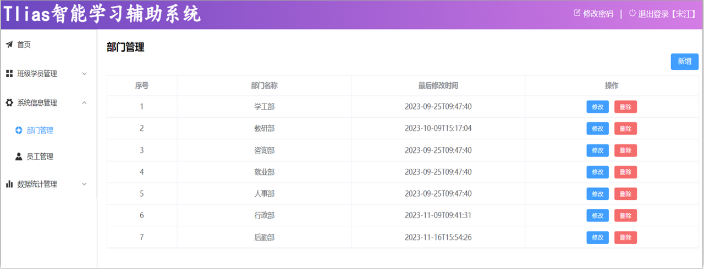
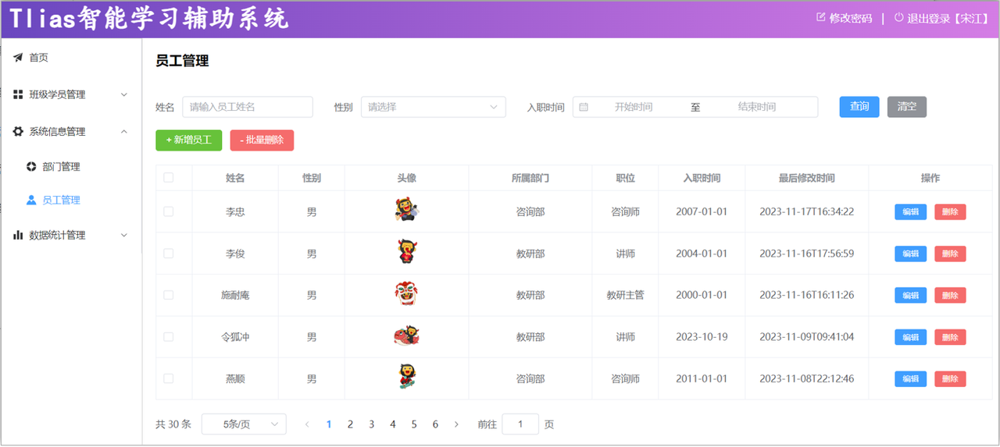
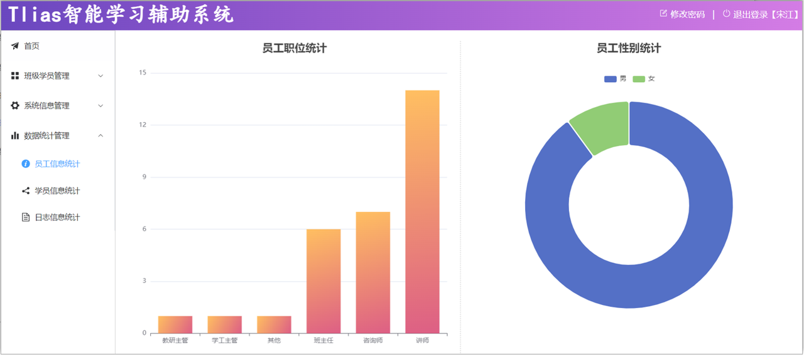
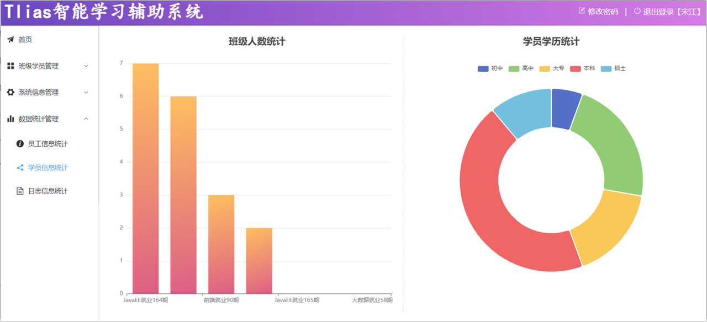
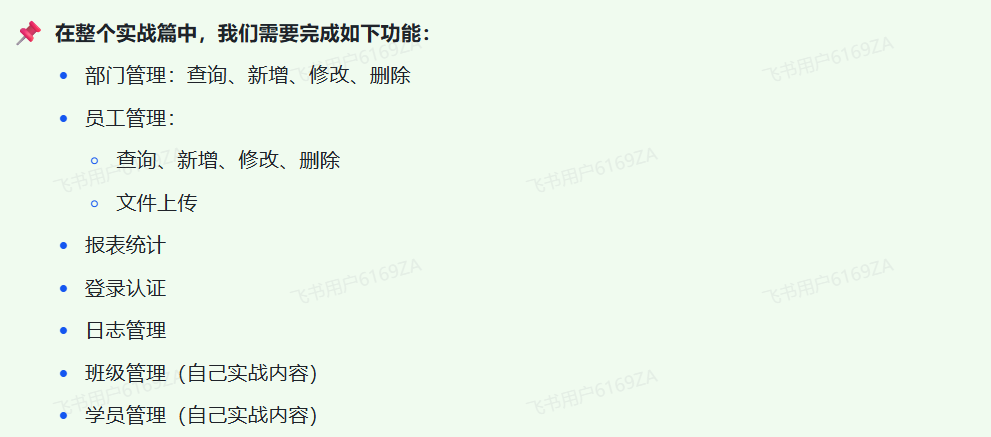
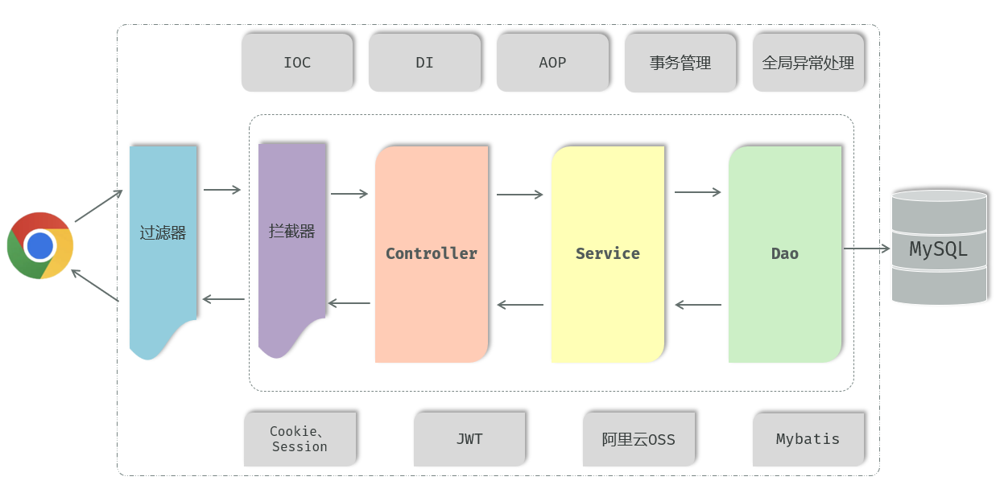
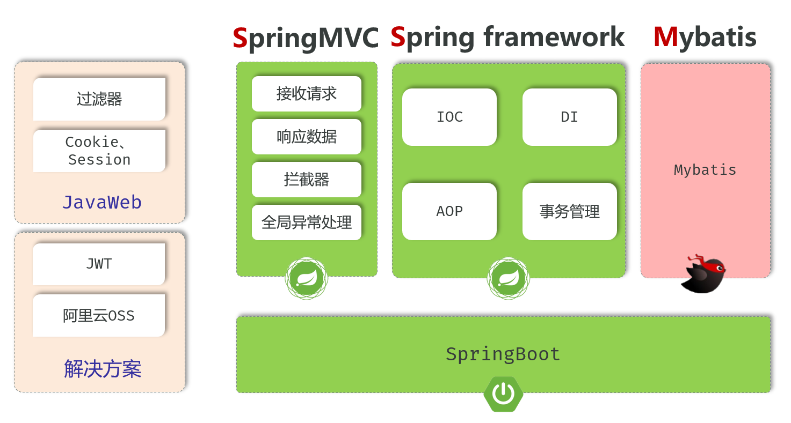

<h1 style="text-align: center;">项目介绍</h1>

---

## ⭐ 项目相关资料

> #### https://pan.baidu.com/s/1u2InhRZMcK_9ZRV_nwE3rw?pwd=sknc 提取码: sknc

## ⭐ 项目接口文档

> #### https://heuqqdmbyk.feishu.cn/wiki/GyZVwpRf6ir89qkKtFqc0HlTnhg

## 前言

> #### （1）基于黑马 Javaweb + AI 课程，我们已经学习了 Web 开发的基础知识，包括像 Maven、HTTP 协议、SpringBootWeb 基础、IOC、DI、MySQL、JDBC、Mybatis 等
>
> #### （2）接下来呢，我们就要进入到后端 Web 实战篇的学习，在实战篇中，就要将前面学习的基础知识用起来，来完成一个大的综合案例 - Tlias 智能学习辅助系统

## 项目界面示例

### 部门管理

 

### 员工管理

 

### 员工信息统计

 

### 学员信息统计

 

## 项目功能模块

## 后端整体架构

 

